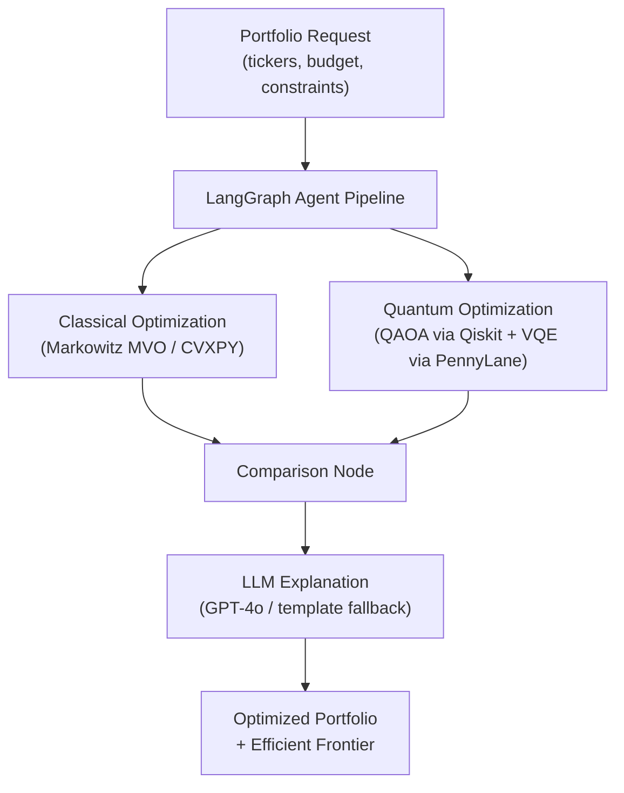

# Project Overview

The **Portfolio Optimizer** is a production-grade portfolio optimization simulator that combines three distinct computational paradigms — classical mathematical programming, quantum-inspired algorithms, and LLM-powered agent orchestration — to recommend optimized investment portfolios under real-world constraints.

The system fetches live market data, runs multiple optimization strategies in parallel, compares their results, and delivers a natural-language explanation of the recommended allocation — all through a single API call and a real-time WebSocket stream.

---

## The Three Optimization Paradigms



### 1. Classical Optimization — Markowitz Mean-Variance

The classical engine implements **Markowitz Mean-Variance Optimization (MVO)** using [CVXPY](https://www.cvxpy.org/) as the convex solver backend. It solves the standard portfolio optimization problem:

- **Objective**: Maximize the Sharpe ratio (or a user-defined multi-objective composite)
- **Constraints**: Budget equality, per-asset weight bounds, sector concentration limits, minimum return floors, maximum volatility ceilings
- **Efficient Frontier**: An epsilon-constraint sweep traces the Pareto-optimal frontier between any two user-selected measures (e.g., return vs. volatility, Sharpe vs. max drawdown)

The classical engine handles portfolios of any size and is always executed first to provide a baseline result.

### 2. Quantum Optimization — QAOA and VQE

The quantum engine formulates portfolio selection as a **Quadratic Unconstrained Binary Optimization (QUBO)** problem and solves it using two complementary quantum algorithms:

- **QAOA (Quantum Approximate Optimization Algorithm)** via [Qiskit](https://qiskit.org/) — a gate-based variational algorithm that encodes the QUBO Hamiltonian into a parameterized quantum circuit and optimizes the circuit parameters classically
- **VQE (Variational Quantum Eigensolver)** via [PennyLane](https://pennylane.ai/) — an alternative variational approach that finds the ground state of the cost Hamiltonian

Quantum optimization is subject to practical limits: the number of assets is capped at `MAX_QUANTUM_ASSETS` (default: 8) because circuit depth grows exponentially with asset count. A dedicated Celery worker queue (`quantum`) isolates slow quantum jobs from fast classical runs.

### 3. Agent Layer — LangGraph Orchestration

The agent layer uses [LangGraph](https://langchain-ai.github.io/langgraph/) to orchestrate the full optimization pipeline as a **stateful directed graph**. Each node in the graph is a deterministic Python function (except the LLM explanation node):

| Node | Role |
|------|------|
| `data_fetch` | Fetches historical price data from yfinance with Redis caching |
| `constraint_validation` | Validates and normalizes user constraints |
| `classical_optimization` | Runs CVXPY MVO solver |
| `quantum_dispatch` | Conditionally runs QAOA + VQE (skipped if too many assets or `run_quantum=False`) |
| `comparison` | Computes side-by-side metrics across all solvers |
| `frontier_computation` | Traces the efficient frontier (optional) |
| `llm_explanation` | Generates a natural-language explanation via GPT-4o |

Error routing is carefully designed: fatal errors in early nodes (data fetch, constraint validation, classical optimization) terminate the pipeline immediately, while failures in later nodes (quantum dispatch, comparison, LLM explanation) are non-fatal and the pipeline continues with partial results.

---

## Key Capabilities

### Multi-Objective Optimization
Users can specify a weighted matrix of business objectives rather than a single scalar goal. Supported measures include:

- `return` — Annualized portfolio return
- `volatility` — Annualized portfolio volatility (standard deviation)
- `sharpe` — Sharpe ratio (risk-adjusted return)
- `max_drawdown` — Maximum historical drawdown
- `diversification_hhi` — Herfindahl-Hirschman Index (concentration measure)
- `esg_score` — ESG composite score
- `sector_concentration` — Sector-level concentration penalty

Each objective has a direction (`maximize` or `minimize`), a weight, an optional soft target, and an optional hard threshold constraint.

### Real-Time Progress Streaming
Optimization runs are executed asynchronously via Celery. Progress events are published to a Redis pub/sub channel (`run:{run_id}:progress`) and streamed to the frontend via WebSocket (`/ws/runs/{run_id}/progress`). Clients receive node-level status updates (`started`, `completed`, `failed`) as the pipeline executes.

### Efficient Frontier Visualization
When `frontier.enabled = true` in the request, the backend executes a parametric sweep across `num_points` levels of one measure while minimizing another, producing a Pareto-efficient frontier curve. The frontend renders this as an interactive scatter plot.

### LLM-Powered Explanations
The final pipeline node calls GPT-4o to generate a plain-English explanation of the recommended portfolio, comparing classical and quantum results and explaining the trade-offs. If `OPENAI_API_KEY` is not set, a template-based fallback explanation is used automatically — the system never fails due to a missing API key.

### Run History
Every optimization run is persisted to PostgreSQL with full request parameters, results, and status. The `GET /api/v1/runs` endpoint supports pagination and filtering. Run details are accessible at `GET /api/v1/runs/{run_id}`.

---

## Technology Highlights

| Layer | Technology | Version |
|-------|-----------|---------|
| **Backend** | Python, FastAPI, Uvicorn | Python 3.11+, FastAPI 0.111.x |
| **Frontend** | TypeScript, React, Vite, shadcn/ui | React 18.3.x, Vite 5.x |
| **Classical Opt** | CVXPY, SciPy, NumPy, Pandas | CVXPY 1.5.x, NumPy 1.26.x |
| **Quantum Opt** | Qiskit + qiskit-algorithms, PennyLane | Qiskit 1.1.x, PennyLane 0.36.x |
| **Agent Layer** | LangGraph, LangChain, GPT-4o | LangGraph 0.1.x |
| **Market Data** | yfinance | 0.2.x |
| **Caching** | Redis | 7.x |
| **Task Queue** | Celery | 5.4.x |
| **Database** | PostgreSQL, SQLAlchemy (async), asyncpg | PostgreSQL 16.x, SQLAlchemy 2.0.x |
| **Migrations** | Alembic | 1.13.x |
| **Monitoring** | Prometheus (via prometheus-fastapi-instrumentator) | 6.1.x |
| **Infra** | Docker Compose, AWS ECS Fargate, Terraform | Terraform 1.8.x |

---

## Project Structure

```
.
├── backend/                    # FastAPI application
│   ├── app/
│   │   ├── main.py             # FastAPI app factory + lifespan
│   │   ├── core/               # Config, logging, exceptions, dependencies
│   │   ├── api/                # REST routers + WebSocket gateway
│   │   ├── agents/             # LangGraph agent graph + nodes
│   │   ├── classical/          # Markowitz MVO (CVXPY)
│   │   ├── quantum/            # QAOA (Qiskit) + VQE (PennyLane)
│   │   ├── data/               # yfinance fetcher + Redis cache
│   │   ├── db/                 # SQLAlchemy models + session
│   │   ├── schemas/            # Pydantic v2 request/response models
│   │   └── workers/            # Celery task definitions
│   ├── alembic/                # Database migrations
│   └── pyproject.toml
├── frontend/                   # React + Vite application
│   ├── src/
│   │   ├── components/         # UI components (shadcn/ui)
│   │   ├── pages/              # Route-level page components
│   │   ├── hooks/              # Custom React hooks
│   │   ├── lib/                # API client + utilities
│   │   └── types/              # TypeScript type definitions
│   └── package.json
├── tests/                      # pytest test suite
├── infra/                      # Terraform IaC (AWS ECS Fargate)
├── docker-compose.yml
├── docker-compose.override.yml # Podman userns_mode fix (auto-loaded)
├── docker-compose.prod.yml
└── .env.example
```

---

## Next Steps

- **Docker Compose quickstart** → [Quickstart: Docker](quickstart-docker.md)
- **Local development setup** → [Quickstart: Local](quickstart-local.md)
- **All environment variables** → [Environment Variables](environment-variables.md)
- **Podman-specific notes** → [Podman Notes](podman-notes.md)
