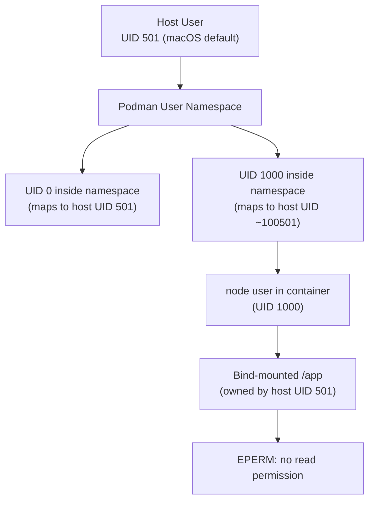
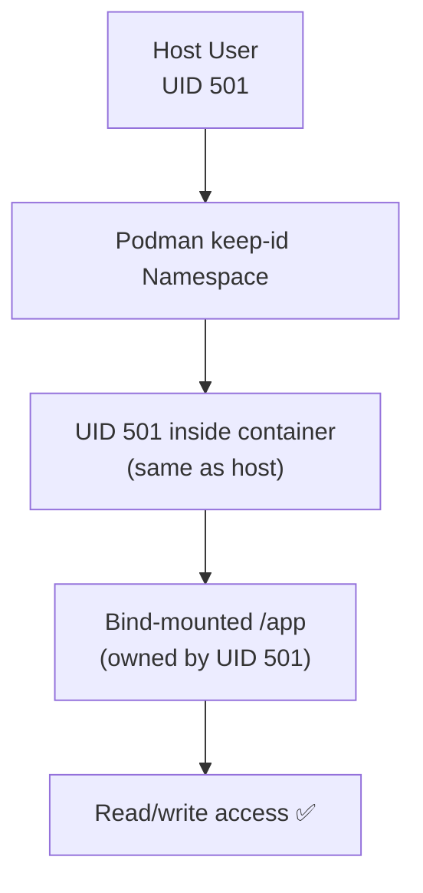

# Podman Notes

This page documents the rootless Podman compatibility fix included in the repository and explains why it is needed, how it works, and how to handle the Docker Desktop incompatibility.

---

## The Problem: Rootless Podman UID Namespace Issue

### Symptom

When running the stack under **rootless Podman** (the default on macOS with Podman Desktop, and on modern Fedora/RHEL 9+), the frontend container crashes immediately with a permission error:

```
EPERM: operation not permitted, open '/app/index.html'
    at async open (node:internal/fs/promises:637:25)
    at async Object.readFile (node:internal/fs/promises:1249:14)
    at async viteIndexHtmlMiddleware …
```

Similar errors appear in the backend container:

```
PermissionError: [Errno 1] Operation not permitted: '/app/app/main.py'
```

### Root Cause: User Namespace Mapping

Rootless Podman runs containers inside a **user namespace** where your host UID is remapped. Here is what happens:



The key issue:
1. Your host files in `./frontend` are owned by your host UID (e.g., `501` on macOS).
2. Rootless Podman maps your host UID `501` to UID `0` *inside* the user namespace.
3. The official `node` Docker image runs the Node.js process as the `node` user (UID `1000`).
4. UID `1000` inside the namespace maps to approximately UID `100501` on the host — a UID that does not own the bind-mounted files.
5. Result: the `node` process cannot read `/app/index.html` → `EPERM`.

The same issue affects the `python` user in the backend image and any other container that runs as a non-root user with bind-mounted source code.

---

## The Fix: `userns_mode: "keep-id"`

The repository ships a `docker-compose.override.yml` file that applies the fix automatically:

```yaml
# docker-compose.override.yml
services:
  backend:
    userns_mode: "keep-id"

  worker:
    userns_mode: "keep-id"

  worker-quantum:
    userns_mode: "keep-id"

  celery-beat:
    userns_mode: "keep-id"

  frontend:
    userns_mode: "keep-id"
```

### How `userns_mode: "keep-id"` Works

`keep-id` is a Podman-specific `userns_mode` value that instructs Podman to map the **host user's UID directly into the container** — a 1:1 mapping instead of the default shifted mapping.



With `keep-id`:
- Your host UID `501` maps to UID `501` inside the container.
- The bind-mounted files (owned by UID `501` on the host) are readable and writable inside the container.
- Hot-reload works correctly for both Vite and Uvicorn.

---

## Auto-Loading via `docker-compose.override.yml`

Docker Compose and `podman-compose` both automatically merge `docker-compose.override.yml` with `docker-compose.yml` when both files exist in the same directory. You do **not** need to pass `-f docker-compose.override.yml` explicitly.

```bash
# This automatically loads both docker-compose.yml AND docker-compose.override.yml
podman-compose up --build

# Equivalent with Docker's Podman-compatible socket
docker compose up --build
```

The override file only adds `userns_mode: "keep-id"` to the services that bind-mount source code. All other configuration (ports, environment variables, health checks, volumes) comes from `docker-compose.yml`.

---

## Docker Desktop Incompatibility

`userns_mode: "keep-id"` is a **Podman-specific value**. Docker Engine's `userns_mode` only accepts:
- `host` — Use the host's user namespace (runs as root, not recommended)
- `""` (empty string) — Default behavior

Docker Desktop will refuse to start services with `userns_mode: "keep-id"` and print an error like:

```
Error response from daemon: invalid userns_mode: keep-id
```

### Workaround for Docker Desktop

**Option 1 (recommended): Skip the override file**

Pass the base compose file explicitly to prevent auto-loading the override:

```bash
docker compose -f docker-compose.yml up --build
```

**Option 2: Rename or delete the override file**

```bash
# Temporarily rename
mv docker-compose.override.yml docker-compose.override.yml.podman

# Run normally
docker compose up --build

# Restore when switching back to Podman
mv docker-compose.override.yml.podman docker-compose.override.yml
```

**Option 3: Create a `.dockerignore`-style exclusion**

Docker Compose does not support ignoring override files natively, so Option 1 or 2 is the cleanest approach.

---

## Summary: Which Command to Use

| Runtime | Command | Notes |
|---------|---------|-------|
| **Rootless Podman** (macOS, Fedora, RHEL) | `podman-compose up --build` | Override auto-loaded, `keep-id` applied |
| **Podman with Docker socket** | `docker compose up --build` | Override auto-loaded, `keep-id` applied |
| **Docker Desktop** | `docker compose -f docker-compose.yml up --build` | Skips override, avoids `keep-id` error |
| **Docker Engine (Linux, rootful)** | `docker compose up --build` | Override auto-loaded but `keep-id` may be rejected — use `-f docker-compose.yml` if so |

---

## Verifying the Fix

After starting with Podman, verify that the frontend container can read its files:

```bash
# Check frontend container logs — should NOT show EPERM errors
podman-compose logs frontend

# Verify the Vite server started successfully
podman-compose logs frontend | grep "Local:"
# Expected: Local:   http://localhost:5173/
```

For the backend:

```bash
podman-compose logs backend | grep "application_starting"
# Expected: {"event": "application_starting", "environment": "development", ...}
```

---

## Additional Podman Considerations

### `podman-compose` vs `docker compose`

Podman provides two ways to use Compose files:

1. **`podman-compose`** — A Python reimplementation of Docker Compose for Podman. Install with `pip install podman-compose` or via your system package manager.

2. **Docker-compatible socket** — Podman can expose a Docker-compatible socket (`podman system service`), allowing the standard `docker compose` CLI to work with Podman as the backend.

Both approaches auto-load `docker-compose.override.yml`.

### SSL/TLS in Podman on macOS

The backend `Dockerfile` includes a workaround for SSL certificate issues that can occur in some Podman/macOS configurations:

```dockerfile
ENV PIP_TRUSTED_HOST="pypi.org pypi.python.org files.pythonhosted.org"
```

This tells pip to trust PyPI hosts without strict SSL verification during the build phase. It is safe for the build context and does not affect runtime behavior.

### Volume Permissions

If you encounter permission issues with named volumes (e.g., `postgres_data`, `redis_data`) under Podman, you may need to initialize them with the correct ownership:

```bash
# Check volume ownership
podman volume inspect postgres_data

# If needed, reset the volume
podman-compose down -v
podman-compose up --build
```

---

## Related Pages

- [Quickstart: Docker](quickstart-docker.md) — Full Docker Compose setup
- [Quickstart: Local](quickstart-local.md) — Running without containers
- [Environment Variables](environment-variables.md) — Configuration reference
