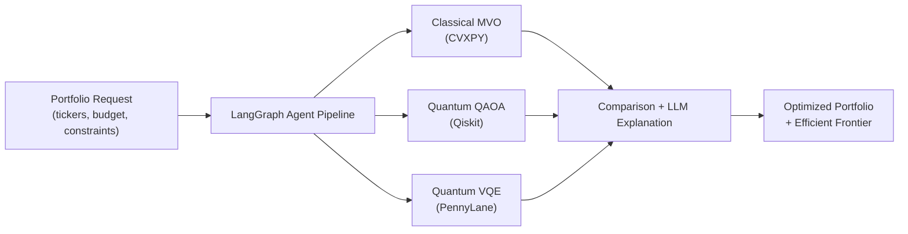

# Overview

High-level introduction to the Portfolio Optimizer project — its purpose, business value, and the three-engine optimization approach (Classical, Quantum, and Agent-First).

## About This Section

This section provides the conceptual foundation for understanding the Portfolio Optimizer. Before diving into code, APIs, or deployment, start here to understand *what* the system does and *why* it is designed the way it is.

## Section Contents

| Page | Description |
|------|-------------|
| [Project Overview](../01-getting-started/overview.md) | Full project introduction, the three optimization paradigms, key capabilities, and technology stack summary |

## What Is Portfolio Optimizer?

The Portfolio Optimizer is a production-grade, full-stack application that solves a fundamental challenge in quantitative finance: **how to allocate capital across a set of assets to maximize risk-adjusted returns under real-world constraints**.

Unlike traditional portfolio tools, this system runs **three optimization engines** and uses an AI agent to compare their results and generate a natural-language explanation of the recommended allocation:

## Key Capabilities

- **Live market data** fetched from yfinance with Redis caching
- **Classical MVO** via CVXPY with full constraint support (budget, weight bounds, sector limits, risk floors/ceilings)
- **Quantum optimization** via QAOA (Qiskit) and VQE (PennyLane) for portfolios up to 8 assets
- **Efficient frontier** computation via epsilon-constraint sweep
- **LLM explanation** via GPT-4o (with template fallback when no API key is configured)
- **Real-time progress** streamed via WebSocket as the agent graph executes
- **Run history** persisted in PostgreSQL for comparison and audit

## Where to Go Next

- **New to the project?** → [Docker Quickstart](../01-getting-started/quickstart-docker.md)
- **Want to understand the architecture?** → [System Overview](../02-architecture/system-overview.md)
- **Ready to call the API?** → [Optimize Endpoint](../04-api-reference/optimize-endpoint.md)
- **Interested in quantum algorithms?** → [QUBO Formulation](../07-quantum-optimization/qubo-formulation.md)
