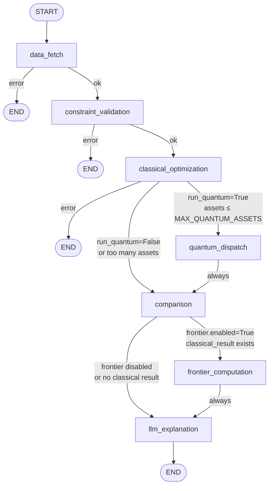

# Agent Pipeline

The agent pipeline is the heart of the Portfolio Optimizer. It is implemented as a **LangGraph `StateGraph`** — a stateful directed graph where each node is a deterministic Python function that reads from and writes to a shared `AgentState` TypedDict. This page describes every node, the conditional routing logic, the `wrap_node` pattern, and how errors are classified as fatal or non-fatal.

## Graph Structure

The pipeline consists of **7 nodes** connected by a mix of unconditional edges and conditional routing functions:



> **Fatal vs Non-fatal errors:** Nodes in the first three positions (`data_fetch`, `constraint_validation`, `classical_optimization`) are **fatal** — a failure routes immediately to `END`. Nodes in the last four positions (`quantum_dispatch`, `comparison`, `frontier_computation`, `llm_explanation`) are **non-fatal** — failures are logged and the pipeline continues with degraded output.

## Shared State: `AgentState`

All nodes communicate through a single `AgentState` TypedDict defined in `backend/app/agents/state.py`. Every field is optional (`total=False`) because each node only populates the fields it is responsible for:

```python
class AgentState(TypedDict, total=False):
    # Input
    run_id: str
    tickers: list[str]
    budget: float
    request_params: dict[str, Any]

    # data_fetch outputs
    price_data: pd.DataFrame          # Shape: (days, n_assets)
    returns_data: pd.DataFrame        # Shape: (days-1, n_assets)
    expected_returns: np.ndarray      # Shape: (n_assets,) — annualised
    covariance_matrix: np.ndarray     # Shape: (n_assets, n_assets) — annualised
    sector_map: dict[str, str]        # ticker → sector name

    # constraint_validation outputs
    validated_constraints: dict[str, Any]
    constraint_warnings: list[str]

    # classical_optimization outputs
    classical_result: dict[str, Any]  # Serialised ClassicalResult

    # quantum_dispatch outputs
    quantum_result: dict[str, Any]    # Serialised QuantumResult

    # comparison outputs
    comparison_summary: dict[str, Any]

    # llm_explanation outputs
    llm_explanation: str

    # frontier_computation outputs
    frontier_report: dict[str, Any] | None

    # Progress tracking
    completed_nodes: list[str]
    node_timings_ms: dict[str, float]

    # Error handling
    error: str | None
    failed_node: str | None
    error_details: dict[str, Any] | None
```

## The `wrap_node` Pattern

Every node function is wrapped by the `wrap_node` closure defined in `backend/app/agents/graph.py`. This decorator adds three behaviors without modifying the node functions themselves:

### 1. Skip-on-prior-fatal-error

If a previous node set `state["error"]` and `state["failed_node"]`, subsequent nodes are skipped automatically. This prevents cascading failures from executing nodes that have no valid inputs:

```python
def wrapped(state: AgentState) -> AgentState:
    if state.get("error") and state.get("failed_node"):
        if state.get("failed_node") != node_name:
            logger.debug("node_skipped_due_to_prior_error", node=node_name)
            return state  # Pass state through unchanged
    ...
```

### 2. Progress Event Publishing

Before calling the node function, `wrap_node` publishes a `"started"` progress event. After the node returns, it publishes either `"completed"` or `"failed"` depending on whether the node set an error in the state:

```python
if progress_callback:
    progress_callback(node_name, "started", _node_start_message(node_name))

result = node_fn(state)

if result.get("error") and result.get("failed_node") == node_name:
    progress_callback(node_name, "failed", result.get("error"))
else:
    progress_callback(node_name, "completed", _node_complete_message(node_name, result))
```

The `progress_callback` is a closure that calls `self.publish_progress()` on the Celery task, which publishes to the Redis pub/sub channel.

### 3. Unexpected Exception Handling

If a node raises an uncaught exception (a bug, not a handled error), `wrap_node` catches it, logs it with full traceback, publishes a `"failed"` event, and sets the error state — preventing the entire graph from crashing:

```python
except Exception as exc:
    logger.error("node_unexpected_exception", node=node_name, error=str(exc), exc_info=True)
    if progress_callback:
        progress_callback(node_name, "failed", str(exc))
    updated = dict(state)
    updated["error"] = str(exc)
    updated["failed_node"] = node_name
    return updated
```

## Node Descriptions

### Node 1: `data_fetch`

**File:** `backend/app/agents/nodes.py` → `data_fetch_node()`

**Purpose:** Fetch historical price data from yfinance (with Redis caching) and compute the statistical inputs needed by all downstream nodes.

**Inputs from state:** `tickers`, `request_params.lookback_days`

**Outputs to state:**
- `price_data` — DataFrame of adjusted close prices (shape: `days × n_assets`)
- `returns_data` — DataFrame of daily log returns (shape: `(days-1) × n_assets`)
- `expected_returns` — Annualized mean return vector (shape: `n_assets`)
- `covariance_matrix` — Annualized covariance matrix (shape: `n_assets × n_assets`)
- `sector_map` — Dictionary mapping each ticker to its GICS sector
- `tickers` — Updated to only include tickers with valid data (invalid tickers are silently dropped)

**Error behavior:** **Fatal.** If data fetch fails (network error, all tickers invalid), the graph routes to `END` immediately. No downstream node can proceed without market data.

---

### Node 2: `constraint_validation`

**File:** `backend/app/agents/nodes.py` → `constraint_validation_node()`

**Purpose:** Validate and normalize the user-supplied optimization constraints. Checks for logical consistency (e.g., `min_return` not exceeding the maximum achievable return given the universe) and emits warnings for near-infeasible constraints.

**Inputs from state:** `request_params`, `tickers`, `expected_returns`, `covariance_matrix`

**Outputs to state:**
- `validated_constraints` — Normalized constraint dict (includes `sector_map` injected from the data fetch node)
- `constraint_warnings` — List of human-readable warning strings for soft violations

**Error behavior:** **Fatal.** Hard constraint violations (logically impossible constraints) route to `END`. Soft warnings are recorded but do not stop execution.

---

### Node 3: `classical_optimization`

**File:** `backend/app/agents/nodes.py` → `classical_optimization_node()`

**Purpose:** Run Markowitz Mean-Variance Optimization via CVXPY. Produces the baseline portfolio with continuous asset weights.

**Inputs from state:** `tickers`, `expected_returns`, `covariance_matrix`, `validated_constraints`, `budget`

**Outputs to state:**
- `classical_result` — Serialized `ClassicalResult` containing per-asset weights, allocations, and portfolio metrics (expected return, volatility, Sharpe ratio)

**Error behavior:** **Fatal.** Classical optimization failure (infeasible problem, solver error) routes to `END`. The comparison and explanation nodes cannot produce meaningful output without a baseline result.

---

### Node 4: `quantum_dispatch`

**File:** `backend/app/agents/nodes.py` → `quantum_dispatch_node()`

**Purpose:** Run both QAOA (Qiskit) and VQE (PennyLane) solvers in parallel on the QUBO formulation of the asset selection problem.

**Conditional execution:** This node is **skipped** if:
- `request_params.run_quantum` is `False`
- The number of tickers exceeds `MAX_QUANTUM_ASSETS` (default: 8)

**Inputs from state:** `tickers`, `expected_returns`, `covariance_matrix`, `budget`, `validated_constraints`

**Outputs to state:**
- `quantum_result` — Serialized `QuantumResult` containing QAOA result, VQE result, and circuit metadata

**Error behavior:** **Non-fatal.** Quantum failures (timeout, Qiskit/PennyLane errors) are logged and the pipeline continues to the `comparison` node without quantum results. The graph always proceeds from `quantum_dispatch` to `comparison` regardless of success or failure.

---

### Node 5: `comparison`

**File:** `backend/app/agents/nodes.py` → `comparison_node()`

**Purpose:** Compare classical and quantum results side-by-side. Computes metric deltas (Sharpe ratio improvement, volatility difference, return difference) and determines which approach produced the better risk-adjusted portfolio.

**Inputs from state:** `classical_result`, `quantum_result` (may be `None`)

**Outputs to state:**
- `comparison_summary` — Serialized `ComparisonSummary` with winner determination and metric deltas

**Error behavior:** **Non-fatal.** Comparison failures are logged; the pipeline continues to `frontier_computation` or `llm_explanation`.

---

### Node 6: `frontier_computation`

**File:** `backend/app/agents/nodes.py` → `frontier_computation_node()`

**Purpose:** Compute the efficient frontier — a Pareto curve between two user-selected measures (e.g., return vs. volatility, Sharpe vs. HHI diversification). Runs a sweep of CVXPY solves across a range of constraint values.

**Conditional execution:** This node is **skipped** if:
- `validated_constraints.frontier.enabled` is `False` or not set
- `classical_result` is not available (no baseline to anchor the sweep)

**Inputs from state:** `tickers`, `expected_returns`, `covariance_matrix`, `budget`, `validated_constraints`

**Outputs to state:**
- `frontier_report` — Serialized `FrontierReport` with Pareto points, dominant points, and the knee-point index

**Error behavior:** **Non-fatal.** Frontier failures are appended to `constraint_warnings` and the pipeline continues.

---

### Node 7: `llm_explanation`

**File:** `backend/app/agents/nodes.py` → `llm_explanation_node()`

**Purpose:** Generate a natural language explanation of the optimization results using GPT-4o (via `langchain-openai`). The explanation covers the portfolio composition, key metrics, quantum vs. classical comparison, and any constraint warnings.

**Inputs from state:** Full state (classical result, quantum result, comparison summary, constraint warnings, frontier report)

**Outputs to state:**
- `llm_explanation` — Markdown-formatted natural language explanation string

**Fallback:** If `OPENAI_API_KEY` is not set or the API call fails, a template-based explanation is generated from the structured data.

**Error behavior:** **Non-fatal.** LLM failures result in a template-based fallback explanation. The graph always proceeds to `END` after this node.

## Conditional Routing Functions

Three routing functions determine the graph's conditional edges:

### `_route_after_fatal_node(state)`

Used after `data_fetch` and `constraint_validation`. Returns `"end"` if `state["error"]` and `state["failed_node"]` are set, otherwise `"continue"`.

### `_route_after_classical(state)`

Used after `classical_optimization`. Returns:
- `"end"` — if classical optimization failed fatally
- `"quantum"` — if `run_quantum=True` and asset count ≤ `MAX_QUANTUM_ASSETS`
- `"skip_quantum"` — if quantum is disabled or asset count exceeds the limit

### `_route_after_comparison(state)`

Used after `comparison`. Returns:
- `"frontier"` — if `validated_constraints.frontier.enabled=True` and `classical_result` exists
- `"skip_frontier"` — otherwise

## Progress Callback Mechanism

The `progress_callback` is injected into the graph at construction time by the Celery task. It is a closure that captures the `run_id` and the Celery task's `publish_progress` method:

```python
# From backend/app/workers/tasks.py
def make_progress_callback(task, run_id):
    def callback(node_name, status, message):
        task.publish_progress(
            run_id=run_id,
            node=node_name,
            status=status,
            message=message,
        )
    return callback

# Graph is built with the callback injected
compiled_graph = _make_graph(progress_callback=make_progress_callback(self, run_id))
```

This design keeps the node functions pure (no Redis dependency) while enabling real-time progress streaming. The `wrap_node` pattern ensures every node automatically participates in progress reporting without any boilerplate in the node functions themselves.

## Node Timing

Each node records its wall-clock execution time in `state["node_timings_ms"]` via the `_record_timing()` helper. This data is available in the final `OptimizationRunDetail` response and is useful for performance profiling:

```python
def _record_timing(state: AgentState, node_name: str, elapsed_ms: float) -> None:
    timings: dict[str, float] = dict(state.get("node_timings_ms") or {})
    timings[node_name] = elapsed_ms
    state["node_timings_ms"] = timings
```

Typical timing ranges:
- `data_fetch`: 200–2000 ms (depends on cache hit rate)
- `constraint_validation`: 5–50 ms
- `classical_optimization`: 50–500 ms (depends on asset count and constraint complexity)
- `quantum_dispatch`: 5,000–60,000 ms (QAOA/VQE simulation)
- `comparison`: 5–20 ms
- `frontier_computation`: 500–5,000 ms (depends on number of sweep points)
- `llm_explanation`: 1,000–5,000 ms (GPT-4o API latency)

## Error State Schema

When a node fails, it sets three fields in the state:

| Field | Type | Description |
|-------|------|-------------|
| `error` | `str` | Human-readable error message |
| `failed_node` | `str` | Name of the node that failed (e.g., `"data_fetch"`) |
| `error_details` | `dict` | Structured details: `node`, `error_type`, and node-specific context |

The final `OptimizationRunDetail` response includes the error message prefixed with the failed node name:

```
"[data_fetch] Failed to fetch price data: HTTPError 404 for ticker INVALID"
```

## Related Pages

- [System Overview](system-overview.md) — High-level architecture and service topology
- [Request Lifecycle](request-lifecycle.md) — How the agent graph fits into the full request flow
- [Technology Decisions](technology-decisions.md) — Why LangGraph was chosen for agent orchestration
