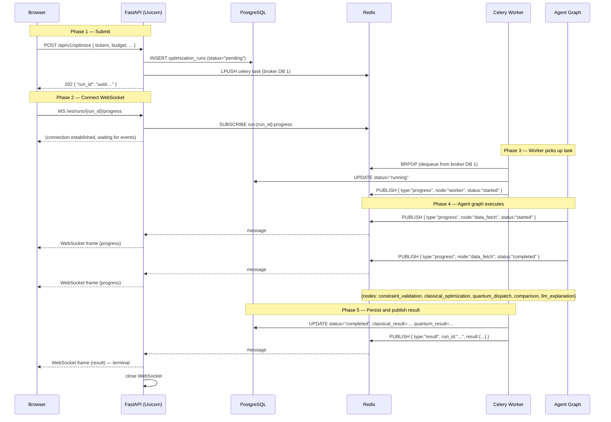
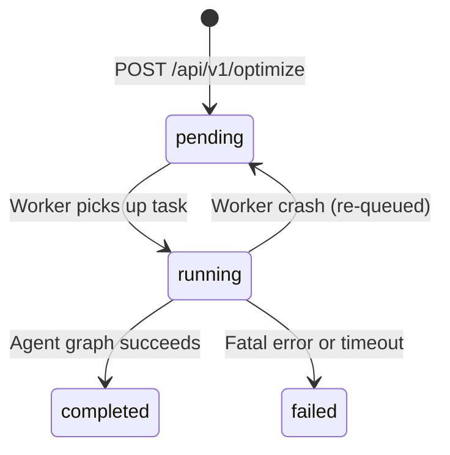

# Request Lifecycle

This page traces the complete lifecycle of a portfolio optimization request — from the moment a user submits the form in the browser to the final result delivered over a WebSocket connection. Understanding this flow is essential for debugging, performance tuning, and extending the system.

## Overview

The system uses an **asynchronous, event-driven** architecture. Rather than blocking the HTTP connection while optimization runs (which can take 60+ seconds for quantum jobs), the API immediately returns a `202 Accepted` response with a `run_id`. The client then opens a WebSocket connection to receive real-time progress events and the final result.



## Phase 1: HTTP Submission (202 Async Pattern)

The client sends a `POST /api/v1/optimize` request with the full `OptimizationRequest` payload (tickers, budget, constraints, quantum flag, etc.).

The FastAPI handler (`backend/app/api/v1/optimize.py`) performs two synchronous operations before returning:

1. **Persist a pending run record** — An `OptimizationRun` row is inserted into PostgreSQL with `status="pending"`. This guarantees the record exists before the client polls or connects via WebSocket.

2. **Dispatch a Celery task** — `run_optimization_task.apply_async()` enqueues the task to either the `default` queue (classical-only) or the `quantum` queue (if `run_quantum=True`).

```python
# From backend/app/api/v1/optimize.py
run_optimization_task.apply_async(
    kwargs={
        "run_id": run_id,
        "request_dict": request.model_dump(mode="json"),
    },
    task_id=run_id,
    queue="quantum" if request.run_quantum else "default",
)

return OptimizationSubmitResponse(run_id=run_id)
```

The response is `HTTP 202 Accepted` — not `200 OK` — because the work has not yet been done. The body contains only the `run_id`:

```json
{ "run_id": "3fa85f64-5717-4562-b3fc-2c963f66afa6" }
```

> **Why 202?** The HTTP 202 status code explicitly signals that the request has been accepted for processing but the processing has not been completed. This is the correct semantic for async job submission and prevents clients from assuming the result is immediately available.

## Phase 2: WebSocket Connection

Immediately after receiving the `run_id`, the browser opens a WebSocket connection to `WS /ws/runs/{run_id}/progress` (handled by `backend/app/api/websocket.py`).

The WebSocket handler:
1. Creates a **dedicated Redis connection** for pub/sub (separate from the shared connection pool to avoid state contamination).
2. Subscribes to the channel `run:{run_id}:progress`.
3. Enters a polling loop that:
   - Checks for an overall timeout (default: 300 seconds).
   - Sends a **keepalive ping** every 30 seconds to prevent proxy/load-balancer timeouts during long quantum jobs.
   - Polls Redis for new messages with a 1-second timeout per poll.
   - Forwards each message to the WebSocket client as a JSON frame.
   - Exits the loop when a **terminal message** (`type: "result"` or `type: "error"`) is received.

```python
# From backend/app/api/websocket.py
msg_type = data.get("type")
if msg_type in ("result", "error"):
    logger.info("websocket_run_complete", run_id=run_id, terminal_type=msg_type)
    break
```

## Phase 3: Redis Pub/Sub Bridge

Redis pub/sub is the bridge between the Celery worker process and the FastAPI WebSocket handler. Because Celery workers and FastAPI run in separate processes (and potentially separate containers), they cannot share in-process state. Redis pub/sub provides a lightweight, low-latency message bus.

**Channel naming convention:** `run:{run_id}:progress`

The Celery task (`backend/app/workers/tasks.py`) uses a synchronous `redis.Redis` client (not async) because Celery workers are synchronous. The `OptimizationTask` base class provides a lazy-initialized Redis client that is reused across task invocations within the same worker process:

```python
# From backend/app/workers/tasks.py
def publish_progress(self, run_id, node, status, message):
    channel = f"run:{run_id}:progress"
    payload = json.dumps({
        "type": "progress",
        "run_id": run_id,
        "node": node,
        "status": status,
        "message": message,
        "timestamp": datetime.now(UTC).isoformat(),
    })
    self.redis_client.publish(channel, payload)
```

The FastAPI WebSocket handler uses an async `redis.asyncio` client to subscribe and receive messages without blocking the event loop.

## Phase 4: Agent Graph Execution

Once the Celery worker picks up the task, it calls `asyncio.run(_execute_optimization(...))` to bridge from the synchronous Celery context into an async execution context for the LangGraph agent graph.

The agent graph executes seven nodes in sequence (see [Agent Pipeline](agent-pipeline.md) for full details). Each node is wrapped by the `wrap_node` decorator, which publishes a `progress` event before and after each node:

```json
{
  "type": "progress",
  "run_id": "3fa85f64-...",
  "node": "classical_optimization",
  "status": "started",
  "message": "Running Markowitz Mean-Variance Optimization...",
  "timestamp": "2026-06-15T10:30:01.123Z"
}
```

The `status` field takes one of three values:
- `"started"` — node has begun executing
- `"completed"` — node finished successfully
- `"failed"` — node encountered an error

## Phase 5: Terminal Message Types

The WebSocket stream ends when one of two terminal message types is received:

### `type: "result"` — Successful Completion

Published after the agent graph completes and the run record is persisted to PostgreSQL:

```json
{
  "type": "result",
  "run_id": "3fa85f64-...",
  "result": {
    "run_id": "3fa85f64-...",
    "status": "completed",
    "tickers": ["AAPL", "MSFT", "GOOGL"],
    "budget": 100000.0,
    "classical_result": { "weights": [...], "metrics": {...} },
    "quantum_result": { "qaoa": {...}, "vqe": {...} },
    "comparison": { "winner": "classical", "sharpe_delta": 0.12 },
    "llm_explanation": "The classical optimizer achieved...",
    "frontier_report": null
  }
}
```

### `type: "error"` — Fatal Failure

Published when the agent graph encounters an unrecoverable error or the task exhausts all retries:

```json
{
  "type": "error",
  "run_id": "3fa85f64-...",
  "error_code": "AGENT_EXECUTION_ERROR",
  "message": "[data_fetch] Failed to fetch price data for INVALID_TICKER",
  "timestamp": "2026-06-15T10:30:05.456Z"
}
```

Specific error codes include:

| Error Code | Cause |
|-----------|-------|
| `AGENT_EXECUTION_ERROR` | Unrecoverable agent graph failure after all retries |
| `QUANTUM_TIMEOUT` | QAOA/VQE exceeded `QUANTUM_TIMEOUT_SECONDS` |
| `WEBSOCKET_TIMEOUT` | WebSocket connection exceeded 300-second limit |
| `WEBSOCKET_ERROR` | Internal WebSocket handler error |

### `type: "ping"` — Keepalive (Non-terminal)

Sent every 30 seconds to prevent proxy timeouts. Clients should ignore these or use them to confirm the connection is alive:

```json
{
  "type": "ping",
  "run_id": "3fa85f64-...",
  "timestamp": "2026-06-15T10:30:30.000Z"
}
```

## Retry and Timeout Policy

The Celery task implements a robust retry policy for transient failures:

| Scenario | Behavior |
|----------|----------|
| Transient error (network, DB timeout) | Retry up to 3 times with exponential backoff: 30s, 60s, 120s |
| `SoftTimeLimitExceeded` (quantum timeout) | No retry — mark as `failed` immediately |
| All retries exhausted | Mark as `failed`, publish `error` event |
| Worker process killed mid-task | Task re-queued (`acks_late=True`, `reject_on_worker_lost=True`) |

During retries, a `progress` event with `status: "retrying"` is published so the frontend can display a meaningful message rather than appearing frozen.

## Database Status Transitions

The `OptimizationRun` record in PostgreSQL transitions through four states:



The `completed` and `failed` states are terminal — once reached, the status never changes. The `pending → pending` transition (via re-queue) is transparent to the database; the record stays in `pending` until a worker successfully transitions it to `running`.

## Polling Alternative

For clients that cannot maintain a WebSocket connection, the run status can be polled via:

```
GET /api/v1/runs/{run_id}/status
```

This returns a lightweight status object without the full result payload. The full result is available at:

```
GET /api/v1/runs/{run_id}
```

once the status is `completed`.

## Related Pages

- [System Overview](system-overview.md) — High-level architecture and service topology
- [Agent Pipeline](agent-pipeline.md) — Detailed node descriptions and error routing
- [Technology Decisions](technology-decisions.md) — Why Redis pub/sub, Celery, and FastAPI were chosen
