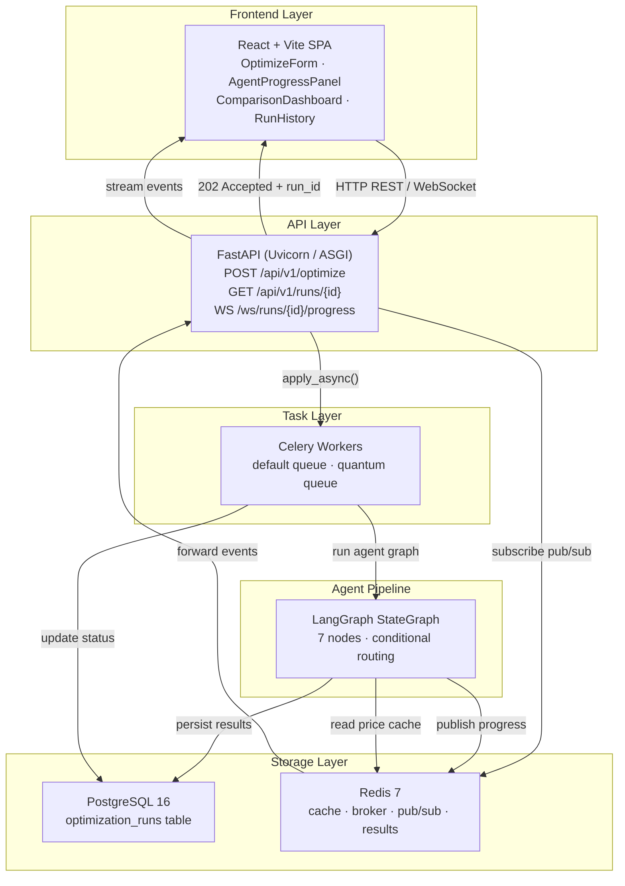
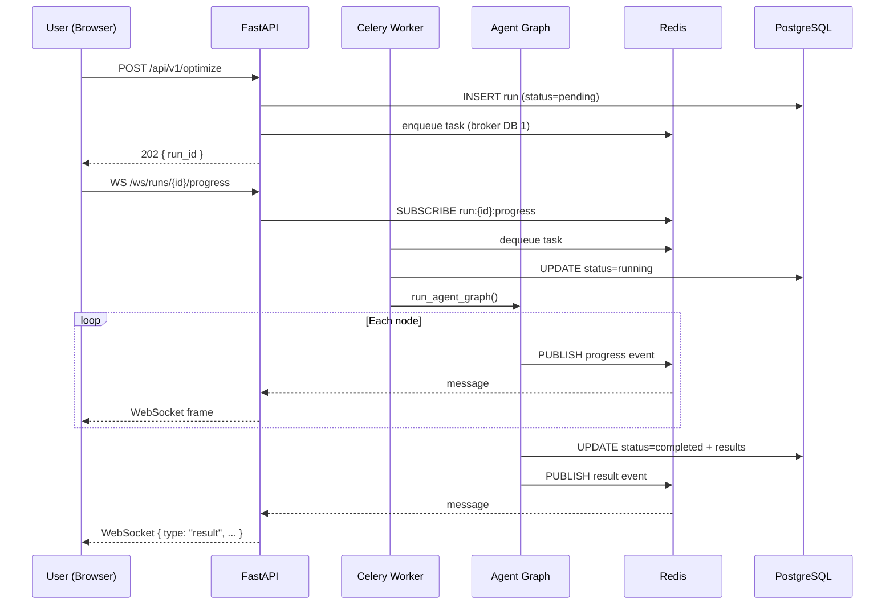

# System Overview

The Portfolio Optimizer is a production-grade, full-stack application that combines three distinct optimization paradigms — classical convex optimization, quantum simulation, and LLM-driven agent orchestration — into a single, cohesive pipeline. This page describes the overall system architecture, service topology, and how the three paradigms interact.

## Architecture at a Glance

The system is organized into five horizontal layers, each with a clear responsibility boundary:



## Service Topology

The application is deployed as a set of Docker Compose services (see `docker-compose.yml`):

| Service | Image / Role | Ports |
|---------|-------------|-------|
| `frontend` | React + Vite dev server | `3000` → `5173` |
| `backend` | FastAPI + Uvicorn (ASGI) | `8000` |
| `worker` | Celery — `default` queue (classical runs) | — |
| `worker-quantum` | Celery — `quantum` queue (QAOA/VQE runs) | — |
| `celery-beat` | Celery Beat periodic scheduler | — |
| `postgres` | PostgreSQL 16 Alpine | `5432` |
| `redis` | Redis 7 Alpine | `6379` |

Two separate Celery worker processes handle different queue types. The `default` worker runs with higher concurrency (default: 4) for fast classical-only jobs (~5–15 seconds). The `worker-quantum` process uses lower concurrency (default: 2) because QAOA/VQE simulations are CPU-intensive and can run for up to 60 seconds per job.

Redis serves three distinct roles on three separate database indices:
- **DB 0** — Application cache (price data, TTL-based)
- **DB 1** — Celery message broker (task queue)
- **DB 2** — Celery result backend (task state)

Additionally, Redis pub/sub channels (on DB 0) bridge the Celery worker's progress events to the FastAPI WebSocket handler in real time.

## The Three Optimization Paradigms

### 1. Classical Convex Optimization (CVXPY / Markowitz MVO)

The classical engine (`backend/app/classical/optimizer.py`) implements Markowitz Mean-Variance Optimization using [CVXPY](https://www.cvxpy.org/). It solves a convex quadratic program:

```
maximize  w^T μ - λ · w^T Σ w
subject to:
    sum(w) = 1
    w >= 0
    (optional) per-asset weight bounds
    (optional) sector concentration limits
    (optional) minimum return / maximum volatility constraints
```

A multi-objective extension allows users to define a weighted matrix of business objectives (return, volatility, Sharpe, HHI diversification, sector concentration). These are scalarized into a single convex objective using normalized weighted sums. Hard threshold constraints are added as CVXPY constraints.

Classical optimization is **always** executed — it provides the baseline result and the covariance/return data that feeds the quantum engines.

### 2. Quantum Simulation (Qiskit QAOA + PennyLane VQE)

The quantum layer (`backend/app/engines/quantum/`) reformulates asset selection as a **QUBO** (Quadratic Unconstrained Binary Optimization) problem:

```
min  -λ_ret · Σ_i μ_i x_i
     + λ_risk · Σ_ij σ_ij x_i x_j
     + λ_card · (Σ_i x_i - k)²
```

where `x_i ∈ {0, 1}` is a binary asset-selection variable. Two solvers run in parallel:

- **QAOA** (`qaoa_qiskit.py`) — Uses Qiskit's Aer statevector simulator with the COBYLA classical optimizer. The circuit depth scales as `2 × p × n` where `p` is the number of QAOA layers and `n` is the number of assets.
- **VQE** (`vqe_pennylane.py`) — Uses PennyLane's `default.qubit` simulator. The QUBO is converted to an Ising Hamiltonian via the substitution `x_i = (1 - Z_i) / 2`, then a hardware-efficient ansatz is optimized via gradient descent.

Quantum optimization is **optional** and **non-fatal**: if it fails, times out, or is disabled (`run_quantum=False`), the pipeline continues with classical results only. Asset count is capped at `MAX_QUANTUM_ASSETS` (default: 8) because circuit complexity grows exponentially.

### 3. Agent Orchestration (LangGraph)

The agent layer (`backend/app/agents/`) uses [LangGraph](https://github.com/langchain-ai/langgraph) to define a stateful directed graph that orchestrates the full optimization workflow. Seven nodes execute in sequence with conditional routing:

```
data_fetch → constraint_validation → classical_optimization
    → quantum_dispatch (conditional) → comparison
    → frontier_computation (conditional) → llm_explanation → END
```

Each node reads from and writes to a shared `AgentState` TypedDict. The `wrap_node` decorator adds progress event publishing around every node, enabling real-time streaming to the frontend via Redis pub/sub.

The LLM explanation node calls GPT-4o (via `langchain-openai`) to generate a natural language summary of the optimization results. If `OPENAI_API_KEY` is not set, a template-based fallback is used.

## Data Flow Summary



## How the Three Paradigms Interact

The three paradigms are not independent — they form a pipeline where each feeds the next:

1. **Data layer** fetches price history from yfinance (with Redis caching) and computes expected returns `μ` and covariance matrix `Σ`.
2. **Classical optimizer** uses `μ` and `Σ` to solve the continuous-weight MVO problem, producing a baseline portfolio with Sharpe ratio, volatility, and per-asset allocations.
3. **Quantum engines** receive the same `μ` and `Σ` to build the QUBO matrix, then solve the discrete asset-selection problem. Results are compared against the classical baseline.
4. **LLM explanation** receives the full state (classical result, quantum result, comparison summary, constraint warnings) and generates a human-readable narrative.

The agent graph ensures that a failure in any non-critical stage (quantum dispatch, frontier computation, LLM explanation) does not block the user from receiving partial results. Only failures in data fetch, constraint validation, or classical optimization are considered fatal.

## Key Source Files

| Component | Path |
|-----------|------|
| FastAPI app factory | `backend/app/main.py` |
| API router (optimize) | `backend/app/api/v1/optimize.py` |
| WebSocket handler | `backend/app/api/websocket.py` |
| Celery app config | `backend/app/workers/celery_app.py` |
| Celery task | `backend/app/workers/tasks.py` |
| LangGraph graph | `backend/app/agents/graph.py` |
| Agent state | `backend/app/agents/state.py` |
| Agent nodes | `backend/app/agents/nodes.py` |
| Classical optimizer | `backend/app/classical/optimizer.py` |
| QAOA solver | `backend/app/engines/quantum/qaoa_qiskit.py` |
| VQE solver | `backend/app/engines/quantum/vqe_pennylane.py` |
| QUBO formulator | `backend/app/engines/quantum/qubo.py` |
| Redis cache | `backend/app/data/cache.py` |
| DB models | `backend/app/db/models.py` |
| App settings | `backend/app/core/config.py` |

## Related Pages

- [Request Lifecycle](request-lifecycle.md) — Full sequence from form submission to WebSocket result
- [Agent Pipeline](agent-pipeline.md) — Detailed LangGraph node descriptions and error routing
- [Technology Decisions](technology-decisions.md) — Rationale for each technology choice
