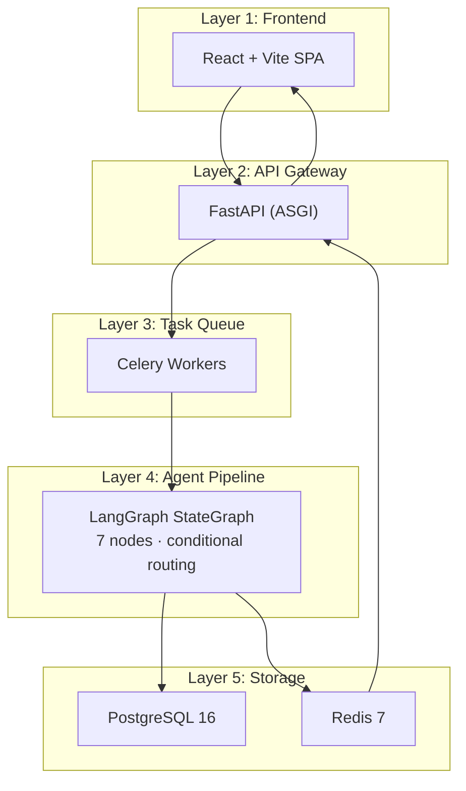

# Architecture

System architecture documentation covering the layered design, service topology, data flow, and the interaction between the FastAPI backend, LangGraph agent graph, optimization engines, and React frontend.

## Section Contents

| Page | Description |
|------|-------------|
| [System Overview](../02-architecture/system-overview.md) | Five-layer architecture, service topology, and Docker Compose services |
| [Request Lifecycle](../02-architecture/request-lifecycle.md) | End-to-end flow from HTTP request to WebSocket response |
| [Agent Pipeline](../02-architecture/agent-pipeline.md) | LangGraph StateGraph structure, node wiring, and conditional routing |
| [Technology Decisions](../02-architecture/technology-decisions.md) | Architecture Decision Records (ADRs) and rationale for key choices |

## Architecture at a Glance

The Portfolio Optimizer is organized into five horizontal layers:

## Key Design Principles

- **Async-first**: FastAPI + Celery + SQLAlchemy async ensure no blocking I/O on the API server
- **Agent-orchestrated**: LangGraph provides deterministic, inspectable orchestration with typed state
- **Graceful degradation**: Quantum failures and LLM failures are non-fatal; the pipeline continues with partial results
- **Observable**: Every node publishes progress events to Redis pub/sub, streamed to the client via WebSocket
- **Reproducible**: All results are persisted in PostgreSQL with full input/output snapshots

## Cross-References

- **Agent Layer details** → [Agent Layer](../05-agent-layer/graph-definition.md)
- **Classical optimization** → [Markowitz MVO](../06-classical-optimization/markowitz-mvo.md)
- **Quantum optimization** → [QUBO Formulation](../07-quantum-optimization/qubo-formulation.md)
- **Infrastructure** → [Docker Compose](../14-infrastructure/docker-compose.md) · [AWS Architecture](../14-infrastructure/aws-architecture.md)
