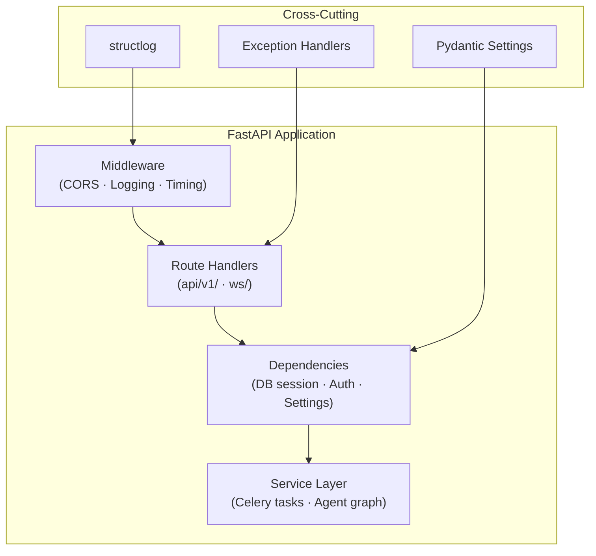

# Backend Core

FastAPI application internals, configuration, middleware, dependency injection, logging, and exception handling for the Portfolio Optimizer backend.

## Section Contents

| Page | Description |
|------|-------------|
| [Application Factory](application-factory.md) | FastAPI app creation, middleware stack, lifespan events, and CORS configuration |
| [Configuration](configuration.md) | Pydantic Settings class, environment loading, and settings validation |
| [Logging](logging.md) | Structured JSON logging with structlog, log levels, and request correlation |
| [Exceptions](exceptions.md) | Custom exception hierarchy, HTTP error handlers, and error response format |
| [Dependencies](dependencies.md) | FastAPI dependency injection: database sessions, settings, and auth |

## Backend Architecture

The backend is a **FastAPI** application running on **Uvicorn** (ASGI). It follows a clean layered architecture:

## Key Files

| File | Purpose |
|------|---------|
| `backend/app/main.py` | Application factory and lifespan |
| `backend/app/core/config.py` | Pydantic Settings class |
| `backend/app/core/logging.py` | structlog configuration |
| `backend/app/core/exceptions.py` | Custom exception classes |
| `backend/app/api/deps.py` | FastAPI dependency functions |

## Cross-References

- **API routes** → [API Reference](../04-api-reference/optimize-endpoint.md)
- **Task queue integration** → [Celery Configuration](../10-task-queue/celery-configuration.md)
- **Database session** → [Async Session](../09-database/async-session.md)
- **Environment variables** → [Environment Variables](../01-getting-started/environment-variables.md)
