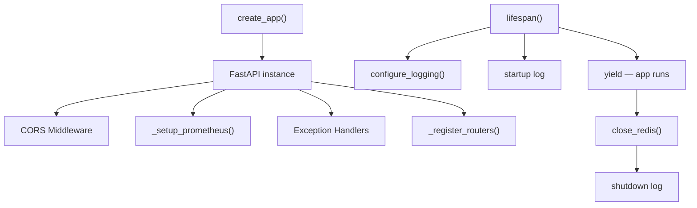
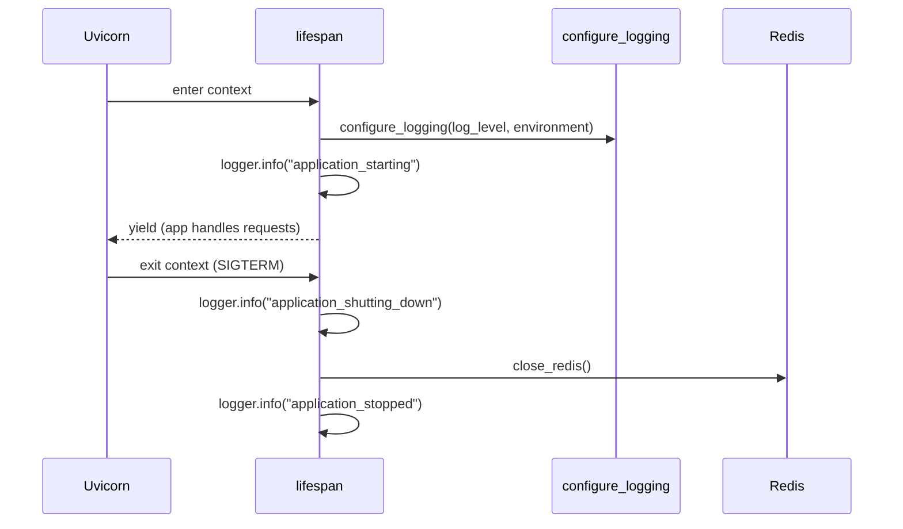

# Application Factory

The application factory module (`backend/app/main.py`) is the entry point for the Portfolio Optimizer API. It creates and fully configures the FastAPI application instance, wires up all middleware, registers exception handlers, attaches Prometheus instrumentation, and manages the application lifecycle through a lifespan context manager.

## Overview



The module-level `app` variable at the bottom of `main.py` is the ASGI application object consumed by Uvicorn:

```python
# Module-level app instance (used by Uvicorn and tests)
app = create_app()
```

---

## `create_app()` Function

```python
def create_app() -> FastAPI:
    """Create and configure the FastAPI application."""
```

`create_app()` is the factory function that assembles the entire application. It is called once at module import time and returns a fully configured `FastAPI` instance. The function performs the following steps in order:

1. Reads settings via `get_settings()`
2. Instantiates `FastAPI` with metadata and environment-aware docs URLs
3. Adds CORS middleware
4. Calls `_setup_prometheus()` to attach metrics instrumentation
5. Registers domain exception handlers
6. Calls `_register_routers()` to mount all API routers

### FastAPI Instance Configuration

```python
app = FastAPI(
    title="Portfolio Optimizer API",
    description=(
        "Production-grade Portfolio Optimization Simulator — "
        "Classical (Markowitz MVO) + Quantum (QAOA/VQE) + Agent-First (LangGraph)"
    ),
    version="0.1.0",
    docs_url="/docs" if settings.ENVIRONMENT != "production" else None,
    redoc_url="/redoc" if settings.ENVIRONMENT != "production" else None,
    openapi_url="/openapi.json" if settings.ENVIRONMENT != "production" else None,
    lifespan=lifespan,
)
```

> **Note:** In `production` environment, the interactive Swagger UI (`/docs`), ReDoc (`/redoc`), and the raw OpenAPI schema (`/openapi.json`) are all disabled by setting their URLs to `None`. This prevents accidental API schema exposure in production deployments.

---

## CORS Configuration

CORS (Cross-Origin Resource Sharing) is configured differently depending on the runtime environment:

| Environment | Allowed Origins | Rationale |
|-------------|----------------|-----------|
| `development` | `["*"]` (all origins) | Permits local frontend dev servers on any port |
| `staging` / `production` | `["https://portfolio-optimizer.example.com"]` | Restricts to the known frontend domain |

```python
allowed_origins = (
    ["*"]
    if settings.ENVIRONMENT == "development"
    else [
        "https://portfolio-optimizer.example.com",
    ]
)

app.add_middleware(
    CORSMiddleware,
    allow_origins=allowed_origins,
    allow_credentials=True,
    allow_methods=["*"],
    allow_headers=["*"],
)
```

All HTTP methods and headers are permitted in both environments. Credentials (cookies, Authorization headers) are allowed, which is required for authenticated requests from the frontend.

---

## Prometheus Instrumentation — `_setup_prometheus()`

```python
def _setup_prometheus(app: FastAPI) -> None:
    """Attach Prometheus instrumentation to the FastAPI application."""
```

Prometheus metrics are collected via the `prometheus-fastapi-instrumentator` library. The function wraps the ASGI application to intercept every HTTP request and record timing and count metrics.

### Exposed Metrics

| Metric | Type | Labels | Description |
|--------|------|--------|-------------|
| `http_requests_total` | Counter | `method`, `handler`, `status_code` | Total number of HTTP requests |
| `http_request_duration_seconds` | Histogram | `method`, `handler`, `status_code` | Request latency (buckets: 0.005 … 10 s) |
| `http_requests_inprogress` | Gauge | `method`, `handler` | Currently in-flight requests |

### Endpoint

Metrics are exposed at **`/metrics`** in the standard Prometheus text exposition format (`Content-Type: text/plain; version=0.0.4`). The `/metrics` endpoint itself is excluded from instrumentation to avoid self-referential metric noise.

```python
Instrumentator(
    excluded_handlers=["/metrics"],
).instrument(app).expose(
    app,
    endpoint="/metrics",
    include_in_schema=False,  # Hidden from OpenAPI docs
    tags=["monitoring"],
)
```

### Graceful Degradation

The import of `prometheus_fastapi_instrumentator` is wrapped in a `try/except ImportError` block. If the package is not installed (e.g., in a minimal test environment), the function logs a warning and returns without raising. The rest of the application continues to work normally — the `/metrics` endpoint simply will not be available.

```python
try:
    from prometheus_fastapi_instrumentator import Instrumentator
    # ... setup ...
    logger.info("prometheus_instrumentation_enabled", endpoint="/metrics")
except ImportError:
    logger.warning(
        "prometheus_instrumentation_unavailable",
        reason="prometheus-fastapi-instrumentator is not installed; "
               "the /metrics endpoint will not be available",
    )
```

---

## Exception Handler Registration

Two exception handlers are registered inline within `create_app()`:

### Domain Exception Handler

Handles all subclasses of `PortfolioOptimizerError` — the application's custom exception hierarchy. It converts domain exceptions into structured JSON responses using the exception's `to_dict()` method and maps the `error_code` to an appropriate HTTP status code via `_error_code_to_http_status()`.

```python
@app.exception_handler(PortfolioOptimizerError)
async def portfolio_error_handler(
    request: Request,
    exc: PortfolioOptimizerError,
) -> JSONResponse:
    logger.warning(
        "domain_error",
        error_code=exc.error_code,
        message=exc.message,
        path=str(request.url),
    )
    return JSONResponse(
        status_code=_error_code_to_http_status(exc.error_code),
        content=exc.to_dict(),
    )
```

All domain errors are logged at `WARNING` level with structured fields: `error_code`, `message`, and the request `path`.

### Catch-All Handler

Handles any `Exception` not caught by the domain handler. Returns a generic `500 Internal Server Error` response and logs the full exception at `ERROR` level with `exc_info=True` to capture the stack trace.

```python
@app.exception_handler(Exception)
async def unhandled_error_handler(
    request: Request,
    exc: Exception,
) -> JSONResponse:
    logger.error(
        "unhandled_exception",
        exc_type=type(exc).__name__,
        message=str(exc),
        path=str(request.url),
        exc_info=True,
    )
    return JSONResponse(
        status_code=500,
        content={
            "error_code": "INTERNAL_ERROR",
            "message": "An unexpected error occurred. Please try again.",
            "details": {},
        },
    )
```

---

## Router Registration — `_register_routers()`

```python
def _register_routers(app: FastAPI) -> None:
    """Register all API routers with the FastAPI application."""
```

All routers are imported lazily inside the function body to avoid circular imports. Each router module can be developed independently without creating import cycles.

```python
from app.api.health import router as health_router
from app.api.v1 import router as api_v1_router
from app.api.websocket import router as ws_router

app.include_router(health_router)
app.include_router(api_v1_router, prefix="/api/v1")
app.include_router(ws_router)
```

### Registered Routers

| Router | Prefix | Description |
|--------|--------|-------------|
| `health_router` | *(none)* | `GET /health` — application health check |
| `api_v1_router` | `/api/v1` | All v1 REST endpoints (optimize, runs, assets) |
| `ws_router` | *(none)* | WebSocket endpoint for real-time run status |

The `api_v1_router` itself aggregates three sub-routers:

| Sub-router | Routes |
|------------|--------|
| `optimize_router` | `POST /api/v1/optimize` |
| `runs_router` | `GET /api/v1/runs`, `GET /api/v1/runs/{run_id}`, `GET /api/v1/runs/{run_id}/status` |
| `assets_router` | `GET /api/v1/assets/search` |

---

## Lifespan Context Manager

```python
@asynccontextmanager
async def lifespan(app: FastAPI):
    """Manage application startup and shutdown."""
```

The lifespan context manager uses Python's `asynccontextmanager` pattern. Everything before `yield` runs at startup; everything after runs at shutdown. It is passed to `FastAPI(lifespan=lifespan)`.



### Startup Sequence

1. **Configure logging** — `configure_logging()` is called first so all subsequent log messages are structured. The log level and renderer (JSON vs. console) are determined by `settings.LOG_LEVEL` and `settings.ENVIRONMENT`.
2. **Log readiness** — Emits `application_starting` with `environment` and `log_level` fields.

> **Note:** Database migrations are handled externally by the Docker `CMD` (Alembic `upgrade head`) before the Uvicorn process starts. The lifespan does not run migrations directly.

### Shutdown Sequence

1. **Log shutdown intent** — Emits `application_shutting_down`.
2. **Close Redis pool** — Calls `await close_redis()` to gracefully drain and close all Redis connections in the shared connection pool.
3. **Log completion** — Emits `application_stopped`.

---

## `_error_code_to_http_status()` Mapping

```python
def _error_code_to_http_status(error_code: str) -> int:
    """Map domain error codes to HTTP status codes."""
```

This function provides the canonical mapping between domain `error_code` strings and HTTP status codes. It is used by the domain exception handler to set the response status.

| `error_code` | HTTP Status | Meaning |
|--------------|-------------|---------|
| `DATA_FETCH_ERROR` | `502` | Bad Gateway — upstream data source (yfinance) failed |
| `CACHE_ERROR` | `503` | Service Unavailable — Redis cache is unreachable |
| `CONSTRAINT_VIOLATION` | `422` | Unprocessable Entity — user constraints are invalid |
| `SOLVER_INFEASIBLE` | `422` | Unprocessable Entity — CVXPY solver found no feasible solution |
| `QUANTUM_TIMEOUT` | `504` | Gateway Timeout — quantum job exceeded time limit |
| `QUANTUM_ASSET_LIMIT_EXCEEDED` | `422` | Unprocessable Entity — too many assets for quantum solver |
| `AGENT_EXECUTION_ERROR` | `500` | Internal Server Error — LangGraph agent graph failed |
| `INTERNAL_ERROR` | `500` | Internal Server Error — unexpected error |
| *(unknown)* | `500` | Fallback for unrecognised error codes |

The mapping uses `dict.get(error_code, 500)` so any unrecognised error code safely falls back to `500`.

---

## Error Response Format

All domain errors return a consistent JSON body:

```json
{
  "error_code": "DATA_FETCH_ERROR",
  "message": "Failed to fetch price data for tickers: ['INVALID']",
  "details": {
    "tickers": ["INVALID"]
  }
}
```

See [Exceptions](exceptions.md) for the full exception hierarchy and the fields each exception type populates in `details`.

---

## Related Pages

- [Configuration](configuration.md) — `Settings` class and `get_settings()` singleton
- [Logging](logging.md) — `configure_logging()` and `get_logger()` usage
- [Exceptions](exceptions.md) — Full domain exception hierarchy
- [Dependencies](dependencies.md) — `DbDep`, `RedisDep`, and `close_redis()`
