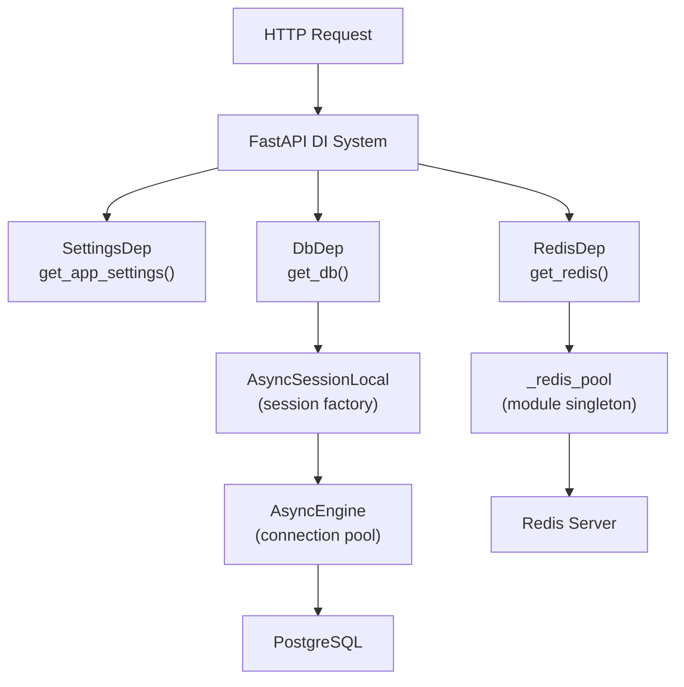
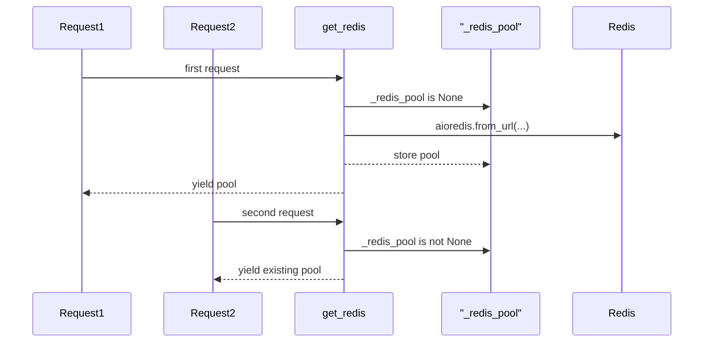
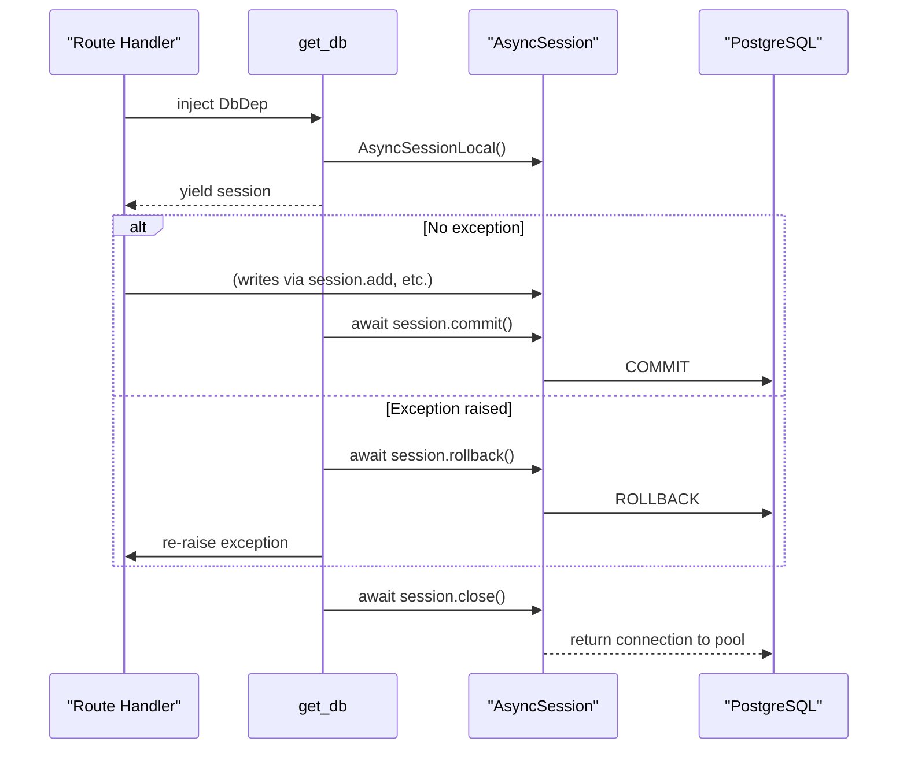

# Dependencies

FastAPI dependency injection providers are centralised in `backend/app/core/dependencies.py`. All shared resources — database sessions, Redis clients, and application settings — are defined here so every module imports from a single, consistent location.

## Overview



Dependencies are created lazily on first use and cleaned up appropriately:

- **`SettingsDep`** — Returns the `lru_cache` singleton; no cleanup needed.
- **`RedisDep`** — Yields from a module-level connection pool; pool is closed at shutdown via `close_redis()`.
- **`DbDep`** — Opens a new `AsyncSession` per request; commits on success, rolls back on exception, always closes in `finally`.

---

## `SettingsDep` — Settings Dependency

```python
def get_app_settings() -> Settings:
    """FastAPI dependency that returns the cached Settings singleton."""
    return get_settings()

SettingsDep = Annotated[Settings, Depends(get_app_settings)]
```

`SettingsDep` is a thin wrapper around `get_settings()` that integrates the settings singleton into FastAPI's dependency injection system. Because `get_settings()` is decorated with `@lru_cache(maxsize=1)`, the `.env` file is read only once per process regardless of how many requests are made.

### Usage in Route Handlers

```python
from app.core.dependencies import SettingsDep

@router.get("/example")
async def example_endpoint(settings: SettingsDep):
    return {
        "environment": settings.ENVIRONMENT,
        "max_quantum_assets": settings.MAX_QUANTUM_ASSETS,
    }
```

### Usage in Other Dependencies

`SettingsDep` is also used as a sub-dependency within `get_redis()`:

```python
async def get_redis(
    settings: SettingsDep,
) -> AsyncGenerator[aioredis.Redis, None]:
    # settings.REDIS_URL is available here
    ...
```

---

## `RedisDep` — Redis Client Dependency

```python
_redis_pool: aioredis.Redis | None = None  # Module-level singleton

async def get_redis(
    settings: SettingsDep,
) -> AsyncGenerator[aioredis.Redis, None]:
    """Yield an async Redis client from the shared connection pool."""
    global _redis_pool
    if _redis_pool is None:
        _redis_pool = aioredis.from_url(
            settings.REDIS_URL,
            encoding="utf-8",
            decode_responses=False,
            max_connections=20,
            socket_connect_timeout=5,
            socket_timeout=5,
            retry_on_timeout=True,
        )
    yield _redis_pool

RedisDep = Annotated[aioredis.Redis, Depends(get_redis)]
```

### Connection Pool Configuration

The Redis client is created with `aioredis.from_url()` using the following parameters:

| Parameter | Value | Description |
|-----------|-------|-------------|
| `encoding` | `"utf-8"` | String encoding for key names |
| `decode_responses` | `False` | Raw bytes mode — required for pickle-serialised NumPy arrays and DataFrames |
| `max_connections` | `20` | Maximum concurrent connections in the pool |
| `socket_connect_timeout` | `5` | Seconds to wait when establishing a new connection |
| `socket_timeout` | `5` | Seconds to wait for a response from Redis |
| `retry_on_timeout` | `True` | Automatically retry timed-out commands once |

> **Important:** `decode_responses=False` is intentional. The data layer uses `pickle` serialisation to store NumPy arrays and Pandas DataFrames in Redis. If `decode_responses=True` were set, Redis would attempt to decode the raw bytes as UTF-8 strings, corrupting the pickled data. The WebSocket handler creates its own separate Redis client with `decode_responses=True` for pub/sub message handling.

### Pool Lifecycle

The `_redis_pool` module-level variable is `None` at startup. On the first request that injects `RedisDep`, the pool is created and stored in `_redis_pool`. All subsequent requests reuse the same pool — individual connections are checked out from the pool per-request transparently by the `redis.asyncio` library.



### Usage in Route Handlers

```python
from app.core.dependencies import RedisDep

@router.get("/cache-status")
async def cache_status(redis: RedisDep):
    info = await redis.info("server")
    return {"redis_version": info["redis_version"]}
```

---

## `DbDep` — Database Session Dependency

```python
async def get_db() -> AsyncGenerator[AsyncSession, None]:
    """Yield an async SQLAlchemy session."""
    from app.db.session import AsyncSessionLocal  # lazy import

    async with AsyncSessionLocal() as session:
        try:
            yield session
            await session.commit()
        except Exception:
            await session.rollback()
            raise
        finally:
            await session.close()

DbDep = Annotated[AsyncSession, Depends(get_db)]
```

### Transaction Management

Each HTTP request that injects `DbDep` receives a fresh `AsyncSession`. The session's lifecycle is fully managed by the dependency:



| Phase | Action | Description |
|-------|--------|-------------|
| **Open** | `AsyncSessionLocal()` | Creates a new session bound to the shared async engine |
| **Yield** | `yield session` | Route handler receives the session and performs DB operations |
| **Commit** | `await session.commit()` | Commits the transaction if no exception was raised |
| **Rollback** | `await session.rollback()` | Rolls back on any exception to prevent partial writes |
| **Close** | `await session.close()` | Always executed; returns the connection to the pool |

### Lazy Import

`AsyncSessionLocal` is imported inside the function body to avoid circular imports:

```python
from app.db.session import AsyncSessionLocal  # noqa: PLC0415
```

`db.session` imports `config`, which is imported by `dependencies`. Importing `AsyncSessionLocal` at module level in `dependencies.py` would create a circular import chain. The lazy import breaks this cycle.

### Usage in Route Handlers

```python
from app.core.dependencies import DbDep
from sqlalchemy import select
from app.db.models import OptimizationRun

@router.get("/runs/{run_id}")
async def get_run(run_id: str, db: DbDep):
    result = await db.execute(
        select(OptimizationRun).where(OptimizationRun.run_id == run_id)
    )
    run = result.scalar_one_or_none()
    if run is None:
        raise HTTPException(status_code=404, detail="Run not found")
    return run
```

### Session Configuration

The `AsyncSessionLocal` factory (defined in `backend/app/db/session.py`) is configured with:

| Option | Value | Rationale |
|--------|-------|-----------|
| `expire_on_commit=False` | `False` | Prevents lazy-loading errors after commit in async contexts where the session may be closed |
| `autocommit` | `False` | Explicit transaction management via `get_db()` |
| `autoflush` | `False` | Explicit flush control; flush before queries as needed |

---

## `close_redis()` — Shutdown Hook

```python
async def close_redis() -> None:
    """Close the global Redis connection pool."""
    global _redis_pool
    if _redis_pool is not None:
        await _redis_pool.aclose()
        _redis_pool = None
```

`close_redis()` is called by the FastAPI [lifespan context manager](application-factory.md#lifespan-context-manager) during application shutdown:

```python
# In main.py lifespan:
await close_redis()
```

It gracefully drains and closes all connections in the `_redis_pool`. After calling `close_redis()`, `_redis_pool` is set back to `None` so that if the application were somehow restarted in the same process, a new pool would be created on the next request.

This function is a **no-op** if the pool was never initialised (e.g., in tests that never make a request requiring Redis):

```python
if _redis_pool is not None:
    await _redis_pool.aclose()
    _redis_pool = None
# If _redis_pool is None, nothing happens
```

---

## Dependency Override in Tests

FastAPI's dependency override mechanism allows tests to replace real dependencies with mocks without modifying application code:

```python
from unittest.mock import AsyncMock
from sqlalchemy.ext.asyncio import AsyncSession
from app.core.dependencies import get_db
from app.main import app

def make_mock_session() -> AsyncMock:
    session = AsyncMock(spec=AsyncSession)
    session.add = MagicMock()
    session.flush = AsyncMock()
    session.commit = AsyncMock()
    session.rollback = AsyncMock()
    session.close = AsyncMock()
    return session

# Override the DB dependency for a test
mock_session = make_mock_session()

async def _override():
    yield mock_session

app.dependency_overrides[get_db] = _override

# ... run test ...

# Restore after test
app.dependency_overrides.pop(get_db, None)
```

This pattern is used extensively in the integration test suite (see `tests/integration/conftest.py`).

---

## All Dependency Types at a Glance

| Dependency | Type Alias | Underlying Type | Scope | Cleanup |
|------------|-----------|-----------------|-------|---------|
| `SettingsDep` | `Annotated[Settings, Depends(get_app_settings)]` | `Settings` | Process singleton | None |
| `RedisDep` | `Annotated[aioredis.Redis, Depends(get_redis)]` | `aioredis.Redis` | Process singleton pool | `close_redis()` at shutdown |
| `DbDep` | `Annotated[AsyncSession, Depends(get_db)]` | `AsyncSession` | Per-request | Auto commit/rollback/close |

---

## Related Pages

- [Application Factory](application-factory.md) — Lifespan shutdown calls `close_redis()`
- [Configuration](configuration.md) — `REDIS_URL` and `DATABASE_URL` settings
- [Logging](logging.md) — Logging within dependency providers
- [Exceptions](exceptions.md) — `CacheError` raised when Redis operations fail
