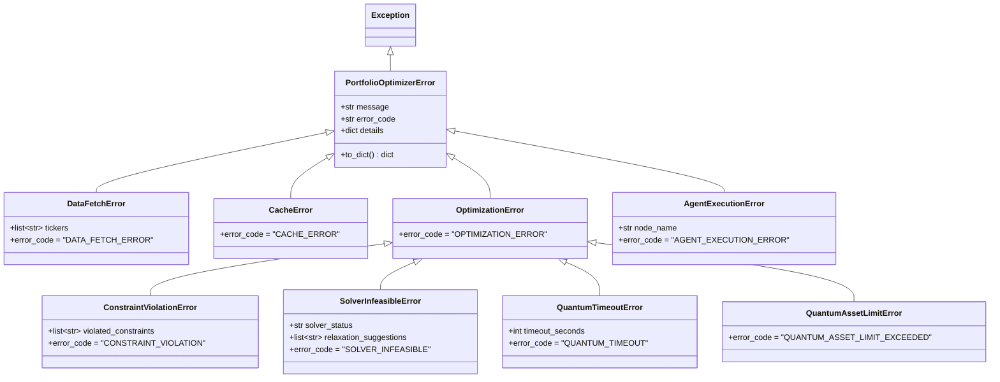

# Exceptions

The Portfolio Optimizer defines a custom exception hierarchy rooted at `PortfolioOptimizerError`. All domain exceptions carry structured metadata — an `error_code`, a human-readable `message`, and a `details` dictionary — so that FastAPI's exception handler can return consistent, machine-readable JSON error responses.

All exceptions are defined in `backend/app/core/exceptions.py`.

## Exception Hierarchy



---

## `PortfolioOptimizerError` — Base Class

```python
class PortfolioOptimizerError(Exception):
    """Base class for all application-level exceptions."""

    def __init__(
        self,
        message: str,
        error_code: str = "INTERNAL_ERROR",
        details: dict[str, Any] | None = None,
    ) -> None:
        super().__init__(message)
        self.message = message
        self.error_code = error_code
        self.details: dict[str, Any] = details or {}
```

Every exception in the hierarchy carries three core attributes:

| Attribute | Type | Description |
|-----------|------|-------------|
| `message` | `str` | Human-readable description of the error |
| `error_code` | `str` | Machine-readable error identifier (used for HTTP status mapping) |
| `details` | `dict[str, Any]` | Structured context specific to the exception type |

### `to_dict()` Method

```python
def to_dict(self) -> dict[str, Any]:
    """Serialize to a JSON-serialisable dict for API error responses."""
    return {
        "error_code": self.error_code,
        "message": self.message,
        "details": self.details,
    }
```

The `to_dict()` method is called by the FastAPI exception handler in `main.py` to produce the JSON response body. All API error responses have this consistent structure:

```json
{
  "error_code": "DATA_FETCH_ERROR",
  "message": "Failed to fetch price data for tickers: ['INVALID']",
  "details": {
    "tickers": ["INVALID"]
  }
}
```

---

## Data Layer Exceptions

### `DataFetchError`

```python
class DataFetchError(PortfolioOptimizerError):
    """Raised when yfinance fails to return usable price data."""

    def __init__(
        self,
        message: str,
        tickers: list[str] | None = None,
        details: dict[str, Any] | None = None,
    ) -> None:
```

**Error code:** `DATA_FETCH_ERROR`  
**HTTP status:** `502 Bad Gateway`

Raised by the data fetcher when the upstream market data source (yfinance) cannot return usable price data. Common causes:

- Empty `DataFrame` returned for all requested tickers (invalid symbols)
- Network timeout after all retries are exhausted
- All columns dropped due to excessive `NaN` values in the price history

The `tickers` parameter is merged into `details` so the caller knows which symbols caused the failure:

```python
raise DataFetchError(
    message="No price data returned for tickers",
    tickers=["INVALID_TICKER"],
)
```

**Response body:**
```json
{
  "error_code": "DATA_FETCH_ERROR",
  "message": "No price data returned for tickers",
  "details": {
    "tickers": ["INVALID_TICKER"]
  }
}
```

### `CacheError`

```python
class CacheError(PortfolioOptimizerError):
    """Raised when Redis cache operations fail unexpectedly."""

    def __init__(self, message: str, details: dict[str, Any] | None = None) -> None:
```

**Error code:** `CACHE_ERROR`  
**HTTP status:** `503 Service Unavailable`

Raised when a Redis `GET`, `SET`, or `DELETE` operation fails with an unexpected exception (e.g., connection refused, serialisation error). The application treats cache failures as non-fatal where possible — if a cache read fails, the data layer falls back to fetching fresh data from yfinance.

```python
raise CacheError(
    message="Failed to deserialize cached price data",
    details={"cache_key": "prices:AAPL:MSFT:252"},
)
```

---

## Optimization Layer Exceptions

### `OptimizationError` — Intermediate Base

```python
class OptimizationError(PortfolioOptimizerError):
    """Base class for optimization engine failures."""
```

**Error code:** `OPTIMIZATION_ERROR` (default, rarely used directly)

`OptimizationError` is an intermediate base class grouping all solver-related failures. It is not typically raised directly — use one of its subclasses instead.

### `ConstraintViolationError`

```python
class ConstraintViolationError(OptimizationError):
    """Raised when user-supplied constraints are logically invalid."""

    def __init__(
        self,
        message: str,
        violated_constraints: list[str] | None = None,
        details: dict[str, Any] | None = None,
    ) -> None:
```

**Error code:** `CONSTRAINT_VIOLATION`  
**HTTP status:** `422 Unprocessable Entity`

Raised during constraint validation **before** the solver is invoked, when the user's requested constraints are logically impossible or contradictory. Examples:

- `min_portfolio_return` exceeds the maximum achievable return given the asset universe
- `max_weight_per_asset` is so small that the budget constraint cannot be satisfied
- Sector weight limits sum to less than 1.0, making full budget allocation impossible

The `violated_constraints` list names the specific constraints that failed:

```python
raise ConstraintViolationError(
    message="min_portfolio_return exceeds maximum achievable return",
    violated_constraints=["min_portfolio_return"],
    details={"requested": 0.25, "max_achievable": 0.18},
)
```

**Response body:**
```json
{
  "error_code": "CONSTRAINT_VIOLATION",
  "message": "min_portfolio_return exceeds maximum achievable return",
  "details": {
    "violated_constraints": ["min_portfolio_return"],
    "requested": 0.25,
    "max_achievable": 0.18
  }
}
```

### `SolverInfeasibleError`

```python
class SolverInfeasibleError(OptimizationError):
    """Raised when the CVXPY solver cannot find a feasible solution."""

    def __init__(
        self,
        message: str,
        solver_status: str = "infeasible",
        relaxation_suggestions: list[str] | None = None,
        details: dict[str, Any] | None = None,
    ) -> None:
```

**Error code:** `SOLVER_INFEASIBLE`  
**HTTP status:** `422 Unprocessable Entity`

Raised when the CVXPY solver returns an `infeasible` or `infeasible_inaccurate` status after attempting to solve the optimization problem. This typically means the constraints are over-specified or contradictory in a way that wasn't caught by pre-validation.

The `relaxation_suggestions` field provides actionable hints for the user:

```python
raise SolverInfeasibleError(
    message="No feasible portfolio found with the given constraints",
    solver_status="infeasible",
    relaxation_suggestions=[
        "Increase max_weight_per_asset above 0.15",
        "Reduce min_portfolio_return below 0.20",
    ],
)
```

**Response body:**
```json
{
  "error_code": "SOLVER_INFEASIBLE",
  "message": "No feasible portfolio found with the given constraints",
  "details": {
    "solver_status": "infeasible",
    "relaxation_suggestions": [
      "Increase max_weight_per_asset above 0.15",
      "Reduce min_portfolio_return below 0.20"
    ]
  }
}
```

### `QuantumTimeoutError`

```python
class QuantumTimeoutError(OptimizationError):
    """Raised when a quantum optimization job exceeds the configured timeout."""

    def __init__(
        self,
        message: str,
        timeout_seconds: int = 60,
        details: dict[str, Any] | None = None,
    ) -> None:
```

**Error code:** `QUANTUM_TIMEOUT`  
**HTTP status:** `504 Gateway Timeout`

Raised when a QAOA or VQE optimization job exceeds the `QUANTUM_TIMEOUT_SECONDS` setting. The `timeout_seconds` field records the limit that was exceeded:

```python
raise QuantumTimeoutError(
    message="QAOA optimization exceeded the 60-second timeout",
    timeout_seconds=60,
    details={"solver": "qaoa", "num_assets": 6},
)
```

**Response body:**
```json
{
  "error_code": "QUANTUM_TIMEOUT",
  "message": "QAOA optimization exceeded the 60-second timeout",
  "details": {
    "timeout_seconds": 60,
    "solver": "qaoa",
    "num_assets": 6
  }
}
```

### `QuantumAssetLimitError`

```python
class QuantumAssetLimitError(OptimizationError):
    """Raised when the number of assets exceeds MAX_QUANTUM_ASSETS."""

    def __init__(
        self,
        num_assets: int,
        max_assets: int,
        details: dict[str, Any] | None = None,
    ) -> None:
```

**Error code:** `QUANTUM_ASSET_LIMIT_EXCEEDED`  
**HTTP status:** `422 Unprocessable Entity`

Raised when a quantum optimization request includes more assets than the `MAX_QUANTUM_ASSETS` configuration limit (default: 8). The error message is auto-generated from the `num_assets` and `max_assets` parameters:

```python
raise QuantumAssetLimitError(num_assets=12, max_assets=8)
```

**Auto-generated message:**
```
Quantum optimization supports at most 8 assets, but 12 were provided.
Reduce the asset list or use classical optimization.
```

**Response body:**
```json
{
  "error_code": "QUANTUM_ASSET_LIMIT_EXCEEDED",
  "message": "Quantum optimization supports at most 8 assets, but 12 were provided. Reduce the asset list or use classical optimization.",
  "details": {
    "num_assets": 12,
    "max_assets": 8
  }
}
```

---

## Agent Layer Exceptions

### `AgentExecutionError`

```python
class AgentExecutionError(PortfolioOptimizerError):
    """Raised when the LangGraph agent graph encounters an unrecoverable error."""

    def __init__(
        self,
        message: str,
        node_name: str | None = None,
        details: dict[str, Any] | None = None,
    ) -> None:
```

**Error code:** `AGENT_EXECUTION_ERROR`  
**HTTP status:** `500 Internal Server Error`

Raised when the LangGraph agent graph fails at a specific node. The `node_name` field identifies which node in the graph caused the failure, aiding debugging:

```python
raise AgentExecutionError(
    message="LLM explanation node failed after 3 retries",
    node_name="explainer",
    details={"retries": 3, "last_error": "OpenAI API rate limit exceeded"},
)
```

**Response body:**
```json
{
  "error_code": "AGENT_EXECUTION_ERROR",
  "message": "LLM explanation node failed after 3 retries",
  "details": {
    "node_name": "explainer",
    "retries": 3,
    "last_error": "OpenAI API rate limit exceeded"
  }
}
```

---

## Error Code to HTTP Status Mapping

The `_error_code_to_http_status()` function in `main.py` provides the canonical mapping:

| Exception Class | `error_code` | HTTP Status | Semantic Meaning |
|-----------------|-------------|-------------|-----------------|
| `DataFetchError` | `DATA_FETCH_ERROR` | `502` | Upstream data source failure |
| `CacheError` | `CACHE_ERROR` | `503` | Cache service unavailable |
| `ConstraintViolationError` | `CONSTRAINT_VIOLATION` | `422` | Invalid user-supplied constraints |
| `SolverInfeasibleError` | `SOLVER_INFEASIBLE` | `422` | Solver found no feasible solution |
| `QuantumTimeoutError` | `QUANTUM_TIMEOUT` | `504` | Quantum job timed out |
| `QuantumAssetLimitError` | `QUANTUM_ASSET_LIMIT_EXCEEDED` | `422` | Too many assets for quantum solver |
| `AgentExecutionError` | `AGENT_EXECUTION_ERROR` | `500` | Agent graph failure |
| `PortfolioOptimizerError` | `INTERNAL_ERROR` | `500` | Generic application error |
| *(unknown code)* | — | `500` | Fallback for unrecognised codes |

---

## Raising Exceptions in Practice

Domain code should raise the most specific exception available:

```python
# Data layer
from app.core.exceptions import DataFetchError, CacheError

if df.empty:
    raise DataFetchError(
        message=f"No price data returned for {tickers}",
        tickers=tickers,
    )

# Optimization layer
from app.core.exceptions import SolverInfeasibleError

if problem.status in ("infeasible", "infeasible_inaccurate"):
    raise SolverInfeasibleError(
        message="Optimization problem is infeasible",
        solver_status=problem.status,
        relaxation_suggestions=["Reduce min_return constraint"],
    )

# Quantum layer
from app.core.exceptions import QuantumAssetLimitError
from app.core.config import get_settings

settings = get_settings()
if len(tickers) > settings.MAX_QUANTUM_ASSETS:
    raise QuantumAssetLimitError(
        num_assets=len(tickers),
        max_assets=settings.MAX_QUANTUM_ASSETS,
    )
```

---

## Related Pages

- [Application Factory](application-factory.md) — Exception handler registration and `_error_code_to_http_status()`
- [Configuration](configuration.md) — `MAX_QUANTUM_ASSETS` and `QUANTUM_TIMEOUT_SECONDS` settings
- [Logging](logging.md) — How domain errors are logged at `WARNING` level
