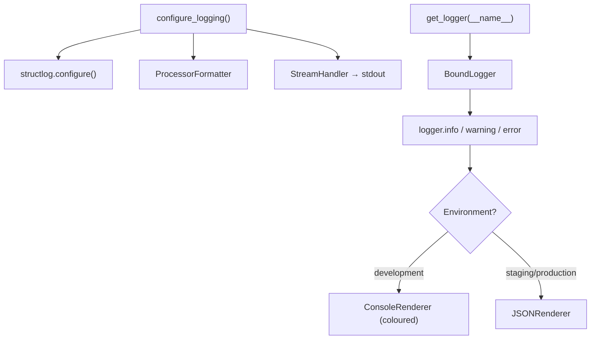

# Logging

The Portfolio Optimizer uses **structlog** for structured, context-rich logging. All log output is either human-readable coloured console text (development) or machine-parseable JSON (staging/production). The logging subsystem is configured in `backend/app/core/logging.py`.

## Overview



Logging is initialised once at application startup inside the [lifespan context manager](application-factory.md#lifespan-context-manager) before any other application code runs.

---

## `configure_logging()`

```python
def configure_logging(log_level: str = "INFO", environment: str = "development") -> None:
    """Configure structlog and stdlib logging.

    Call this once at application startup (in ``main.py`` lifespan).

    Args:
        log_level: One of DEBUG, INFO, WARNING, ERROR, CRITICAL.
        environment: ``development`` uses ConsoleRenderer; all others use JSONRenderer.
    """
```

This function must be called **once** at startup. It configures both structlog and the Python standard library `logging` module so that all loggers — including third-party libraries that use `logging.getLogger()` — route through the same structured pipeline.

### Shared Processors

All log records pass through a shared processor chain regardless of environment:

| Processor | Purpose |
|-----------|---------|
| `structlog.contextvars.merge_contextvars` | Merges thread-local/async context variables into the log event |
| `structlog.stdlib.add_logger_name` | Adds the `logger` field with the module name |
| `structlog.stdlib.add_log_level` | Adds the `level` field (`info`, `warning`, etc.) |
| `structlog.stdlib.PositionalArgumentsFormatter()` | Formats positional `%s`-style arguments |
| `structlog.processors.TimeStamper(fmt="iso")` | Adds `timestamp` in ISO 8601 format |
| `structlog.processors.StackInfoRenderer()` | Renders stack info when `stack_info=True` |

### Environment-Specific Renderer

```python
if environment == "development":
    renderer = structlog.dev.ConsoleRenderer(colors=True)
else:
    renderer = structlog.processors.JSONRenderer()
```

| Environment | Renderer | Output Format |
|-------------|----------|---------------|
| `development` | `ConsoleRenderer(colors=True)` | Human-readable, coloured terminal output |
| `staging` | `JSONRenderer()` | Single-line JSON per log event |
| `production` | `JSONRenderer()` | Single-line JSON per log event |

### Silenced Third-Party Loggers

To reduce noise from verbose libraries, the following loggers are set to `WARNING` level regardless of the configured `LOG_LEVEL`:

```python
for noisy in ("uvicorn.access", "sqlalchemy.engine", "httpx", "httpcore"):
    logging.getLogger(noisy).setLevel(logging.WARNING)
```

This prevents Uvicorn access logs, SQLAlchemy SQL echo, and HTTP client debug output from flooding the log stream in development.

---

## `get_logger()`

```python
def get_logger(name: str) -> structlog.stdlib.BoundLogger:
    """Return a structlog BoundLogger bound with the given module name.

    Args:
        name: Typically ``__name__`` of the calling module.

    Returns:
        A structlog BoundLogger instance.
    """
    return structlog.get_logger(name)
```

Every module that needs logging should call `get_logger(__name__)` at module level:

```python
from app.core.logging import get_logger

logger = get_logger(__name__)
```

The `name` argument (typically `__name__`) is automatically included in every log record as the `logger` field, making it easy to filter logs by module.

---

## Structured Log Events

structlog uses **keyword arguments** to attach structured fields to log events. The first positional argument is the event name (a short, snake_case string). All additional context is passed as keyword arguments:

```python
logger.info(
    "optimization_started",
    run_id=str(run_id),
    tickers=tickers,
    budget=budget,
)
```

This produces the following JSON output in production:

```json
{
  "timestamp": "2026-06-15T10:23:45.123456Z",
  "level": "info",
  "logger": "app.api.v1.optimize",
  "event": "optimization_started",
  "run_id": "a1b2c3d4-...",
  "tickers": ["AAPL", "MSFT", "GOOGL"],
  "budget": 100000.0
}
```

And in development (coloured console):

```
2026-06-15 10:23:45 [info     ] optimization_started  [app.api.v1.optimize] run_id=a1b2c3d4-... tickers=['AAPL', 'MSFT', 'GOOGL'] budget=100000.0
```

---

## Log Fields Convention

All log events across the codebase follow a consistent naming convention:

### Event Names

Event names use `snake_case` and describe what happened, not what is happening:

| Event Name | Module | Description |
|------------|--------|-------------|
| `application_starting` | `main.py` | Application startup initiated |
| `application_shutting_down` | `main.py` | Graceful shutdown initiated |
| `application_stopped` | `main.py` | Shutdown complete |
| `prometheus_instrumentation_enabled` | `main.py` | Prometheus metrics active |
| `prometheus_instrumentation_unavailable` | `main.py` | Package not installed |
| `domain_error` | `main.py` | Domain exception caught by handler |
| `unhandled_exception` | `main.py` | Unexpected exception caught |
| `health_check` | `api/health.py` | Health check completed |
| `health_check_db_timeout` | `api/health.py` | Database ping timed out |
| `health_check_redis_timeout` | `api/health.py` | Redis ping timed out |
| `health_check_celery_timeout` | `api/health.py` | Celery ping timed out |

### Common Fields

| Field | Type | Description |
|-------|------|-------------|
| `timestamp` | ISO 8601 string | Log record timestamp (added by `TimeStamper`) |
| `level` | string | Log level (`debug`, `info`, `warning`, `error`, `critical`) |
| `logger` | string | Module name (e.g., `app.api.v1.optimize`) |
| `event` | string | Event name (snake_case) |
| `run_id` | UUID string | Optimization run identifier |
| `tickers` | list[str] | Asset ticker symbols |
| `error_code` | string | Domain error code (e.g., `DATA_FETCH_ERROR`) |
| `message` | string | Human-readable error message |
| `path` | string | Request URL path |
| `environment` | string | Runtime environment |
| `log_level` | string | Configured log level |

---

## Environment-Specific Log Levels

The `LOG_LEVEL` setting (from [Configuration](configuration.md)) controls the minimum severity of log records that are emitted. Recommended levels by environment:

| Environment | Recommended `LOG_LEVEL` | Rationale |
|-------------|------------------------|-----------|
| `development` | `DEBUG` | Maximum verbosity for local debugging |
| `staging` | `INFO` | Standard operational visibility |
| `production` | `INFO` or `WARNING` | Reduce noise; alert on warnings and errors |

In development with `LOG_LEVEL=DEBUG`, SQLAlchemy SQL echo is still suppressed (set to `WARNING`) to avoid overwhelming the console with query logs.

---

## Usage Examples

### Basic Info Log

```python
from app.core.logging import get_logger

logger = get_logger(__name__)

logger.info("data_fetch_started", tickers=["AAPL", "MSFT"], lookback_days=252)
```

### Warning with Context

```python
logger.warning(
    "cache_miss",
    cache_key="prices:AAPL:MSFT:252",
    reason="key_not_found",
)
```

### Error with Exception Info

```python
try:
    result = await fetch_prices(tickers)
except Exception as exc:
    logger.error(
        "data_fetch_failed",
        tickers=tickers,
        error=str(exc),
        exc_info=True,  # Includes full stack trace in the log record
    )
    raise
```

### Binding Context Variables

For request-scoped context (e.g., `run_id`), use structlog's context variable binding so all log records within a request automatically include the field:

```python
import structlog

structlog.contextvars.bind_contextvars(run_id=str(run_id))
# All subsequent log calls in this async context will include run_id
logger.info("optimization_started")
logger.info("solver_running")
# Clear at end of request
structlog.contextvars.clear_contextvars()
```

---

## Integration with Standard Library Logging

structlog is configured to integrate with Python's standard `logging` module via `ProcessorFormatter`. This means:

- Third-party libraries that use `logging.getLogger("some.library")` will have their records processed through the same structlog pipeline.
- The `logging.StreamHandler` writes to `stdout`, which is the standard for containerised applications (Docker/Kubernetes log collection).
- Log aggregation tools (Datadog, Loki, CloudWatch) can parse the JSON output directly.

---

## Related Pages

- [Application Factory](application-factory.md) — Where `configure_logging()` is called
- [Configuration](configuration.md) — `LOG_LEVEL` and `ENVIRONMENT` settings
- [Exceptions](exceptions.md) — How domain errors are logged via the exception handler
