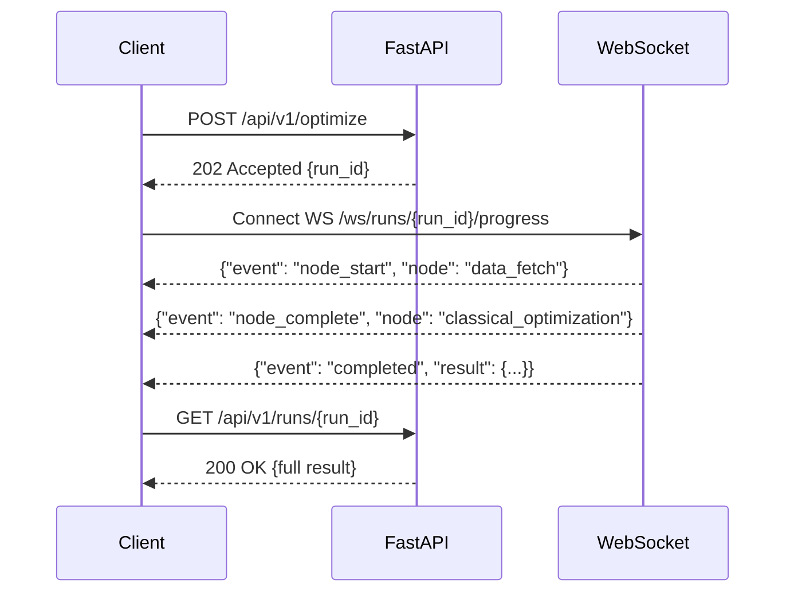

# API Reference

Complete reference for the Portfolio Optimizer REST API (v1) and WebSocket gateway — endpoints, request/response schemas, error codes, and authentication.

## Section Contents

| Page | Description |
|------|-------------|
| [Optimize Endpoint](optimize-endpoint.md) | `POST /api/v1/optimize` — trigger an optimization run |
| [Runs Endpoints](runs-endpoints.md) | `GET /api/v1/runs` and `GET /api/v1/runs/{id}` — list and retrieve run history |
| [Assets Endpoint](assets-endpoint.md) | `GET /api/v1/assets` — available ticker universe |
| [Health Endpoint](health-endpoint.md) | `GET /health` — liveness and readiness probes |
| [WebSocket Endpoint](websocket-endpoint.md) | `WS /ws/runs/{id}/progress` — real-time progress streaming |
| [Error Codes](error-codes.md) | HTTP status codes, error response schema, and error catalog |

## Base URL

| Environment | Base URL |
|-------------|----------|
| Local (Docker) | `http://localhost:8000` |
| Production | `https://api.your-domain.com` |

## Endpoint Summary

| Endpoint | Method | Auth | Description |
|----------|--------|------|-------------|
| `/api/v1/optimize` | POST | Required | Trigger optimization run |
| `/api/v1/runs` | GET | Required | List all runs |
| `/api/v1/runs/{id}` | GET | Required | Get run by ID |
| `/api/v1/assets` | GET | Optional | List available tickers |
| `/health` | GET | None | Health check |
| `/ws/runs/{id}/progress` | WS | Required | Real-time progress stream |

## Authentication

All API endpoints (except `/health`) require an `X-API-Key` header:

```http
X-API-Key: your-api-key-here
```

In development with `DEBUG=true`, authentication is bypassed.

## Async Request Pattern



## Cross-References

- **Request schemas** → [Request Schemas](../12-schemas/request-schemas.md)
- **Response schemas** → [Response Schemas](../12-schemas/response-schemas.md)
- **Validation rules** → [Validation Rules](../12-schemas/validation-rules.md)
- **Progress event format** → [Progress Events](../10-task-queue/progress-events.md)
