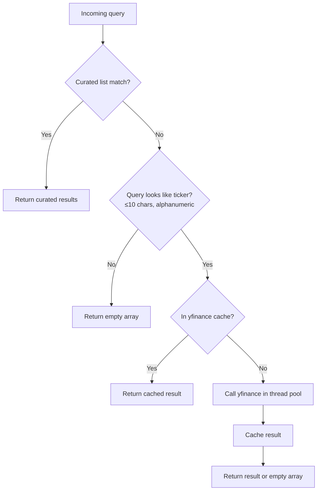

# GET /api/v1/assets/search

Search for assets by ticker symbol or company name. This endpoint powers the ticker autocomplete UI and allows clients to discover valid ticker symbols before submitting an optimization run.

The endpoint is implemented in `backend/app/api/v1/assets.py`.

## Overview

```
GET /api/v1/assets/search?q={query}&limit={limit}
```

**Response:** `200 OK` — array of `AssetSearchResult` objects.

## Query Parameters

| Parameter | Type | Default | Constraints | Description |
|-----------|------|---------|-------------|-------------|
| `q` | `string` | *(required)* | — | Ticker symbol or company name to search for. Case-insensitive. |
| `limit` | `integer` | `10` | 1–50 | Maximum number of results to return. |

## Response Schema

The response is a JSON array of `AssetSearchResult` objects (defined in `backend/app/schemas/responses.py`):

```json
[
  {
    "ticker": "AAPL",
    "name": "Apple Inc.",
    "sector": "Technology",
    "exchange": "NASDAQ"
  }
]
```

### AssetSearchResult Fields

| Field | Type | Description |
|-------|------|-------------|
| `ticker` | `string` | Ticker symbol (e.g., `"AAPL"`, `"MSFT"`). |
| `name` | `string` | Full company or fund name. |
| `sector` | `string` \| `null` | GICS sector name. May be `null` for assets not in the curated list and not returned by yfinance. |
| `exchange` | `string` \| `null` | Exchange name (e.g., `"NASDAQ"`, `"NYSE"`). May be `null` for yfinance fallback results. |

## Search Behavior

The endpoint uses a two-tier lookup strategy:



### Tier 1: Curated In-Memory List

The primary lookup searches a curated list of approximately 75 well-known S&P 500 constituents and popular ETFs, covering all major GICS sectors:

| Sector | Example Tickers |
|--------|----------------|
| Technology | AAPL, MSFT, GOOGL, NVDA, META, ADBE, CRM, ORCL, INTC, AMD |
| Consumer Discretionary | AMZN, TSLA, HD, MCD, NKE, SBUX |
| Consumer Staples | PG, KO, PEP, COST, WMT |
| Financials | JPM, V, MA, BAC, GS, MS, BLK |
| Healthcare | JNJ, UNH, LLY, ABBV, PFE, MRK |
| Energy | XOM, CVX, COP, SLB |
| Communication Services | DIS, NFLX, CMCSA, T, VZ |
| Industrials | CAT, BA, HON, UPS, GE |
| Materials | LIN, APD, FCX |
| Real Estate | AMT, PLD, EQIX |
| Utilities | NEE, DUK, SO |
| ETFs | SPY, QQQ, IWM, GLD, TLT |

**Match priority within the curated list:**
1. Exact ticker prefix match (highest priority)
2. Ticker contains the query string
3. Company name contains the query string (case-insensitive)

### Tier 2: yfinance Fallback

When no curated results are found and the query looks like a ticker symbol (≤ 10 characters, alphanumeric with optional `.` or `-`), the endpoint falls back to a live yfinance lookup.

The yfinance call runs in a **thread pool executor** (`asyncio.get_event_loop().run_in_executor`) to avoid blocking the async event loop, since yfinance uses synchronous HTTP requests.

Results from yfinance lookups are cached in a **module-level dictionary** (`_yfinance_cache`) to prevent repeated network calls for the same ticker within the process lifetime.

```python
# From backend/app/api/v1/assets.py
if not matches and len(query_upper) <= 10 and query_upper.replace(".", "").replace("-", "").isalnum():
    if query_upper in _yfinance_cache:
        cached = _yfinance_cache[query_upper]
        if cached is not None:
            matches = [AssetSearchResult(...)]
    else:
        loop = asyncio.get_event_loop()
        yf_result = await loop.run_in_executor(None, _lookup_yfinance, query_upper)
        _yfinance_cache[query_upper] = yf_result
```

## Rate Limiting Considerations

> **Important:** The yfinance fallback path makes live HTTP requests to Yahoo Finance. Be aware of the following limitations:

- **No built-in rate limiting**: The endpoint does not implement request-rate limiting. High-frequency queries for unknown tickers will generate proportional yfinance API calls.
- **Module-level cache**: The in-process cache prevents repeated lookups for the same ticker, but the cache is not shared across worker processes and resets on restart.
- **Timeout behavior**: yfinance calls have no explicit timeout in the current implementation. Slow responses from Yahoo Finance will delay the API response.
- **Production recommendation**: For production deployments with high query volumes, consider adding a Redis-backed cache layer or a dedicated rate limiter (e.g., `slowapi`) in front of the yfinance fallback path.

## Example Requests and Responses

### Search by Ticker Prefix

```http
GET /api/v1/assets/search?q=APP
```

```json
[
  {
    "ticker": "AAPL",
    "name": "Apple Inc.",
    "sector": "Technology",
    "exchange": "NASDAQ"
  }
]
```

### Search by Company Name

```http
GET /api/v1/assets/search?q=microsoft
```

```json
[
  {
    "ticker": "MSFT",
    "name": "Microsoft Corporation",
    "sector": "Technology",
    "exchange": "NASDAQ"
  }
]
```

### Search with Multiple Results

```http
GET /api/v1/assets/search?q=tech&limit=5
```

```json
[
  {
    "ticker": "AAPL",
    "name": "Apple Inc.",
    "sector": "Technology",
    "exchange": "NASDAQ"
  },
  {
    "ticker": "MSFT",
    "name": "Microsoft Corporation",
    "sector": "Technology",
    "exchange": "NASDAQ"
  },
  {
    "ticker": "GOOGL",
    "name": "Alphabet Inc. Class A",
    "sector": "Technology",
    "exchange": "NASDAQ"
  },
  {
    "ticker": "NVDA",
    "name": "NVIDIA Corporation",
    "sector": "Technology",
    "exchange": "NASDAQ"
  },
  {
    "ticker": "META",
    "name": "Meta Platforms Inc.",
    "sector": "Technology",
    "exchange": "NASDAQ"
  }
]
```

### Unknown Ticker (yfinance Fallback)

```http
GET /api/v1/assets/search?q=PLTR
```

If `PLTR` is not in the curated list, the endpoint attempts a yfinance lookup:

```json
[
  {
    "ticker": "PLTR",
    "name": "Palantir Technologies Inc.",
    "sector": "Technology",
    "exchange": "NYSE"
  }
]
```

### No Results Found

```http
GET /api/v1/assets/search?q=XYZNOTREAL
```

```json
[]
```

## Error Responses

The assets search endpoint does not return structured error objects for normal operation — it returns an empty array when no results are found. Standard FastAPI validation errors apply for invalid query parameter types.

| HTTP Status | Condition |
|-------------|-----------|
| `200 OK` | Always returned for valid requests, even when the result array is empty. |
| `422 Unprocessable Entity` | Invalid query parameter types (e.g., non-integer `limit`). |

## Related Endpoints

- [POST /api/v1/optimize](optimize-endpoint.md) — Use discovered tickers in an optimization run
- [Error Codes Reference](error-codes.md) — Complete error code table
