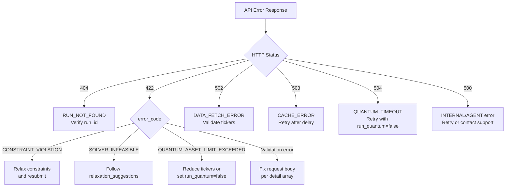

# Error Codes Reference

The Portfolio Optimizer API uses a consistent structured error format across all endpoints. Every error response includes a machine-readable `error_code`, a human-readable `message`, and a `details` object with additional context.

## Error Response Format

All domain errors follow this JSON structure:

```json
{
  "error_code": "DATA_FETCH_ERROR",
  "message": "Failed to fetch price data for tickers: ['INVALID_TICKER']",
  "details": {
    "tickers": ["INVALID_TICKER"]
  }
}
```

| Field | Type | Description |
|-------|------|-------------|
| `error_code` | `string` | Machine-readable error identifier. Use this for programmatic error handling. |
| `message` | `string` | Human-readable description of the error. Suitable for display to end users. |
| `details` | `object` | Additional context specific to the error type. May be an empty object `{}`. |

> **Note:** FastAPI validation errors (`422 Unprocessable Entity`) use a different format — they return a `detail` array following the standard FastAPI/Pydantic error schema. See [Validation Errors](#validation-errors-422) below.

## Complete Error Code Table

### Domain Error Codes

These error codes are raised by the application's domain exception hierarchy (defined in `backend/app/core/exceptions.py`) and mapped to HTTP status codes in `backend/app/main.py`.

| Error Code | HTTP Status | Category | Description |
|------------|-------------|----------|-------------|
| `DATA_FETCH_ERROR` | `502 Bad Gateway` | Data Layer | yfinance failed to return usable price data. Causes: empty DataFrame, network timeout, all columns dropped due to excessive NaN values. |
| `CACHE_ERROR` | `503 Service Unavailable` | Data Layer | Redis cache operation failed unexpectedly. |
| `CONSTRAINT_VIOLATION` | `422 Unprocessable Entity` | Optimization | User-supplied constraints are logically invalid (e.g., `min_return` exceeds maximum achievable return, sector limits sum to less than 1.0). |
| `SOLVER_INFEASIBLE` | `422 Unprocessable Entity` | Optimization | CVXPY solver cannot find a feasible solution. Constraints are over-specified or contradictory. |
| `QUANTUM_TIMEOUT` | `504 Gateway Timeout` | Optimization | Quantum optimization job exceeded the configured timeout (`QUANTUM_TIMEOUT_SECONDS`). |
| `QUANTUM_ASSET_LIMIT_EXCEEDED` | `422 Unprocessable Entity` | Optimization | Number of assets exceeds the maximum supported by quantum optimization (`MAX_QUANTUM_ASSETS`). |
| `AGENT_EXECUTION_ERROR` | `500 Internal Server Error` | Agent Layer | LangGraph agent graph encountered an unrecoverable error. |
| `INTERNAL_ERROR` | `500 Internal Server Error` | General | Unexpected server error not covered by a more specific code. |

### Run-Specific Error Codes

These codes appear in `404` responses from the runs endpoints:

| Error Code | HTTP Status | Description |
|------------|-------------|-------------|
| `RUN_NOT_FOUND` | `404 Not Found` | The requested `run_id` does not exist in the database. |

### Status Filter Error Codes

| Error Code | HTTP Status | Description |
|------------|-------------|-------------|
| `INVALID_STATUS_FILTER` | `422 Unprocessable Entity` | The `status` query parameter value is not one of `pending`, `running`, `completed`, `failed`. |

### WebSocket Error Codes

These codes appear in WebSocket `error` messages (not HTTP responses):

| Error Code | Description |
|------------|-------------|
| `WEBSOCKET_TIMEOUT` | No terminal message received within 300 seconds. The run may still be in progress. |
| `WEBSOCKET_ERROR` | Internal error in the WebSocket handler. |

## Detailed Error Code Descriptions

### DATA_FETCH_ERROR

Raised when the data fetching layer cannot retrieve usable historical price data from yfinance.

**HTTP Status:** `502 Bad Gateway`

**`details` fields:**

| Field | Type | Description |
|-------|------|-------------|
| `tickers` | `string[]` | List of tickers that were requested. |

**Example:**

```json
{
  "error_code": "DATA_FETCH_ERROR",
  "message": "No price data returned for any of the requested tickers",
  "details": {
    "tickers": ["INVALID1", "INVALID2"]
  }
}
```

**Client handling:** Verify that all ticker symbols are valid and listed on a supported exchange. Use `GET /api/v1/assets/search` to validate tickers before submitting an optimization run.

---

### CACHE_ERROR

Raised when a Redis cache operation fails unexpectedly (e.g., connection refused, serialization error).

**HTTP Status:** `503 Service Unavailable`

**Example:**

```json
{
  "error_code": "CACHE_ERROR",
  "message": "Failed to write price data to cache",
  "details": {}
}
```

**Client handling:** Retry the request after a short delay. Check the `/health` endpoint to verify Redis connectivity.

---

### CONSTRAINT_VIOLATION

Raised when the user-supplied optimization constraints are logically invalid or mutually contradictory.

**HTTP Status:** `422 Unprocessable Entity`

**`details` fields:**

| Field | Type | Description |
|-------|------|-------------|
| `violated_constraints` | `string[]` | List of constraint names that were violated. |

**Example:**

```json
{
  "error_code": "CONSTRAINT_VIOLATION",
  "message": "Minimum return constraint (0.50) exceeds the maximum achievable return (0.35) for the given asset universe",
  "details": {
    "violated_constraints": ["min_return"]
  }
}
```

**Common causes:**
- `min_return` set higher than the maximum achievable return for the asset universe
- `max_weight_per_asset` so small that the budget constraint cannot be met
- Sector `max_weight` limits that sum to less than 1.0, making full budget allocation impossible

**Client handling:** Relax the violated constraints and resubmit. The `violated_constraints` list identifies which constraints to adjust.

---

### SOLVER_INFEASIBLE

Raised when the CVXPY convex optimization solver cannot find a feasible solution given the current constraints.

**HTTP Status:** `422 Unprocessable Entity`

**`details` fields:**

| Field | Type | Description |
|-------|------|-------------|
| `solver_status` | `string` | CVXPY solver status string (e.g., `"infeasible"`, `"infeasible_inaccurate"`). |
| `relaxation_suggestions` | `string[]` | Hints for constraint relaxation. |

**Example:**

```json
{
  "error_code": "SOLVER_INFEASIBLE",
  "message": "No feasible portfolio exists satisfying all constraints simultaneously",
  "details": {
    "solver_status": "infeasible",
    "relaxation_suggestions": [
      "Increase max_weight_per_asset",
      "Remove or relax sector constraints",
      "Reduce min_return threshold"
    ]
  }
}
```

**Client handling:** Follow the `relaxation_suggestions` to identify which constraints to loosen. Consider removing sector constraints or increasing `max_weight_per_asset`.

---

### QUANTUM_TIMEOUT

Raised when a quantum optimization job (QAOA or VQE) exceeds the configured timeout.

**HTTP Status:** `504 Gateway Timeout`

**`details` fields:**

| Field | Type | Description |
|-------|------|-------------|
| `timeout_seconds` | `integer` | The timeout value that was exceeded. |

**Example:**

```json
{
  "error_code": "QUANTUM_TIMEOUT",
  "message": "Quantum optimization timed out after 300 seconds",
  "details": {
    "timeout_seconds": 300
  }
}
```

**Client handling:** Retry with `run_quantum: false` to use classical optimization only, or reduce the number of assets (`num_assets_to_select`) to decrease quantum circuit complexity.

---

### QUANTUM_ASSET_LIMIT_EXCEEDED

Raised when the number of assets in the optimization universe exceeds the maximum supported by quantum optimization.

**HTTP Status:** `422 Unprocessable Entity`

**`details` fields:**

| Field | Type | Description |
|-------|------|-------------|
| `num_assets` | `integer` | Number of assets provided. |
| `max_assets` | `integer` | Maximum supported by quantum optimization. |

**Example:**

```json
{
  "error_code": "QUANTUM_ASSET_LIMIT_EXCEEDED",
  "message": "Quantum optimization supports at most 20 assets, but 35 were provided. Reduce the asset list or use classical optimization.",
  "details": {
    "num_assets": 35,
    "max_assets": 20
  }
}
```

**Client handling:** Either reduce the `tickers` list to within the limit, set `run_quantum: false`, or use `num_assets_to_select` to limit the QUBO problem size.

---

### AGENT_EXECUTION_ERROR

Raised when the LangGraph agent graph encounters an unrecoverable error during execution.

**HTTP Status:** `500 Internal Server Error`

**`details` fields:**

| Field | Type | Description |
|-------|------|-------------|
| `node_name` | `string` \| `null` | Name of the agent graph node where the error occurred. |

**Example:**

```json
{
  "error_code": "AGENT_EXECUTION_ERROR",
  "message": "Agent graph failed at node 'llm_explanation': LLM API rate limit exceeded",
  "details": {
    "node_name": "llm_explanation"
  }
}
```

**Client handling:** This is typically a transient error. The Celery task will retry up to 3 times with exponential backoff (30s, 60s, 120s). If the run remains `failed` after retries, contact support.

---

### RUN_NOT_FOUND

Returned by the runs endpoints when the requested `run_id` does not exist.

**HTTP Status:** `404 Not Found`

**`details` fields:**

| Field | Type | Description |
|-------|------|-------------|
| `run_id` | `string` | The `run_id` that was not found. |

**Example:**

```json
{
  "error_code": "RUN_NOT_FOUND",
  "message": "Optimization run '3fa85f64-5717-4562-b3fc-2c963f66afa6' not found.",
  "details": {
    "run_id": "3fa85f64-5717-4562-b3fc-2c963f66afa6"
  }
}
```

**Client handling:** Verify the `run_id` was obtained from a successful `POST /api/v1/optimize` response. Note that run records are persisted permanently — a `404` means the ID is genuinely unknown, not that the run expired.

---

## Validation Errors (422)

FastAPI validation errors use a different format from domain errors. They return a `detail` array:

```json
{
  "detail": [
    {
      "type": "missing",
      "loc": ["body", "budget"],
      "msg": "Field required",
      "input": {
        "tickers": ["AAPL", "MSFT"]
      }
    },
    {
      "type": "greater_than",
      "loc": ["body", "budget"],
      "msg": "Input should be greater than 0",
      "input": -1000.0,
      "ctx": {"gt": 0.0}
    }
  ]
}
```

| Field | Description |
|-------|-------------|
| `type` | Pydantic error type (e.g., `"missing"`, `"greater_than"`, `"string_too_long"`) |
| `loc` | Location path to the invalid field (e.g., `["body", "tickers", 0]`) |
| `msg` | Human-readable validation message |
| `input` | The invalid input value |
| `ctx` | Additional context (e.g., constraint bounds) |

## HTTP Status Code Summary

| HTTP Status | Meaning | Error Codes |
|-------------|---------|-------------|
| `200 OK` | Success | — |
| `202 Accepted` | Run submitted | — |
| `404 Not Found` | Resource not found | `RUN_NOT_FOUND` |
| `422 Unprocessable Entity` | Validation or constraint error | `CONSTRAINT_VIOLATION`, `SOLVER_INFEASIBLE`, `QUANTUM_ASSET_LIMIT_EXCEEDED`, `INVALID_STATUS_FILTER`, FastAPI validation errors |
| `500 Internal Server Error` | Unexpected server error | `INTERNAL_ERROR`, `AGENT_EXECUTION_ERROR` |
| `502 Bad Gateway` | Upstream data source error | `DATA_FETCH_ERROR` |
| `503 Service Unavailable` | Service dependency unavailable | `CACHE_ERROR` |
| `504 Gateway Timeout` | Upstream timeout | `QUANTUM_TIMEOUT` |

## Client Handling Recommendations



### General Recommendations

1. **Always check `error_code`** rather than relying solely on HTTP status codes for programmatic error handling.
2. **`422` errors are client errors** — fix the request before retrying. Retrying without changes will produce the same error.
3. **`502`, `503`, `504` errors are transient** — implement exponential backoff retry logic.
4. **`500` errors** may be transient (Celery retries automatically up to 3 times) or permanent. Log the full response for debugging.
5. **WebSocket errors** (`WEBSOCKET_TIMEOUT`, `WEBSOCKET_ERROR`) do not necessarily mean the run failed — poll `GET /api/v1/runs/{run_id}/status` to check the actual run state.

## Related Pages

- [POST /api/v1/optimize](optimize-endpoint.md) — Optimization submission endpoint
- [Run History Endpoints](runs-endpoints.md) — Run status and results
- [WebSocket Endpoint](websocket-endpoint.md) — Real-time progress streaming
- [Health Endpoint](health-endpoint.md) — Service health checks
