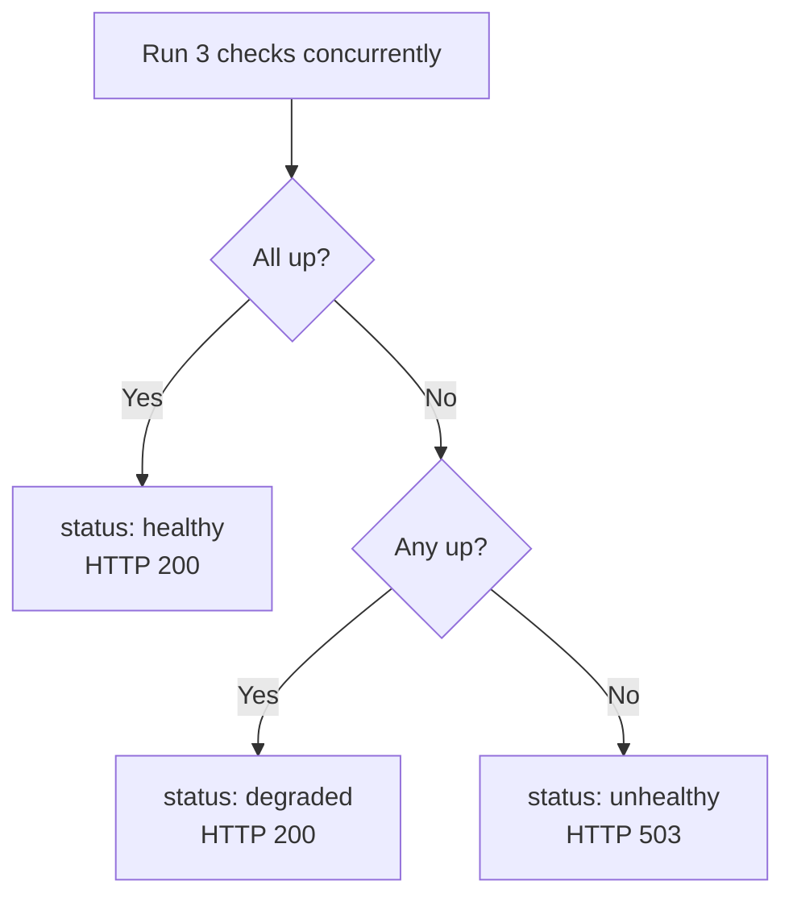

# GET /api/v1/health

The health check endpoint reports the operational status of the application and all its infrastructure dependencies. It is used by Docker health checks, Kubernetes liveness/readiness probes, and load balancers to determine whether the instance should receive traffic.

The endpoint is implemented in `backend/app/api/health.py`.

## Overview

```
GET /health
```

> **Note:** The health endpoint is mounted at `/health` (not `/api/v1/health`). It is registered directly on the root router in `backend/app/main.py`.

**Response codes:**
- `200 OK` — Application is `healthy` or `degraded` (at least one service is up)
- `503 Service Unavailable` — Application is `unhealthy` (all services are down)

## Response Schema — `HealthResponse`

```json
{
  "status": "healthy",
  "version": "0.1.0",
  "services": {
    "database": "up",
    "redis": "up",
    "celery": "up"
  }
}
```

### Top-Level Fields

| Field | Type | Description |
|-------|------|-------------|
| `status` | `string` | Overall application health status. See [Status Values](#status-values) below. |
| `version` | `string` | Application version string (matches Docker image tag). |
| `services` | `ServiceStatus` | Individual service health checks. |

### ServiceStatus Fields

| Field | Type | Values | Description |
|-------|------|--------|-------------|
| `database` | `string` | `"up"` \| `"down"` | PostgreSQL database connectivity. |
| `redis` | `string` | `"up"` \| `"down"` | Redis server connectivity. |
| `celery` | `string` | `"up"` \| `"down"` | Celery worker reachability via broker ping. |

## Status Values

The overall `status` field is derived from the individual service checks:

| Status | Condition | HTTP Code |
|--------|-----------|-----------|
| `healthy` | All three services (`database`, `redis`, `celery`) are `"up"` | `200` |
| `degraded` | At least one service is `"up"`, but not all | `200` |
| `unhealthy` | All three services are `"down"` | `503` |



> **Load balancer behavior:** HTTP `503` is returned only when `status = "unhealthy"` (all services down). A `degraded` application still returns `200` so that load balancers keep it in rotation — partial functionality is better than no service.

## Service Check Implementation

All three checks run **concurrently** via `asyncio.gather` to minimize latency. Each check has a **2-second timeout** (`_CHECK_TIMEOUT_SECONDS = 2.0`) enforced via `asyncio.wait_for`. A timed-out check is treated as `"down"`.

```python
# From backend/app/api/health.py
db_status, redis_status, celery_status = await asyncio.gather(
    _check_database(),
    _check_redis(),
    _check_celery(),
    return_exceptions=False,
)
```

### Database Check

Executes a `SELECT 1` query against PostgreSQL using the SQLAlchemy async engine:

```python
async def _check_database() -> Literal["up", "down"]:
    async with engine.connect() as conn:
        await conn.execute(sqlalchemy.text("SELECT 1"))
    return "up"
```

Fails with `"down"` on:
- `asyncio.TimeoutError` (query takes > 2 seconds)
- Any SQLAlchemy connection or execution error

### Redis Check

Sends a `PING` command to the Redis server using `redis.asyncio`:

```python
async def _check_redis() -> Literal["up", "down"]:
    client = aioredis.from_url(settings.REDIS_URL, socket_connect_timeout=2)
    await asyncio.wait_for(client.ping(), timeout=_CHECK_TIMEOUT_SECONDS)
    return "up"
```

Fails with `"down"` on:
- `asyncio.TimeoutError` (ping takes > 2 seconds)
- Any Redis connection error

### Celery Check

Sends a `ping` control command to all Celery workers via the broker. Because Celery's control API is synchronous, this check runs in a **thread pool executor** to avoid blocking the async event loop:

```python
async def _check_celery() -> Literal["up", "down"]:
    loop = asyncio.get_event_loop()

    def _ping() -> list:
        return celery_app.control.ping(timeout=_CHECK_TIMEOUT_SECONDS)

    result = await asyncio.wait_for(
        loop.run_in_executor(None, _ping),
        timeout=_CHECK_TIMEOUT_SECONDS + 1.0,
    )
    return "up" if result else "down"
```

Returns `"down"` when:
- No workers respond within the timeout
- The broker is unreachable
- `asyncio.TimeoutError` (outer timeout: 3 seconds)

> **Note:** The Celery check uses a slightly longer outer timeout (`_CHECK_TIMEOUT_SECONDS + 1.0 = 3.0s`) than the inner Celery ping timeout (`2.0s`) to account for thread pool scheduling overhead.

## Example Responses

### Healthy (All Services Up)

```http
HTTP/1.1 200 OK
Content-Type: application/json

{
  "status": "healthy",
  "version": "0.1.0",
  "services": {
    "database": "up",
    "redis": "up",
    "celery": "up"
  }
}
```

### Degraded (Redis Down)

```http
HTTP/1.1 200 OK
Content-Type: application/json

{
  "status": "degraded",
  "version": "0.1.0",
  "services": {
    "database": "up",
    "redis": "down",
    "celery": "up"
  }
}
```

### Unhealthy (All Services Down)

```http
HTTP/1.1 503 Service Unavailable
Content-Type: application/json

{
  "status": "unhealthy",
  "version": "0.1.0",
  "services": {
    "database": "down",
    "redis": "down",
    "celery": "down"
  }
}
```

## Docker Health Check Integration

The health endpoint is designed for use with Docker's `HEALTHCHECK` instruction:

```dockerfile
HEALTHCHECK --interval=30s --timeout=10s --start-period=30s --retries=3 \
  CMD curl -f http://localhost:8000/health || exit 1
```

## Kubernetes Probe Configuration

For Kubernetes deployments, configure both liveness and readiness probes:

```yaml
livenessProbe:
  httpGet:
    path: /health
    port: 8000
  initialDelaySeconds: 30
  periodSeconds: 30
  timeoutSeconds: 10
  failureThreshold: 3

readinessProbe:
  httpGet:
    path: /health
    port: 8000
  initialDelaySeconds: 10
  periodSeconds: 10
  timeoutSeconds: 5
  failureThreshold: 3
```

> **Tip:** Consider using a separate lightweight liveness probe (e.g., a simple `/ping` endpoint) that does not check external dependencies, and reserve the full `/health` check for the readiness probe. This prevents cascading restarts when a downstream service is temporarily unavailable.

## Related Endpoints

- [Error Codes Reference](error-codes.md) — Complete error code table
