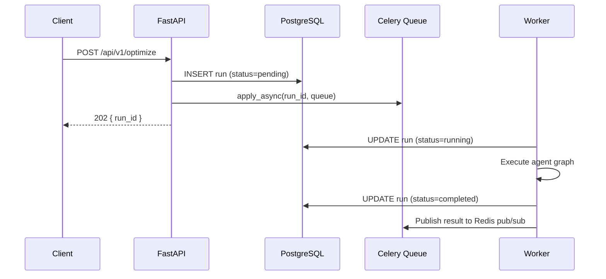

# POST /api/v1/optimize

Submit a new portfolio optimization run. This is the primary entry point for the Portfolio Optimizer API. The endpoint accepts your portfolio constraints, immediately persists a pending run record to the database, enqueues a Celery task for asynchronous processing, and returns a `run_id` — all within a single HTTP round-trip.

## Overview

```
POST /api/v1/optimize
Content-Type: application/json
```

**Response:** `202 Accepted`

The `202 Accepted` status code signals that the request has been received and queued for processing, but the optimization has not yet completed. The full agent pipeline (data fetch → classical optimization → quantum optimization → comparison → LLM explanation) runs asynchronously in a Celery worker.



## Request Body Schema

The request body is a JSON object conforming to `OptimizationRequest` (defined in `backend/app/schemas/requests.py`).

### Required Fields

| Field | Type | Constraints | Description |
|-------|------|-------------|-------------|
| `tickers` | `string[]` | min 2, max 50 items; each ≤ 10 chars | Ticker symbols to include in the optimization universe. Automatically normalized to uppercase; duplicates are silently removed. |
| `budget` | `number` | `> 0`, `≤ 1,000,000,000` | Total investment budget in USD. |

### Optional Fields

| Field | Type | Default | Description |
|-------|------|---------|-------------|
| `objectives` | `BusinessObjective[]` | Auto-built from legacy fields | Multi-objective optimization matrix. Up to 20 rows. If omitted, a default two-row matrix is constructed from `min_return` / `max_volatility`. |
| `frontier` | `FrontierConfig` | `null` | Configuration for the efficient-frontier sweep. |
| `min_return` | `number` | `null` | **Deprecated** — use `objectives` instead. Minimum acceptable annualized return (0.0–5.0). |
| `max_volatility` | `number` | `null` | **Deprecated** — use `objectives` instead. Maximum acceptable annualized volatility (0.0–5.0). |
| `max_weight_per_asset` | `number` | `null` | Maximum weight for any single asset (0.0–1.0). |
| `min_weight_per_asset` | `number` | `null` | Minimum weight for any included asset (0.0–1.0). |
| `sector_constraints` | `SectorConstraint[]` | `null` | Sector-level maximum allocation constraints. Up to 20 entries. |
| `num_assets_to_select` | `integer` | `null` | Number of assets to select. Used in the QUBO formulation for quantum optimization (2–50). |
| `lookback_days` | `integer` | `365` | Historical data lookback period in calendar days (30–3650). |
| `run_quantum` | `boolean` | `true` | Whether to run quantum optimization (QAOA + VQE) in addition to classical Markowitz MVO. |

### BusinessObjective Schema

Each entry in the `objectives` array defines one business goal:

| Field | Type | Constraints | Description |
|-------|------|-------------|-------------|
| `name` | `string` | See valid values below | Canonical measure name. |
| `direction` | `"maximize"` \| `"minimize"` | — | Optimization direction. |
| `weight` | `number` | 0.0–1.0 | Relative importance in the scalarized composite. Auto-normalized if enabled weights don't sum to 1. |
| `target` | `number` \| `null` | — | Optional soft anchor value used in LLM commentary. |
| `threshold` | `number` \| `null` | — | Optional hard limit. For `maximize`, enforces `value ≥ threshold`; for `minimize`, enforces `value ≤ threshold`. |
| `enabled` | `boolean` | — | When `false`, the row is ignored by the optimizer but retained in the payload for UI round-trips. |

**Valid `name` values:**

| Name | Description |
|------|-------------|
| `return` | Annualized expected portfolio return |
| `volatility` | Annualized portfolio volatility (standard deviation) |
| `sharpe` | Sharpe ratio |
| `max_drawdown` | Maximum historical drawdown |
| `diversification_hhi` | Herfindahl-Hirschman Index (concentration measure) |
| `esg_score` | ESG composite score |
| `sector_concentration` | Sector concentration measure |

### FrontierConfig Schema

| Field | Type | Default | Constraints | Description |
|-------|------|---------|-------------|-------------|
| `enabled` | `boolean` | `false` | — | Whether to compute and return an efficient frontier. |
| `x_measure` | `ObjectiveName` | `"volatility"` | Must differ from `y_measure` | Measure plotted on the X-axis. |
| `y_measure` | `ObjectiveName` | `"return"` | Must differ from `x_measure` | Measure plotted on the Y-axis. |
| `num_points` | `integer` | `25` | 5–100 | Number of parametric solves used to trace the frontier. Higher values produce a smoother curve at the cost of latency. |

### SectorConstraint Schema

| Field | Type | Constraints | Description |
|-------|------|-------------|-------------|
| `sector` | `string` | 1–100 chars | Sector name (e.g., `"Technology"`, `"Healthcare"`). |
| `max_weight` | `number` | 0.0–1.0 | Maximum allocation fraction for this sector. |

## Validation Rules

The server enforces the following validation rules beyond simple type checking:

1. **Ticker normalization**: All tickers are stripped of whitespace and uppercased. Empty strings raise a `422` error.
2. **Ticker length**: Each ticker must be ≤ 10 characters.
3. **Duplicate removal**: Duplicate tickers are silently deduplicated (order-preserving).
4. **Weight constraint ordering**: If both `min_weight_per_asset` and `max_weight_per_asset` are provided, `min_weight_per_asset` must be strictly less than `max_weight_per_asset`.
5. **Frontier axis distinctness**: When `frontier.enabled = true`, `x_measure` and `y_measure` must be different values.
6. **Legacy normalization**: When `objectives` is omitted but `min_return` or `max_volatility` is provided, a two-row objectives matrix is automatically constructed.

## Response Schema

### 202 Accepted

```json
{
  "run_id": "3fa85f64-5717-4562-b3fc-2c963f66afa6"
}
```

| Field | Type | Description |
|-------|------|-------------|
| `run_id` | `string` (UUID v4) | Unique identifier for the submitted optimization run. Use this to poll for status or connect to the WebSocket. |

## Async Pattern Explanation

The optimize endpoint follows a **fire-and-forget** async pattern:

1. **Immediate persistence**: Before dispatching the Celery task, the API creates an `OptimizationRun` record in PostgreSQL with `status="pending"`. This guarantees the record exists when the client immediately polls `GET /api/v1/runs/{run_id}` or connects to the WebSocket.

2. **Task dispatch**: The `run_optimization_task` Celery task is dispatched via `apply_async`. The `task_id` is set to the same value as `run_id` for correlation.

3. **Client options**: After receiving the `202` response, clients can:
   - **WebSocket** (`WS /ws/runs/{run_id}/progress`): Real-time streaming of agent progress events. Recommended for interactive UIs.
   - **Polling** (`GET /api/v1/runs/{run_id}/status`): Lightweight status-only polling. Suitable for background jobs or non-WebSocket clients.
   - **Full detail** (`GET /api/v1/runs/{run_id}`): Fetch the complete result once the run completes.

## Celery Queue Routing

The `run_quantum` field determines which Celery queue receives the task:

| `run_quantum` | Queue | Typical Duration | Notes |
|---------------|-------|-----------------|-------|
| `false` | `default` | 5–15 seconds | Classical Markowitz MVO only |
| `true` | `quantum` | 60–300 seconds | Classical + QAOA + VQE |

The `quantum` queue is configured with lower worker concurrency (`worker_prefetch_multiplier=1`) to prevent resource exhaustion from simultaneous quantum circuit simulations. Both queues are consumed by the same worker process started with `--queues=quantum,default`.

From `backend/app/api/v1/optimize.py`:

```python
run_optimization_task.apply_async(
    kwargs={
        "run_id": run_id,
        "request_dict": request.model_dump(mode="json"),
    },
    task_id=run_id,
    queue="quantum" if request.run_quantum else "default",
)
```

## Example Requests

### Minimal Request (Classical Only)

```json
{
  "tickers": ["AAPL", "MSFT", "GOOGL"],
  "budget": 100000.0,
  "run_quantum": false
}
```

### Full Multi-Objective Request with Frontier

```json
{
  "tickers": ["AAPL", "MSFT", "GOOGL", "AMZN", "NVDA"],
  "budget": 100000.0,
  "objectives": [
    {
      "name": "return",
      "direction": "maximize",
      "weight": 0.5,
      "target": 0.12,
      "threshold": 0.08,
      "enabled": true
    },
    {
      "name": "volatility",
      "direction": "minimize",
      "weight": 0.3,
      "target": 0.18,
      "threshold": 0.25,
      "enabled": true
    },
    {
      "name": "diversification_hhi",
      "direction": "minimize",
      "weight": 0.2,
      "target": null,
      "threshold": null,
      "enabled": true
    }
  ],
  "frontier": {
    "enabled": true,
    "x_measure": "volatility",
    "y_measure": "return",
    "num_points": 25
  },
  "max_weight_per_asset": 0.4,
  "min_weight_per_asset": 0.05,
  "sector_constraints": [
    {"sector": "Technology", "max_weight": 0.6}
  ],
  "lookback_days": 365,
  "run_quantum": true
}
```

### Request with Sector Constraints

```json
{
  "tickers": ["AAPL", "MSFT", "JPM", "JNJ", "XOM"],
  "budget": 50000.0,
  "sector_constraints": [
    {"sector": "Technology", "max_weight": 0.4},
    {"sector": "Financials", "max_weight": 0.3},
    {"sector": "Healthcare", "max_weight": 0.3}
  ],
  "max_weight_per_asset": 0.35,
  "run_quantum": false
}
```

## Example Response

```json
{
  "run_id": "3fa85f64-5717-4562-b3fc-2c963f66afa6"
}
```

## Error Responses

| HTTP Status | Condition |
|-------------|-----------|
| `422 Unprocessable Entity` | Request body fails validation (missing required fields, invalid values, constraint violations) |
| `500 Internal Server Error` | Unexpected server error |

A `422` response body follows FastAPI's standard validation error format:

```json
{
  "detail": [
    {
      "type": "missing",
      "loc": ["body", "budget"],
      "msg": "Field required",
      "input": {"tickers": ["AAPL", "MSFT"]}
    }
  ]
}
```

## Related Endpoints

- [GET /api/v1/runs/{run_id}/status](runs-endpoints.md) — Lightweight polling for run status
- [GET /api/v1/runs/{run_id}](runs-endpoints.md) — Full result detail
- [WS /ws/runs/{run_id}/progress](websocket-endpoint.md) — Real-time progress streaming
- [Error Codes Reference](error-codes.md) — Complete error code table

## Related Documentation

- [Request Schemas](../12-schemas/request-schemas.md) — Full `OptimizationRequest` Pydantic model reference
- [Response Schemas](../12-schemas/response-schemas.md) — Full `OptimizationResult` Pydantic model reference
- [Validation Rules](../12-schemas/validation-rules.md) — Field validators and business rule constraints
- [Agent Pipeline](../05-agent-layer/graph-definition.md) — How the LangGraph agent processes your request
- [Optimization Task](../10-task-queue/optimization-task.md) — Celery task that executes the pipeline
