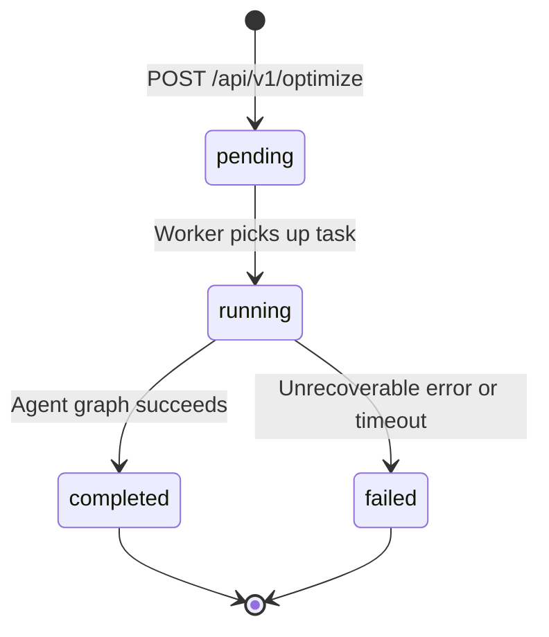

# Run History Endpoints

The runs endpoints provide access to the history and results of portfolio optimization runs. Three endpoints cover different use cases: paginated history listing, full result retrieval, and lightweight status polling.

All endpoints are implemented in `backend/app/api/v1/runs.py` and use an async SQLAlchemy session for database access.

## Endpoints Summary

| Endpoint | Method | Purpose |
|----------|--------|---------|
| `/api/v1/runs` | `GET` | Paginated list of past runs |
| `/api/v1/runs/{run_id}` | `GET` | Full detail of a specific run |
| `/api/v1/runs/{run_id}/status` | `GET` | Lightweight status-only polling |

---

## GET /api/v1/runs

Returns a paginated list of past optimization runs, ordered newest first. Each item includes summary metrics (Sharpe ratios) without the full result payload.

### Query Parameters

| Parameter | Type | Default | Constraints | Description |
|-----------|------|---------|-------------|-------------|
| `page` | `integer` | `1` | `≥ 1` | Page number (1-based). |
| `page_size` | `integer` | `20` | `1–100` | Items per page. Maximum 100. |
| `status` | `string` | `null` | See valid values | Filter by run lifecycle status. Omit to return all statuses. |

**Valid `status` filter values:** `pending`, `running`, `completed`, `failed`

> Passing an invalid `status` value returns `422 Unprocessable Entity` with `error_code: "INVALID_STATUS_FILTER"`.

### Response Schema — `PaginatedRunsResponse`

```json
{
  "items": [ /* array of OptimizationRunSummary */ ],
  "total": 42,
  "page": 1,
  "page_size": 20
}
```

| Field | Type | Description |
|-------|------|-------------|
| `items` | `OptimizationRunSummary[]` | Array of run summaries for the current page. |
| `total` | `integer` | Total number of runs matching the filter (across all pages). |
| `page` | `integer` | Current page number (1-based). |
| `page_size` | `integer` | Number of items per page. |

### OptimizationRunSummary Schema

Each item in the `items` array has the following fields:

| Field | Type | Description |
|-------|------|-------------|
| `run_id` | `string` (UUID) | Unique identifier for the run. |
| `status` | `string` | Current lifecycle status: `pending`, `running`, `completed`, or `failed`. |
| `tickers` | `string[]` | List of ticker symbols submitted for this run. |
| `budget` | `number` | Investment budget in USD. |
| `created_at` | `string` (ISO 8601) | UTC timestamp when the run was submitted. |
| `completed_at` | `string` \| `null` | UTC timestamp when the run finished. `null` if still in progress. |
| `classical_sharpe` | `number` \| `null` | Denormalized classical Sharpe ratio for quick display. `null` until completed. |
| `quantum_sharpe` | `number` \| `null` | Denormalized quantum Sharpe ratio (QAOA preferred, else VQE). `null` if quantum was not run or not yet completed. |

### Example Request

```http
GET /api/v1/runs?page=1&page_size=10&status=completed
```

### Example Response

```json
{
  "items": [
    {
      "run_id": "3fa85f64-5717-4562-b3fc-2c963f66afa6",
      "status": "completed",
      "tickers": ["AAPL", "MSFT", "GOOGL", "AMZN", "NVDA"],
      "budget": 100000.0,
      "created_at": "2026-06-15T10:30:00Z",
      "completed_at": "2026-06-15T10:30:45Z",
      "classical_sharpe": 1.42,
      "quantum_sharpe": 1.51
    },
    {
      "run_id": "7b1e2c3d-4f5a-6b7c-8d9e-0f1a2b3c4d5e",
      "status": "completed",
      "tickers": ["JPM", "BAC", "GS"],
      "budget": 50000.0,
      "created_at": "2026-06-15T09:15:00Z",
      "completed_at": "2026-06-15T09:15:12Z",
      "classical_sharpe": 0.98,
      "quantum_sharpe": null
    }
  ],
  "total": 42,
  "page": 1,
  "page_size": 10
}
```

---

## GET /api/v1/runs/{run_id}

Returns the full detail of a specific optimization run, including classical and quantum portfolio weights, metrics, comparison summary, and LLM-generated explanation.

For runs that are still `pending` or `running`, the result fields (`classical_result`, `quantum_result`, `comparison`, `llm_explanation`) will be `null`. Use the `/status` endpoint or WebSocket for efficient waiting.

### Path Parameters

| Parameter | Type | Description |
|-----------|------|-------------|
| `run_id` | `string` (UUID) | The run identifier returned by `POST /api/v1/optimize`. |

### Response Schema — `OptimizationRunDetail`

`OptimizationRunDetail` extends `OptimizationRunSummary` with the following additional fields:

| Field | Type | Description |
|-------|------|-------------|
| `classical_result` | `ClassicalResult` \| `null` | Full Markowitz MVO result. `null` until completed. |
| `quantum_result` | `QuantumResult` \| `null` | Combined QAOA + VQE results. `null` if `run_quantum=false` or not yet completed. |
| `comparison` | `ComparisonSummary` \| `null` | Side-by-side comparison of classical vs quantum metrics. `null` until completed. |
| `llm_explanation` | `string` \| `null` | LLM-generated natural language explanation of the results. `null` until completed. |
| `error_message` | `string` \| `null` | Human-readable error description. Populated only when `status = "failed"`. |
| `frontier_report` | `FrontierReport` \| `null` | Efficient-frontier report. Only populated when the request had `frontier.enabled = true`. |

### ClassicalResult Schema

| Field | Type | Description |
|-------|------|-------------|
| `weights` | `AssetWeight[]` | Per-asset weight and dollar allocation. |
| `metrics` | `PortfolioMetrics` | Key performance metrics. |
| `solver_status` | `string` | CVXPY solver status (e.g., `"optimal"`). |
| `solve_time_ms` | `number` | Wall-clock solve time in milliseconds. |

### QuantumResult Schema

| Field | Type | Description |
|-------|------|-------------|
| `qaoa` | `QAOAResult` \| `null` | Result from the QAOA optimizer (Qiskit). |
| `vqe` | `VQEResult` \| `null` | Result from the VQE optimizer (PennyLane). |

### QAOAResult Schema

| Field | Type | Description |
|-------|------|-------------|
| `selected_assets` | `string[]` | Tickers selected by the QUBO/QAOA solver. |
| `weights` | `AssetWeight[]` | Per-asset weight and dollar allocation. |
| `metrics` | `PortfolioMetrics` | Key performance metrics. |
| `circuit_depth` | `integer` | Depth of the QAOA quantum circuit. |
| `num_qubits` | `integer` | Number of qubits used. |
| `solve_time_ms` | `number` | Wall-clock solve time in milliseconds. |

### VQEResult Schema

| Field | Type | Description |
|-------|------|-------------|
| `selected_assets` | `string[]` | Tickers selected by the VQE solver. |
| `weights` | `AssetWeight[]` | Per-asset weight and dollar allocation. |
| `metrics` | `PortfolioMetrics` | Key performance metrics. |
| `num_qubits` | `integer` | Number of qubits used. |
| `solve_time_ms` | `number` | Wall-clock solve time in milliseconds. |

### AssetWeight Schema

| Field | Type | Description |
|-------|------|-------------|
| `ticker` | `string` | Ticker symbol. |
| `weight` | `number` | Portfolio weight (0.0–1.0). |
| `allocation` | `number` | Dollar amount allocated to this asset. |
| `sector` | `string` \| `null` | GICS sector name, if available. |

### PortfolioMetrics Schema

| Field | Type | Description |
|-------|------|-------------|
| `expected_return` | `number` | Annualized expected return. |
| `volatility` | `number` | Annualized volatility (standard deviation). |
| `sharpe_ratio` | `number` | Sharpe ratio. |
| `max_drawdown` | `number` \| `null` | Maximum drawdown. |
| `num_assets` | `integer` | Number of assets with non-zero weight. |

### ComparisonSummary Schema

| Field | Type | Description |
|-------|------|-------------|
| `sharpe_improvement_qaoa` | `number` \| `null` | QAOA Sharpe ratio minus classical Sharpe ratio. |
| `sharpe_improvement_vqe` | `number` \| `null` | VQE Sharpe ratio minus classical Sharpe ratio. |
| `return_diff_qaoa` | `number` \| `null` | QAOA expected return minus classical expected return. |
| `return_diff_vqe` | `number` \| `null` | VQE expected return minus classical expected return. |
| `volatility_diff_qaoa` | `number` \| `null` | QAOA volatility minus classical volatility. |
| `volatility_diff_vqe` | `number` \| `null` | VQE volatility minus classical volatility. |
| `recommendation` | `string` | LLM-generated recommendation string. |

### Example Response (Completed Run)

```json
{
  "run_id": "3fa85f64-5717-4562-b3fc-2c963f66afa6",
  "status": "completed",
  "tickers": ["AAPL", "MSFT", "GOOGL"],
  "budget": 100000.0,
  "created_at": "2026-06-15T10:30:00Z",
  "completed_at": "2026-06-15T10:30:45Z",
  "classical_sharpe": 1.42,
  "quantum_sharpe": 1.51,
  "classical_result": {
    "weights": [
      {"ticker": "AAPL", "weight": 0.45, "allocation": 45000.0, "sector": "Technology"},
      {"ticker": "MSFT", "weight": 0.35, "allocation": 35000.0, "sector": "Technology"},
      {"ticker": "GOOGL", "weight": 0.20, "allocation": 20000.0, "sector": "Technology"}
    ],
    "metrics": {
      "expected_return": 0.142,
      "volatility": 0.198,
      "sharpe_ratio": 1.42,
      "max_drawdown": -0.312,
      "num_assets": 3
    },
    "solver_status": "optimal",
    "solve_time_ms": 87.3
  },
  "quantum_result": {
    "qaoa": {
      "selected_assets": ["AAPL", "MSFT", "GOOGL"],
      "weights": [
        {"ticker": "AAPL", "weight": 0.40, "allocation": 40000.0, "sector": "Technology"},
        {"ticker": "MSFT", "weight": 0.38, "allocation": 38000.0, "sector": "Technology"},
        {"ticker": "GOOGL", "weight": 0.22, "allocation": 22000.0, "sector": "Technology"}
      ],
      "metrics": {
        "expected_return": 0.151,
        "volatility": 0.195,
        "sharpe_ratio": 1.51,
        "max_drawdown": -0.298,
        "num_assets": 3
      },
      "circuit_depth": 12,
      "num_qubits": 3,
      "solve_time_ms": 4230.5
    },
    "vqe": null
  },
  "comparison": {
    "sharpe_improvement_qaoa": 0.09,
    "sharpe_improvement_vqe": null,
    "return_diff_qaoa": 0.009,
    "return_diff_vqe": null,
    "volatility_diff_qaoa": -0.003,
    "volatility_diff_vqe": null,
    "recommendation": "QAOA achieves a marginally higher Sharpe ratio with lower volatility."
  },
  "llm_explanation": "The QAOA-optimized portfolio achieves a Sharpe ratio of 1.51, outperforming the classical Markowitz solution by 0.09...",
  "error_message": null,
  "frontier_report": null
}
```

---

## GET /api/v1/runs/{run_id}/status

Returns only the lifecycle status of a specific run without deserializing the full result payload. This endpoint is optimized for efficient polling — it avoids loading large JSON blobs from the database.

### Path Parameters

| Parameter | Type | Description |
|-----------|------|-------------|
| `run_id` | `string` (UUID) | The run identifier returned by `POST /api/v1/optimize`. |

### Response Schema — `RunStatusResponse`

```json
{
  "run_id": "3fa85f64-5717-4562-b3fc-2c963f66afa6",
  "status": "running",
  "created_at": "2026-06-15T10:30:00Z",
  "completed_at": null
}
```

| Field | Type | Description |
|-------|------|-------------|
| `run_id` | `string` (UUID) | Unique identifier for the run. |
| `status` | `string` | Current lifecycle status: `pending`, `running`, `completed`, or `failed`. |
| `created_at` | `string` (ISO 8601) | UTC timestamp when the run was submitted. |
| `completed_at` | `string` \| `null` | UTC timestamp when the run finished. `null` if still in progress. |

### Run Lifecycle States



| Status | Description |
|--------|-------------|
| `pending` | Run submitted but not yet picked up by a Celery worker. |
| `running` | A worker is actively executing the agent graph. |
| `completed` | Agent graph finished successfully; all result fields are populated. |
| `failed` | Agent graph encountered an unrecoverable error; `error_message` is set. |

### Polling Strategy

For clients that cannot use WebSockets, the recommended polling strategy is:

1. Submit the run via `POST /api/v1/optimize` and save the `run_id`.
2. Poll `GET /api/v1/runs/{run_id}/status` every 2–5 seconds.
3. When `status` becomes `completed` or `failed`, fetch the full result via `GET /api/v1/runs/{run_id}`.

> **Tip:** Prefer the [WebSocket endpoint](websocket-endpoint.md) (`WS /ws/runs/{run_id}/progress`) for interactive UIs — it provides real-time agent progress events without polling overhead.

---

## 404 Error Format

All three endpoints return a structured `404` response when the `run_id` is not found:

```json
{
  "error_code": "RUN_NOT_FOUND",
  "message": "Optimization run '3fa85f64-5717-4562-b3fc-2c963f66afa6' not found.",
  "details": {
    "run_id": "3fa85f64-5717-4562-b3fc-2c963f66afa6"
  }
}
```

| Field | Type | Description |
|-------|------|-------------|
| `error_code` | `string` | Machine-readable error code: `"RUN_NOT_FOUND"`. |
| `message` | `string` | Human-readable description including the requested `run_id`. |
| `details` | `object` | Additional context. Contains `run_id` for `RUN_NOT_FOUND` errors. |

## Related Endpoints

- [POST /api/v1/optimize](optimize-endpoint.md) — Submit a new optimization run
- [WS /ws/runs/{run_id}/progress](websocket-endpoint.md) — Real-time progress streaming
- [Error Codes Reference](error-codes.md) — Complete error code table
