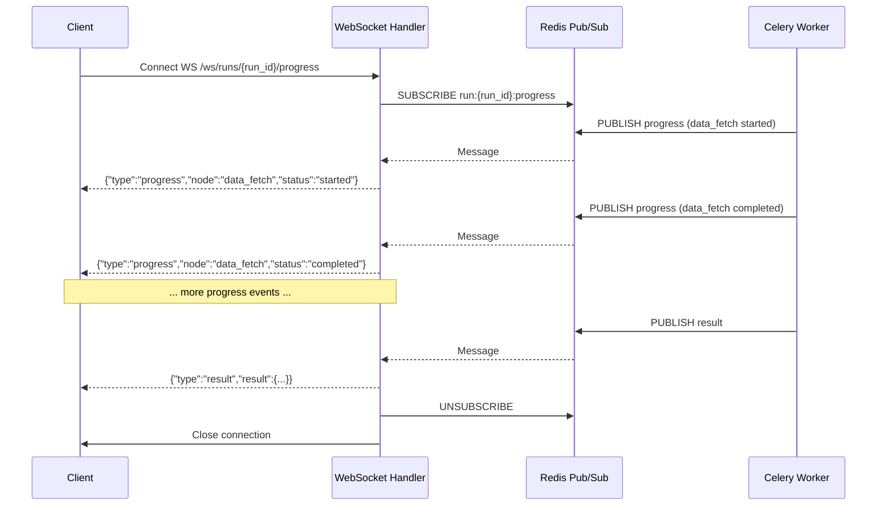

# WS /ws/runs/{run_id}/progress

The WebSocket endpoint streams real-time agent progress events for an optimization run. Connect immediately after submitting a run via `POST /api/v1/optimize` to receive live updates as the agent graph executes each node.

The endpoint is implemented in `backend/app/api/websocket.py`.

## Overview

```
WS /ws/runs/{run_id}/progress
```

The WebSocket handler subscribes to a Redis pub/sub channel (`run:{run_id}:progress`) and forwards all messages to the connected client. The Celery worker publishes progress events to this channel as it executes each stage of the agent pipeline.



## Connection Lifecycle

1. **Client connects** to `WS /ws/runs/{run_id}/progress`.
2. **Handler accepts** the WebSocket connection and creates a dedicated Redis connection for pub/sub.
3. **Handler subscribes** to the Redis channel `run:{run_id}:progress`.
4. **Handler polls** for Redis messages in a loop, forwarding each message to the client.
5. **Keepalive pings** are sent every 30 seconds to prevent proxy/load balancer timeouts.
6. **Terminal message** (`type: "result"` or `type: "error"`) signals the end of the run. The handler unsubscribes, closes the Redis connection, and closes the WebSocket.
7. **Timeout**: If no terminal message is received within 300 seconds, the handler sends a `WEBSOCKET_TIMEOUT` error message and closes the connection.

### Connection Parameters

| Parameter | Value | Description |
|-----------|-------|-------------|
| Keepalive ping interval | 30 seconds | Frequency of `ping` messages sent to prevent proxy timeouts. |
| Connection timeout | 300 seconds | Maximum time to wait for a terminal message before closing. |
| Redis poll interval | 1 second | How long to wait for a Redis message before checking ping/timeout. |

## Message Types

All messages are JSON objects with a `type` field that identifies the message kind.

### `progress` — Agent Node Progress

Sent when an agent graph node starts, completes, or fails. Multiple progress messages are sent per run — one for each node transition.

```json
{
  "type": "progress",
  "run_id": "3fa85f64-5717-4562-b3fc-2c963f66afa6",
  "node": "data_fetch",
  "status": "started",
  "message": "Fetching historical price data for 5 tickers",
  "timestamp": "2026-06-15T10:30:01Z"
}
```

| Field | Type | Description |
|-------|------|-------------|
| `type` | `"progress"` | Message type identifier. |
| `run_id` | `string` | UUID of the optimization run. |
| `node` | `string` | Name of the agent graph node. See [Agent Nodes](#agent-nodes) below. |
| `status` | `string` | Node execution status: `"started"`, `"completed"`, or `"failed"`. |
| `message` | `string` | Human-readable description of the current step. |
| `timestamp` | `string` (ISO 8601) | UTC timestamp of the event. |

#### Agent Nodes

| Node Name | Description |
|-----------|-------------|
| `data_fetch` | Fetching historical price data via yfinance |
| `constraint_validation` | Validating optimization constraints |
| `classical_optimization` | Running Markowitz MVO via CVXPY |
| `quantum_dispatch` | Running QAOA (Qiskit) and/or VQE (PennyLane) |
| `comparison` | Comparing classical vs quantum results |
| `llm_explanation` | Generating LLM natural language explanation |
| `frontier_sweep` | Computing efficient frontier (if enabled) |

### `result` — Final Optimization Result

Sent once when the optimization run completes successfully. This is a **terminal message** — the WebSocket connection closes after this message is forwarded.

```json
{
  "type": "result",
  "run_id": "3fa85f64-5717-4562-b3fc-2c963f66afa6",
  "result": {
    "run_id": "3fa85f64-5717-4562-b3fc-2c963f66afa6",
    "status": "completed",
    "tickers": ["AAPL", "MSFT", "GOOGL"],
    "budget": 100000.0,
    "created_at": "2026-06-15T10:30:00Z",
    "completed_at": "2026-06-15T10:30:45Z",
    "classical_sharpe": 1.42,
    "quantum_sharpe": 1.51,
    "classical_result": { "..." : "..." },
    "quantum_result": { "..." : "..." },
    "comparison": { "..." : "..." },
    "llm_explanation": "The QAOA-optimized portfolio...",
    "error_message": null,
    "frontier_report": null
  }
}
```

| Field | Type | Description |
|-------|------|-------------|
| `type` | `"result"` | Message type identifier. |
| `run_id` | `string` | UUID of the optimization run. |
| `result` | `OptimizationRunDetail` | Full run detail object. See [GET /api/v1/runs/{run_id}](runs-endpoints.md) for the complete schema. |

### `error` — Run or Connection Error

Sent when the optimization run fails or when a WebSocket-level error occurs. This is a **terminal message** — the WebSocket connection closes after this message is forwarded.

```json
{
  "type": "error",
  "run_id": "3fa85f64-5717-4562-b3fc-2c963f66afa6",
  "error_code": "DATA_FETCH_ERROR",
  "message": "Failed to fetch price data for tickers: ['INVALID']"
}
```

| Field | Type | Description |
|-------|------|-------------|
| `type` | `"error"` | Message type identifier. |
| `run_id` | `string` | UUID of the optimization run. |
| `error_code` | `string` | Machine-readable error code. See [Error Codes](error-codes.md). |
| `message` | `string` | Human-readable error description. |

#### WebSocket-Specific Error Codes

| Error Code | Cause |
|------------|-------|
| `WEBSOCKET_TIMEOUT` | No terminal message received within 300 seconds. The run may still be in progress — poll `GET /api/v1/runs/{run_id}/status` for updates. |
| `WEBSOCKET_ERROR` | Internal error in the WebSocket handler. |

### `ping` — Keepalive

Sent every 30 seconds to prevent proxy and load balancer timeouts during long-running quantum optimization jobs (which can take 60–300 seconds).

```json
{
  "type": "ping",
  "run_id": "3fa85f64-5717-4562-b3fc-2c963f66afa6",
  "timestamp": "2026-06-15T10:30:30Z"
}
```

| Field | Type | Description |
|-------|------|-------------|
| `type` | `"ping"` | Message type identifier. |
| `run_id` | `string` | UUID of the optimization run. |
| `timestamp` | `string` (ISO 8601) | UTC timestamp of the ping. |

> **Client behavior:** Clients should silently ignore `ping` messages. They are informational only and do not require a `pong` response.

## Terminal Message Handling

The WebSocket connection closes automatically after receiving a terminal message (`result` or `error`). Clients should:

1. Listen for messages in a loop.
2. On `type: "progress"` — update the UI with the current node and status.
3. On `type: "result"` — display the full optimization results and close the WebSocket.
4. On `type: "error"` — display the error message and close the WebSocket.
5. On `type: "ping"` — ignore (or use to confirm the connection is alive).
6. On WebSocket close event — handle gracefully (the server closed the connection after a terminal message or timeout).

## Complete Message Sequence Example

A typical run with quantum optimization produces the following message sequence:

```
→ WS Connect
← {"type":"progress","node":"data_fetch","status":"started","message":"Fetching data for 5 tickers..."}
← {"type":"progress","node":"data_fetch","status":"completed","message":"Fetched 365 days of data"}
← {"type":"progress","node":"constraint_validation","status":"started","message":"Validating constraints"}
← {"type":"progress","node":"constraint_validation","status":"completed","message":"Constraints valid"}
← {"type":"progress","node":"classical_optimization","status":"started","message":"Running Markowitz MVO"}
← {"type":"progress","node":"classical_optimization","status":"completed","message":"Classical optimization complete"}
← {"type":"ping","run_id":"...","timestamp":"..."}   ← (if quantum takes > 30s)
← {"type":"progress","node":"quantum_dispatch","status":"started","message":"Running QAOA + VQE"}
← {"type":"progress","node":"quantum_dispatch","status":"completed","message":"Quantum optimization complete"}
← {"type":"progress","node":"comparison","status":"started","message":"Comparing results"}
← {"type":"progress","node":"comparison","status":"completed","message":"Comparison complete"}
← {"type":"progress","node":"llm_explanation","status":"started","message":"Generating explanation"}
← {"type":"progress","node":"llm_explanation","status":"completed","message":"Explanation ready"}
← {"type":"result","run_id":"...","result":{...}}
→ WS Close (server-initiated)
```

## Client Implementation Example

### JavaScript / TypeScript

```javascript
const runId = "3fa85f64-5717-4562-b3fc-2c963f66afa6";
const ws = new WebSocket(`ws://localhost:8000/ws/runs/${runId}/progress`);

ws.onmessage = (event) => {
  const msg = JSON.parse(event.data);

  switch (msg.type) {
    case "progress":
      console.log(`[${msg.node}] ${msg.status}: ${msg.message}`);
      updateProgressUI(msg.node, msg.status, msg.message);
      break;

    case "result":
      console.log("Optimization complete!", msg.result);
      displayResults(msg.result);
      ws.close();
      break;

    case "error":
      console.error(`Error [${msg.error_code}]: ${msg.message}`);
      displayError(msg.error_code, msg.message);
      ws.close();
      break;

    case "ping":
      // Silently ignore keepalive pings
      break;
  }
};

ws.onerror = (error) => {
  console.error("WebSocket error:", error);
};

ws.onclose = (event) => {
  console.log("WebSocket closed:", event.code, event.reason);
};
```

### Python (websockets library)

```python
import asyncio
import json
import websockets

async def stream_progress(run_id: str):
    uri = f"ws://localhost:8000/ws/runs/{run_id}/progress"
    async with websockets.connect(uri) as ws:
        async for raw_message in ws:
            msg = json.loads(raw_message)
            if msg["type"] == "progress":
                print(f"[{msg['node']}] {msg['status']}: {msg['message']}")
            elif msg["type"] == "result":
                print("Complete!", msg["result"]["status"])
                break
            elif msg["type"] == "error":
                print(f"Error: {msg['error_code']} - {msg['message']}")
                break
            # Ignore ping messages
```

## Redis Pub/Sub Architecture

Each WebSocket connection creates a **dedicated Redis connection** for pub/sub to avoid sharing subscription state across concurrent connections. The channel name follows the pattern:

```
run:{run_id}:progress
```

For example, for run `3fa85f64-5717-4562-b3fc-2c963f66afa6`:
```
run:3fa85f64-5717-4562-b3fc-2c963f66afa6:progress
```

The Celery worker publishes to this channel using a synchronous Redis client (`redis.Redis`) initialized lazily per worker process. The WebSocket handler subscribes using an async Redis client (`redis.asyncio`).

On connection close (whether normal, timeout, or error), the handler always:
1. Unsubscribes from the Redis channel
2. Closes the Redis pub/sub connection
3. Closes the Redis client connection
4. Closes the WebSocket

## Related Endpoints

- [POST /api/v1/optimize](optimize-endpoint.md) — Submit a new optimization run
- [GET /api/v1/runs/{run_id}/status](runs-endpoints.md) — Lightweight polling alternative
- [Error Codes Reference](error-codes.md) — Complete error code table
