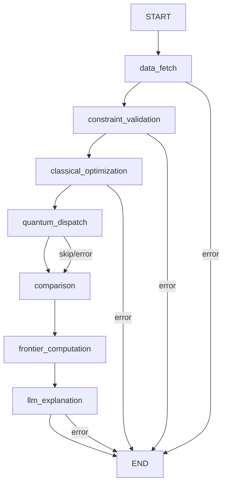

# Agent Layer

Documentation for the LangGraph-powered agent graph — node definitions, state management, the LLM explanation node (GPT-4o), comparison logic, and prompt engineering.

## Section Contents

| Page | Description |
|------|-------------|
| [Graph Definition](graph-definition.md) | StateGraph construction, node registration, and edge wiring |
| [Agent State](agent-state.md) | TypedDict state schema, field lifecycle, and state transitions |
| [Node: Data Fetch](node-data-fetch.md) | yfinance price fetching with Redis cache integration |
| [Node: Constraint Validation](node-constraint-validation.md) | Input normalization, validation, and constraint canonicalization |
| [Node: Classical Optimization](node-classical.md) | CVXPY MVO invocation and result extraction |
| [Node: Quantum Dispatch](node-quantum-dispatch.md) | Conditional QAOA + VQE execution with asset limit guard |
| [Node: Comparison](node-comparison.md) | Side-by-side solver metrics and best-result selection |
| [Node: Frontier](node-frontier.md) | Efficient frontier computation via epsilon-constraint sweep |
| [Node: LLM Explanation](node-llm-explanation.md) | GPT-4o explanation generation with template fallback |
| [Error Routing](error-routing.md) | Conditional edges, fatal vs. non-fatal errors, and recovery paths |

## Agent Graph Structure

## State Lifecycle

Each node receives the full `AgentState` and returns a partial update:

| Node | Reads | Writes |
|------|-------|--------|
| `data_fetch` | `tickers`, `lookback_days` | `prices`, `returns`, `covariance_matrix`, `sector_map` |
| `constraint_validation` | `request` | `validated_constraints`, `tickers` |
| `classical_optimization` | `returns`, `covariance_matrix`, `validated_constraints` | `classical_result` |
| `quantum_dispatch` | `returns`, `covariance_matrix`, `validated_constraints` | `quantum_result` |
| `comparison` | `classical_result`, `quantum_result` | `comparison_table`, `best_solver` |
| `frontier_computation` | `returns`, `covariance_matrix` | `frontier_points` |
| `llm_explanation` | `comparison_table`, `best_solver` | `explanation` |

## Cross-References

- **Classical engine** → [Markowitz MVO](../06-classical-optimization/markowitz-mvo.md)
- **Quantum engine** → [Quantum Dispatcher](../07-quantum-optimization/quantum-dispatcher.md)
- **Task queue** → [Optimization Task](../10-task-queue/optimization-task.md)
- **Progress events** → [Progress Events](../10-task-queue/progress-events.md)
