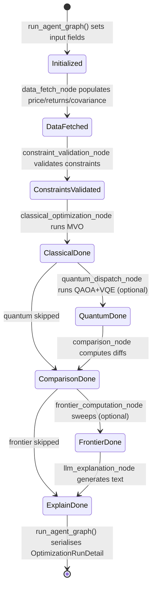

# Agent State

`AgentState` is the shared state object that flows through every node in the LangGraph optimization pipeline. It is defined as a `TypedDict` with `total=False`, meaning all fields are optional — each node only populates the fields it is responsible for, and downstream nodes must use `state.get(...)` with sensible defaults.

**Source file:** `backend/app/agents/state.py`

```python
class AgentState(TypedDict, total=False):
    """Shared state flowing through the LangGraph optimization pipeline."""
```

## State Lifecycle



## Field Groups

### Input Fields

These fields are set by `run_agent_graph()` before the graph starts executing. They are read-only from the perspective of all nodes.

| Field | Type | Description |
|---|---|---|
| `run_id` | `str` | UUID of the optimization run (for logging and DB persistence) |
| `tickers` | `list[str]` | Requested ticker symbols (may be updated by `data_fetch_node` to remove invalid tickers) |
| `budget` | `float` | Total investment budget in USD |
| `request_params` | `dict[str, Any]` | Full `OptimizationRequest` serialised as a dict; used by nodes to read `run_quantum`, `lookback_days`, `objectives`, `frontier`, etc. |

### Data Fetch Node Outputs

Populated by `data_fetch_node` after a successful yfinance call. All downstream nodes depend on these fields.

| Field | Type | Shape / Notes |
|---|---|---|
| `price_data` | `pd.DataFrame` | Adjusted close prices — shape `(days, n_assets)`, columns are ticker symbols |
| `returns_data` | `pd.DataFrame` | Daily log returns — shape `(days-1, n_assets)`, computed as `ln(P_t / P_{t-1})` |
| `expected_returns` | `np.ndarray` | Annualised expected returns — shape `(n_assets,)`, computed as `mean(returns) * 252` |
| `covariance_matrix` | `np.ndarray` | Annualised covariance matrix — shape `(n_assets, n_assets)`, computed as `cov(returns) * 252`, guaranteed PSD |
| `sector_map` | `dict[str, str]` | Mapping of `ticker → sector name` (e.g. `{"AAPL": "Technology"}`) fetched from yfinance metadata |

> **Note:** `tickers` is also updated by `data_fetch_node` to contain only the tickers that survived the data quality filter (≤ 20% NaN values). The original requested tickers may differ from the final `tickers` list.

### Constraint Validation Node Outputs

Populated by `constraint_validation_node` after validating the request constraints against the asset universe.

| Field | Type | Description |
|---|---|---|
| `validated_constraints` | `dict[str, Any]` | Normalised constraint dict passed to the classical optimizer and frontier sweep. Contains `max_weight_per_asset`, `min_weight_per_asset`, `min_return`, `max_volatility`, `sector_constraints`, `sector_map`, `objectives`, and `frontier` keys. |
| `constraint_warnings` | `list[str]` | Human-readable warning messages for near-infeasible constraints (e.g. "min_return is very close to the maximum achievable return"). Does not block execution. |

The `sector_map` from the data fetch node is injected into `validated_constraints` by the constraint validation node so the classical optimizer can apply sector-level weight limits without reading from state directly.

### Classical Optimization Node Outputs

| Field | Type | Description |
|---|---|---|
| `classical_result` | `dict[str, Any]` | Serialised `ClassicalResult` Pydantic model (via `.model_dump()`). Contains `weights` (list of `AssetWeight`), `metrics` (`PortfolioMetrics`), `solver_status`, and `solve_time_ms`. |

### Quantum Dispatch Node Outputs

| Field | Type | Description |
|---|---|---|
| `quantum_result` | `dict[str, Any]` | Serialised `QuantumResult` Pydantic model. Contains `qaoa` (`QAOAResult | None`) and `vqe` (`VQEResult | None`). Either sub-result may be `None` if that solver failed. |

### Comparison Node Outputs

| Field | Type | Description |
|---|---|---|
| `comparison_summary` | `dict[str, Any]` | Serialised `ComparisonSummary` Pydantic model. Contains per-algorithm Sharpe/return/volatility differences and a `recommendation` string. |

### Frontier Computation Node Outputs

| Field | Type | Description |
|---|---|---|
| `frontier_report` | `dict[str, Any] \| None` | Serialised `FrontierReport` Pydantic model, or `None` if the frontier sweep was not requested or failed. Contains `points` (list of `FrontierPoint`), `knee_point_index`, `max_sharpe_index`, `min_risk_index`, and sweep metadata. |

### LLM Explanation Node Outputs

| Field | Type | Description |
|---|---|---|
| `llm_explanation` | `str` | Natural-language explanation of the optimization results. Generated by GPT-4o if `OPENAI_API_KEY` is set, otherwise by a deterministic template. Always a plain string (no markdown). |

### Progress Tracking Fields

These fields are updated by every node on successful completion. They are used by `run_agent_graph()` to build timing summaries and by the WebSocket channel to report progress.

| Field | Type | Description |
|---|---|---|
| `completed_nodes` | `list[str]` | Ordered list of node names that completed successfully (e.g. `["data_fetch", "constraint_validation", "classical_optimization"]`) |
| `node_timings_ms` | `dict[str, float]` | Wall-clock execution time per node in milliseconds (e.g. `{"data_fetch": 1234.5, "classical_optimization": 89.2}`) |

Both fields are updated by the helper functions `_record_completed()` and `_record_timing()` in `nodes.py`:

```python
def _record_timing(state: AgentState, node_name: str, elapsed_ms: float) -> None:
    timings: dict[str, float] = dict(state.get("node_timings_ms") or {})
    timings[node_name] = elapsed_ms
    state["node_timings_ms"] = timings

def _record_completed(state: AgentState, node_name: str) -> None:
    completed: list[str] = list(state.get("completed_nodes") or [])
    if node_name not in completed:
        completed.append(node_name)
    state["completed_nodes"] = completed
```

### Error Handling Fields

These fields are set by any node that encounters a fatal or non-fatal error. The graph's routing functions inspect these fields to decide whether to continue or terminate.

| Field | Type | Description |
|---|---|---|
| `error` | `str \| None` | Human-readable error message set by the failing node. `None` if no error has occurred. |
| `failed_node` | `str \| None` | Name of the node that set the error (e.g. `"data_fetch"`). Used by routing functions to distinguish fatal from non-fatal failures. |
| `error_details` | `dict[str, Any] \| None` | Structured error details for API responses. Contains at minimum `{"node": ..., "error_type": ...}` plus node-specific context (e.g. `{"tickers": [...]}` for data fetch errors). |

> **Important:** Non-fatal nodes (`quantum_dispatch`, `comparison`, `frontier_computation`, `llm_explanation`) do **not** set `state["error"]` on failure. Instead, they append a warning to `constraint_warnings` and return partial state. Only fatal nodes set `error` and `failed_node`. See [Error Routing](error-routing.md) for the full classification.

## State Mutation Pattern

All nodes follow the same immutable-update pattern to avoid mutating the input state:

```python
updated = dict(state)          # shallow copy
updated["some_field"] = value  # set new fields
return updated                 # return updated copy
```

This is required by LangGraph's state management model, which merges node return values into the shared state graph.

## Related Pages

- [Graph Definition](graph-definition.md) — How the graph is constructed and compiled
- [Error Routing](error-routing.md) — How `error` and `failed_node` drive routing decisions
- [Node: Data Fetch](node-data-fetch.md) — Populates `price_data`, `returns_data`, `expected_returns`, `covariance_matrix`, `sector_map`
- [Node: Constraint Validation](node-constraint-validation.md) — Populates `validated_constraints`, `constraint_warnings`
