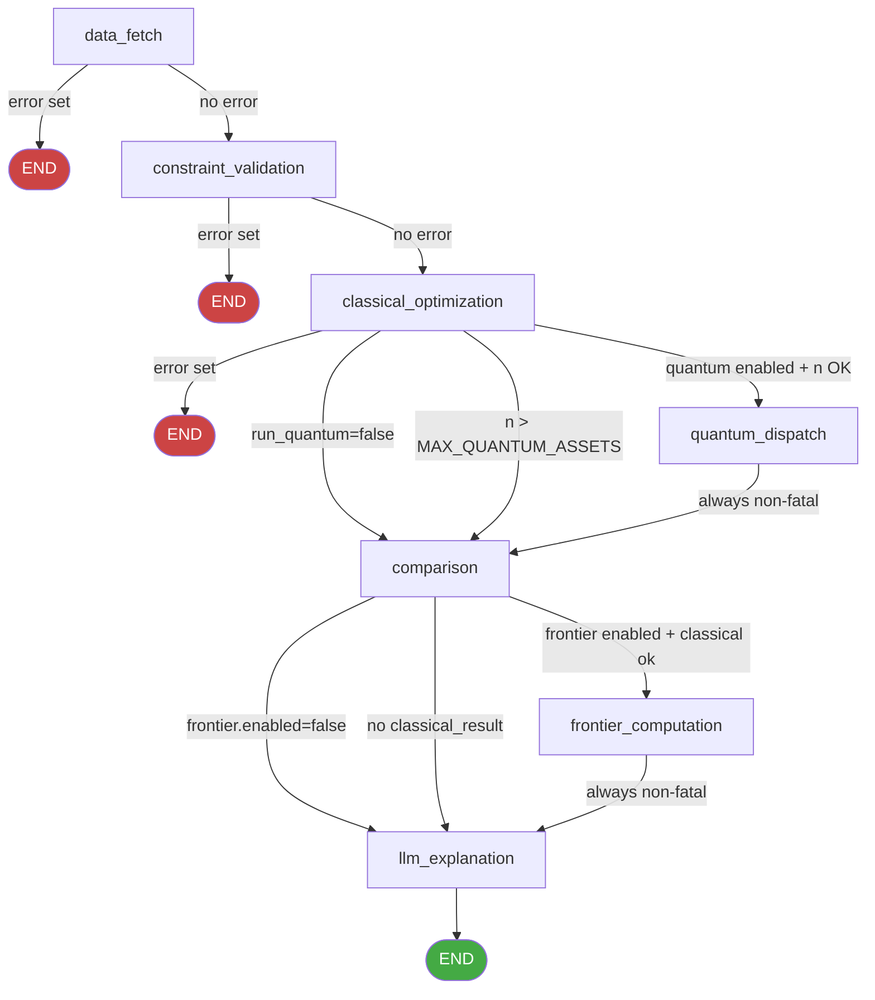

# Error Routing

The LangGraph optimization pipeline uses a set of routing functions to decide which node to execute next based on the current state. These functions implement the **fatal vs non-fatal** node classification — the core design principle that allows partial results to be returned even when some nodes fail.

**Source file:** `backend/app/agents/graph.py`

## Fatal vs Non-Fatal Node Classification

| Node | Classification | Failure Behaviour |
|---|---|---|
| `data_fetch` | **Fatal** | Sets `state["error"]`, routes to `END` immediately |
| `constraint_validation` | **Fatal** | Sets `state["error"]`, routes to `END` immediately |
| `classical_optimization` | **Fatal** | Sets `state["error"]`, routes to `END` immediately |
| `quantum_dispatch` | **Non-fatal** | Appends to `constraint_warnings`, continues to `comparison` |
| `comparison` | **Non-fatal** | Logs error, continues to `frontier_computation` or `llm_explanation` |
| `frontier_computation` | **Non-fatal** | Appends to `constraint_warnings`, sets `frontier_report=None`, continues |
| `llm_explanation` | **Non-fatal** | Sets minimal fallback explanation, continues to `END` |

The rationale for this classification:
- **Fatal nodes** produce data that all downstream nodes depend on. Without market data, validated constraints, or a classical baseline, no meaningful result can be produced.
- **Non-fatal nodes** produce supplementary information (quantum comparison, frontier chart, explanation text). Their failure degrades the result but does not invalidate the core classical portfolio recommendation.

## `_route_after_fatal_node()`

Used after `data_fetch` and `constraint_validation`:

```python
def _route_after_fatal_node(state: AgentState) -> str:
    """Route to END if the previous node set a fatal error, else continue."""
    if state.get("error") and state.get("failed_node"):
        return "end"
    return "continue"
```

This function checks whether **any** node has set `state["error"]` and `state["failed_node"]`. If so, it returns `"end"` to terminate the run. Otherwise it returns `"continue"` to proceed to the next node.

The routing map for both `data_fetch` and `constraint_validation`:

```python
graph.add_conditional_edges(
    "data_fetch",
    _route_after_fatal_node,
    {
        "continue": "constraint_validation",
        "end": END,
    },
)
```

## `_route_after_classical()`

Used after `classical_optimization`:

```python
def _route_after_classical(state: AgentState) -> str:
    """Route after classical optimization.

    Returns:
        'end'          — if classical optimization failed fatally
        'quantum'      — if quantum should run
        'skip_quantum' — if quantum should be skipped
    """
    # Fatal error from classical optimization
    if state.get("error") and state.get("failed_node") == "classical_optimization":
        return "end"

    # Also end if a prior node set a fatal error
    if state.get("error") and state.get("failed_node") in (
        "data_fetch",
        "constraint_validation",
    ):
        return "end"

    return _should_run_quantum(state)
```

This function handles three cases:
1. **Classical optimization failed** → `"end"` (fatal)
2. **Prior fatal error** (should not normally reach here, but defensive) → `"end"`
3. **Classical succeeded** → delegates to `_should_run_quantum()`

The routing map:

```python
graph.add_conditional_edges(
    "classical_optimization",
    _route_after_classical,
    {
        "quantum": "quantum_dispatch",
        "skip_quantum": "comparison",
        "end": END,
    },
)
```

## `_should_run_quantum()`

Called by `_route_after_classical()` when classical optimization succeeded:

```python
def _should_run_quantum(state: AgentState) -> str:
    """Decide whether to run quantum optimization.

    Returns 'quantum' if quantum should run, 'skip_quantum' otherwise.
    """
    request_params = state.get("request_params", {})
    run_quantum = request_params.get("run_quantum", True)

    if not run_quantum:
        logger.info("quantum_skipped_disabled", run_id=state.get("run_id"))
        return "skip_quantum"

    settings = get_settings()
    tickers = state.get("tickers", [])
    if len(tickers) > settings.MAX_QUANTUM_ASSETS:
        logger.warning(
            "quantum_skipped_too_many_assets",
            run_id=state.get("run_id"),
            num_assets=len(tickers),
            max_assets=settings.MAX_QUANTUM_ASSETS,
        )
        return "skip_quantum"

    return "quantum"
```

### Skip Conditions

| Condition | Log Event | Outcome |
|---|---|---|
| `run_quantum=False` in request | `quantum_skipped_disabled` | `"skip_quantum"` → routes to `comparison` |
| `len(tickers) > MAX_QUANTUM_ASSETS` | `quantum_skipped_too_many_assets` | `"skip_quantum"` → routes to `comparison` |
| Neither condition | — | `"quantum"` → routes to `quantum_dispatch` |

`MAX_QUANTUM_ASSETS` defaults to `8` and is configurable via the `MAX_QUANTUM_ASSETS` environment variable (range: 2–20). See [Environment Variables](../01-getting-started/environment-variables.md).

## `_route_after_comparison()`

Used after `comparison`:

```python
def _route_after_comparison(state: AgentState) -> str:
    """Route after the comparison node.

    Returns 'frontier' when the request enabled the efficient-frontier
    sweep (and the classical optimisation succeeded), otherwise
    'skip_frontier' to go straight to the explanation node.
    """
    constraints = state.get("validated_constraints") or {}
    frontier_cfg = constraints.get("frontier")
    if not frontier_cfg or not frontier_cfg.get("enabled"):
        return "skip_frontier"

    # Require a valid classical result
    if not state.get("classical_result"):
        logger.info(
            "frontier_skipped_no_classical_result",
            run_id=state.get("run_id"),
        )
        return "skip_frontier"

    return "frontier"
```

### Skip Conditions

| Condition | Outcome |
|---|---|
| `frontier.enabled` is `False` or absent | `"skip_frontier"` → routes to `llm_explanation` |
| `classical_result` is absent | `"skip_frontier"` → routes to `llm_explanation` |
| Both conditions satisfied | `"frontier"` → routes to `frontier_computation` |

The routing map:

```python
graph.add_conditional_edges(
    "comparison",
    _route_after_comparison,
    {
        "frontier": "frontier_computation",
        "skip_frontier": "llm_explanation",
    },
)
```

## Complete Routing Decision Tree



## Error State Propagation

When a fatal node sets `state["error"]`, the `wrap_node()` wrapper in subsequent nodes checks for this condition and skips execution:

```python
def wrapped(state: AgentState) -> AgentState:
    # Skip execution if a fatal error was already set by a prior node
    if state.get("error") and state.get("failed_node"):
        if state.get("failed_node") != node_name:
            logger.debug("node_skipped_due_to_prior_error", ...)
            return state
    ...
```

This provides a second layer of protection: even if the conditional routing somehow passes a node that should have been skipped, the `wrap_node()` wrapper will short-circuit execution.

## Error Details in API Response

When a run fails, the error information is included in the `OptimizationRunDetail` response:

```python
error_message: str | None = state.get("error")
if error_message and state.get("failed_node"):
    error_message = f"[{state['failed_node']}] {error_message}"
```

Example error message: `"[data_fetch] No price data returned for any of the requested tickers."`

The `error_details` dict provides structured information for programmatic error handling:

```python
{
    "node": "data_fetch",
    "error_type": "DataFetchError",
    "tickers": ["INVALID_TICKER"]
}
```

## Related Pages

- [Graph Definition](graph-definition.md) — How routing functions are wired into the graph
- [Agent State](agent-state.md) — `error`, `failed_node`, `error_details` fields
- [Node: Data Fetch](node-data-fetch.md) — Fatal node: data fetch failure
- [Node: Constraint Validation](node-constraint-validation.md) — Fatal node: constraint violation
- [Node: Classical Optimization](node-classical.md) — Fatal node: solver failure
- [Node: Quantum Dispatch](node-quantum-dispatch.md) — Non-fatal node: quantum failure
