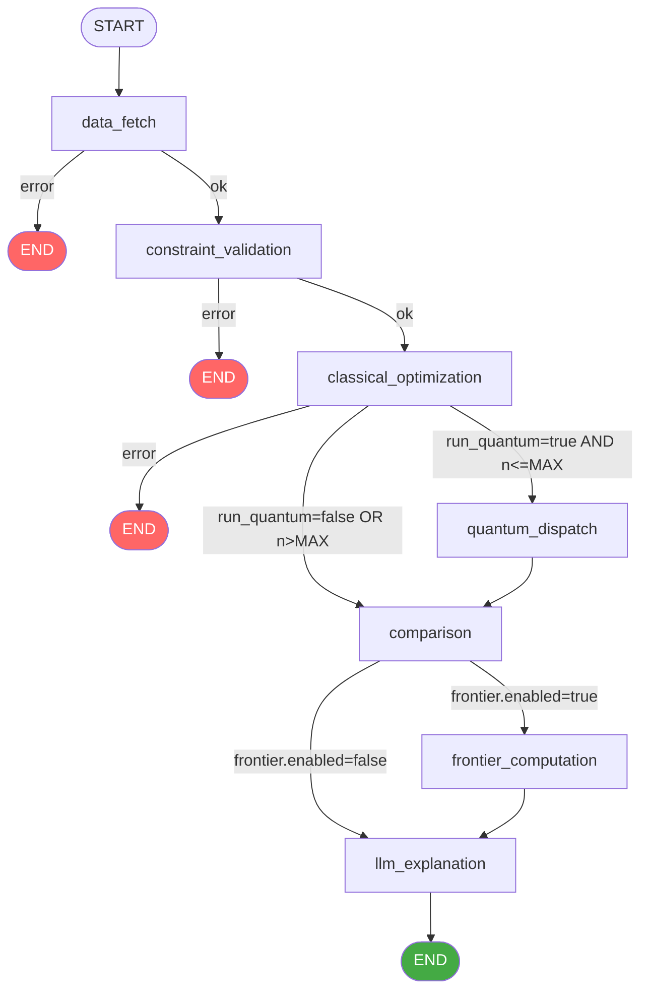

# Graph Definition

The optimization pipeline is implemented as a compiled **LangGraph `StateGraph`** — a directed graph of deterministic Python nodes connected by conditional routing functions. The graph is built and compiled inside `_make_graph()` in `backend/app/agents/graph.py`.

## `_make_graph()` Function

```python
def _make_graph(
    progress_callback: ProgressCallback | None = None,
) -> Any:
    """Build and compile the LangGraph optimization graph."""
```

`_make_graph()` accepts an optional `progress_callback` (a `Callable[[str, str, str], None]`) that receives `(node_name, status, message)` events at each node transition. It returns a compiled `StateGraph` ready for synchronous invocation.

The function is called once per optimization run by `run_agent_graph()` so that each run gets its own callback closure — there is no shared mutable state between concurrent runs.

## `StateGraph(AgentState)` Construction

```python
graph = StateGraph(AgentState)
```

The graph is typed against `AgentState` (a `TypedDict`). LangGraph uses this type annotation to validate that node return values are compatible with the shared state schema. See [Agent State](agent-state.md) for the full field reference.

## Node Registration

All seven nodes are registered with `graph.add_node()`. Each node function is wrapped by `wrap_node()` before registration:

```python
graph.add_node("data_fetch",            wrap_node(data_fetch_node,            "data_fetch"))
graph.add_node("constraint_validation", wrap_node(constraint_validation_node, "constraint_validation"))
graph.add_node("classical_optimization",wrap_node(classical_optimization_node,"classical_optimization"))
graph.add_node("quantum_dispatch",      wrap_node(quantum_dispatch_node,      "quantum_dispatch"))
graph.add_node("comparison",            wrap_node(comparison_node,            "comparison"))
graph.add_node("frontier_computation",  wrap_node(frontier_computation_node,  "frontier_computation"))
graph.add_node("llm_explanation",       wrap_node(llm_explanation_node,       "llm_explanation"))
```

## `wrap_node()` Pattern

`wrap_node()` is a closure factory that decorates every node function with three cross-cutting behaviours:

### 1. Prior-Error Skip

If a **fatal** error was already set by an earlier node (`state["error"]` and `state["failed_node"]` are both populated), the wrapper skips execution and returns the state unchanged. This prevents downstream nodes from running on corrupt state when the graph's conditional routing has not yet had a chance to terminate the run.

```python
if state.get("error") and state.get("failed_node"):
    if state.get("failed_node") != node_name:
        logger.debug("node_skipped_due_to_prior_error", ...)
        return state
```

### 2. Progress Callback

Before calling the node, the wrapper fires a `"started"` event. After the node returns, it fires either `"completed"` or `"failed"` depending on whether the node set `state["error"]`:

```python
if progress_callback:
    progress_callback(node_name, "started", _node_start_message(node_name))

result = node_fn(state)

if result.get("error") and result.get("failed_node") == node_name:
    progress_callback(node_name, "failed", result.get("error", ...))
else:
    progress_callback(node_name, "completed", _node_complete_message(node_name, result))
```

Progress events are forwarded to the WebSocket channel so the frontend can display real-time node status. See [WebSocket Endpoint](../04-api-reference/websocket-endpoint.md).

### 3. Unexpected Exception Propagation

If the node raises an unhandled exception (i.e., it did not catch it internally), the wrapper catches it, logs it at `ERROR` level, and converts it into a state error:

```python
except Exception as exc:
    logger.error("node_unexpected_exception", node=node_name, error=str(exc), ...)
    updated = dict(state)
    updated["error"] = str(exc)
    updated["failed_node"] = node_name
    updated["error_details"] = {"node": node_name, "error_type": type(exc).__name__}
    return updated
```

This ensures the graph always terminates gracefully — no unhandled exception can crash the Celery worker.

## Entry Point

```python
graph.set_entry_point("data_fetch")
```

Every optimization run starts at `data_fetch`. There is no conditional entry — the graph always begins by fetching market data.

## Edge Definitions

### Conditional Edges

| Source Node | Routing Function | Possible Targets |
|---|---|---|
| `data_fetch` | `_route_after_fatal_node` | `constraint_validation` or `END` |
| `constraint_validation` | `_route_after_fatal_node` | `classical_optimization` or `END` |
| `classical_optimization` | `_route_after_classical` | `quantum_dispatch`, `comparison`, or `END` |
| `comparison` | `_route_after_comparison` | `frontier_computation` or `llm_explanation` |

### Unconditional Edges

| Source Node | Target Node | Notes |
|---|---|---|
| `quantum_dispatch` | `comparison` | Quantum failure is non-fatal; always continues |
| `frontier_computation` | `llm_explanation` | Frontier failure is non-fatal; always continues |
| `llm_explanation` | `END` | Final node; always terminates |

## Compiled Graph — Execution Flow



> **Fatal vs Non-Fatal Nodes**: `data_fetch`, `constraint_validation`, and `classical_optimization` are **fatal** — their failure terminates the run immediately. `quantum_dispatch`, `comparison`, `frontier_computation`, and `llm_explanation` are **non-fatal** — their failure is logged and the run continues with partial results. See [Error Routing](error-routing.md) for full details.

## `run_agent_graph()` Entry Point

The public API for invoking the graph is `run_agent_graph()`:

```python
from app.agents.graph import run_agent_graph

result = await run_agent_graph(
    run_id="550e8400-e29b-41d4-a716-446655440000",
    request=OptimizationRequest(...),
    progress_callback=lambda node, status, msg: ...,
)
```

This function:
1. Builds the initial `AgentState` from the `OptimizationRequest`
2. Calls `_make_graph(progress_callback)` to compile the graph
3. Invokes the compiled graph synchronously via `asyncio.to_thread`
4. Deserialises the final state into an `OptimizationRunDetail` response

## Related Pages

- [Agent State](agent-state.md) — Full `AgentState` TypedDict reference
- [Error Routing](error-routing.md) — Routing function logic
- [Node: Data Fetch](node-data-fetch.md) — First node in the pipeline
- [Node: LLM Explanation](node-llm-explanation.md) — Final node in the pipeline

## Cross-References

- [Classical Optimization](../06-classical-optimization/markowitz-mvo.md) — The CVXPY MVO engine invoked by the classical node
- [Quantum Optimization](../07-quantum-optimization/quantum-dispatcher.md) — The quantum dispatcher invoked by the quantum node
- [Optimization Task](../10-task-queue/optimization-task.md) — Celery task that calls `run_agent_graph()`
- [Progress Events](../10-task-queue/progress-events.md) — How progress callbacks publish to Redis pub/sub
