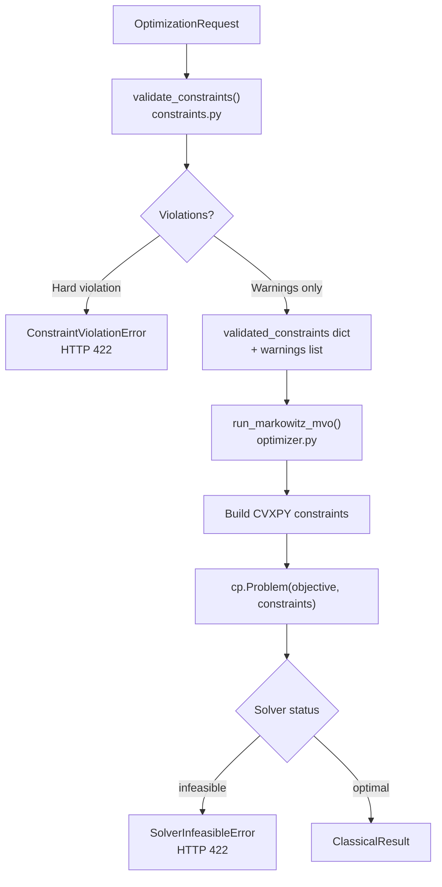

# Optimization Constraints

The portfolio optimizer supports a rich set of constraints that control the feasible region of the CVXPY problem. This page documents every constraint type, how they are validated before the solve, and how infeasibility is detected and reported.

Source files:
- `backend/app/classical/constraints.py` — `validate_constraints()` pre-solve validation
- `backend/app/classical/optimizer.py` — CVXPY constraint construction
- `backend/app/core/exceptions.py` — `SolverInfeasibleError`, `ConstraintViolationError`

---

## Constraint Overview



---

## Core Constraints (Always Applied)

### Budget Constraint: `sum(w) = 1`

The portfolio must be fully invested. This equality constraint is always present:

```python
cvx_constraints: list[cp.Constraint] = [
    cp.sum(w) == 1.0,   # Fully invested
]
```

This ensures the weights sum to exactly 1.0 (100% of the budget is allocated).

### Non-Negativity: `w >= 0`

The optimizer uses a long-only portfolio model. Non-negativity is enforced by declaring the CVXPY variable with `nonneg=True`:

```python
w = cp.Variable(n, nonneg=True)
```

This is equivalent to adding `w >= 0` as an explicit constraint but is more efficient for the solver.

---

## Optional Constraints

### `max_weight_per_asset`

Caps the maximum allocation to any single asset:

```python
max_weight = constraints.get("max_weight_per_asset")
if max_weight is not None:
    cvx_constraints.append(w <= max_weight)
```

**Pre-solve validation**: The validator checks that `max_weight >= 1/n` (the minimum required weight when all assets are equally weighted). If `max_weight < 1/n`, the budget constraint `sum(w) = 1` cannot be satisfied:

```python
if max_weight < min_required_weight:
    violated.append(
        f"max_weight_per_asset ({max_weight:.3f}) is less than 1/n "
        f"({min_required_weight:.3f}) — budget constraint cannot be satisfied."
    )
```

**Example**: With 5 assets, `max_weight_per_asset` must be at least `0.20`.

### `min_weight_per_asset`

Sets a minimum allocation for any asset that is included in the portfolio. This field is validated at the schema level but is not currently applied as a CVXPY constraint in the main optimizer (it is used in the QUBO formulation for quantum optimization). The validated constraints dict carries it forward for future use.

**Schema validation**: Pydantic enforces `0.0 ≤ min_weight ≤ 1.0` and the `OptimizationRequest` model validator ensures `min_weight < max_weight` when both are specified.

---

## Return and Volatility Thresholds

### `min_return` — Minimum Portfolio Return

Enforces a lower bound on the portfolio's expected return:

```python
portfolio_return = expected_returns @ w
if min_return is not None:
    cvx_constraints.append(portfolio_return >= min_return)
```

**Pre-solve validation**:

```python
max_achievable_return = float(np.max(expected_returns))
if min_return > max_achievable_return:
    violated.append(
        f"min_return ({min_return:.3f}) exceeds the maximum achievable "
        f"return ({max_achievable_return:.3f}) in the asset universe."
    )
elif min_return > 0.9 * max_achievable_return:
    warnings.append(
        f"min_return ({min_return:.3f}) is very close to the maximum "
        f"achievable return ({max_achievable_return:.3f}). "
        "The solver may struggle to find a feasible solution."
    )
```

A warning (not an error) is emitted when `min_return > 90%` of the maximum achievable return, as this may produce a near-infeasible problem.

### `max_volatility` — Maximum Portfolio Volatility

Enforces an upper bound on portfolio volatility via a quadratic constraint:

```python
portfolio_variance = cp.quad_form(w, cp.psd_wrap(covariance_matrix))
if max_volatility is not None:
    cvx_constraints.append(portfolio_variance <= max_volatility ** 2)
```

Note that the constraint is on **variance** (`σ²`), not volatility (`σ`), to keep the problem convex.

**Pre-solve validation** — minimum achievable volatility is computed via the global minimum variance portfolio:

```python
try:
    inv_cov = np.linalg.inv(covariance_matrix)
    ones = np.ones(n)
    min_var = 1.0 / (ones @ inv_cov @ ones)
    min_vol = float(np.sqrt(max(min_var, 0.0)))
except np.linalg.LinAlgError:
    min_vol = 0.0

if max_volatility < min_vol:
    violated.append(
        f"max_volatility ({max_volatility:.3f}) is below the minimum "
        f"achievable portfolio volatility ({min_vol:.3f})."
    )
```

---

## Sector Allocation Limits

Sector constraints cap the total weight allocated to all assets within a named sector:

```python
sector_constraints = constraints.get("sector_constraints", []) or []
for sc in sector_constraints:
    sector_name = sc.get("sector", "")
    max_sector_weight = sc.get("max_weight", 1.0)
    sector_indices = sector_indices_by_name.get(sector_name, [])
    if sector_indices:
        cvx_constraints.append(
            cp.sum(w[sector_indices]) <= max_sector_weight
        )
```

The `sector_indices_by_name` dict is built from the `sector_map` (ticker → sector name) that is populated by the data fetch node:

```python
def _build_sector_indices(
    tickers: list[str],
    sector_map: dict[str, str],
) -> dict[str, list[int]]:
    """Group ticker indices by sector name."""
    result: dict[str, list[int]] = {}
    for i, t in enumerate(tickers):
        sector = sector_map.get(t, "")
        if not sector:
            continue
        result.setdefault(sector, []).append(i)
    return result
```

**Pre-solve validation** — checks that sector limits don't make full budget allocation impossible:

```python
total_sector_limit = sum(sc.get("max_weight", 1.0) for sc in sector_constraints)
if total_sector_limit < 0.99:
    warnings.append(
        f"Sector weight limits sum to {total_sector_limit:.3f} < 1.0. "
        "If all assets belong to constrained sectors, full budget "
        "allocation may not be achievable."
    )
```

### Example: Technology Sector Cap

```json
{
  "sector_constraints": [
    {"sector": "Technology", "max_weight": 0.40},
    {"sector": "Healthcare", "max_weight": 0.30}
  ]
}
```

This limits Technology stocks to at most 40% and Healthcare to at most 30% of the portfolio.

---

## Per-Objective Hard Thresholds

When the multi-objective matrix is used, each `BusinessObjective` row can carry a `threshold` that becomes a hard CVXPY constraint:

```python
if threshold is not None:
    if direction == "maximize":
        # raw expression must be >= threshold
        threshold_constraints.append(expr >= float(threshold))
    else:
        threshold_constraints.append(expr <= float(threshold))
```

These threshold constraints are collected by `_build_scalar_objective()` and added to the main `cvx_constraints` list before the solve:

```python
scalar_expr, threshold_constraints, deferred_warnings = (
    _build_scalar_objective(
        objectives=objectives,
        w=w,
        expected_returns=expected_returns,
        covariance_matrix=covariance_matrix,
        sector_indices_by_name=sector_indices_by_name,
    )
)
cvx_constraints.extend(threshold_constraints)
```

### Threshold Validation

The constraint validator performs sanity checks on thresholds against the asset universe:

```python
# Return threshold feasibility
if name == "return" and direction == "maximize" and thr > max_mu:
    violated.append(
        f"Return threshold ({thr:.3f}) exceeds the maximum "
        f"achievable return ({max_mu:.3f}) in the asset universe."
    )

# HHI threshold feasibility
if name == "diversification_hhi":
    hhi_lo = 1.0 / n
    if direction == "minimize" and thr < hhi_lo:
        violated.append(
            f"HHI threshold ({thr:.3f}) is below the theoretical "
            f"minimum (1/n = {hhi_lo:.3f}) for {n} assets."
        )
```

### Threshold Examples

| Objective | Direction | Threshold | CVXPY Constraint |
|-----------|-----------|-----------|-----------------|
| `return` | maximize | `0.08` | `μᵀw >= 0.08` |
| `volatility` | minimize | `0.25` | `wᵀΣw <= 0.0625` |
| `diversification_hhi` | minimize | `0.30` | `Σwᵢ² <= 0.30` |
| `sector_concentration` | minimize | `0.50` | `Σₛ(Σᵢ∈ₛwᵢ)² <= 0.50` |

---

## Constraint Validation Pipeline

The `validate_constraints()` function in `backend/app/classical/constraints.py` runs before the CVXPY solve and produces either a hard error or a list of warnings:

```python
def validate_constraints(
    request_params: dict[str, Any],
    tickers: list[str],
    expected_returns: np.ndarray,
    covariance_matrix: np.ndarray,
) -> tuple[dict[str, Any], list[str]]:
    """Validate and normalise optimization constraints.

    Returns:
        Tuple of (validated_constraints dict, list of warning strings).

    Raises:
        ConstraintViolationError: If constraints are logically impossible.
    """
```

### Validation Checks

| Check | Type | Condition |
|-------|------|-----------|
| `max_weight_per_asset >= 1/n` | Hard | Ensures budget constraint is satisfiable |
| `min_return <= max(μ)` | Hard | Ensures return target is achievable |
| `max_volatility >= min_vol` | Hard | Ensures volatility target is achievable |
| `min_return > 0.9 * max(μ)` | Warning | Near-infeasible return target |
| `max_volatility < 1.1 * min_vol` | Warning | Near-minimum-variance target |
| `sum(sector_limits) >= 1.0` | Warning | Sector limits may prevent full allocation |
| Objective weight sum > 0 | Hard | At least one enabled row must have positive weight |
| Return threshold vs universe | Hard | Threshold must be achievable |
| HHI threshold vs 1/n | Hard | Threshold must be above theoretical minimum |

### Objective Weight Validation

```python
enabled_rows = [o for o in raw_objectives if o.get("enabled", True)]
if enabled_rows:
    total_w = sum(float(o.get("weight", 0.0)) for o in enabled_rows)
    if total_w <= 0:
        violated.append(
            "All enabled objectives have weight 0 — at least one row "
            "must carry positive weight."
        )
    elif abs(total_w - 1.0) > 0.01:
        warnings.append(
            f"Objective weights sum to {total_w:.3f}; they will be "
            "renormalised to 1.0 before optimisation."
        )
```

---

## Constraint Infeasibility Handling

### `ConstraintViolationError`

Raised by `validate_constraints()` **before** the CVXPY solve when constraints are logically impossible:

```python
class ConstraintViolationError(OptimizationError):
    """Raised when user-supplied constraints are logically invalid."""

    def __init__(
        self,
        message: str,
        violated_constraints: list[str] | None = None,
        details: dict[str, Any] | None = None,
    ) -> None:
        super().__init__(
            message=message,
            error_code="CONSTRAINT_VIOLATION",
            details={
                **(details or {}),
                "violated_constraints": violated_constraints or [],
            },
        )
```

**HTTP response**: `422 Unprocessable Entity`

**Example response body**:
```json
{
  "error_code": "CONSTRAINT_VIOLATION",
  "message": "Found 1 constraint violation(s) that make the optimization problem infeasible.",
  "details": {
    "violated_constraints": [
      "min_return (0.200) exceeds the maximum achievable return (0.150) in the asset universe."
    ]
  }
}
```

### `SolverInfeasibleError`

Raised by `run_markowitz_mvo()` **after** the CVXPY solve when the solver reports infeasibility:

```python
class SolverInfeasibleError(OptimizationError):
    """Raised when the CVXPY solver cannot find a feasible solution."""

    def __init__(
        self,
        message: str,
        solver_status: str = "infeasible",
        relaxation_suggestions: list[str] | None = None,
        details: dict[str, Any] | None = None,
    ) -> None:
        super().__init__(
            message=message,
            error_code="SOLVER_INFEASIBLE",
            details={
                **(details or {}),
                "solver_status": solver_status,
                "relaxation_suggestions": relaxation_suggestions or [],
            },
        )
```

**HTTP response**: `422 Unprocessable Entity`

**Relaxation suggestions** included in the error:
- `"Increase max_volatility"`
- `"Decrease min_return"`
- `"Increase max_weight_per_asset"`
- `"Relax sector constraints"`
- `"Relax objective thresholds"`

**Example response body**:
```json
{
  "error_code": "SOLVER_INFEASIBLE",
  "message": "The optimization problem is infeasible with the given constraints.",
  "details": {
    "solver_status": "infeasible",
    "relaxation_suggestions": [
      "Increase max_volatility",
      "Decrease min_return",
      "Increase max_weight_per_asset",
      "Relax sector constraints",
      "Relax objective thresholds"
    ]
  }
}
```

### When `SolverInfeasibleError` vs `ConstraintViolationError`

| Scenario | Exception | Stage |
|----------|-----------|-------|
| `min_return` exceeds `max(μ)` | `ConstraintViolationError` | Pre-solve validation |
| `max_weight < 1/n` | `ConstraintViolationError` | Pre-solve validation |
| Conflicting thresholds (e.g., return ≥ 15% AND volatility ≤ 5%) | `SolverInfeasibleError` | Post-solve |
| Over-constrained sector limits | `SolverInfeasibleError` | Post-solve |
| All solvers fail with exception | `SolverInfeasibleError` | Post-solve |

---

## Complete Constraint Reference

| Constraint | Source | CVXPY Form | Validation |
|-----------|--------|-----------|------------|
| `sum(w) = 1` | Always | `cp.sum(w) == 1.0` | None (always feasible with `w >= 0`) |
| `w >= 0` | Always | `nonneg=True` on variable | None |
| `w <= max_weight` | `max_weight_per_asset` | `w <= max_weight` | `max_weight >= 1/n` |
| `μᵀw >= min_return` | `min_return` | `portfolio_return >= min_return` | `min_return <= max(μ)` |
| `wᵀΣw <= σ²_max` | `max_volatility` | `portfolio_variance <= max_vol²` | `max_vol >= min_vol` |
| `Σᵢ∈ₛ wᵢ <= max_s` | `sector_constraints` | `cp.sum(w[sector_idxs]) <= max_s` | Sum of limits ≥ 1.0 |
| `expr >= threshold` | `objectives[i].threshold` (maximize) | `expr >= threshold` | Threshold vs universe |
| `expr <= threshold` | `objectives[i].threshold` (minimize) | `expr <= threshold` | Threshold vs universe |

---

## See Also

- [Markowitz MVO](markowitz-mvo.md) — core optimization formulation
- [Multi-Objective Optimization](multi-objective.md) — per-objective threshold constraints
- [Efficient Frontier](efficient-frontier.md) — how base constraints are reused in the frontier sweep
