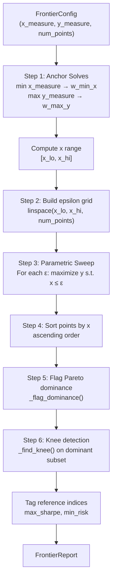
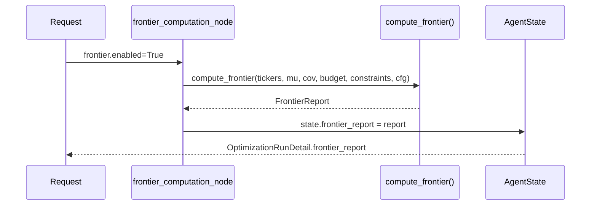

# Efficient Frontier

The efficient frontier module traces the Pareto-optimal boundary between two portfolio measures using the **epsilon-constraint method**. For a given pair of measures (e.g., volatility on the X-axis and return on the Y-axis), it sweeps one measure across a grid of levels and optimizes the other at each level, producing a set of Pareto-efficient portfolios.

Source file: `backend/app/classical/frontier.py`

---

## Algorithm Overview

The epsilon-constraint sweep follows a six-step algorithm:



### Step 1: Anchor Solves

Two extreme portfolios bracket the feasible frontier range:

```python
# Minimize x_measure (e.g., minimum volatility portfolio)
w_min_x, _ = _solve_extreme(
    x_dir, x_name, n, base_constraints, mu, cov, sector_indices_by_name,
)
# Maximize y_measure (e.g., maximum return portfolio)
w_max_y, _ = _solve_extreme(
    y_dir, y_name, n, base_constraints, mu, cov, sector_indices_by_name,
)
```

The X-values of these two portfolios define the sweep range `[x_lo, x_hi]`.

### Step 2: Epsilon Grid

A uniform grid of `num_points` levels is built across the X range:

```python
eps_grid = np.linspace(x_lo, x_hi, num_points)
```

### Step 3: Parametric Sweep

For each epsilon level `ε`, the optimizer solves:

```
maximize   y_measure(w)
subject to:
    x_measure(w) ≤ ε    (if x is a "minimize" direction)
    x_measure(w) ≥ ε    (if x is a "maximize" direction)
    sum(w) = 1
    w >= 0
    + base constraints (max_weight, sector limits, ...)
```

```python
for eps in eps_grid:
    w = cp.Variable(n, nonneg=True)
    x_expr = _measure_expr(x_name, w, mu, cov, sector_indices_by_name)
    y_expr = _measure_expr(y_name, w, mu, cov, sector_indices_by_name)

    cons = base_constraints(w)
    if x_dir == "minimize":
        cons.append(x_expr <= float(eps))
    else:
        cons.append(x_expr >= float(eps))

    objective = cp.Maximize(y_expr) if y_dir == "maximize" else cp.Minimize(y_expr)
    problem = cp.Problem(objective, cons)
    problem.solve(solver=cp.CLARABEL, verbose=False)
```

Infeasible or failed solves at individual epsilon levels are silently skipped — the sweep continues to the next level.

### Step 4: Sort and Filter

After the sweep, points are sorted by ascending X value for consistent plotting:

```python
points.sort(key=lambda p: p.x)
```

### Step 5: Pareto Dominance Flagging

Each point is checked for Pareto dominance via `_flag_dominance()`. A point `p` is **dominated** if there exists another point `q` that is at least as good on both axes and strictly better on one:

```python
def _flag_dominance(
    points: list[FrontierPoint],
    x_direction: str,
    y_direction: str,
) -> None:
    """Mark each point's is_dominant flag in place."""
    for i, p in enumerate(points):
        dominated = False
        for j, q in enumerate(points):
            if i == j:
                continue
            if (
                better_or_equal(q.x, p.x, x_direction)
                and better_or_equal(q.y, p.y, y_direction)
                and (
                    strictly_better(q.x, p.x, x_direction)
                    or strictly_better(q.y, p.y, y_direction)
                )
            ):
                dominated = True
                break
        p.is_dominant = not dominated
```

Direction-aware comparison: "better" means **lower** for `"minimize"` axes and **higher** for `"maximize"` axes.

### Step 6: Knee Point Detection

The knee point is the portfolio that offers the best trade-off between the two objectives — the point of maximum curvature on the frontier. The algorithm uses the **maximum perpendicular distance from the chord** heuristic:

```python
def _find_knee(points: list[FrontierPoint]) -> int | None:
    """Return the index of the maximum-curvature point on the frontier."""
    xs = np.array([p.x for p in points], dtype=float)
    ys = np.array([p.y for p in points], dtype=float)

    # Normalise to [0, 1] so curvature is direction-independent
    x_n = _norm(xs)
    y_n = _norm(ys)

    # Chord from first to last point
    x0, y0 = x_n[0], y_n[0]
    x1, y1 = x_n[-1], y_n[-1]
    chord_len = np.hypot(x1 - x0, y1 - y0)

    # Perpendicular distance from each point to the chord
    distances = np.abs(
        (y1 - y0) * x_n - (x1 - x0) * y_n + x1 * y0 - y1 * x0
    ) / chord_len

    # Exclude endpoints (distance ≈ 0 by construction)
    distances[0] = 0.0
    distances[-1] = 0.0
    idx = int(np.argmax(distances))
    return idx if distances[idx] > 1e-6 else None
```

The knee detection operates on the **dominant subset** only:

```python
dominant_indices = [i for i, p in enumerate(points) if p.is_dominant]
if len(dominant_indices) >= 3:
    dominant_points = [points[i] for i in dominant_indices]
    local_knee = _find_knee(dominant_points)
    if local_knee is not None:
        knee_index = dominant_indices[local_knee]
        points[knee_index].is_knee = True
```

---

## `FrontierConfig` Parameters

The frontier sweep is configured via the `FrontierConfig` Pydantic model in `backend/app/schemas/requests.py`:

```python
class FrontierConfig(BaseModel):
    enabled: bool = Field(default=False)
    x_measure: ObjectiveName = Field(default="volatility")
    y_measure: ObjectiveName = Field(default="return")
    num_points: int = Field(default=25, ge=5, le=100)
```

### Parameter Reference

| Parameter | Type | Default | Range | Description |
|-----------|------|---------|-------|-------------|
| `enabled` | `bool` | `False` | — | Whether to compute and return the frontier |
| `x_measure` | `ObjectiveName` | `"volatility"` | 7 options | Measure plotted on the X-axis |
| `y_measure` | `ObjectiveName` | `"return"` | 7 options | Measure plotted on the Y-axis |
| `num_points` | `int` | `25` | `[5, 100]` | Number of parametric solves |

### Supported Measures

The frontier sweep supports the same five convex measures as the main optimizer:

| Measure | Natural Direction | Typical Range |
|---------|-----------------|---------------|
| `return` | maximize | 0.05 – 0.30 |
| `volatility` | minimize | 0.10 – 0.40 |
| `sharpe` | maximize | 0.0 – 3.0 |
| `diversification_hhi` | minimize | 1/n – 1.0 |
| `sector_concentration` | minimize | 1/S – 1.0 |

Non-convex measures (`max_drawdown`, `esg_score`) raise `ValueError` if requested.

### Validation

The `FrontierConfig` model validator ensures the X and Y measures are distinct when `enabled=True`:

```python
@model_validator(mode="after")
def validate_distinct_axes(self) -> FrontierConfig:
    if self.enabled and self.x_measure == self.y_measure:
        raise ValueError(
            "Frontier x_measure and y_measure must be different "
            f"(both are '{self.x_measure}')."
        )
    return self
```

---

## `FrontierReport` Output Structure

The `compute_frontier()` function returns a `FrontierReport` Pydantic model:

```python
class FrontierReport(BaseModel):
    x_measure: FrontierMeasureName
    y_measure: FrontierMeasureName
    x_direction: Literal["maximize", "minimize"]
    y_direction: Literal["maximize", "minimize"]
    points: list[FrontierPoint]
    knee_point_index: int | None = None
    max_sharpe_index: int | None = None
    min_risk_index: int | None = None
    num_dominant: int = 0
    num_dominated: int = 0
    solve_time_ms: float = 0.0
    commentary: str | None = None
```

### `FrontierPoint` Structure

Each point on the frontier is a `FrontierPoint`:

```python
class FrontierPoint(BaseModel):
    x: float              # X-axis measure value
    y: float              # Y-axis measure value
    sharpe: float         # Sharpe ratio (always computed for ranking)
    weights: list[AssetWeight]  # Full asset allocation
    is_dominant: bool = True    # True if Pareto-efficient
    is_knee: bool = False       # True for the knee point
    solver_status: str = "optimal"  # CVXPY solver status
```

### Reference Indices

The report includes three reference portfolio indices into the `points` list:

| Index | Description | Selection Logic |
|-------|-------------|----------------|
| `knee_point_index` | Best trade-off portfolio | Maximum perpendicular distance from chord |
| `max_sharpe_index` | Highest Sharpe ratio portfolio | `max(points, key=lambda p: p.sharpe)` |
| `min_risk_index` | Lowest risk portfolio | `min(points, key=lambda p: p.x)` when X is minimize |

### Example Output

```json
{
  "x_measure": "volatility",
  "y_measure": "return",
  "x_direction": "minimize",
  "y_direction": "maximize",
  "points": [
    {
      "x": 0.142,
      "y": 0.098,
      "sharpe": 0.549,
      "weights": [
        {"ticker": "GOOGL", "weight": 0.65, "allocation": 65000.0},
        {"ticker": "MSFT", "weight": 0.35, "allocation": 35000.0}
      ],
      "is_dominant": true,
      "is_knee": false,
      "solver_status": "optimal"
    },
    {
      "x": 0.162,
      "y": 0.118,
      "sharpe": 0.607,
      "weights": [
        {"ticker": "AAPL", "weight": 0.35, "allocation": 35000.0},
        {"ticker": "MSFT", "weight": 0.40, "allocation": 40000.0},
        {"ticker": "GOOGL", "weight": 0.25, "allocation": 25000.0}
      ],
      "is_dominant": true,
      "is_knee": true,
      "solver_status": "optimal"
    }
  ],
  "knee_point_index": 1,
  "max_sharpe_index": 1,
  "min_risk_index": 0,
  "num_dominant": 2,
  "num_dominated": 0,
  "solve_time_ms": 312.5,
  "commentary": null
}
```

---

## `compute_frontier()` Function Signature

```python
def compute_frontier(
    tickers: list[str],
    expected_returns: np.ndarray,
    covariance_matrix: np.ndarray,
    budget: float,
    constraints: dict[str, Any],
    frontier_cfg: dict[str, Any],
) -> FrontierReport:
```

### Parameters

| Parameter | Type | Description |
|-----------|------|-------------|
| `tickers` | `list[str]` | Asset symbols |
| `expected_returns` | `np.ndarray` | Annualised expected returns, shape `(n,)` |
| `covariance_matrix` | `np.ndarray` | Annualised covariance, shape `(n, n)` |
| `budget` | `float` | Total budget — used only to fill `AssetWeight.allocation` |
| `constraints` | `dict[str, Any]` | Validated constraints dict (same shape as main optimizer) |
| `frontier_cfg` | `dict[str, Any]` | Dict with `x_measure`, `y_measure`, `num_points` |

### Raises

`ValueError` — if an unsupported measure is requested or `x_measure == y_measure`.

---

## Base Constraints in the Sweep

The frontier sweep reuses the same base constraints as the main optimizer. A `base_constraints` closure is built once and applied to every epsilon-level solve:

```python
def base_constraints(w: cp.Variable) -> list[cp.Constraint]:
    cons: list[cp.Constraint] = [cp.sum(w) == 1.0]
    if max_weight is not None:
        cons.append(w <= float(max_weight))
    for sc in sector_constraints:
        sec_name = sc.get("sector", "")
        idxs = sector_indices_by_name.get(sec_name, [])
        if idxs:
            cons.append(cp.sum(w[idxs]) <= float(sc.get("max_weight", 1.0)))
    return cons
```

Note that `min_return` and `max_volatility` scalar constraints are **not** applied in the sweep — they would conflict with the epsilon-constraint formulation. Only `max_weight_per_asset` and sector constraints are carried over.

---

## Performance Considerations

The frontier sweep performs `num_points + 2` CVXPY solves (2 anchor solves + `num_points` sweep solves). Total wall-clock time scales approximately as:

```
total_time ≈ (num_points + 2) × solve_time_per_point
```

### Typical Performance

| `num_points` | Assets | Approx. Time |
|-------------|--------|-------------|
| 25 (default) | 10 | ~300 ms |
| 25 (default) | 30 | ~800 ms |
| 50 | 10 | ~600 ms |
| 100 (max) | 10 | ~1.2 s |
| 100 (max) | 30 | ~3.5 s |

> **Tip**: For interactive use, `num_points=25` (the default) provides a smooth curve with sub-second latency for most portfolios. Use `num_points=50` for publication-quality charts.

### Solver Fallback

Each epsilon-level solve uses the same two-solver fallback as the main optimizer:

```python
try:
    problem.solve(solver=cp.CLARABEL, verbose=False)
except Exception:
    try:
        problem.solve(solver=cp.SCS, verbose=False)
    except Exception:
        continue  # Skip this epsilon level silently
```

Failed epsilon levels are silently skipped — the sweep continues to produce a partial frontier rather than failing entirely.

### Edge Cases

| Scenario | Behavior |
|----------|----------|
| Anchor solve fails | Returns empty `FrontierReport` with `points=[]` |
| X range collapses (`x_hi - x_lo < 1e-9`) | Returns single-point `FrontierReport` |
| All epsilon levels infeasible | Returns empty `FrontierReport` |
| Fewer than 3 dominant points | `knee_point_index = None` |

---

## Integration with the Agent Pipeline

The frontier sweep is triggered by the `frontier_computation_node` in the LangGraph agent pipeline when `frontier.enabled=True` in the request:



The `FrontierReport` is stored on the `AgentState` and persisted to the database as part of the `OptimizationRunDetail` response. The LLM explanation node can access the frontier report to generate natural-language commentary about the trade-off curve.

---

## Usage Example

```python
import numpy as np
from app.classical.frontier import compute_frontier

tickers = ["AAPL", "MSFT", "GOOGL"]
mu = np.array([0.15, 0.12, 0.10])
cov = np.diag([0.04, 0.03, 0.025])

report = compute_frontier(
    tickers=tickers,
    expected_returns=mu,
    covariance_matrix=cov,
    budget=100_000.0,
    constraints={
        "max_weight_per_asset": 0.6,
        "sector_constraints": [],
        "sector_map": {},
    },
    frontier_cfg={
        "x_measure": "volatility",
        "y_measure": "return",
        "num_points": 25,
    },
)

print(f"Points: {len(report.points)}")
print(f"Dominant: {report.num_dominant}")
print(f"Knee index: {report.knee_point_index}")
print(f"Max Sharpe index: {report.max_sharpe_index}")
print(f"Solve time: {report.solve_time_ms:.1f} ms")

# Access the knee portfolio
if report.knee_point_index is not None:
    knee = report.points[report.knee_point_index]
    print(f"Knee: vol={knee.x:.3f}, return={knee.y:.3f}, sharpe={knee.sharpe:.3f}")
```

---

## Logging

The frontier sweep emits structured log events:

| Event | Level | Fields |
|-------|-------|--------|
| `frontier_anchor_failed` | WARNING | `measure`, `error` |
| `frontier_anchor_infeasible` | WARNING | `x`, `y` |
| `frontier_sweep_complete` | INFO | `x_measure`, `y_measure`, `num_points`, `num_dominant`, `knee_index`, `solve_time_ms` |

---

## See Also

- [Markowitz MVO](markowitz-mvo.md) — the single-objective optimizer used at each epsilon level
- [Multi-Objective Optimization](multi-objective.md) — the measure expressions reused by the sweep
- [Constraints](constraints.md) — base constraints applied in the sweep
