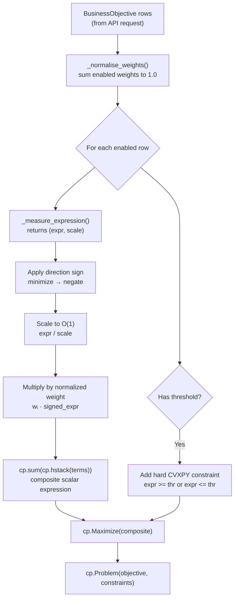

# Multi-Objective Optimization

The portfolio optimizer supports a **multi-objective matrix** that lets users simultaneously optimize for several business goals — return, volatility, Sharpe ratio, diversification, and sector concentration — within a single convex CVXPY problem. This page covers the `BusinessObjective` schema, the scalarized weighted-sum objective construction, the `_measure_expression()` function for each supported measure, deferred (non-convex) measures, and weight auto-normalization.

Source files:
- `backend/app/schemas/requests.py` — `BusinessObjective`, `FrontierConfig`
- `backend/app/classical/optimizer.py` — `_measure_expression()`, `_build_scalar_objective()`, `_normalise_weights()`

---

## `BusinessObjective` Schema

Each row in the multi-objective matrix is a `BusinessObjective` Pydantic model:

```python
class BusinessObjective(BaseModel):
    name: ObjectiveName          # Canonical measure name
    direction: ObjectiveDirection  # "maximize" or "minimize"
    weight: float                # Relative importance (0.0–1.0)
    target: float | None = None  # Soft anchor for LLM commentary
    threshold: float | None = None  # Hard floor/ceiling constraint
    enabled: bool = True         # When False, row is ignored by optimizer
```

### Field Reference

| Field | Type | Constraints | Description |
|-------|------|-------------|-------------|
| `name` | `ObjectiveName` | One of 7 literals | Canonical measure name (see table below) |
| `direction` | `"maximize" \| "minimize"` | Required | Optimization direction |
| `weight` | `float` | `0.0 ≤ w ≤ 1.0` | Relative importance in the scalarized composite |
| `target` | `float \| None` | Optional | Desired value — used as a soft anchor in LLM commentary only |
| `threshold` | `float \| None` | Optional | Hard limit enforced as a CVXPY constraint |
| `enabled` | `bool` | Default `True` | When `False`, row is ignored but retained in payload |

### Supported Measure Names (`ObjectiveName`)

```python
ObjectiveName = Literal[
    "return",
    "volatility",
    "sharpe",
    "max_drawdown",
    "diversification_hhi",
    "esg_score",
    "sector_concentration",
]
```

### Threshold Semantics

The `threshold` field creates a **hard CVXPY constraint** based on the objective direction:

| Direction | Threshold Constraint | Example |
|-----------|---------------------|---------|
| `"maximize"` | `expression >= threshold` | Return ≥ 8% |
| `"minimize"` | `expression <= threshold` | Volatility ≤ 25% |

The `target` field, by contrast, is only a soft anchor used in LLM-generated commentary — it does not affect the CVXPY solve.

### Example: Three-Row Objective Matrix

```json
{
  "objectives": [
    {
      "name": "return",
      "direction": "maximize",
      "weight": 0.5,
      "target": 0.12,
      "threshold": 0.08,
      "enabled": true
    },
    {
      "name": "volatility",
      "direction": "minimize",
      "weight": 0.3,
      "target": 0.18,
      "threshold": 0.25,
      "enabled": true
    },
    {
      "name": "diversification_hhi",
      "direction": "minimize",
      "weight": 0.2,
      "target": null,
      "threshold": null,
      "enabled": true
    }
  ]
}
```

---

## Weight Auto-Normalization

Before building the CVXPY objective, the optimizer normalizes the enabled rows' weights to sum to 1.0 via `_normalise_weights()`:

```python
def _normalise_weights(objectives: list[dict[str, Any]]) -> dict[str, float]:
    """Return a {name: weight} map for enabled rows, normalised to sum to 1."""
    enabled = [o for o in objectives if o.get("enabled", True)]
    if not enabled:
        return {}
    total = sum(float(o.get("weight", 0.0)) for o in enabled)
    if total <= 0:
        n = len(enabled)
        return {str(o["name"]): 1.0 / n for o in enabled}
    return {
        str(o["name"]): float(o.get("weight", 0.0)) / total
        for o in enabled
    }
```

**Normalization rules:**
- Only `enabled=True` rows are included
- Weights are divided by their sum so they sum to exactly 1.0
- If all enabled weights are 0 (rejected by Pydantic upstream), an equal split is used as a defensive fallback
- The constraint validator in `backend/app/classical/constraints.py` emits a warning when the raw weights don't sum to 1.0 (but still proceeds)

---

## Scalarized Weighted-Sum Objective Construction

The multi-objective problem is converted to a single-objective convex problem via **weighted scalarization**. The `_build_scalar_objective()` function assembles the composite objective:

```
maximize   Σᵢ wᵢ · sign(directionᵢ) · expressionᵢ(w) / scaleᵢ
```

Where:
- `wᵢ` — normalized weight for objective row `i`
- `sign(directionᵢ)` — `+1` for `"maximize"`, `-1` for `"minimize"`
- `expressionᵢ(w)` — CVXPY expression for the measure (see below)
- `scaleᵢ` — data-derived scale factor to bring measures to O(1) magnitude

```python
def _build_scalar_objective(
    objectives: list[dict[str, Any]],
    w: cp.Variable,
    expected_returns: np.ndarray,
    covariance_matrix: np.ndarray,
    sector_indices_by_name: dict[str, list[int]],
) -> tuple[cp.Expression, list[cp.Constraint], list[str]]:
    """Return (objective_expression, threshold_constraints, deferred_warnings)."""
    norm_weights = _normalise_weights(objectives)
    # ...
    for row in objectives:
        expr, scale = _measure_expression(name, w, ...)
        signed = expr / scale if scale > 0 else expr
        if direction == "minimize":
            signed = -signed
        objective_terms.append(weight * signed)
        # Hard threshold → CVXPY constraint
        if threshold is not None:
            if direction == "maximize":
                threshold_constraints.append(expr >= float(threshold))
            else:
                threshold_constraints.append(expr <= float(threshold))
    return cp.sum(cp.hstack(objective_terms)), threshold_constraints, deferred_warnings
```

### Objective Matrix → CVXPY Objective Flow



---

## `_measure_expression()` for Each Supported Measure

The `_measure_expression()` function returns a `(cvxpy_expression, typical_scale)` tuple for each convex measure. The scale is derived from the input data so that measures remain comparable across different asset universes.

```python
def _measure_expression(
    name: str,
    w: cp.Variable,
    expected_returns: np.ndarray,
    covariance_matrix: np.ndarray,
    sector_indices_by_name: dict[str, list[int]],
) -> tuple[cp.Expression, float]:
```

### `return` — Expected Portfolio Return

```python
if name == "return":
    scale = max(float(np.max(np.abs(expected_returns))), 1e-6)
    return expected_returns @ w, scale
```

- **Expression**: `μᵀw` — linear in `w`
- **Scale**: maximum absolute return in the universe (typically O(0.1))
- **Convexity**: Linear (both convex and concave)

### `volatility` — Portfolio Standard Deviation

```python
if name == "volatility":
    diag = np.diag(covariance_matrix)
    scale = float(np.sqrt(max(np.max(diag), 1e-12)))
    reg = covariance_matrix + 1e-10 * np.eye(covariance_matrix.shape[0])
    sqrt_cov = np.linalg.cholesky(reg)  # or eigen-sqrt fallback
    return cp.norm(sqrt_cov @ w, 2), scale
```

- **Expression**: `‖L w‖₂` where `L` is the Cholesky factor of `Σ` — equivalent to `√(wᵀΣw)`
- **Scale**: maximum individual asset volatility (square root of max diagonal element)
- **Convexity**: Convex (norm of a linear function)

### `sharpe` — Sharpe Ratio Proxy

```python
if name == "sharpe":
    scale = max(float(np.max(np.abs(expected_returns))), 1e-6)
    variance = cp.quad_form(w, cp.psd_wrap(covariance_matrix))
    lam = float(scale / max(np.trace(covariance_matrix) / len(expected_returns), 1e-9))
    return expected_returns @ w - lam * variance, scale
```

- **Expression**: `μᵀw − λ · wᵀΣw` — a convex proxy for the true Sharpe ratio
- **Scale**: maximum absolute return
- **λ derivation**: `λ = max(μ) / mean_variance` — ensures the two terms are O(1) relative to each other
- **Convexity**: Concave (linear minus convex quadratic) — valid for maximization

> **Note**: The true Sharpe ratio `(μᵀw − r_f) / √(wᵀΣw)` is non-convex. The proxy `μᵀw − λ·wᵀΣw` is a standard convex approximation that preserves the return-vs-risk trade-off.

### `diversification_hhi` — Herfindahl-Hirschman Index

```python
if name == "diversification_hhi":
    return cp.sum_squares(w), 1.0
```

- **Expression**: `Σᵢ wᵢ²` — the HHI concentration index
- **Scale**: 1.0 (already O(1) since weights sum to 1)
- **Convexity**: Convex (sum of squares)
- **Direction**: Always `"minimize"` to maximize diversification
- **Range**: `[1/n, 1]` — minimum at equal weights, maximum at full concentration

### `sector_concentration` — Sector-Level HHI

```python
if name == "sector_concentration":
    if not sector_indices_by_name:
        return cp.sum_squares(w), 1.0  # behaves like HHI when no map
    return cp.sum(
        cp.hstack([
            cp.sum(w[idxs]) ** 2
            for idxs in sector_indices_by_name.values()
            if idxs
        ])
    ), 1.0
```

- **Expression**: `Σₛ (Σᵢ∈ₛ wᵢ)²` — sum of squared sector weights
- **Scale**: 1.0
- **Convexity**: Convex (sum of squares of linear functions)
- **Direction**: Always `"minimize"` to reduce sector concentration
- **Fallback**: When no sector map is provided, degenerates to the asset-level HHI

---

## Non-Convex / Deferred Measures

Two measures are accepted in the request payload but **not applied inside the CVXPY solve**:

### `max_drawdown`

Maximum drawdown requires out-of-sample simulation over a historical price path. It is a path-dependent, non-convex function of the weight vector and cannot be expressed as a CVXPY constraint or objective.

### `esg_score`

ESG (Environmental, Social, Governance) scores are external data-dependent values that require integration with a third-party ESG data provider. They are not available as a function of the weight vector alone.

### Deferred Measure Handling

```python
_DEFERRED_MEASURES: frozenset[str] = frozenset({
    "max_drawdown",
    "esg_score",
})

if name in _DEFERRED_MEASURES:
    deferred_warnings.append(
        f"Objective '{name}' is accepted but not yet applied inside "
        "the convex solver. It is only surfaced in commentary."
    )
    continue
```

When deferred measures are present in the request:
1. A warning is recorded in `deferred_warnings`
2. The measure is **skipped** in the CVXPY objective construction
3. The warning is logged at INFO level after the solve
4. The measure name is still passed through to the LLM explanation pipeline for commentary

> **Roadmap**: `max_drawdown` and `esg_score` are scheduled for a future iteration that will add out-of-sample simulation and ESG data integration respectively.

---

## Convex vs. Deferred Measures Summary

| Measure | Convex? | CVXPY Expression | Direction |
|---------|---------|-----------------|-----------|
| `return` | ✅ Yes | `μᵀw` (linear) | maximize |
| `volatility` | ✅ Yes | `‖Lw‖₂` (SOCP) | minimize |
| `sharpe` | ✅ Proxy | `μᵀw − λ·wᵀΣw` (concave) | maximize |
| `diversification_hhi` | ✅ Yes | `Σwᵢ²` (convex) | minimize |
| `sector_concentration` | ✅ Yes | `Σₛ(Σᵢ∈ₛwᵢ)²` (convex) | minimize |
| `max_drawdown` | ❌ No | — (deferred) | minimize |
| `esg_score` | ❌ No | — (deferred) | maximize |

---

## Back-Compatibility: Legacy Scalar Fields

When the `objectives` list is empty or absent, the optimizer falls back to the original Markowitz objective:

```python
# Legacy Markowitz objective (unchanged behaviour)
objective = cp.Maximize(portfolio_return - portfolio_variance)
```

The `OptimizationRequest` schema also auto-normalizes legacy `min_return` / `max_volatility` fields into a two-row objectives matrix:

```python
# Auto-generated from legacy fields
legacy: list[BusinessObjective] = [
    BusinessObjective(
        name="return",
        direction="maximize",
        weight=0.5,
        target=self.min_return,
        threshold=self.min_return,
        enabled=True,
    ),
    BusinessObjective(
        name="volatility",
        direction="minimize",
        weight=0.5,
        target=self.max_volatility,
        threshold=self.max_volatility,
        enabled=True,
    ),
]
```

---

## See Also

- [Markowitz MVO](markowitz-mvo.md) — core optimization formulation and CVXPY setup
- [Constraints](constraints.md) — all constraint types including per-objective thresholds
- [Efficient Frontier](efficient-frontier.md) — Pareto frontier sweep using the same measure expressions
