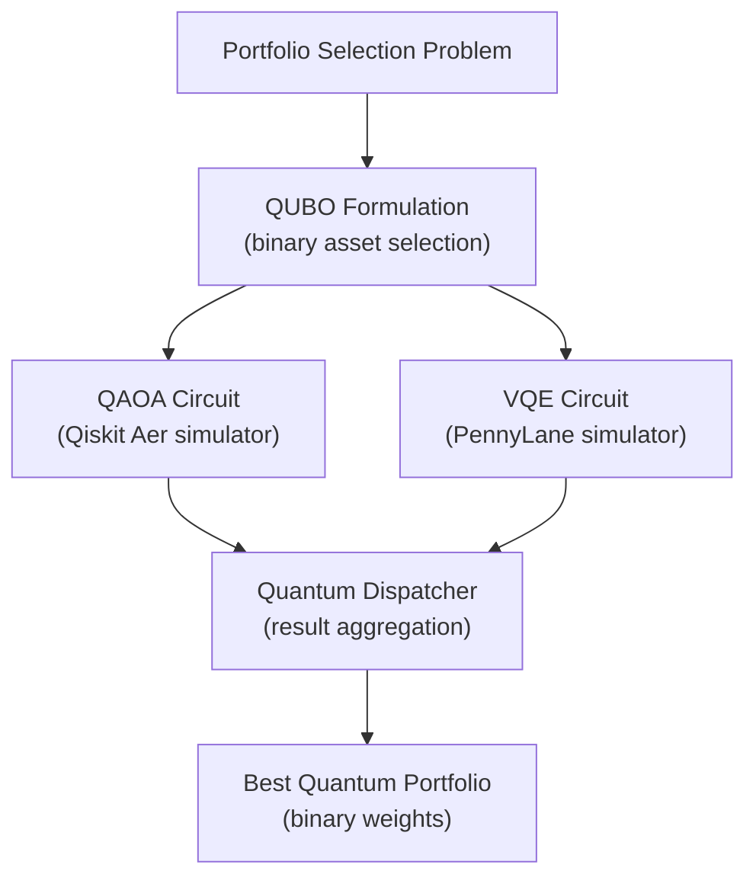

# Quantum Optimization

Documentation for the quantum optimization engines — QUBO formulation, QAOA (Qiskit), VQE (PennyLane), the quantum dispatcher, and performance metrics comparing quantum vs. classical results.

## Section Contents

| Page | Description |
|------|-------------|
| [QUBO Formulation](../07-quantum-optimization/qubo-formulation.md) | Encoding portfolio selection as a Quadratic Unconstrained Binary Optimization problem |
| [QAOA Solver](../07-quantum-optimization/qaoa-solver.md) | Quantum Approximate Optimization Algorithm via Qiskit |
| [VQE Solver](../07-quantum-optimization/vqe-solver.md) | Variational Quantum Eigensolver via PennyLane |
| [Quantum Dispatcher](../07-quantum-optimization/quantum-dispatcher.md) | Solver selection, asset limit enforcement, and result aggregation |
| [Quantum vs Classical](../07-quantum-optimization/quantum-vs-classical.md) | Side-by-side performance comparison and trade-off analysis |

## What Is Quantum Optimization?

The quantum optimization engine formulates portfolio selection as a **QUBO (Quadratic Unconstrained Binary Optimization)** problem and solves it using two complementary quantum algorithms:

## Practical Limits

Quantum optimization is subject to practical constraints in the current implementation:

| Constraint | Value | Reason |
|------------|-------|--------|
| Maximum assets | 8 (`MAX_QUANTUM_ASSETS`) | Circuit depth grows exponentially |
| Execution queue | `quantum` Celery queue | Isolates slow quantum jobs |
| Simulator backend | Qiskit Aer / PennyLane default | No real quantum hardware required |
| QAOA layers (p) | 1–3 | Configurable via `QAOA_LAYERS` |

> **Note:** When `run_quantum=False` or the portfolio has more than `MAX_QUANTUM_ASSETS` assets, the quantum dispatch node is skipped and the pipeline continues with classical results only.

## Cross-References

- **Agent node that invokes quantum** → [Node: Quantum Dispatch](../05-agent-layer/node-quantum-dispatch.md)
- **Classical alternative** → [Markowitz MVO](../06-classical-optimization/markowitz-mvo.md)
- **Comparison logic** → [Node: Comparison](../05-agent-layer/node-comparison.md)
- **Queue routing** → [Queue Routing](../10-task-queue/queue-routing.md)
