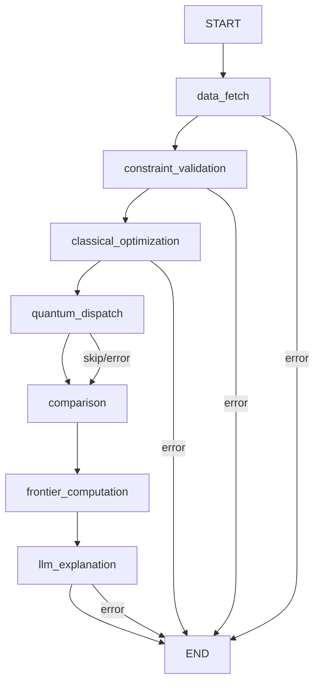

# Agent Layer

Documentation for the LangGraph-powered agent graph — node definitions, state management, the LLM explanation node (GPT-4o), comparison logic, and prompt engineering.

## Section Contents

| Page | Description |
|------|-------------|
| [Graph Definition](../05-agent-layer/graph-definition.md) | StateGraph construction, node registration, and edge wiring |
| [Agent State](../05-agent-layer/agent-state.md) | TypedDict state schema, field lifecycle, and state transitions |
| [Node: Data Fetch](../05-agent-layer/node-data-fetch.md) | yfinance price fetching with Redis cache integration |
| [Node: Constraint Validation](../05-agent-layer/node-constraint-validation.md) | Input normalization, validation, and constraint canonicalization |
| [Node: Classical Optimization](../05-agent-layer/node-classical.md) | CVXPY MVO invocation and result extraction |
| [Node: Quantum Dispatch](../05-agent-layer/node-quantum-dispatch.md) | Conditional QAOA + VQE execution with asset limit guard |
| [Node: Comparison](../05-agent-layer/node-comparison.md) | Side-by-side solver metrics and best-result selection |
| [Node: Frontier](../05-agent-layer/node-frontier.md) | Efficient frontier computation via epsilon-constraint sweep |
| [Node: LLM Explanation](../05-agent-layer/node-llm-explanation.md) | GPT-4o explanation generation with template fallback |
| [Error Routing](../05-agent-layer/error-routing.md) | Conditional edges, fatal vs. non-fatal errors, and recovery paths |

## Agent Graph Structure

The agent pipeline is a **LangGraph StateGraph** with 7 nodes and conditional routing:

## State Flow

Each node receives the full `AgentState` TypedDict and returns a partial update. The state accumulates results as it flows through the graph:

| After Node | State Contains |
|------------|---------------|
| `data_fetch` | `prices`, `returns`, `covariance_matrix`, `sector_map` |
| `constraint_validation` | `validated_constraints`, `tickers` (normalized) |
| `classical_optimization` | `classical_result` (weights, Sharpe, volatility, return) |
| `quantum_dispatch` | `quantum_result` (QAOA + VQE results, or `None`) |
| `comparison` | `comparison_table`, `best_solver` |
| `frontier_computation` | `frontier_points` |
| `llm_explanation` | `explanation` (natural-language text) |

## Cross-References

- **Classical engine** → [Markowitz MVO](../06-classical-optimization/markowitz-mvo.md)
- **Quantum engine** → [Quantum Dispatcher](../07-quantum-optimization/quantum-dispatcher.md)
- **Task queue integration** → [Optimization Task](../10-task-queue/optimization-task.md)
- **Progress events** → [Progress Events](../10-task-queue/progress-events.md)
