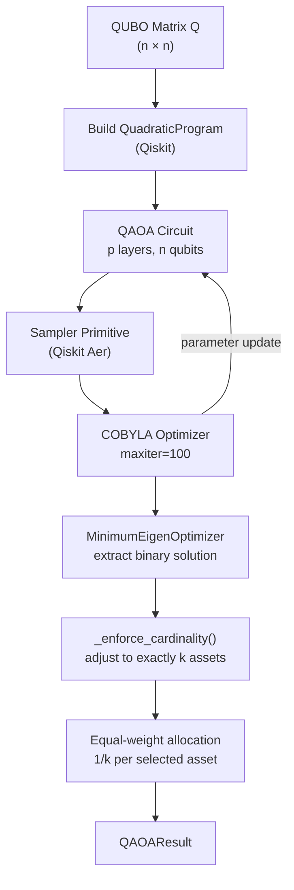

# QAOA Solver

The Quantum Approximate Optimization Algorithm (QAOA) solver uses Qiskit's statevector simulator to solve the asset selection QUBO. This page covers the `run_qaoa()` function, the Qiskit circuit construction, the COBYLA classical optimizer, cardinality enforcement, and the greedy fallback strategy.

## Overview

QAOA is a hybrid quantum-classical algorithm that alternates between a **cost unitary** (encoding the QUBO objective) and a **mixer unitary** (exploring the solution space). The classical optimizer tunes the circuit parameters to minimise the expected energy.



## `run_qaoa()` Function

**Source:** `backend/app/quantum/qaoa_solver.py`

```python
from app.quantum.qaoa_solver import run_qaoa

result = run_qaoa(
    tickers=["AAPL", "MSFT", "GOOGL", "AMZN"],
    qubo_matrix=Q,
    expected_returns=mu,
    covariance_matrix=sigma,
    budget=100_000.0,
    num_assets_to_select=2,
    p=2,  # QAOA circuit depth (number of layers)
)

print(result.selected_assets)       # ["AAPL", "AMZN"]
print(result.metrics.sharpe_ratio)  # 1.23
print(result.circuit_depth)         # 16  (= 2 * p * n)
print(result.num_qubits)            # 4
print(result.solve_time_ms)         # 1842.5
```

### Parameters

| Parameter | Type | Default | Description |
|-----------|------|---------|-------------|
| `tickers` | `list[str]` | required | Asset ticker symbols, length `n` |
| `qubo_matrix` | `np.ndarray` | required | QUBO matrix `Q`, shape `(n, n)` |
| `expected_returns` | `np.ndarray` | required | Annualised expected returns, shape `(n,)` |
| `covariance_matrix` | `np.ndarray` | required | Annualised covariance matrix, shape `(n, n)` |
| `budget` | `float` | required | Total investment budget in USD |
| `num_assets_to_select` | `int` | required | Target number of assets `k` to select |
| `p` | `int` | `2` | QAOA circuit depth (number of QAOA layers) |

### Returns: `QAOAResult`

```python
class QAOAResult(BaseModel):
    selected_assets: list[str]    # Tickers of selected assets
    weights: list[AssetWeight]    # Equal-weight allocations
    metrics: PortfolioMetrics     # Return, volatility, Sharpe
    circuit_depth: int            # Estimated circuit depth = 2 * p * n
    num_qubits: int               # Number of qubits = n
    solve_time_ms: float          # Wall-clock solve time in milliseconds
```

### Raises

- `QuantumTimeoutError` — if the solver exceeds `QUANTUM_TIMEOUT_SECONDS` (default: 60s)

## Step-by-Step Algorithm

### Step 1: Build `QuadraticProgram`

The QUBO matrix is converted to Qiskit's `QuadraticProgram` format. Binary variables `x0, x1, ..., x(n-1)` are declared, and the QUBO objective is split into linear (diagonal) and quadratic (off-diagonal) terms:

```python
from qiskit_optimization import QuadraticProgram

qp = QuadraticProgram(name="portfolio_selection")
for i in range(n):
    qp.binary_var(name=f"x{i}")

# Linear terms from diagonal of Q
linear = {f"x{i}": float(qubo_matrix[i, i]) for i in range(n)}

# Quadratic terms from upper triangle of Q
quadratic = {}
for i in range(n):
    for j in range(i + 1, n):
        val = float(qubo_matrix[i, j])
        if abs(val) > 1e-10:
            quadratic[(f"x{i}", f"x{j}")] = val

qp.minimize(linear=linear, quadratic=quadratic)
```

### Step 2: Instantiate QAOA with Sampler

The QAOA circuit uses Qiskit's `Sampler` primitive (statevector-based) and the COBYLA classical optimizer:

```python
from qiskit.primitives import Sampler
from qiskit_algorithms import QAOA
from qiskit_algorithms.optimizers import COBYLA
from qiskit_optimization.algorithms import MinimumEigenOptimizer

sampler = Sampler()
optimizer = COBYLA(maxiter=100)
qaoa = QAOA(sampler=sampler, optimizer=optimizer, reps=p)
algorithm = MinimumEigenOptimizer(qaoa)
```

**Why COBYLA?** COBYLA (Constrained Optimization BY Linear Approximations) is a gradient-free optimizer that works well for noisy quantum circuits. It does not require gradient computation, making it robust to the stochastic nature of quantum measurements.

### Step 3: Solve and Extract Binary Solution

```python
result = algorithm.solve(qp)
x_opt = np.array(result.x, dtype=float)
```

The `MinimumEigenOptimizer` wraps QAOA and handles the conversion from the quantum eigenvalue problem back to the binary decision variables.

### Step 4: Timeout Check

The solver checks elapsed time both **before** and **after** the QAOA solve:

```python
# Before solve
elapsed = time.perf_counter() - start_time
if elapsed > settings.QUANTUM_TIMEOUT_SECONDS:
    raise QuantumTimeoutError(...)

# After solve
if solve_time_ms / 1000 > settings.QUANTUM_TIMEOUT_SECONDS:
    raise QuantumTimeoutError(...)
```

The `QUANTUM_TIMEOUT_SECONDS` setting (default: 60, range: 10–600) is configured via the `QUANTUM_TIMEOUT_SECONDS` environment variable.

### Step 5: Cardinality Enforcement

The QAOA solution may select more or fewer than `k` assets due to approximation errors. The `_enforce_cardinality()` function adjusts the solution:

```python
x_binary = _enforce_cardinality(x_opt, num_assets_to_select, expected_returns)
```

**When too many assets are selected:** Remove the lowest-return selected assets until exactly `k` remain.

**When too few assets are selected:** Add the highest-return unselected assets until exactly `k` are selected.

This ensures the cardinality constraint is always satisfied in the final output, regardless of QAOA approximation quality.

### Step 6: Equal-Weight Portfolio Metrics

The returned portfolio uses **equal weighting** among selected assets:

```python
weight_per_asset = 1.0 / len(selected_indices)
for i in selected_indices:
    weights_arr[i] = weight_per_asset
```

> **Design note:** Equal weighting is intentional. The QUBO formulation solves the binary asset *selection* problem. Continuous weight optimisation (finding the exact Markowitz-optimal weights) is handled by the classical engine. The quantum result provides a candidate asset set; the classical engine refines the weights.

Portfolio metrics are computed from the equal-weight allocation:

```python
port_return = float(expected_returns @ weights_arr)
port_variance = float(weights_arr @ covariance_matrix @ weights_arr)
port_vol = float(np.sqrt(max(port_variance, 0.0)))
sharpe = (port_return - risk_free_rate) / port_vol
```

## Circuit Depth

The estimated circuit depth is computed as:

```
circuit_depth = 2 * p * n
```

where `p` is the number of QAOA layers and `n` is the number of qubits (assets).

This is a rough approximation. Each QAOA layer consists of:
- A **cost unitary** with O(n²) two-qubit gates (one for each QUBO term)
- A **mixer unitary** with O(n) single-qubit Rx gates

| `p` | `n` | Estimated depth | Notes |
|-----|-----|----------------|-------|
| 1 | 4 | 8 | Minimal circuit, fast but lower quality |
| 2 | 4 | 16 | Default, good balance |
| 3 | 4 | 24 | Better quality, slower |
| 2 | 8 | 32 | Maximum supported assets |

Higher `p` generally improves solution quality (closer to the true optimum) at the cost of longer circuit execution time and more classical optimizer iterations.

## Greedy Fallback

If Qiskit or `qiskit-optimization` is not installed, or if any unexpected exception occurs during the QAOA solve, the solver falls back to a deterministic greedy strategy:

```python
def _greedy_selection(expected_returns: np.ndarray, k: int) -> np.ndarray:
    """Select top-k assets by expected return."""
    n = len(expected_returns)
    k = min(k, n)
    x = np.zeros(n)
    top_k = np.argsort(expected_returns)[-k:]
    x[top_k] = 1.0
    return x
```

The greedy fallback:
- Always selects exactly `k` assets
- Picks the `k` assets with the highest expected returns
- Is deterministic and fast (O(n log n))
- Satisfies the cardinality constraint by construction

The fallback is logged at `WARNING` level with the exception details:

```
qaoa_qiskit_failed_using_greedy_fallback  error="..." error_type="ImportError"
```

## Logging

The QAOA solver emits structured log events at key stages:

| Event | Level | Fields |
|-------|-------|--------|
| `qaoa_started` | INFO | `num_qubits`, `p`, `num_assets_to_select` |
| `qaoa_raw_solution` | DEBUG | `x` (binary vector), `fval` (objective value) |
| `qaoa_qiskit_failed_using_greedy_fallback` | WARNING | `error`, `error_type` |
| `qaoa_complete` | INFO | `selected_tickers`, `sharpe`, `expected_return`, `volatility`, `solve_time_ms`, `circuit_depth` |

## Configuration

| Setting | Env Var | Default | Description |
|---------|---------|---------|-------------|
| `QUANTUM_TIMEOUT_SECONDS` | `QUANTUM_TIMEOUT_SECONDS` | `60` | Max seconds for quantum solve |
| `MAX_QUANTUM_ASSETS` | `MAX_QUANTUM_ASSETS` | `8` | Max assets for quantum optimization |
| `RISK_FREE_RATE` | `RISK_FREE_RATE` | `0.02` | Annual risk-free rate for Sharpe |

## Related Pages

- [QUBO Formulation](qubo-formulation.md) — how the QUBO matrix is built
- [VQE Solver](vqe-solver.md) — alternative quantum solver using PennyLane
- [Quantum Dispatcher](quantum-dispatcher.md) — orchestrates QAOA + VQE
- [Quantum vs Classical](quantum-vs-classical.md) — when to use quantum optimization
