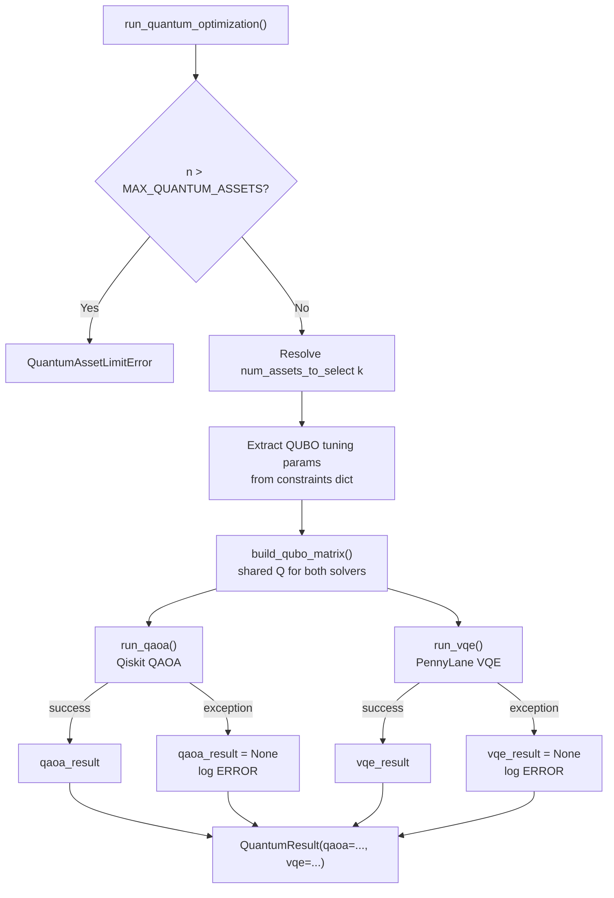

# Quantum Dispatcher

The quantum dispatcher (`backend/app/quantum/dispatcher.py`) is the single entry point for all quantum optimization. It validates inputs, builds the shared QUBO matrix, dispatches to both QAOA and VQE solvers in sequence, and assembles the combined `QuantumResult`. This page covers the orchestration logic, error handling, configuration limits, and the `select_best_quantum_result()` utility.

## Responsibilities



## `run_quantum_optimization()`

**Source:** `backend/app/quantum/dispatcher.py`

```python
from app.quantum.dispatcher import run_quantum_optimization

result = run_quantum_optimization(
    tickers=["AAPL", "MSFT", "GOOGL", "AMZN"],
    expected_returns=mu,
    covariance_matrix=sigma,
    budget=100_000.0,
    constraints={
        "num_assets_to_select": 2,
        "lambda_return": 1.0,
        "lambda_risk": 1.0,
        "lambda_cardinality": 5.0,
        "qaoa_p": 2,
        "vqe_layers": 2,
        "vqe_max_iter": 100,
    },
)

if result.qaoa:
    print("QAOA Sharpe:", result.qaoa.metrics.sharpe_ratio)
if result.vqe:
    print("VQE Sharpe:", result.vqe.metrics.sharpe_ratio)
```

### Parameters

| Parameter | Type | Description |
|-----------|------|-------------|
| `tickers` | `list[str]` | Asset ticker symbols, length `n`. Must satisfy `n ≤ MAX_QUANTUM_ASSETS`. |
| `expected_returns` | `np.ndarray` | Annualised expected returns, shape `(n,)` |
| `covariance_matrix` | `np.ndarray` | Annualised covariance matrix, shape `(n, n)` |
| `budget` | `float` | Total investment budget in USD |
| `constraints` | `dict[str, Any]` | Validated constraint dict from the agent pipeline |

### Constraints Dict Keys

| Key | Type | Default | Description |
|-----|------|---------|-------------|
| `num_assets_to_select` | `int` | `max(2, int(n * 0.5))` | Target number of assets `k` |
| `lambda_return` | `float` | `1.0` | QUBO return maximisation weight |
| `lambda_risk` | `float` | `1.0` | QUBO risk minimisation weight |
| `lambda_cardinality` | `float` | `5.0` | QUBO cardinality penalty weight |
| `qaoa_p` | `int` | `2` | QAOA circuit depth (number of layers) |
| `vqe_layers` | `int` | `2` | VQE ansatz layers |
| `vqe_max_iter` | `int` | `100` | VQE maximum gradient descent iterations |

### Returns: `QuantumResult`

```python
class QuantumResult(BaseModel):
    qaoa: QAOAResult | None = None  # None if QAOA failed
    vqe: VQEResult | None = None    # None if VQE failed
```

Either or both fields may be `None` if the corresponding solver failed. The dispatcher never raises an exception for individual solver failures — it logs them and continues.

### Raises

- `QuantumAssetLimitError` — if `len(tickers) > MAX_QUANTUM_ASSETS`

## `MAX_QUANTUM_ASSETS` Limit Check

The first thing the dispatcher does is validate the asset count:

```python
if n > settings.MAX_QUANTUM_ASSETS:
    raise QuantumAssetLimitError(
        num_assets=n,
        max_assets=settings.MAX_QUANTUM_ASSETS,
    )
```

`MAX_QUANTUM_ASSETS` defaults to `8` and is configurable via the `MAX_QUANTUM_ASSETS` environment variable (range: 2–20). This limit exists because QAOA and VQE complexity grows **exponentially** with the number of qubits — an 8-qubit circuit already requires 256 statevector amplitudes.

| Assets | Statevector size | Relative cost |
|--------|-----------------|---------------|
| 4 | 16 | 1× |
| 6 | 64 | 4× |
| 8 | 256 | 16× |
| 10 | 1,024 | 64× |
| 12 | 4,096 | 256× |

## `QuantumAssetLimitError`

```python
class QuantumAssetLimitError(OptimizationError):
    """Raised when the number of assets exceeds MAX_QUANTUM_ASSETS."""

    def __init__(self, num_assets: int, max_assets: int, ...):
        super().__init__(
            message=(
                f"Quantum optimization supports at most {max_assets} assets, "
                f"but {num_assets} were provided. "
                "Reduce the asset list or use classical optimization."
            ),
            error_code="QUANTUM_ASSET_LIMIT_EXCEEDED",
            details={
                "num_assets": num_assets,
                "max_assets": max_assets,
            },
        )
```

The agent pipeline catches this error and skips quantum optimization, falling back to classical-only results.

## `QuantumTimeoutError`

```python
class QuantumTimeoutError(OptimizationError):
    """Raised when a quantum optimization job exceeds the configured timeout."""

    def __init__(self, message: str, timeout_seconds: int = 60, ...):
        super().__init__(
            message=message,
            error_code="QUANTUM_TIMEOUT",
            details={"timeout_seconds": timeout_seconds},
        )
```

`QuantumTimeoutError` is raised by the individual solvers (QAOA and VQE) when `QUANTUM_TIMEOUT_SECONDS` is exceeded. The dispatcher catches it as part of the general `Exception` handler and sets the corresponding result to `None`.

## Shared QUBO Matrix

A key design decision is that the QUBO matrix is built **once** and shared between both solvers:

```python
qubo_matrix = build_qubo_matrix(
    expected_returns=expected_returns,
    covariance_matrix=covariance_matrix,
    num_assets_to_select=num_assets_to_select,
    lambda_return=lambda_return,
    lambda_risk=lambda_risk,
    lambda_cardinality=lambda_cardinality,
)
```

This ensures:
- Both QAOA and VQE are solving the **same** optimisation problem
- The comparison between their results is meaningful
- QUBO construction overhead is paid only once

The dispatcher logs the QUBO matrix statistics at DEBUG level:

```
qubo_built  shape=[4, 4]  min_val=-0.85  max_val=9.2  frobenius_norm=12.4
```

## Both Solvers Always Attempted

Both QAOA and VQE are always attempted, even if one fails:

```python
qaoa_result = None
try:
    qaoa_result = run_qaoa(...)
    logger.info("qaoa_succeeded", ...)
except Exception as exc:
    logger.error("qaoa_failed", error=str(exc), exc_info=True)

vqe_result = None
try:
    vqe_result = run_vqe(...)
    logger.info("vqe_succeeded", ...)
except Exception as exc:
    logger.error("vqe_failed", error=str(exc), exc_info=True)
```

This design maximises the information available to the comparison and explanation nodes. Even if QAOA fails (e.g. due to a Qiskit import error), the VQE result is still returned and vice versa.

## `num_assets_to_select` Resolution

When `num_assets_to_select` is not provided in the constraints dict, the dispatcher defaults to:

```python
num_assets_to_select = max(2, int(n * 0.5))
```

This selects approximately half the asset universe, clamped to a minimum of 2. The value is then clamped to `[1, n]`:

```python
num_assets_to_select = max(1, min(num_assets_to_select, n))
```

| `n` | Default `k` |
|-----|------------|
| 2 | 2 |
| 4 | 2 |
| 6 | 3 |
| 8 | 4 |

## `QuantumResult` Assembly

The final `QuantumResult` is assembled from whatever succeeded:

```python
return QuantumResult(qaoa=qaoa_result, vqe=vqe_result)
```

Possible states:

| `qaoa` | `vqe` | Meaning |
|--------|-------|---------|
| `QAOAResult` | `VQEResult` | Both solvers succeeded |
| `QAOAResult` | `None` | Only QAOA succeeded |
| `None` | `VQEResult` | Only VQE succeeded |
| `None` | `None` | Both solvers failed |

The comparison node handles all four cases gracefully.

## `select_best_quantum_result()`

A utility function that compares QAOA and VQE results by Sharpe ratio:

```python
from app.quantum.dispatcher import select_best_quantum_result

best = select_best_quantum_result(result)
if best:
    name, sharpe = best
    print(f"Best quantum: {name} with Sharpe {sharpe:.4f}")
```

```python
def select_best_quantum_result(
    quantum_result: QuantumResult,
) -> tuple[str, float] | None:
    candidates = []
    if quantum_result.qaoa is not None:
        candidates.append(("QAOA", quantum_result.qaoa.metrics.sharpe_ratio))
    if quantum_result.vqe is not None:
        candidates.append(("VQE", quantum_result.vqe.metrics.sharpe_ratio))
    if not candidates:
        return None
    return max(candidates, key=lambda c: c[1])
```

Returns `None` if both solvers failed. Used by the comparison node to determine which quantum approach to highlight in the recommendation.

## Logging

| Event | Level | Fields |
|-------|-------|--------|
| `quantum_dispatch_started` | INFO | `num_tickers`, `num_assets_to_select`, all lambda values, `qaoa_p`, `vqe_layers`, `vqe_max_iter` |
| `qubo_built` | DEBUG | `shape`, `min_val`, `max_val`, `frobenius_norm` |
| `qaoa_succeeded` | INFO | `sharpe`, `selected`, `solve_time_ms` |
| `qaoa_failed` | ERROR | `error`, `error_type` (with traceback) |
| `vqe_succeeded` | INFO | `sharpe`, `selected`, `solve_time_ms` |
| `vqe_failed` | ERROR | `error`, `error_type` (with traceback) |
| `quantum_dispatch_complete` | INFO | `qaoa_ok`, `vqe_ok` |

## Configuration Reference

| Setting | Env Var | Default | Range | Description |
|---------|---------|---------|-------|-------------|
| `MAX_QUANTUM_ASSETS` | `MAX_QUANTUM_ASSETS` | `8` | 2–20 | Maximum assets for quantum optimization |
| `QUANTUM_TIMEOUT_SECONDS` | `QUANTUM_TIMEOUT_SECONDS` | `60` | 10–600 | Max seconds per quantum solve |
| `RISK_FREE_RATE` | `RISK_FREE_RATE` | `0.02` | 0.0–0.2 | Annual risk-free rate for Sharpe |

## Integration with the Agent Pipeline

The dispatcher is called from the quantum optimization node in the LangGraph agent pipeline. The agent node:

1. Checks whether quantum optimization is enabled for the request
2. Truncates the ticker list to `MAX_QUANTUM_ASSETS` if needed (or raises `QuantumAssetLimitError`)
3. Calls `run_quantum_optimization()` with the validated constraints
4. Stores the `QuantumResult` in the agent state for the comparison and explanation nodes

See [Agent Pipeline](../02-architecture/agent-pipeline.md) for the full pipeline flow.

## Related Pages

- [QUBO Formulation](qubo-formulation.md) — how the QUBO matrix is built
- [QAOA Solver](qaoa-solver.md) — Qiskit QAOA implementation
- [VQE Solver](vqe-solver.md) — PennyLane VQE implementation
- [Quantum vs Classical](quantum-vs-classical.md) — when to use quantum optimization
