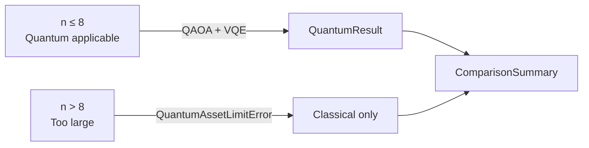
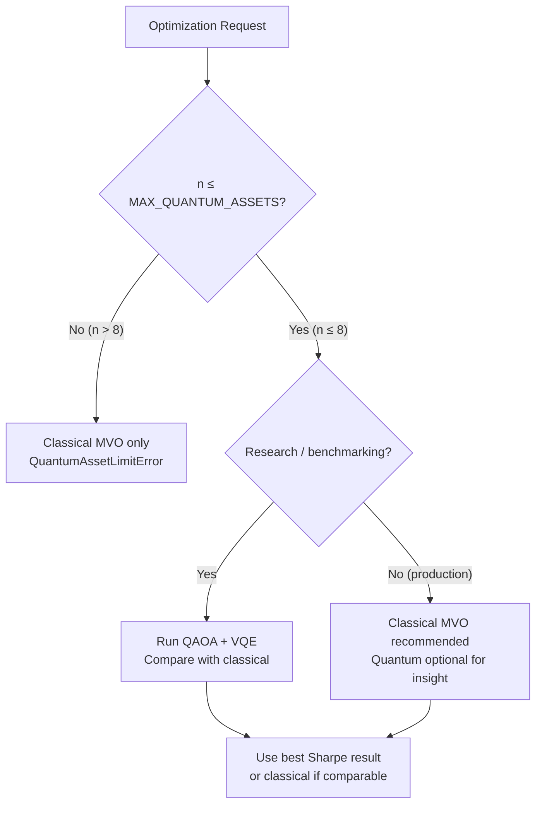

# Quantum vs Classical Optimization

This page explains when quantum optimization is applicable, its current limitations, how Sharpe ratios are compared between quantum and classical approaches, expected performance characteristics, and the future roadmap.

## When Quantum Optimization Is Applicable

Quantum optimization in this system solves the **binary asset selection** problem: given `n` candidate assets, which `k` should be included in the portfolio? This is a combinatorial problem that maps naturally to QUBO and quantum algorithms.

### Applicability Criteria

| Criterion | Requirement | Reason |
|-----------|-------------|--------|
| Asset count | ≤ 8 (default `MAX_QUANTUM_ASSETS`) | Exponential qubit scaling |
| Problem type | Binary selection (which assets to include) | QUBO formulation |
| Constraint type | Cardinality constraint (select exactly k) | Encoded as penalty term |
| Environment | Simulator only (no real hardware) | Current implementation |

### Small Portfolios (≤ 8 Assets)

Quantum optimization is most relevant for **small, focused portfolios** where the combinatorial selection problem is non-trivial but the asset universe is small enough for the simulator to handle efficiently.

**Good use cases:**
- Selecting 3–4 assets from a universe of 6–8 candidates
- Portfolios with strong cardinality constraints (e.g. "pick exactly 3 sector leaders")
- Research and benchmarking of quantum vs. classical approaches

**Poor use cases:**
- Large universes (> 8 assets) — use classical optimization instead
- Portfolios where all assets should be included (k = n) — no combinatorial problem
- Time-sensitive production workloads — quantum simulation is slower than classical

### The `MAX_QUANTUM_ASSETS` Guard

The dispatcher enforces a hard limit via `MAX_QUANTUM_ASSETS` (default: 8):

```python
if n > settings.MAX_QUANTUM_ASSETS:
    raise QuantumAssetLimitError(
        num_assets=n,
        max_assets=settings.MAX_QUANTUM_ASSETS,
    )
```

This limit exists because the statevector simulator requires `2^n` complex amplitudes. For `n=8`, this is 256 amplitudes — manageable. For `n=20`, it would be over 1 million amplitudes, making simulation impractical.



## Current Limitations

### Simulator Only — No Real Quantum Hardware

The current implementation runs entirely on **classical simulators**:

- **QAOA** uses Qiskit's `Sampler` primitive backed by the Aer statevector simulator
- **VQE** uses PennyLane's `default.qubit` device (pure-state statevector)

Neither solver connects to real quantum hardware (IBM Quantum, IonQ, Rigetti, etc.). This means:

- **No quantum advantage**: Classical simulation of quantum circuits is exponentially expensive. For `n ≤ 8`, the simulator is fast, but there is no speedup over classical algorithms.
- **No noise**: Real quantum hardware has gate errors, decoherence, and measurement noise. The simulator is noiseless, so results are more optimistic than what real hardware would produce.
- **No entanglement benefit**: The potential quantum advantage from entanglement is not realised on a classical simulator.

> **Important**: The quantum optimization in this system is primarily for **research, benchmarking, and educational purposes**. For production portfolio management, the classical Markowitz MVO engine is recommended.

### Equal-Weight Portfolios

Both QAOA and VQE return **equal-weight** portfolios among the selected assets. The QUBO formulation solves the binary *selection* problem — it does not optimise continuous weights. The classical Markowitz engine handles continuous weight optimisation.

This means the quantum Sharpe ratio reflects equal-weight performance, which may be suboptimal compared to the Markowitz-optimal weights for the same asset set.

### Approximation Quality

QAOA and VQE are **approximate** algorithms. They do not guarantee finding the optimal QUBO solution. The approximation quality depends on:

- **Circuit depth** (`p` for QAOA, `num_layers` for VQE): Higher depth generally improves quality
- **Number of optimizer iterations**: More iterations improve convergence
- **Problem structure**: Some QUBO instances are harder than others

The `compute_quantum_solution_quality()` function in `backend/app/engines/quantum/metrics.py` can compute the **approximation ratio** for small problems (n ≤ 12) by comparing the quantum solution to the brute-force optimum:

```python
from app.engines.quantum.metrics import compute_quantum_solution_quality

quality = compute_quantum_solution_quality(Q, x_opt, num_assets_to_select=2)
print(f"Approximation ratio: {quality['approximation_ratio']:.4f}")
# 1.0 = optimal, < 1.0 = suboptimal
```

### Greedy Fallback

When Qiskit or PennyLane is not installed, both solvers fall back to a greedy strategy (top-k by expected return). This is not quantum optimization — it is a deterministic classical heuristic. The fallback is logged at WARNING level.

## Sharpe Comparison Methodology

The system compares quantum and classical results using the **Sharpe ratio** as the primary metric. The comparison is computed in `backend/app/agents/comparison.py`.

### Computation

```python
sharpe_improvement_qaoa = qaoa_sharpe - classical_sharpe
sharpe_improvement_vqe  = vqe_sharpe  - classical_sharpe
```

The classical baseline is the Markowitz MVO portfolio (continuous weights, full universe). The quantum portfolios use equal weights on the selected subset.

### Recommendation Thresholds

| Condition | Recommendation |
|-----------|---------------|
| `best_improvement > 0.05` | Quantum outperforms — quantum portfolio recommended |
| `0.0 < best_improvement ≤ 0.05` | Marginal improvement — both viable, classical more reliable |
| `-0.05 ≤ best_improvement ≤ 0.0` | Comparable results — classical recommended for production |
| `best_improvement < -0.05` | Classical outperforms — classical portfolio recommended |

The threshold of `0.05` Sharpe ratio points is defined as `_SIGNIFICANT_SHARPE_DELTA` in `comparison.py`.

### Example Comparison Output

```json
{
  "sharpe_improvement_qaoa": 0.08,
  "sharpe_improvement_vqe": 0.03,
  "return_diff_qaoa": 0.015,
  "return_diff_vqe": -0.005,
  "volatility_diff_qaoa": -0.02,
  "volatility_diff_vqe": 0.01,
  "recommendation": "Quantum optimization (QAOA) outperforms classical by +0.080 Sharpe ratio points (classical: 0.720, QAOA: 0.800). The quantum portfolio also offers a higher expected return (+1.5% vs classical). The quantum portfolio is recommended for this asset universe."
}
```

### Detailed Comparison Metrics

The `compute_classical_vs_quantum_comparison()` function in `backend/app/engines/quantum/metrics.py` provides richer comparison data:

```python
from app.engines.quantum.metrics import compute_classical_vs_quantum_comparison

comparison = compute_classical_vs_quantum_comparison(
    classical_return=0.12,
    classical_volatility=0.15,
    classical_sharpe=0.67,
    quantum_return=0.14,
    quantum_volatility=0.16,
    quantum_sharpe=0.75,
    algorithm_name="QAOA",
)
# {
#   "algorithm": "QAOA",
#   "sharpe_improvement": 0.08,
#   "sharpe_improvement_pct": 11.94,
#   "return_diff": 0.02,
#   "volatility_diff": 0.01,
#   "quantum_better": True,
#   "recommendation": "QAOA outperforms classical Markowitz by 0.0800 Sharpe ratio points (+11.9%)..."
# }
```

## Expected Performance Characteristics

### Typical Results on Simulator

Based on the simulator implementation, typical behaviour for small portfolios (4–8 assets):

| Scenario | Expected Outcome |
|----------|-----------------|
| QAOA with `p=2`, 4 assets | Often finds near-optimal selection; Sharpe comparable to classical |
| QAOA with `p=1`, 8 assets | May miss optimal selection; greedy fallback may outperform |
| VQE with `num_layers=2`, 4 assets | Converges in ~50–80 iterations; quality similar to QAOA |
| Both solvers with greedy fallback | Deterministic top-k selection; no quantum benefit |

### Solve Time

Approximate wall-clock times on a modern CPU (simulator):

| Assets | QAOA (`p=2`) | VQE (`num_layers=2`, `max_iter=100`) |
|--------|-------------|--------------------------------------|
| 4 | ~0.5–2s | ~2–5s |
| 6 | ~2–8s | ~5–15s |
| 8 | ~10–30s | ~15–45s |

Times vary significantly based on hardware and whether Qiskit/PennyLane are installed. The `QUANTUM_TIMEOUT_SECONDS` setting (default: 60s) prevents runaway solves.

### When Quantum Outperforms Classical

In the current simulator-based implementation, quantum optimization can outperform the classical equal-weight baseline when:

1. The QUBO energy landscape has a clear minimum that QAOA/VQE can find
2. The cardinality constraint is tight (k << n), making the combinatorial problem non-trivial
3. The selected assets happen to have better risk-adjusted returns than the Markowitz-optimal full portfolio

However, quantum optimization **cannot outperform** the Markowitz MVO on a risk-adjusted basis when:
- The classical solver has access to the full asset universe with continuous weights
- The quantum solver is constrained to equal weights

The comparison is most meaningful when both approaches are constrained to the same asset subset.

## Future Roadmap

### Near-Term (Planned)

- **Noise models**: Add Qiskit Aer noise models to simulate realistic quantum hardware behaviour
- **Hardware backends**: Support IBM Quantum and other cloud quantum providers via Qiskit Runtime
- **Warm starting**: Initialise QAOA/VQE parameters from classical solutions to improve convergence
- **Larger asset universes**: Investigate quantum-inspired algorithms (simulated annealing, tensor networks) for n > 8

### Medium-Term (Research)

- **Continuous weight optimisation**: Extend the QUBO formulation to encode continuous weights using binary expansion
- **Multi-objective QUBO**: Encode multiple objectives (return, risk, ESG score) directly in the QUBO
- **Quantum annealing**: Support D-Wave quantum annealers via the `qubo_to_dict()` format already implemented

### Long-Term (Aspirational)

- **Quantum advantage**: As quantum hardware matures (fault-tolerant qubits, lower error rates), the system is designed to switch from simulator to real hardware with minimal code changes
- **Portfolio rebalancing**: Use quantum optimization for incremental rebalancing decisions
- **Real-time optimization**: Leverage quantum speedup for intraday portfolio adjustments

> **Current status**: The quantum optimization module is production-ready as a research and benchmarking tool. It is not recommended as the primary optimization engine for production portfolios due to the simulator-only limitation and equal-weight constraint.

## Decision Guide



## Related Pages

- [QUBO Formulation](qubo-formulation.md) — mathematical foundation
- [QAOA Solver](qaoa-solver.md) — Qiskit QAOA implementation
- [VQE Solver](vqe-solver.md) — PennyLane VQE implementation
- [Quantum Dispatcher](quantum-dispatcher.md) — orchestration and limits
- [Classical Optimization](../05-classical-optimization/README.md) — Markowitz MVO reference
