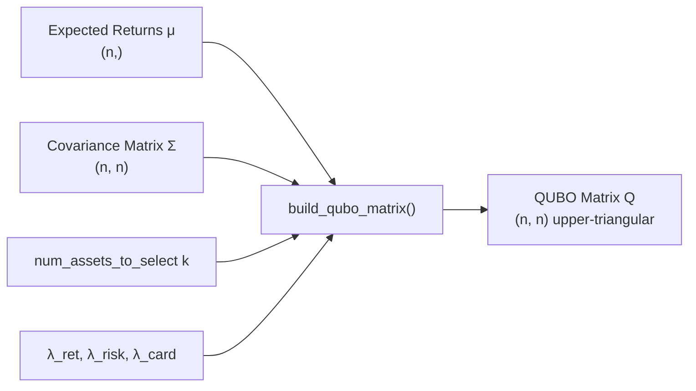

# QUBO Formulation

The Quadratic Unconstrained Binary Optimization (QUBO) formulation is the mathematical foundation that bridges the portfolio selection problem to quantum hardware. This page explains how expected returns and covariance data are encoded into a QUBO matrix, how the cardinality constraint is enforced via a penalty term, and how the matrix is scaled to keep the energy landscape balanced.

## Problem Statement

The portfolio selection problem asks: given `n` candidate assets, which `k` should be selected to maximise risk-adjusted return? This is a combinatorial problem — there are C(n, k) possible portfolios — and it maps naturally to binary optimisation.

Each asset `i` is assigned a binary decision variable:

```
x_i ∈ {0, 1}   (1 = selected, 0 = not selected)
```

The QUBO objective (in **minimisation** form) is:

```
min  -λ_ret · Σ_i μ_i x_i
     + λ_risk · Σ_ij σ_ij x_i x_j
     + λ_card · (Σ_i x_i - k)²
```

| Symbol | Meaning |
|--------|---------|
| `x_i` | Binary selection variable for asset `i` |
| `μ_i` | Annualised expected return of asset `i` |
| `σ_ij` | Covariance between assets `i` and `j` |
| `k` | Target number of assets to select (`num_assets_to_select`) |
| `λ_ret` | Return maximisation weight (`lambda_return`) |
| `λ_risk` | Risk minimisation weight (`lambda_risk`) |
| `λ_card` | Cardinality constraint penalty weight (`lambda_cardinality`) |

The three terms encode:
1. **Return maximisation** — prefer assets with high expected returns (negative sign because we minimise)
2. **Risk minimisation** — penalise correlated asset pairs
3. **Cardinality constraint** — penalise solutions that select more or fewer than `k` assets

## QUBO Matrix Structure

The objective is expressed as the quadratic form `x^T Q x`, where `Q` is an `(n × n)` upper-triangular matrix:

- **Diagonal entries** `Q[i, i]` hold **linear** (single-variable) terms
- **Off-diagonal entries** `Q[i, j]` (where `i < j`) hold **quadratic** (pairwise) terms
- The lower triangle is always zero



## Three-Term Construction

The `build_qubo_matrix()` function in `backend/app/quantum/qubo.py` constructs `Q` by adding three contributions:

### Term 1: Return Maximisation (Diagonal)

Minimising `-λ_ret · μ_i x_i` contributes to the diagonal:

```python
for i in range(n):
    Q[i, i] -= lambda_return * mu_norm[i]
```

Higher `lambda_return` pushes the solver toward high-return assets.

### Term 2: Risk Minimisation (Diagonal + Upper Triangle)

The covariance term `λ_risk · Σ_ij σ_ij x_i x_j` contributes:

- **Diagonal** (variance terms): `Q[i, i] += λ_risk · σ_ii` (since `x_i² = x_i` for binary)
- **Off-diagonal** (covariance terms): `Q[i, j] += λ_risk · 2 · σ_ij` for `i < j`

The factor of 2 arises because the symmetric term `x_i x_j + x_j x_i` is folded into the upper triangle:

```python
for i in range(n):
    Q[i, i] += lambda_risk * sigma_norm[i, i]
    for j in range(i + 1, n):
        Q[i, j] += lambda_risk * 2.0 * sigma_norm[i, j]
```

### Term 3: Cardinality Constraint Penalty

The penalty `λ_card · (Σ_i x_i - k)²` is expanded algebraically:

```
(Σ x_i - k)² = Σ_i x_i² - 2k Σ_i x_i + k²
             = Σ_i x_i - 2k Σ_i x_i + k²    (since x_i² = x_i)
             = Σ_i (1 - 2k) x_i + 2 Σ_{i<j} x_i x_j + k²
```

The constant `k²` does not affect the optimisation and is dropped. The remaining terms contribute:

```python
k = num_assets_to_select
for i in range(n):
    Q[i, i] += lambda_cardinality * (1 - 2 * k)
    for j in range(i + 1, n):
        Q[i, j] += lambda_cardinality * 2.0
```

> **Penalty strength**: `lambda_cardinality` must be large enough to dominate the objective. The default value of `5.0` is a safe heuristic for normalised inputs. If the solver consistently violates the cardinality constraint, increase this value.

## Normalisation

Before building `Q`, both expected returns and covariance values are normalised to prevent one term from dominating the energy landscape:

```python
ret_scale = np.max(np.abs(expected_returns)) + 1e-8
cov_scale = np.max(np.abs(covariance_matrix)) + 1e-8

mu_norm = expected_returns / ret_scale
sigma_norm = covariance_matrix / cov_scale
```

This ensures that:
- The return term and risk term contribute at comparable scales
- The cardinality penalty (which operates on normalised values) remains effective
- The quantum energy landscape is balanced, improving solution quality

The `1e-8` epsilon prevents division by zero when all values are zero.

## The `num_assets_to_select` Parameter

The `num_assets_to_select` parameter (denoted `k`) controls how many assets the quantum solver should select. It must satisfy `1 ≤ k ≤ n`.

| Value | Effect |
|-------|--------|
| `k = 1` | Select the single best asset |
| `k = n/2` | Select half the universe (default in dispatcher) |
| `k = n` | Select all assets (cardinality penalty = 0 for all-ones vector) |

The dispatcher defaults to `max(2, int(n * 0.5))` when `num_assets_to_select` is not specified in the request constraints.

## Matrix Shape and Properties

For `n` assets, the QUBO matrix `Q` has shape `(n, n)`:

| Property | Value |
|----------|-------|
| Shape | `(n, n)` |
| Structure | Upper-triangular |
| Diagonal | Linear terms (return + variance + cardinality) |
| Off-diagonal | Quadratic terms (covariance + cardinality) |
| Lower triangle | Always zero |
| Dtype | `float64` |

The number of non-zero entries is at most `n + n(n-1)/2 = n(n+1)/2` (the upper triangle including diagonal).

## API Reference

### `build_qubo_matrix()`

```python
from app.quantum.qubo import build_qubo_matrix
import numpy as np

mu = np.array([0.12, 0.10, 0.09, 0.15])
sigma = np.array([
    [0.04, 0.01, 0.01, 0.02],
    [0.01, 0.03, 0.01, 0.01],
    [0.01, 0.01, 0.05, 0.01],
    [0.02, 0.01, 0.01, 0.06],
])

Q = build_qubo_matrix(
    expected_returns=mu,
    covariance_matrix=sigma,
    num_assets_to_select=2,
    lambda_return=1.0,      # default
    lambda_risk=1.0,        # default
    lambda_cardinality=5.0, # default
)
# Q.shape == (4, 4)
```

**Parameters:**

| Parameter | Type | Default | Description |
|-----------|------|---------|-------------|
| `expected_returns` | `np.ndarray` | required | Annualised expected returns, shape `(n,)` |
| `covariance_matrix` | `np.ndarray` | required | Annualised covariance matrix, shape `(n, n)` |
| `num_assets_to_select` | `int` | required | Target number of assets `k` (1 ≤ k ≤ n) |
| `lambda_return` | `float` | `1.0` | Return maximisation weight |
| `lambda_risk` | `float` | `1.0` | Risk minimisation weight |
| `lambda_cardinality` | `float` | `5.0` | Cardinality constraint penalty |

**Returns:** QUBO matrix `Q` of shape `(n, n)` in upper-triangular form.

**Raises:** `ValueError` if shapes are incompatible or `k` is out of range.

### `qubo_energy()`

Evaluates the quadratic form `x^T Q x` for a candidate binary solution:

```python
from app.quantum.qubo import qubo_energy

x = np.array([1.0, 0.0, 0.0, 1.0])  # Select assets 0 and 3
energy = qubo_energy(Q, x)
# Lower energy = better solution
```

### `decode_bitstring()`

Converts a quantum measurement bitstring to a binary numpy array:

```python
from app.quantum.qubo import decode_bitstring

x = decode_bitstring("1001")
# x == np.array([1., 0., 0., 1.])
```

Raises `ValueError` if the string contains characters other than `'0'` and `'1'`.

### `validate_qubo_solution()`

Checks whether a solution satisfies the cardinality constraint:

```python
from app.quantum.qubo import validate_qubo_solution

x = np.array([1., 0., 0., 1.])
valid, msg = validate_qubo_solution(x, num_assets_to_select=2, n=4)
# valid == True, msg == "Valid: 2 assets selected."
```

### `qubo_to_dict()`

Converts the QUBO matrix to a dictionary format compatible with D-Wave's `dimod` library:

```python
from app.quantum.qubo import qubo_to_dict

d = qubo_to_dict(Q, tickers=["AAPL", "MSFT", "GOOGL", "AMZN"])
# {("AAPL", "AAPL"): -0.5, ("AAPL", "MSFT"): 0.3, ...}
```

## Engines Layer: `build_qubo()`

The `backend/app/engines/quantum/qubo.py` module wraps `build_qubo_matrix()` with richer metadata:

```python
from app.engines.quantum.qubo import build_qubo, QUBOMetadata

Q, meta = build_qubo(mu, sigma, num_assets_to_select=2)

print(meta.n)               # 4 (number of assets)
print(meta.k)               # 2 (assets to select)
print(meta.frobenius_norm)  # Matrix norm
print(meta.num_nonzero)     # Non-zero entries
print(meta.ret_scale)       # Normalisation scale for returns
print(meta.cov_scale)       # Normalisation scale for covariance
```

The `QUBOMetadata` dataclass captures all parameters and statistics for logging and debugging.

## Tuning Guidelines

| Scenario | Recommendation |
|----------|---------------|
| Solver ignores return maximisation | Increase `lambda_return` |
| Solver selects highly correlated assets | Increase `lambda_risk` |
| Solver violates cardinality constraint | Increase `lambda_cardinality` |
| Energy landscape too flat | Reduce `lambda_cardinality` relative to other terms |
| All assets have similar returns | Increase `lambda_risk` to differentiate by correlation |

> **Rule of thumb**: `lambda_cardinality` should be at least 5× the maximum absolute value in the QUBO matrix after the return and risk terms are added. The default of `5.0` works well for normalised inputs.

## Related Pages

- [QAOA Solver](qaoa-solver.md) — uses the QUBO matrix as input to the Qiskit QAOA algorithm
- [VQE Solver](vqe-solver.md) — converts the QUBO to an Ising Hamiltonian for PennyLane
- [Quantum Dispatcher](quantum-dispatcher.md) — orchestrates QUBO construction and solver dispatch
- [Quantum vs Classical](quantum-vs-classical.md) — when to use quantum optimization
