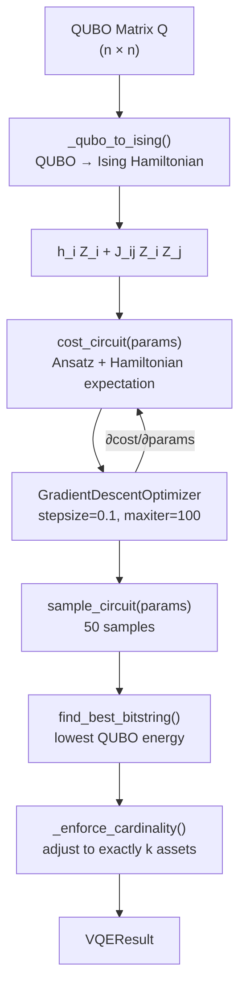

# VQE Solver

The Variational Quantum Eigensolver (VQE) solver uses PennyLane's `default.qubit` simulator to solve the asset selection QUBO. Unlike QAOA (which uses a fixed circuit structure derived from the problem Hamiltonian), VQE uses a **hardware-efficient ansatz** — a parameterised circuit whose structure is independent of the problem — and optimises its parameters via gradient descent.

## Overview

The VQE approach involves four stages:

1. **QUBO → Ising**: Convert the QUBO matrix to an Ising Hamiltonian using the substitution `x_i = (1 - Z_i) / 2`
2. **Ansatz**: Build a hardware-efficient parameterised circuit (Ry rotations + CNOT entanglement)
3. **Optimise**: Minimise the expectation value of the Ising Hamiltonian via gradient descent
4. **Sample**: Draw samples from the optimised circuit and select the bitstring with the lowest QUBO energy



## QUBO → Ising Transformation

The key mathematical step is converting binary variables `x_i ∈ {0, 1}` to Pauli-Z operators `Z_i ∈ {-1, +1}` via:

```
x_i = (1 - Z_i) / 2
```

For pairwise terms:

```
x_i · x_j = (1 - Z_i)(1 - Z_j) / 4
           = (1 - Z_i - Z_j + Z_i Z_j) / 4
```

This maps the QUBO objective to an Ising Hamiltonian:

```
H = Σ_i h_i Z_i + Σ_{i<j} J_ij Z_i Z_j + constant
```

The constant is dropped (it doesn't affect optimisation). The `_qubo_to_ising()` function computes the coefficients:

```python
def _qubo_to_ising(Q):
    n = Q.shape[0]
    h_coeffs = np.zeros(n)
    zz_pairs = []
    zz_coeffs = []

    for i in range(n):
        # Diagonal: Q_ii * x_i = Q_ii * (1 - Z_i) / 2
        # → Z_i coefficient: -Q_ii / 2
        h_coeffs[i] -= Q[i, i] / 2.0

        for j in range(i + 1, n):
            q_ij = Q[i, j]
            # Off-diagonal: Q_ij * x_i * x_j = Q_ij * (1-Z_i)(1-Z_j) / 4
            # → Z_i coefficient: -Q_ij / 4
            # → Z_j coefficient: -Q_ij / 4
            # → Z_i Z_j coefficient: +Q_ij / 4
            h_coeffs[i] -= q_ij / 4.0
            h_coeffs[j] -= q_ij / 4.0
            zz_pairs.append((i, j))
            zz_coeffs.append(q_ij / 4.0)

    return h_coeffs, zz_pairs, zz_coeffs
```

**Example** for a 2×2 QUBO `Q = [[1.0, 2.0], [0.0, 3.0]]`:
- `h[0] = -Q[0,0]/2 - Q[0,1]/4 = -0.5 - 0.5 = -1.0`
- `h[1] = -Q[1,1]/2 - Q[0,1]/4 = -1.5 - 0.5 = -2.0`
- `J[(0,1)] = Q[0,1]/4 = 0.5`

## `run_vqe()` Function

**Source:** `backend/app/quantum/vqe_solver.py`

```python
from app.quantum.vqe_solver import run_vqe

result = run_vqe(
    tickers=["AAPL", "MSFT", "GOOGL"],
    qubo_matrix=Q,
    expected_returns=mu,
    covariance_matrix=sigma,
    budget=100_000.0,
    num_assets_to_select=2,
    num_layers=2,       # Ansatz depth
    max_iterations=100, # Gradient descent steps
)

print(result.selected_assets)       # ["AAPL", "GOOGL"]
print(result.metrics.sharpe_ratio)  # 1.18
print(result.num_qubits)            # 3
print(result.solve_time_ms)         # 3241.7
```

### Parameters

| Parameter | Type | Default | Description |
|-----------|------|---------|-------------|
| `tickers` | `list[str]` | required | Asset ticker symbols, length `n` |
| `qubo_matrix` | `np.ndarray` | required | QUBO matrix `Q`, shape `(n, n)` |
| `expected_returns` | `np.ndarray` | required | Annualised expected returns, shape `(n,)` |
| `covariance_matrix` | `np.ndarray` | required | Annualised covariance matrix, shape `(n, n)` |
| `budget` | `float` | required | Total investment budget in USD |
| `num_assets_to_select` | `int` | required | Target number of assets `k` to select |
| `num_layers` | `int` | `2` | Number of variational ansatz layers |
| `max_iterations` | `int` | `100` | Maximum gradient descent steps |

### Returns: `VQEResult`

```python
class VQEResult(BaseModel):
    selected_assets: list[str]    # Tickers of selected assets
    weights: list[AssetWeight]    # Equal-weight allocations
    metrics: PortfolioMetrics     # Return, volatility, Sharpe
    num_qubits: int               # Number of qubits = n
    solve_time_ms: float          # Wall-clock solve time in milliseconds
```

### Raises

- `QuantumTimeoutError` — if the solver exceeds `QUANTUM_TIMEOUT_SECONDS` (checked at every gradient descent iteration)

## Variational Ansatz

The hardware-efficient ansatz consists of alternating **Ry rotation layers** and **CNOT entanglement chains**:

```python
@qml.qnode(dev)
def cost_circuit(params):
    for layer in range(num_layers):
        # Ry rotations on all qubits
        for qubit in range(n):
            qml.RY(params[layer * n + qubit], wires=qubit)
        # Linear CNOT entanglement: 0→1→2→...→(n-1)
        for qubit in range(n - 1):
            qml.CNOT(wires=[qubit, qubit + 1])

    # Build cost Hamiltonian from Ising coefficients
    obs = []
    coeffs = []
    for i, h in enumerate(h_coeffs):
        if abs(h) > 1e-10:
            obs.append(qml.PauliZ(i))
            coeffs.append(float(h))
    for (i, j), J in zip(zz_pairs, zz_coeffs):
        if abs(J) > 1e-10:
            obs.append(qml.PauliZ(i) @ qml.PauliZ(j))
            coeffs.append(float(J))

    H = qml.Hamiltonian(coeffs, obs)
    return qml.expval(H)
```

The total number of trainable parameters is `num_layers × n`. For `num_layers=2` and `n=4`, this gives 8 parameters.

**Ansatz structure for `n=4`, `num_layers=2`:**

```
Layer 1:  RY(θ₀) RY(θ₁) RY(θ₂) RY(θ₃)
          CNOT(0→1) CNOT(1→2) CNOT(2→3)
Layer 2:  RY(θ₄) RY(θ₅) RY(θ₆) RY(θ₇)
          CNOT(0→1) CNOT(1→2) CNOT(2→3)
Measure:  ⟨H⟩ = Σ h_i ⟨Z_i⟩ + Σ J_ij ⟨Z_i Z_j⟩
```

## Gradient-Based Optimisation

Parameters are initialised randomly from `Uniform(-π, π)` with a fixed seed for reproducibility:

```python
rng = np.random.default_rng(42)
params = pnp.array(
    rng.uniform(-np.pi, np.pi, num_layers * n),
    requires_grad=True,
)
```

PennyLane's `GradientDescentOptimizer` is used with a step size of `0.1`:

```python
opt = qml.GradientDescentOptimizer(stepsize=0.1)

for step in range(max_iterations):
    # Timeout check at every iteration
    elapsed = time.perf_counter() - start_time
    if elapsed > settings.QUANTUM_TIMEOUT_SECONDS:
        raise QuantumTimeoutError(...)

    params, cost = opt.step_and_cost(cost_circuit, params)

    # Early stopping: convergence check
    if abs(prev_cost - float(cost)) < 1e-6 and step > 10:
        break
    prev_cost = float(cost)
```

**Early stopping** triggers when the cost improvement between consecutive steps falls below `1e-6` (after at least 10 steps). This prevents unnecessary computation when the optimiser has converged.

> **Timeout safety**: The timeout is checked at every gradient descent iteration, not just before and after the full solve. This ensures the solver respects the configured `QUANTUM_TIMEOUT_SECONDS` even for long-running optimisations.

## Binary Solution Extraction

After optimisation, the circuit is sampled `_NUM_SAMPLES = 50` times to find the best binary solution:

```python
@qml.qnode(dev)
def sample_circuit(params):
    for layer in range(num_layers):
        for qubit in range(n):
            qml.RY(params[layer * n + qubit], wires=qubit)
        for qubit in range(n - 1):
            qml.CNOT(wires=[qubit, qubit + 1])
    return qml.sample(wires=range(n))

samples = np.array([sample_circuit(params) for _ in range(_NUM_SAMPLES)])

# Convert {-1, +1} → {0, 1} if device returns ±1 eigenvalues
if samples.min() < 0:
    samples = (samples + 1) // 2

# Find the sample with the lowest QUBO energy
best_x = samples[0].astype(float)
best_energy = float("inf")
for sample in samples:
    x = sample.astype(float)
    energy = float(x @ qubo_matrix @ x)
    if energy < best_energy:
        best_energy = energy
        best_x = x
```

Taking multiple samples and selecting the minimum-energy bitstring improves the probability of finding a good solution, especially when the optimised circuit has a broad probability distribution.

## Cardinality Enforcement and Portfolio Metrics

After extracting the best bitstring, the same `_enforce_cardinality()` function used by the QAOA solver adjusts the selection to exactly `k` assets. Portfolio metrics are then computed using equal weighting, identical to the QAOA approach.

See [QAOA Solver — Step 5](qaoa-solver.md) for details on cardinality enforcement.

## PennyLane Device Setup

```python
import pennylane as qml

dev = qml.device("default.qubit", wires=n)
```

The `default.qubit` device is a pure-state statevector simulator. It supports exact gradient computation via PennyLane's automatic differentiation, making it suitable for gradient-based VQE optimisation.

## Greedy Fallback

If PennyLane is not installed, or if any unexpected exception occurs, the solver falls back to the same greedy selection strategy as the QAOA solver (top-`k` assets by expected return):

```python
except Exception as exc:
    logger.warning(
        "vqe_pennylane_failed_using_greedy_fallback",
        error=str(exc),
        error_type=type(exc).__name__,
    )
    x_opt = _greedy_selection(expected_returns, num_assets_to_select)
```

The `_greedy_selection()` and `_enforce_cardinality()` functions are imported from `app.quantum.qaoa_solver` to avoid code duplication.

## Logging

| Event | Level | Fields |
|-------|-------|--------|
| `vqe_started` | INFO | `num_qubits`, `num_layers`, `max_iterations` |
| `vqe_iteration` | DEBUG | `step`, `cost` (every 20 steps) |
| `vqe_converged` | DEBUG | `step`, `cost` |
| `vqe_best_sample` | DEBUG | `x` (binary vector), `energy` |
| `vqe_pennylane_failed_using_greedy_fallback` | WARNING | `error`, `error_type` |
| `vqe_complete` | INFO | `selected_tickers`, `sharpe`, `expected_return`, `volatility`, `solve_time_ms` |

## VQE vs QAOA: Key Differences

| Aspect | QAOA | VQE |
|--------|------|-----|
| Framework | Qiskit | PennyLane |
| Circuit structure | Problem-derived (cost + mixer unitaries) | Hardware-efficient (Ry + CNOT) |
| Classical optimizer | COBYLA (gradient-free) | Gradient descent |
| Solution extraction | Direct from `MinimumEigenOptimizer` | Sampling from optimised circuit |
| Hamiltonian encoding | Via `QuadraticProgram` | Via Ising transformation |
| Timeout check | Before + after solve | At every iteration |
| Circuit depth reported | Yes (`2 * p * n`) | No |

## Related Pages

- [QUBO Formulation](qubo-formulation.md) — how the QUBO matrix is built
- [QAOA Solver](qaoa-solver.md) — alternative quantum solver using Qiskit
- [Quantum Dispatcher](quantum-dispatcher.md) — orchestrates QAOA + VQE
- [Quantum vs Classical](quantum-vs-classical.md) — when to use quantum optimization
