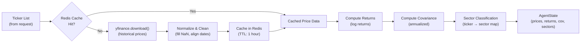

# Data Layer

Documentation for the market data pipeline — the yfinance fetcher, Redis caching strategy, sector tagging, and financial metrics computation (returns, covariance, Sharpe ratio).

## Section Contents

| Page | Description |
|------|-------------|
| [Market Data Fetcher](../08-data-layer/market-data-fetcher.md) | yfinance integration, data normalization, and error handling |
| [Redis Caching](../08-data-layer/redis-caching.md) | Cache strategy, TTL configuration, key schema, and invalidation |
| [Sector Classification](../08-data-layer/sector-classification.md) | Ticker-to-sector mapping and sector constraint enforcement |
| [Portfolio Metrics](../08-data-layer/portfolio-metrics.md) | Returns, covariance matrix, Sharpe ratio, and drawdown computation |

## Data Pipeline Overview

## Key Design Decisions

- **Redis-first caching**: Price data is cached in Redis with a configurable TTL (default: 1 hour) to avoid redundant yfinance API calls during development and testing
- **Log returns**: The engine uses log returns (not simple returns) for better statistical properties in the covariance matrix
- **Annualized metrics**: All volatility and return figures are annualized (252 trading days) for consistency with industry conventions
- **Sector tagging**: Each ticker is mapped to a GICS sector to enable sector concentration constraints

## Cross-References

- **Agent node that calls the fetcher** → [Node: Data Fetch](../05-agent-layer/node-data-fetch.md)
- **Redis configuration** → [Celery Configuration](../10-task-queue/celery-configuration.md)
- **Constraint enforcement using sectors** → [Constraints](../06-classical-optimization/constraints.md)
- **Caching environment variables** → [Environment Variables](../01-getting-started/environment-variables.md)
