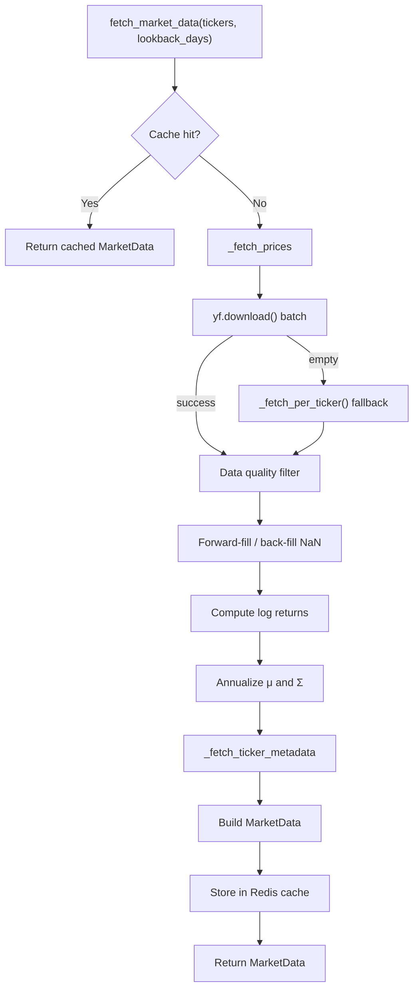

# Market Data Fetcher

The market data fetcher is the entry point for all historical price data in the portfolio optimizer. It downloads adjusted close prices from Yahoo Finance via `yfinance`, applies data quality filters, computes daily log returns, and derives the annualized expected returns and covariance matrix that feed every optimization engine.

Source file: `backend/app/data/fetcher.py`

---

## Overview



---

## `fetch_market_data()` Function

```python
def fetch_market_data(
    tickers: list[str],
    lookback_days: int = 365,
) -> MarketData:
```

### Parameters

| Parameter | Type | Default | Description |
|-----------|------|---------|-------------|
| `tickers` | `list[str]` | — | Ticker symbols (e.g. `["AAPL", "MSFT"]`). Case-insensitive; normalized to uppercase. Duplicates are silently removed. |
| `lookback_days` | `int` | `365` | Number of **calendar** days of history to fetch. Must be ≥ `MIN_TRADING_DAYS` (30). |

### Returns

A [`MarketData`](#marketdata-dataclass) dataclass containing price data, returns, covariance matrix, and sector metadata for all tickers that survived the data quality filter.

### Raises

| Exception | Condition |
|-----------|-----------|
| `ValueError` | `tickers` is empty, or `lookback_days < 30` |
| `DataFetchError` | No valid price data returned, or all tickers dropped due to excessive NaN values |

### Ticker Normalization

Before any network call, tickers are normalized:

```python
# Normalise tickers to uppercase and deduplicate (preserve order)
seen: set[str] = set()
normalised: list[str] = []
for t in tickers:
    upper = t.strip().upper()
    if upper and upper not in seen:
        seen.add(upper)
        normalised.append(upper)
tickers = normalised
```

This means `["aapl", " MSFT ", "AAPL"]` becomes `["AAPL", "MSFT"]`.

---

## yfinance `download()` Call

The fetcher calls `yf.download()` with `auto_adjust=True` to retrieve split- and dividend-adjusted close prices:

```python
raw = yf.download(
    tickers=tickers,
    start=start_str,
    end=end_str,
    auto_adjust=True,
    progress=False,
    threads=False,
)
```

> **Important:** No custom `session` argument is passed. Using a `curl_cffi` session triggers HTTP 429 (Too Many Requests) from Yahoo Finance. The plain `yf.download()` call uses yfinance's built-in cookie/crumb handling, which works correctly.

### Multi-Index Column Handling

Modern yfinance (≥ 0.2.x) returns a `MultiIndex` DataFrame with `(field, ticker)` column tuples. The `_extract_close()` helper normalizes this:

```python
if isinstance(raw.columns, pd.MultiIndex):
    price_field = "Close" if "Close" in level0_values else "Adj Close"
    prices = raw[price_field].copy()
    prices.columns = [str(c) for c in prices.columns]
```

With `auto_adjust=True`, yfinance renames `Adj Close` to `Close`, so the fetcher always looks for `Close` first.

---

## Retry Strategy

The fetcher implements a manual exponential-backoff retry loop (up to 3 attempts) rather than using the `tenacity` library:

```python
def _download_with_retry(
    tickers: list[str],
    start_str: str,
    end_str: str,
    max_attempts: int = 3,
) -> pd.DataFrame:
    delay = 5  # seconds base delay
    for attempt in range(1, max_attempts + 1):
        try:
            raw = yf.download(...)
            ...
        except Exception as exc:
            if attempt < max_attempts:
                wait = delay * (2 ** (attempt - 1))  # 5s, 10s, 20s
                time.sleep(wait)
```

| Attempt | Wait before retry |
|---------|-------------------|
| 1 → 2 | 5 seconds |
| 2 → 3 | 10 seconds |
| 3 (final) | raises / returns empty |

### Per-Ticker Fallback

If the batch `yf.download()` returns an empty DataFrame, the fetcher falls back to calling `yf.Ticker(ticker).history()` for each ticker individually. This is slower but more resilient when Yahoo Finance rejects batch requests:

```python
def _fetch_per_ticker(tickers, start_str, end_str) -> pd.DataFrame:
    for ticker in tickers:
        for attempt in range(1, 4):
            t = yf.Ticker(ticker)
            hist = t.history(start=start_str, end=end_str, auto_adjust=True)
            if hist is not None and not hist.empty and "Close" in hist.columns:
                frames[ticker] = hist["Close"].copy()
                break
```

---

## Data Quality Filtering

Two constants govern data quality:

```python
MAX_NAN_FRACTION = 0.20   # Drop tickers with > 20% missing values
MIN_TRADING_DAYS = 30     # Require at least 30 trading days after cleaning
```

### NaN Filtering

Tickers with more than 20% missing price rows are dropped entirely:

```python
min_valid_rows = int((1.0 - MAX_NAN_FRACTION) * len(price_data))
price_data = price_data.dropna(axis=1, thresh=min_valid_rows)
```

If this drops **all** tickers, a `DataFetchError` is raised:

```python
raise DataFetchError(
    message=(
        f"All tickers were dropped because more than "
        f"{MAX_NAN_FRACTION * 100:.0f}% of their price data was missing."
    ),
    tickers=tickers,
)
```

### Gap Filling

Remaining NaN values (e.g. from market holidays or trading halts) are filled using forward-fill then back-fill:

```python
price_data = price_data.ffill().bfill()
price_data = price_data.dropna(axis=1, how="all")
```

### Minimum Trading Days

After cleaning, if fewer than 30 trading days remain, a `DataFetchError` is raised:

```python
if len(price_data) < MIN_TRADING_DAYS:
    raise DataFetchError(
        message=(
            f"Only {len(price_data)} trading days of data available after "
            f"cleaning. At least {MIN_TRADING_DAYS} days are required."
        ),
        tickers=valid_tickers,
    )
```

---

## Log Returns Computation

Daily log returns are computed as the natural logarithm of the price ratio:

```python
# Daily log returns: ln(P_t / P_{t-1})
returns_data = np.log(price_data / price_data.shift(1)).dropna()
```

This gives a DataFrame of shape `(days - 1, n_assets)`.

---

## Annualized Statistics

The constant `TRADING_DAYS_PER_YEAR = 252` is used to annualize both the expected returns and the covariance matrix:

### Expected Returns

```python
expected_returns = returns_data.mean().values * TRADING_DAYS_PER_YEAR
```

This multiplies the mean daily log return by 252 to get an annualized figure.

### Covariance Matrix

```python
covariance_matrix = returns_data.cov().values * TRADING_DAYS_PER_YEAR
```

The daily covariance matrix is scaled by 252 (not √252) because variance scales linearly with time.

### Positive Semi-Definite Correction

Numerical noise can occasionally produce a covariance matrix with tiny negative eigenvalues. The `_ensure_psd()` helper clips these to zero:

```python
def _ensure_psd(matrix: np.ndarray) -> np.ndarray:
    eigenvalues, eigenvectors = np.linalg.eigh(matrix)
    eigenvalues = np.maximum(eigenvalues, 0)
    return eigenvectors @ np.diag(eigenvalues) @ eigenvectors.T
```

---

## `MarketData` Dataclass

```python
@dataclass
class MarketData:
    valid_tickers: list[str]
    price_data: pd.DataFrame
    returns_data: pd.DataFrame
    expected_returns: np.ndarray
    covariance_matrix: np.ndarray
    sector_map: dict[str, str] = field(default_factory=dict)
    fetch_timestamp: datetime = field(default_factory=lambda: datetime.now(UTC))
    metadata: dict[str, dict[str, Any]] = field(default_factory=dict)
```

| Field | Type | Description |
|-------|------|-------------|
| `valid_tickers` | `list[str]` | Tickers that survived the data quality filter |
| `price_data` | `pd.DataFrame` | Adjusted close prices, shape `(days, n_assets)` |
| `returns_data` | `pd.DataFrame` | Daily log returns, shape `(days-1, n_assets)` |
| `expected_returns` | `np.ndarray` | Annualized expected returns, shape `(n_assets,)` |
| `covariance_matrix` | `np.ndarray` | Annualized covariance matrix, shape `(n, n)` |
| `sector_map` | `dict[str, str]` | Ticker → GICS sector name (e.g. `"Information Technology"`) |
| `fetch_timestamp` | `datetime` | UTC timestamp when the data was fetched |
| `metadata` | `dict[str, dict]` | Per-ticker metadata: name, exchange, currency, market cap |

---

## `DataFetchError` Handling

`DataFetchError` is a domain exception defined in `backend/app/core/exceptions.py`:

```python
class DataFetchError(PortfolioOptimizerError):
    def __init__(
        self,
        message: str,
        tickers: list[str] | None = None,
        details: dict[str, Any] | None = None,
    ) -> None:
        super().__init__(
            message=message,
            error_code="DATA_FETCH_ERROR",
            details={**(details or {}), "tickers": tickers or []},
        )
```

It carries:
- `error_code = "DATA_FETCH_ERROR"` — used by the FastAPI exception handler to return a structured JSON error response
- `tickers` — the list of tickers that caused the failure
- `message` — human-readable description of the failure

The FastAPI layer maps this to an HTTP 422 response with a JSON body containing `error_code`, `message`, and `details`.

---

## Usage Example

```python
from app.data.fetcher import fetch_market_data

# Fetch 1 year of data for a 5-asset portfolio
data = fetch_market_data(
    tickers=["AAPL", "MSFT", "GOOGL", "JPM", "JNJ"],
    lookback_days=365,
)

print(data.valid_tickers)       # ['AAPL', 'MSFT', 'GOOGL', 'JPM', 'JNJ']
print(data.expected_returns)    # array([0.28, 0.31, 0.19, 0.12, 0.08])
print(data.covariance_matrix.shape)  # (5, 5)
print(data.sector_map)
# {
#   'AAPL': 'Information Technology',
#   'MSFT': 'Information Technology',
#   'GOOGL': 'Communication Services',
#   'JPM': 'Financials',
#   'JNJ': 'Health Care'
# }
```

---

## Related Pages

- [Redis Caching](redis-caching.md) — how `MarketData` is cached and retrieved
- [Sector Classification](sector-classification.md) — how `sector_map` is populated
- [Portfolio Metrics](portfolio-metrics.md) — how `returns_data` and `covariance_matrix` are used downstream
