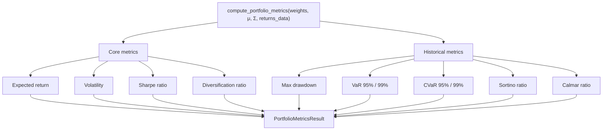

# Portfolio Metrics

The `metrics.py` module computes comprehensive portfolio performance statistics from weight vectors, expected returns, and covariance matrices. All metrics are annualized unless otherwise noted.

Source file: `backend/app/data/metrics.py`

---

## Overview



---

## `compute_portfolio_metrics()`

The main entry point for all portfolio metrics:

```python
def compute_portfolio_metrics(
    weights: np.ndarray,
    expected_returns: np.ndarray,
    covariance_matrix: np.ndarray,
    returns_data: pd.DataFrame | None = None,
    risk_free_rate: float = 0.02,
    weight_threshold: float = 1e-4,
) -> PortfolioMetricsResult:
```

### Parameters

| Parameter | Type | Default | Description |
|-----------|------|---------|-------------|
| `weights` | `np.ndarray` | — | Portfolio weight vector, shape `(n,)`. Must sum to 1. |
| `expected_returns` | `np.ndarray` | — | Annualized expected returns, shape `(n,)`. From `MarketData.expected_returns`. |
| `covariance_matrix` | `np.ndarray` | — | Annualized covariance matrix, shape `(n, n)`. From `MarketData.covariance_matrix`. |
| `returns_data` | `pd.DataFrame \| None` | `None` | Daily log returns, shape `(days, n)`. Required for drawdown, VaR, CVaR, and Sortino. |
| `risk_free_rate` | `float` | `0.02` | Annual risk-free rate for Sharpe/Sortino computation. |
| `weight_threshold` | `float` | `1e-4` | Minimum weight to count an asset as "included" in `num_assets`. |

### Weight Normalization

Before computing any metrics, tiny negative weights from numerical noise are clipped and the vector is re-normalized:

```python
weights = np.maximum(weights, 0.0)
total = weights.sum()
if total > 0:
    weights = weights / total
```

---

## Core Metrics

### Expected Return

The annualized portfolio expected return is the weighted sum of individual asset returns:

```
E[R_p] = μᵀ · w
```

```python
port_return = float(expected_returns @ weights)
```

Since `expected_returns` is already annualized (×252 in the fetcher), `port_return` is directly an annualized figure.

### Volatility

Portfolio volatility (standard deviation) is derived from the quadratic form of the weight vector and covariance matrix:

```
σ_p = √(wᵀ · Σ · w)
```

```python
port_variance = float(weights @ covariance_matrix @ weights)
port_vol = float(np.sqrt(max(port_variance, 0.0)))
```

The `max(..., 0.0)` guard prevents `sqrt` of a tiny negative number from numerical noise.

---

## Sharpe Ratio

The Sharpe ratio measures risk-adjusted return — how much excess return is earned per unit of volatility:

```
Sharpe = (E[R_p] - r_f) / σ_p
```

```python
sharpe = (
    (port_return - risk_free_rate) / port_vol
    if port_vol > 1e-10
    else 0.0
)
```

Both `port_return` and `risk_free_rate` are annualized, so the Sharpe ratio is also annualized.

### `RISK_FREE_RATE` Configuration

The default risk-free rate is configured in `backend/app/core/config.py`:

```python
RISK_FREE_RATE: float = Field(
    default=0.02,
    ge=0.0,
    le=0.2,
    description="Annual risk-free rate used in Sharpe ratio calculation",
)
```

| Setting | Default | Range | Description |
|---------|---------|-------|-------------|
| `RISK_FREE_RATE` | `0.02` (2%) | 0–20% | Annual risk-free rate (e.g. US Treasury yield) |

Set via environment variable:

```bash
RISK_FREE_RATE=0.045   # 4.5% (current Fed funds rate)
```

The `compute_sharpe_ratio()` standalone function is also available:

```python
def compute_sharpe_ratio(
    portfolio_return: float,
    portfolio_volatility: float,
    risk_free_rate: float = 0.02,
) -> float:
    if portfolio_volatility < 1e-10:
        return 0.0
    return (portfolio_return - risk_free_rate) / portfolio_volatility
```

---

## Volatility Computation

The `compute_portfolio_volatility()` standalone function computes volatility from weights and covariance matrix:

```python
def compute_portfolio_volatility(
    weights: np.ndarray,
    covariance_matrix: np.ndarray,
) -> float:
    weights = np.asarray(weights, dtype=float)
    variance = float(weights @ covariance_matrix @ weights)
    return float(np.sqrt(max(variance, 0.0)))
```

The `annualise_volatility()` function annualizes a series of daily log returns:

```python
def annualise_volatility(
    daily_returns: np.ndarray,
    trading_days: int = TRADING_DAYS_PER_YEAR,
) -> float:
    if len(daily_returns) < 2:
        return 0.0
    daily_vol = float(np.std(daily_returns, ddof=1))
    return daily_vol * np.sqrt(trading_days)
```

Volatility scales with the square root of time: `σ_annual = σ_daily × √252`.

---

## Maximum Drawdown

Maximum drawdown measures the largest peak-to-trough decline in the cumulative return series:

```python
def compute_max_drawdown(returns: np.ndarray) -> float:
    if len(returns) == 0:
        return 0.0

    # Compute cumulative wealth index (starting at 1.0)
    cum_returns = np.exp(np.cumsum(returns))

    # Running maximum
    running_max = np.maximum.accumulate(cum_returns)

    # Drawdown at each point
    drawdowns = (cum_returns - running_max) / running_max

    return float(np.min(drawdowns))
```

The result is a **negative** fraction (e.g. `-0.25` means a 25% peak-to-trough decline).

### Calmar Ratio

The Calmar ratio relates annualized return to maximum drawdown:

```
Calmar = E[R_p] / |max_drawdown|
```

```python
if max_drawdown is not None and abs(max_drawdown) > 1e-10:
    calmar_ratio = port_return / abs(max_drawdown)
```

A higher Calmar ratio indicates better risk-adjusted performance relative to the worst historical loss.

---

## Value at Risk (VaR)

Historical VaR at confidence level `c` is the loss not exceeded with probability `c`:

```python
def compute_var(returns: np.ndarray, confidence: float = 0.95) -> float:
    if len(returns) == 0:
        return 0.0
    return float(np.percentile(returns, (1 - confidence) * 100))
```

VaR is computed at both 95% and 99% confidence levels. The result is a **negative** number (loss convention): `-0.02` means a 2% daily loss at the threshold.

| Metric | Confidence | Interpretation |
|--------|-----------|----------------|
| `var_95` | 95% | On 95% of days, the loss will not exceed this value |
| `var_99` | 99% | On 99% of days, the loss will not exceed this value |

---

## Conditional Value at Risk (CVaR)

CVaR (also called Expected Shortfall) is the expected loss given that the loss exceeds the VaR threshold:

```python
def compute_cvar(returns: np.ndarray, confidence: float = 0.95) -> float:
    if len(returns) == 0:
        return 0.0
    var = compute_var(returns, confidence=confidence)
    tail_returns = returns[returns <= var]
    if len(tail_returns) == 0:
        return var
    return float(np.mean(tail_returns))
```

CVaR is always ≤ VaR (a larger loss) and provides a more complete picture of tail risk.

---

## Sortino Ratio

The Sortino ratio is similar to the Sharpe ratio but penalizes only **downside** volatility:

```
Sortino = (E[R_p] - r_f) / σ_downside
```

```python
daily_rf = risk_free_rate / TRADING_DAYS_PER_YEAR
downside_returns = port_daily_returns[port_daily_returns < daily_rf]
if len(downside_returns) > 1:
    downside_dev_daily = float(np.std(downside_returns, ddof=1))
    annualised_downside_deviation = downside_dev_daily * np.sqrt(TRADING_DAYS_PER_YEAR)
    sortino_ratio = (
        (port_return - risk_free_rate) / annualised_downside_deviation
        if annualised_downside_deviation > 1e-10
        else 0.0
    )
```

Only returns below the daily risk-free rate are included in the downside deviation calculation.

---

## Diversification Ratio

The diversification ratio measures how much the portfolio benefits from diversification:

```
DR = (Σᵢ wᵢ · σᵢ) / σ_p
```

```python
asset_vols = np.sqrt(np.maximum(np.diag(covariance_matrix), 0.0))
weighted_avg_vol = float(weights @ asset_vols)
diversification_ratio = (
    weighted_avg_vol / port_vol if port_vol > 1e-10 else None
)
```

- `DR = 1.0` — no diversification benefit (all assets perfectly correlated)
- `DR > 1.0` — portfolio volatility is lower than the weighted average of individual volatilities

---

## `PortfolioMetricsResult` Schema

All computed metrics are returned in a single dataclass:

```python
@dataclass
class PortfolioMetricsResult:
    # Core metrics
    expected_return: float
    volatility: float
    sharpe_ratio: float

    # Risk-adjusted metrics
    sortino_ratio: float | None = None
    calmar_ratio: float | None = None

    # Drawdown
    max_drawdown: float | None = None

    # Value at Risk
    var_95: float | None = None
    var_99: float | None = None
    cvar_95: float | None = None
    cvar_99: float | None = None

    # Diversification
    diversification_ratio: float | None = None

    # Asset count
    num_assets: int = 0

    # Additional
    annualised_downside_deviation: float | None = None
    extra: dict = field(default_factory=dict)
```

### Field Reference

| Field | Type | Always Present | Description |
|-------|------|---------------|-------------|
| `expected_return` | `float` | ✅ | Annualized expected return (weighted sum) |
| `volatility` | `float` | ✅ | Annualized portfolio volatility |
| `sharpe_ratio` | `float` | ✅ | `(return - risk_free_rate) / volatility` |
| `sortino_ratio` | `float \| None` | Requires `returns_data` | Downside-adjusted Sharpe |
| `calmar_ratio` | `float \| None` | Requires `returns_data` | Return / max drawdown |
| `max_drawdown` | `float \| None` | Requires `returns_data` | Largest peak-to-trough decline (negative) |
| `var_95` | `float \| None` | Requires `returns_data` | 95% daily VaR (negative = loss) |
| `var_99` | `float \| None` | Requires `returns_data` | 99% daily VaR (negative = loss) |
| `cvar_95` | `float \| None` | Requires `returns_data` | 95% CVaR / Expected Shortfall |
| `cvar_99` | `float \| None` | Requires `returns_data` | 99% CVaR / Expected Shortfall |
| `diversification_ratio` | `float \| None` | ✅ | Weighted avg vol / portfolio vol |
| `num_assets` | `int` | ✅ | Assets with weight > `weight_threshold` |
| `annualised_downside_deviation` | `float \| None` | Requires `returns_data` | Annualized semi-deviation |

---

## Usage Example

```python
import numpy as np
from app.data.metrics import compute_portfolio_metrics
from app.data.fetcher import fetch_market_data

# Fetch market data
data = fetch_market_data(["AAPL", "MSFT", "JPM"], lookback_days=365)

# Equal-weight portfolio
weights = np.array([1/3, 1/3, 1/3])

# Compute all metrics
metrics = compute_portfolio_metrics(
    weights=weights,
    expected_returns=data.expected_returns,
    covariance_matrix=data.covariance_matrix,
    returns_data=data.returns_data,
    risk_free_rate=0.045,  # 4.5% risk-free rate
)

print(f"Expected Return:  {metrics.expected_return:.2%}")
print(f"Volatility:       {metrics.volatility:.2%}")
print(f"Sharpe Ratio:     {metrics.sharpe_ratio:.3f}")
print(f"Max Drawdown:     {metrics.max_drawdown:.2%}")
print(f"VaR 95%:          {metrics.var_95:.2%}")
print(f"CVaR 95%:         {metrics.cvar_95:.2%}")
print(f"Sortino Ratio:    {metrics.sortino_ratio:.3f}")
print(f"Diversification:  {metrics.diversification_ratio:.3f}")
```

---

## Standalone Utility Functions

The module also exports several standalone functions for use outside the main `compute_portfolio_metrics()` pipeline:

| Function | Description |
|----------|-------------|
| `compute_sharpe_ratio(return, vol, rf)` | Compute Sharpe ratio from scalar inputs |
| `compute_portfolio_volatility(weights, cov)` | Compute portfolio volatility |
| `compute_max_drawdown(returns)` | Compute max drawdown from return series |
| `compute_var(returns, confidence)` | Compute historical VaR |
| `compute_cvar(returns, confidence)` | Compute historical CVaR |
| `annualise_returns(daily_returns)` | Annualize mean daily log returns |
| `annualise_volatility(daily_returns)` | Annualize daily volatility |
| `compute_efficient_frontier_points(μ, Σ, n)` | Monte Carlo efficient frontier approximation |

### Efficient Frontier Points

The `compute_efficient_frontier_points()` function generates random portfolios to approximate the efficient frontier:

```python
def compute_efficient_frontier_points(
    expected_returns: np.ndarray,
    covariance_matrix: np.ndarray,
    num_points: int = 50,
    risk_free_rate: float = 0.02,
) -> list[dict]:
```

It uses Dirichlet-distributed random weights (via `rng.exponential`) for uniform simplex sampling, returning a list of `{"return": ..., "volatility": ..., "sharpe": ...}` dicts sorted by volatility.

---

## Constants

```python
TRADING_DAYS_PER_YEAR = 252
```

This constant is used throughout the module to annualize daily statistics. It is consistent with the value used in `backend/app/data/fetcher.py`.

---

## Related Pages

- [Market Data Fetcher](market-data-fetcher.md) — provides `expected_returns`, `covariance_matrix`, and `returns_data`
- [Redis Caching](redis-caching.md) — `MarketData` (including returns data) is cached in Redis
- [Sector Classification](sector-classification.md) — sector data from the same `MarketData` object
