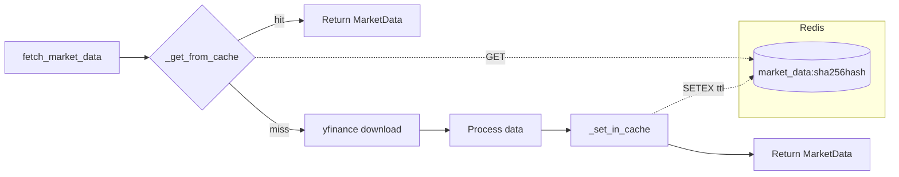

# Redis Caching

The data layer uses Redis to cache `MarketData` objects between requests. Because fetching and processing historical price data from Yahoo Finance takes several seconds, caching eliminates redundant network calls for identical ticker/lookback combinations.

Source files:
- `backend/app/data/fetcher.py` — inline cache helpers (`_get_from_cache`, `_set_in_cache`, `invalidate_cache`)
- `backend/app/data/cache.py` — reusable `CacheManager` class with connection pooling

---

## Architecture



---

## Cache Key Construction

Cache keys are deterministic SHA-256 hashes of the sorted ticker list and `lookback_days`. Sorting ensures that `["MSFT", "AAPL"]` and `["AAPL", "MSFT"]` produce the same key.

```python
def _make_cache_key(tickers: list[str], lookback_days: int) -> str:
    """Generate a deterministic cache key for the given parameters."""
    key_data = json.dumps({"tickers": sorted(tickers), "lookback_days": lookback_days})
    return "market_data:" + hashlib.sha256(key_data.encode()).hexdigest()
```

### Key Format

```
market_data:<64-character-hex-sha256>
```

**Example:**

```python
_make_cache_key(["AAPL", "MSFT"], 365)
# → "market_data:a3f2c1d8e9b4..."
```

### Key Properties

| Property | Behavior |
|----------|----------|
| Ticker order | Ignored — tickers are sorted before hashing |
| Ticker case | Normalized to uppercase before `_make_cache_key` is called |
| Lookback days | Part of the hash — different lookbacks produce different keys |
| Determinism | Same inputs always produce the same key |

---

## Pickle Serialization

`MarketData` contains NumPy arrays and Pandas DataFrames, which are not JSON-serializable. The fetcher uses Python's `pickle` module to serialize the entire dataclass:

```python
def _set_in_cache(cache_key: str, market_data: MarketData) -> None:
    """Store a MarketData object in Redis cache with TTL."""
    try:
        import redis
        settings = get_settings()
        r = redis.from_url(settings.REDIS_URL, socket_connect_timeout=2)
        ttl = getattr(settings, "CACHE_TTL_SECONDS", 3600)
        r.setex(cache_key, ttl, pickle.dumps(market_data))
        logger.debug("cache_set", cache_key=cache_key[:16], ttl=ttl)
    except Exception as exc:
        logger.debug("cache_set_failed", error=str(exc))
```

Retrieval deserializes with `pickle.loads()`:

```python
def _get_from_cache(cache_key: str) -> MarketData | None:
    """Try to retrieve a MarketData object from Redis cache."""
    try:
        import redis
        settings = get_settings()
        r = redis.from_url(settings.REDIS_URL, socket_connect_timeout=2)
        data = r.get(cache_key)
        if data:
            return pickle.loads(data)
    except Exception as exc:
        logger.debug("cache_get_failed", error=str(exc))
    return None
```

> **Security note:** `pickle.loads()` is used only on data that was written by the application itself. The Redis instance should not be publicly accessible.

---

## `CACHE_TTL_SECONDS` Configuration

The TTL is controlled by the `CACHE_TTL_SECONDS` setting in `backend/app/core/config.py`:

```python
CACHE_TTL_SECONDS: int = Field(
    default=3600,
    ge=60,
    description="Redis TTL for cached price data (seconds)",
)
```

| Setting | Default | Minimum | Description |
|---------|---------|---------|-------------|
| `CACHE_TTL_SECONDS` | `3600` (1 hour) | `60` | How long a `MarketData` entry lives in Redis |

Set via environment variable:

```bash
CACHE_TTL_SECONDS=7200   # 2 hours
```

The TTL is applied using Redis `SETEX`:

```
SETEX market_data:<hash> 3600 <pickled bytes>
```

When the TTL expires, Redis automatically removes the key. The next request for the same tickers will trigger a fresh yfinance download.

---

## Cache Hit / Miss Logging

The fetcher logs cache hits and misses using structured log events:

```python
# Cache hit
logger.info("market_data_cache_hit", cache_key=cache_key[:16])

# Cache miss (proceeds to fetch)
logger.info("market_data_fetching", tickers=tickers, lookback_days=lookback_days)

# After successful store
logger.debug("cache_set", cache_key=cache_key[:16], ttl=ttl)
```

Only the first 16 characters of the cache key are logged to avoid cluttering log output with 64-character hashes.

### Log Events Reference

| Event | Level | When |
|-------|-------|------|
| `market_data_cache_hit` | INFO | Cached data found and returned |
| `market_data_fetching` | INFO | Cache miss, starting yfinance download |
| `cache_set` | DEBUG | Data successfully stored in Redis |
| `cache_set_failed` | DEBUG | Redis write failed (graceful degradation) |
| `cache_get_failed` | DEBUG | Redis read failed (graceful degradation) |

---

## Synchronous Redis Client

The fetcher uses the **synchronous** `redis-py` client (`redis.from_url()`), not an async client. This is intentional:

> The module is intentionally synchronous so it can be called from both FastAPI route handlers (via `asyncio.to_thread`) and Celery workers. Redis caching uses the synchronous `redis-py` client.

The async `aioredis` client is used elsewhere in the application for pub/sub (WebSocket progress updates), but the data fetcher runs in a thread pool to avoid blocking the event loop.

---

## `CacheManager` Class

For more advanced caching needs, `backend/app/data/cache.py` provides a `CacheManager` class with connection pooling, JSON support, and typed retrieval:

```python
from app.data.cache import CacheManager

cache = CacheManager(namespace="portfolio_optimizer:", default_ttl=3600)

# Store any picklable Python object
cache.set("my_key", {"result": 42}, ttl=300)

# Retrieve it
value = cache.get("my_key")  # returns {"result": 42} or None

# Type-safe retrieval
result = cache.get_typed("my_key", dict)

# JSON helpers (for human-readable values)
cache.set_json("config:v1", {"threshold": 0.05})
config = cache.get_json("config:v1")

# Delete a key
cache.delete("my_key")

# Health check
if cache.ping():
    print("Redis is reachable")
```

### Connection Pooling

`CacheManager` uses a module-level `redis.ConnectionPool` (max 20 connections) shared across all instances in the same process:

```python
_pool = redis.ConnectionPool.from_url(
    settings.REDIS_URL,
    max_connections=20,
    socket_connect_timeout=2,
    socket_timeout=2,
    decode_responses=False,
)
```

The pool is created lazily on first use and protected by a threading lock to prevent double-initialization in multi-threaded environments (e.g. Celery workers with concurrency > 1).

### Namespace Prefixing

All keys are automatically prefixed with the namespace to avoid collisions with other applications sharing the same Redis instance:

```python
DEFAULT_NAMESPACE = "portfolio_optimizer:"

# Logical key "result:abc123" becomes "portfolio_optimizer:result:abc123" in Redis
```

### Graceful Degradation

All `CacheManager` methods catch Redis exceptions and log warnings rather than raising. Callers should always have a fallback path:

```python
def get(self, key: str) -> Any | None:
    try:
        raw = client.get(full_key)
        if raw is None:
            logger.debug("cache_miss", key=key)
            return None
        return pickle.loads(raw)
    except Exception as exc:
        logger.warning("cache_get_failed", key=key, error=str(exc))
        return None  # Caller handles None gracefully
```

---

## Cache Invalidation

The `invalidate_cache()` function removes a specific `MarketData` entry from Redis:

```python
def invalidate_cache(tickers: list[str], lookback_days: int = 365) -> bool:
    """Remove a cached MarketData entry from Redis.

    Returns:
        True if the key existed and was deleted, False otherwise.
    """
    cache_key = _make_cache_key(tickers, lookback_days)
    try:
        r = redis.from_url(settings.REDIS_URL, socket_connect_timeout=2)
        result = r.delete(cache_key)
        logger.info("cache_invalidated", cache_key=cache_key[:16], deleted=bool(result))
        return bool(result)
    except Exception as exc:
        logger.warning("cache_invalidate_failed", error=str(exc))
        return False
```

### When to Invalidate

| Scenario | Action |
|----------|--------|
| Corporate action (split, merger) | Call `invalidate_cache(tickers, lookback_days)` |
| Stale data suspected | Call `invalidate_cache()` or wait for TTL expiry |
| Testing / development | Call `CacheManager().flush_namespace()` to clear all keys |
| Ticker symbol change | Old key expires naturally; new symbol gets a fresh key |

### Namespace Flush (Testing)

During integration tests, the entire namespace can be flushed:

```python
from app.data.cache import CacheManager

cache = CacheManager()
deleted_count = cache.flush_namespace()
print(f"Deleted {deleted_count} keys")
```

This uses Redis `SCAN` with a cursor to avoid blocking the server with a `KEYS *` command.

---

## Redis Database Allocation

The application uses three separate Redis databases to avoid key collisions:

| Database | URL | Purpose |
|----------|-----|---------|
| `redis://…/0` | `REDIS_URL` | Market data cache (`MarketData` objects) |
| `redis://…/1` | `CELERY_BROKER_URL` | Celery task queue |
| `redis://…/2` | `CELERY_RESULT_BACKEND` | Celery task results |

---

## Related Pages

- [Market Data Fetcher](market-data-fetcher.md) — the `fetch_market_data()` function that uses the cache
- [Environment Variables](../01-getting-started/environment-variables.md) — `REDIS_URL` and `CACHE_TTL_SECONDS` configuration
