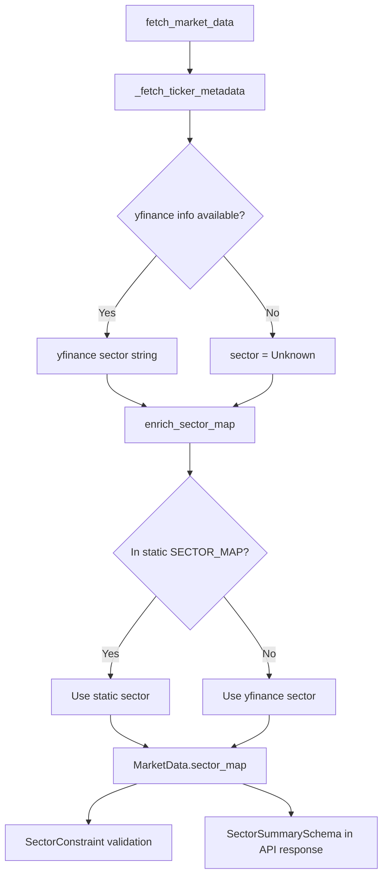
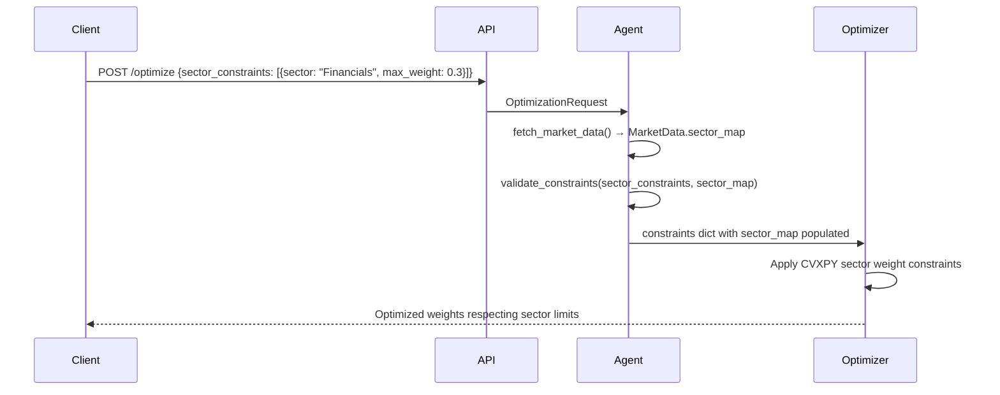

# Sector Classification

The sector classification system assigns each portfolio asset to one of the 11 GICS (Global Industry Classification Standard) top-level sectors. Sector data is used to enforce `SectorConstraint` limits during optimization, to generate sector allocation summaries in API responses, and to provide context for the LLM explanation agent.

Source file: `backend/app/data/sector_tags.py`

---

## Overview



---

## GICS Sectors

The system recognizes exactly 11 top-level GICS sectors, stored as a `frozenset` for O(1) membership testing:

```python
GICS_SECTORS: Final[frozenset[str]] = frozenset({
    "Communication Services",
    "Consumer Discretionary",
    "Consumer Staples",
    "Energy",
    "Financials",
    "Health Care",
    "Industrials",
    "Information Technology",
    "Materials",
    "Real Estate",
    "Utilities",
})
```

---

## Static `SECTOR_MAP`

`sector_tags.py` contains a curated static mapping of well-known US equity ticker symbols to their GICS sectors. This covers the S&P 500 constituents most commonly used in portfolio optimization:

```python
SECTOR_MAP: Final[dict[str, str]] = {
    # Information Technology
    "AAPL": "Information Technology",
    "MSFT": "Information Technology",
    "NVDA": "Information Technology",
    "AVGO": "Information Technology",
    "ORCL": "Information Technology",
    # ...

    # Communication Services
    "GOOGL": "Communication Services",
    "META":  "Communication Services",
    "NFLX":  "Communication Services",
    "DIS":   "Communication Services",

    # Consumer Discretionary
    "AMZN": "Consumer Discretionary",
    "TSLA": "Consumer Discretionary",
    "HD":   "Consumer Discretionary",

    # Financials
    "JPM":  "Financials",
    "BAC":  "Financials",
    "GS":   "Financials",
    "V":    "Financials",
    "MA":   "Financials",

    # Health Care
    "JNJ":  "Health Care",
    "UNH":  "Health Care",
    "LLY":  "Health Care",
    "PFE":  "Health Care",

    # Energy
    "XOM":  "Energy",
    "CVX":  "Energy",

    # ... (hundreds more entries)
}
```

### Why a Static Map?

> yfinance's `Ticker.info` call is slow (one HTTP request per ticker) and occasionally returns stale or missing sector data. The static map provides instant, reliable sector tags for the most commonly traded US equities.

The static map is the **secondary** source — it is consulted only when yfinance metadata is unavailable or returns `"Unknown"`.

---

## yfinance `info` Fallback

When `fetch_market_data()` completes price processing, it calls `_fetch_ticker_metadata()` to retrieve live sector data from yfinance:

```python
def _fetch_ticker_metadata(tickers):
    sector_map = {}
    metadata = {}

    for ticker in tickers:
        try:
            info = yf.Ticker(ticker).info
            sector = info.get("sector", "Unknown") or "Unknown"
            sector_map[ticker] = sector
            metadata[ticker] = {
                "name":       info.get("longName", ""),
                "exchange":   info.get("exchange", "Unknown"),
                "currency":   info.get("currency", "USD"),
                "market_cap": info.get("marketCap"),
                "industry":   info.get("industry", "Unknown"),
                "country":    info.get("country", "Unknown"),
            }
        except Exception:
            sector_map[ticker] = "Unknown"
            metadata[ticker] = {}

    return sector_map, metadata
```

The yfinance `info` dict is fetched once per ticker per data fetch (not per request, since results are cached in Redis).

---

## `enrich_sector_map()` — Resolution Order

The `enrich_sector_map()` function merges yfinance live data with the static map using a priority order:

```python
def enrich_sector_map(
    tickers: list[str],
    yfinance_map: dict[str, str] | None = None,
) -> dict[str, str]:
```

**Resolution order (highest priority first):**

1. **yfinance live data** — reflects the most current classification
2. **Static `SECTOR_MAP`** — reliable offline fallback for well-known tickers
3. **`"Unknown"`** — when neither source has data

```python
for ticker in tickers:
    upper = ticker.strip().upper()

    # 1. yfinance live data (skip if missing/unknown)
    yf_sector = yf_map.get(upper)
    if yf_sector and yf_sector.strip() and yf_sector.strip() != "Unknown":
        result[upper] = yf_sector.strip()
        continue

    # 2. Static map
    static_sector = SECTOR_MAP.get(upper)
    if static_sector:
        result[upper] = static_sector
        continue

    # 3. Fallback
    result[upper] = "Unknown"
```

### Example

```python
from app.data.sector_tags import enrich_sector_map

enriched = enrich_sector_map(
    tickers=["AAPL", "MSFT", "XYZ"],
    yfinance_map={"XYZ": "Energy"},
)
# {
#   "AAPL": "Information Technology",  # from static map
#   "MSFT": "Information Technology",  # from static map
#   "XYZ":  "Energy",                  # from yfinance live data
# }
```

---

## Helper Functions

### `get_sector()`

Single-ticker lookup against the static map:

```python
def get_sector(ticker: str, fallback: str = "Unknown") -> str:
    return SECTOR_MAP.get(ticker.strip().upper(), fallback)
```

```python
get_sector("AAPL")      # "Information Technology"
get_sector("UNKNOWN")   # "Unknown"
get_sector("UNKNOWN", fallback="N/A")  # "N/A"
```

### `get_tickers_by_sector()`

Returns all tickers in the static map for a given sector:

```python
def get_tickers_by_sector(sector: str) -> list[str]:
    normalised = sector.strip().lower()
    return sorted(
        ticker
        for ticker, sec in SECTOR_MAP.items()
        if sec.strip().lower() == normalised
    )
```

```python
tech_tickers = get_tickers_by_sector("Information Technology")
# ["AAPL", "MSFT", "NVDA", "AVGO", ...]
```

### `is_valid_gics_sector()`

Validates that a sector name is one of the 11 recognized GICS sectors:

```python
def is_valid_gics_sector(sector: str) -> bool:
    return sector.strip() in GICS_SECTORS
```

```python
is_valid_gics_sector("Information Technology")  # True
is_valid_gics_sector("Tech")                    # False
```

### `normalise_sector_name()`

Converts common aliases and abbreviations to canonical GICS names:

```python
normalise_sector_name("technology")        # "Information Technology"
normalise_sector_name("healthcare")        # "Health Care"
normalise_sector_name("financial")         # "Financials"
normalise_sector_name("consumer staples")  # "Consumer Staples"
```

This handles the fact that yfinance sometimes returns non-standard sector names like `"Technology"` instead of `"Information Technology"`.

---

## `sector_map` in `MarketData`

The `sector_map` field of the `MarketData` dataclass is a `dict[str, str]` mapping each valid ticker to its resolved GICS sector:

```python
@dataclass
class MarketData:
    ...
    sector_map: dict[str, str] = field(default_factory=dict)
```

After `fetch_market_data()` completes, `sector_map` contains entries for every ticker in `valid_tickers`:

```python
data = fetch_market_data(["AAPL", "JPM", "XOM"], lookback_days=365)
print(data.sector_map)
# {
#   "AAPL": "Information Technology",
#   "JPM":  "Financials",
#   "XOM":  "Energy"
# }
```

---

## How Sector Data Feeds `SectorConstraint` Validation

The `SectorConstraint` schema in `backend/app/schemas/requests.py` allows users to cap the total portfolio weight allocated to any sector:

```python
class SectorConstraint(BaseModel):
    sector: str = Field(
        description="Sector name (e.g. 'Technology', 'Healthcare')",
        min_length=1,
        max_length=100,
    )
    max_weight: float = Field(
        description="Maximum allocation fraction for this sector (0.0–1.0)",
        ge=0.0,
        le=1.0,
    )
```

### Constraint Flow



The `validate_constraints()` function in `backend/app/classical/constraints.py` checks that sector weight limits are feasible:

```python
if sector_constraints:
    total_sector_limit = sum(sc.get("max_weight", 1.0) for sc in sector_constraints)
    if total_sector_limit < 0.99:
        warnings.append(
            f"Sector weight limits sum to {total_sector_limit:.3f} < 1.0. "
            "If all assets belong to constrained sectors, full budget "
            "allocation may not be achievable."
        )
```

The `sector_map` from `MarketData` is injected into the validated constraints dict so the optimizer can group tickers by sector when building CVXPY constraints:

```python
validated: dict[str, Any] = {
    ...
    "sector_constraints": sector_constraints,
    "sector_map": {},  # Populated by data_fetch_node via state
    ...
}
```

### Example Request with Sector Constraints

```json
{
  "tickers": ["AAPL", "MSFT", "JPM", "BAC", "XOM"],
  "budget": 100000,
  "sector_constraints": [
    {"sector": "Information Technology", "max_weight": 0.40},
    {"sector": "Financials", "max_weight": 0.30},
    {"sector": "Energy", "max_weight": 0.20}
  ]
}
```

With this request, the optimizer will ensure that the combined weight of `AAPL + MSFT` does not exceed 40%, `JPM + BAC` does not exceed 30%, and `XOM` does not exceed 20%.

---

## Sector Summary in API Responses

The `compute_sector_summary()` function in `backend/app/data/schemas.py` computes a sector allocation breakdown for any portfolio weight vector:

```python
from app.data.schemas import compute_sector_summary

weights = {"AAPL": 0.4, "MSFT": 0.3, "JPM": 0.3}
sector_map = {
    "AAPL": "Information Technology",
    "MSFT": "Information Technology",
    "JPM":  "Financials",
}
summary = compute_sector_summary(weights, sector_map)
# summary.num_sectors == 2
# summary.largest_sector == "Information Technology"
# summary.sector_concentration == HHI value
```

The `SectorSummarySchema` is included in every optimization response, giving clients a breakdown of sector exposure in the recommended portfolio.

---

## Related Pages

- [Market Data Fetcher](market-data-fetcher.md) — how `sector_map` is populated in `MarketData`
- [Redis Caching](redis-caching.md) — sector data is cached as part of the `MarketData` object
- [Portfolio Metrics](portfolio-metrics.md) — metrics computed from the same `MarketData`
