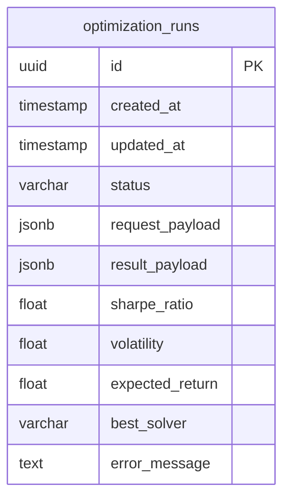

# Database

Documentation for the PostgreSQL data model, SQLAlchemy async session management, Alembic migration workflow, and the run-history repository pattern.

## Section Contents

| Page | Description |
|------|-------------|
| [Schema](../09-database/schema.md) | Table definitions, column types, indexes, and relationships |
| [ORM Models](../09-database/orm-models.md) | SQLAlchemy 2 mapped classes with async support |
| [Migrations](../09-database/migrations.md) | Alembic migration workflow, version management, and rollback |
| [Async Session](../09-database/async-session.md) | AsyncSession patterns, connection pooling, and dependency injection |

## Database Overview

The Portfolio Optimizer uses **PostgreSQL 16** as its primary data store, accessed via **SQLAlchemy 2** with full async support (`asyncpg` driver). The schema is intentionally minimal — a single `optimization_runs` table stores the complete input/output snapshot for each optimization run.

## Key Design Decisions

- **JSONB for payloads**: Request and result payloads are stored as JSONB columns, allowing flexible schema evolution without migrations for every new field
- **Async-first**: All database operations use `AsyncSession` to avoid blocking the event loop
- **Repository pattern**: Database access is encapsulated in repository functions, keeping route handlers clean
- **Alembic for migrations**: Schema changes are versioned and applied via Alembic, supporting both upgrade and downgrade paths

## Cross-References

- **Async session dependency** → [Dependencies](../03-backend/dependencies.md)
- **Run status updates from Celery** → [Optimization Task](../10-task-queue/optimization-task.md)
- **Runs API endpoints** → [Runs Endpoints](../04-api-reference/runs-endpoints.md)
- **Response schemas** → [Response Schemas](../12-schemas/response-schemas.md)
