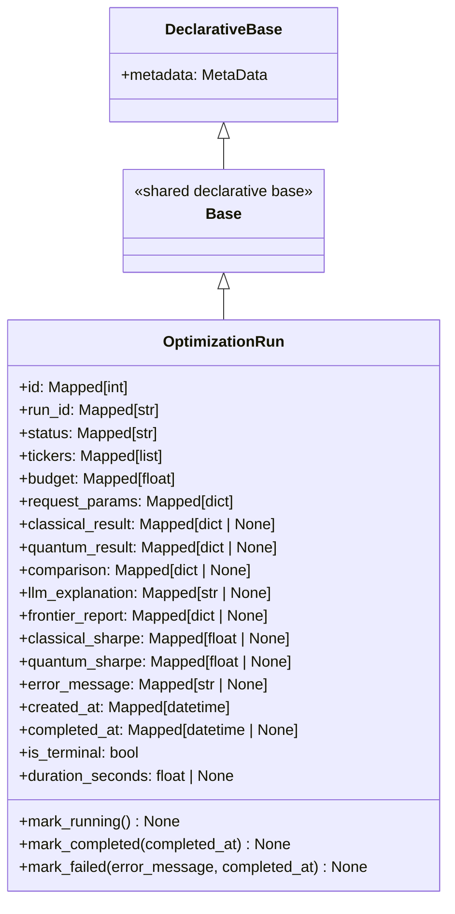

# ORM Models — `OptimizationRun`

The `OptimizationRun` SQLAlchemy model is the Python representation of the
`optimization_runs` database table. It uses SQLAlchemy 2.x's modern
`mapped_column()` API with full type annotations, and provides lifecycle
methods for transitioning runs through their states.

> **Source file:** `backend/app/db/models.py`

---

## Class Hierarchy



---

## `Base` — Shared Declarative Base

```python
class Base(DeclarativeBase):
    """Shared declarative base for all ORM models.

    All models that inherit from this base will share the same metadata
    object, which is used by Alembic for autogenerate support.
    """
    pass
```

`Base` inherits from SQLAlchemy 2.x's `DeclarativeBase`. All ORM models in the
project inherit from `Base`, which means they share a single `MetaData` object.
Alembic's `env.py` imports `Base.metadata` to enable autogenerate support —
when you run `alembic revision --autogenerate`, Alembic compares the live
database schema against the models registered in this metadata.

---

## `OptimizationRun` — Full Model Definition

### Table Arguments

```python
__tablename__ = "optimization_runs"

__table_args__ = (
    CheckConstraint(
        "status IN ('pending', 'running', 'completed', 'failed')",
        name="ck_optimization_runs_status",
    ),
    CheckConstraint(
        "budget > 0",
        name="ck_optimization_runs_budget_positive",
    ),
    Index(
        "ix_optimization_runs_status_created_at",
        "status",
        "created_at",
    ),
)
```

`__table_args__` is a tuple of DDL constructs applied to the table. The two
`CheckConstraint` objects enforce valid status values and positive budgets at
the database level. The composite `Index` on `(status, created_at)` optimizes
the most common list query pattern. See [Schema](schema.md) for full details
on constraints and indexes.

---

### Column Definitions

All columns use SQLAlchemy 2.x's `mapped_column()` with `Mapped[T]` type
annotations. The `Mapped` generic provides full static type checking — mypy
and pyright understand that `run.status` is a `str` and `run.completed_at` is
`datetime | None`.

#### Primary Key

```python
id: Mapped[int] = mapped_column(
    Integer,
    primary_key=True,
    autoincrement=True,
    comment="Internal auto-increment primary key",
)
```

Internal surrogate key. Never exposed in the API.

#### Identity

```python
run_id: Mapped[str] = mapped_column(
    String(36),
    unique=True,
    nullable=False,
    index=True,
    default=lambda: str(uuid.uuid4()),
    comment="UUID exposed in the API; generated by the application layer",
)
```

The public identifier for a run. The `default=lambda: str(uuid.uuid4())`
generates a new UUID v4 at the Python layer when a new `OptimizationRun`
instance is created — before the row is inserted into the database. This
allows the API to return the `run_id` in the HTTP response immediately after
creating the object, even before `session.commit()` is called.

Note the distinction between `default` (Python-side, evaluated when the object
is instantiated) and `server_default` (SQL-side, evaluated by the database at
INSERT time). `run_id` uses `default` so the value is available in Python
immediately.

#### Status

```python
status: Mapped[str] = mapped_column(
    String(20),
    nullable=False,
    default="pending",
    index=True,
    comment="Run lifecycle state: pending | running | completed | failed",
)
```

The lifecycle state. `default="pending"` means new runs start in the `pending`
state automatically. The `index=True` shorthand creates `ix_optimization_runs_status`.

#### Request Inputs

```python
tickers: Mapped[list] = mapped_column(
    JSON,
    nullable=False,
    comment="JSON array of ticker symbols (e.g. ['AAPL', 'MSFT'])",
)

budget: Mapped[float] = mapped_column(
    Float,
    nullable=False,
    comment="Investment budget in USD",
)

request_params: Mapped[dict] = mapped_column(
    JSON,
    nullable=False,
    default=dict,
    comment="Full serialised OptimizationRequest payload",
)
```

`tickers` and `budget` are denormalized from `request_params` for convenient
access in list queries. `request_params` stores the complete `OptimizationRequest`
Pydantic model as a JSON dict, providing a full audit trail.

#### Result Columns

```python
classical_result: Mapped[dict | None] = mapped_column(
    JSON,
    nullable=True,
    comment="Serialised ClassicalResult from Markowitz MVO",
)
quantum_result: Mapped[dict | None] = mapped_column(
    JSON,
    nullable=True,
    comment="Serialised QuantumResult (QAOA + VQE) — null if run_quantum=False",
)
comparison: Mapped[dict | None] = mapped_column(
    JSON,
    nullable=True,
    comment="Serialised ComparisonSummary (classical vs quantum metrics)",
)
llm_explanation: Mapped[str | None] = mapped_column(
    Text,
    nullable=True,
    comment="LLM-generated natural language explanation of the results",
)
frontier_report: Mapped[dict | None] = mapped_column(
    JSON,
    nullable=True,
    comment=(
        "Serialised FrontierReport (efficient-frontier bundle) — "
        "null when the request did not enable the frontier sweep"
    ),
)
```

All result columns are `nullable=True` and start as `None`. They are populated
by the Celery worker after the agent graph completes. `llm_explanation` uses
`Text` (unbounded string) rather than `JSON` because it is an unstructured
natural language string.

`frontier_report` was added in migration `002` and stores the efficient-frontier
sweep output. It is `None` for runs that predate the migration or did not
request a frontier sweep.

#### Denormalized Sharpe Columns

```python
classical_sharpe: Mapped[float | None] = mapped_column(
    Float,
    nullable=True,
    comment="Denormalised classical Sharpe ratio for list query performance",
)
quantum_sharpe: Mapped[float | None] = mapped_column(
    Float,
    nullable=True,
    comment="Denormalised quantum Sharpe ratio (QAOA preferred, else VQE)",
)
```

These columns duplicate data from `classical_result` and `quantum_result` to
avoid deserializing JSON blobs in list queries. See [Schema — Denormalized
Sharpe Columns](schema.md#denormalized-sharpe-columns) for the full rationale.

#### Error Handling

```python
error_message: Mapped[str | None] = mapped_column(
    Text,
    nullable=True,
    comment="Human-readable error description when status == 'failed'",
)
```

Populated only when `status = 'failed'`. Contains the exception message or a
human-readable description of the failure.

#### Timestamps

```python
created_at: Mapped[datetime] = mapped_column(
    DateTime(timezone=True),
    nullable=False,
    server_default=func.now(),
    comment="UTC timestamp when the run was submitted",
)
completed_at: Mapped[datetime | None] = mapped_column(
    DateTime(timezone=True),
    nullable=True,
    comment="UTC timestamp when the run finished (null if still in progress)",
)
```

`created_at` uses `server_default=func.now()` — the database sets it at INSERT
time using the database clock. This is more reliable than an application-side
default because it is immune to clock skew between application servers.

`completed_at` is set by `mark_completed()` and `mark_failed()` using
`datetime.now(UTC)` from the application layer.

---

## Lifecycle Methods

The model provides three mutation methods that encapsulate the valid state
transitions. Using methods rather than direct attribute assignment ensures
that all required fields are set atomically.

### `mark_running()`

```python
def mark_running(self) -> None:
    """Transition the run to 'running' status."""
    self.status = "running"
```

Called by the Celery worker immediately after picking up the task. Sets
`status` to `"running"`. Does not set `completed_at` (the run is still in
progress).

**Usage in `repository.py`:**

```python
async def mark_run_running(session: AsyncSession, run_id: str) -> OptimizationRun:
    run = await get_run_by_id_or_raise(session, run_id)
    run.mark_running()
    return run
```

### `mark_completed()`

```python
def mark_completed(self, completed_at: datetime | None = None) -> None:
    """Transition the run to 'completed' status.

    Args:
        completed_at: Completion timestamp. Defaults to current UTC time.
    """
    self.status = "completed"
    self.completed_at = completed_at or datetime.now(UTC)
```

Called after the agent graph finishes successfully. Sets `status` to
`"completed"` and records the completion timestamp. The `completed_at`
parameter allows tests to inject a specific timestamp for deterministic
assertions.

**Usage in `repository.py`:**

```python
async def mark_run_completed(
    session: AsyncSession,
    run_id: str,
    *,
    classical_result: dict | None = None,
    quantum_result: dict | None = None,
    comparison: dict | None = None,
    llm_explanation: str | None = None,
    classical_sharpe: float | None = None,
    quantum_sharpe: float | None = None,
    completed_at: datetime | None = None,
) -> OptimizationRun:
    run = await get_run_by_id_or_raise(session, run_id)
    # Populate result fields...
    run.mark_completed(completed_at=completed_at)
    return run
```

### `mark_failed()`

```python
def mark_failed(
    self,
    error_message: str,
    completed_at: datetime | None = None,
) -> None:
    """Transition the run to 'failed' status.

    Args:
        error_message: Human-readable description of the failure.
        completed_at: Failure timestamp. Defaults to current UTC time.
    """
    self.status = "failed"
    self.error_message = error_message
    self.completed_at = completed_at or datetime.now(UTC)
```

Called when the agent graph encounters an unrecoverable error. Sets `status`
to `"failed"`, records the error message, and sets `completed_at`. The
`completed_at` timestamp is set even for failed runs so that `duration_seconds`
can be calculated.

---

## Properties

### `is_terminal`

```python
@property
def is_terminal(self) -> bool:
    """Return True if the run is in a terminal state (completed or failed)."""
    return self.status in ("completed", "failed")
```

A terminal run will never change state again. This property is used by the
WebSocket handler to decide when to stop streaming progress events, and by
the Celery task to avoid redundant status updates.

```python
# Example usage
if run.is_terminal:
    logger.info(f"Run {run.run_id} already finished, skipping update")
    return
```

### `duration_seconds`

```python
@property
def duration_seconds(self) -> float | None:
    """Return the run duration in seconds, or None if not yet completed."""
    if self.completed_at is None or self.created_at is None:
        return None
    # Ensure both datetimes are timezone-aware for subtraction
    created = self.created_at
    completed = self.completed_at
    if created.tzinfo is None:
        created = created.replace(tzinfo=UTC)
    if completed.tzinfo is None:
        completed = completed.replace(tzinfo=UTC)
    return (completed - created).total_seconds()
```

Returns the wall-clock duration of the run in seconds. Returns `None` for
`pending` and `running` runs where `completed_at` has not been set.

The property handles naive datetimes (without timezone info) by treating them
as UTC. This defensive behavior is needed because SQLite (used in tests) does
not store timezone information, so datetimes read back from SQLite are naive.

**Example output:**

```python
run.created_at   # 2026-06-15 10:00:00+00:00
run.completed_at # 2026-06-15 10:00:47+00:00
run.duration_seconds  # 47.0
```

---

## `__repr__`

```python
def __repr__(self) -> str:
    return (
        f"<OptimizationRun "
        f"run_id={self.run_id!r} "
        f"status={self.status!r} "
        f"tickers={self.tickers!r}>"
    )
```

Produces a concise, human-readable representation for debugging:

```
<OptimizationRun run_id='3f2504e0-4f89-11d3-9a0c-0305e82c3301' status='completed' tickers=['AAPL', 'MSFT', 'GOOGL']>
```

The `!r` format specifier wraps string values in quotes, making it clear that
`run_id` and `status` are strings rather than bare identifiers.

---

## Full Lifecycle Example

The following example shows a complete run lifecycle from creation to completion:

```python
from app.db.models import OptimizationRun
import uuid

# 1. Create a new run (status defaults to 'pending')
run = OptimizationRun(
    run_id=str(uuid.uuid4()),
    tickers=["AAPL", "MSFT", "GOOGL"],
    budget=100_000.0,
    request_params={"tickers": ["AAPL", "MSFT", "GOOGL"], "budget": 100_000.0},
)
assert run.status == "pending"
assert run.is_terminal is False
assert run.duration_seconds is None

# 2. Worker picks up the task
run.mark_running()
assert run.status == "running"
assert run.is_terminal is False

# 3. Agent graph completes successfully
run.classical_result = {"weights": {"AAPL": 0.4, "MSFT": 0.35, "GOOGL": 0.25}}
run.classical_sharpe = 1.82
run.llm_explanation = "The portfolio is well-diversified across tech sectors."
run.mark_completed()

assert run.status == "completed"
assert run.is_terminal is True
assert run.duration_seconds is not None  # e.g., 47.3
```

---

## Testing

The model is tested in `tests/unit/test_db_models.py`. The test suite covers:

- Instantiation with required fields
- Default values for optional fields
- All three lifecycle methods (`mark_running`, `mark_completed`, `mark_failed`)
- `is_terminal` for all four status values
- `duration_seconds` including naive datetime handling
- `__repr__` output
- Full lifecycle integration tests

Tests run without a real database — the model is instantiated as a plain Python
object, which is possible because SQLAlchemy 2.x's `mapped_column()` definitions
do not require a database connection for unit testing.

---

## Related Pages

- [Schema](schema.md) — Full DDL, constraints, and indexes
- [Migrations](migrations.md) — How the schema was created and evolved
- [Async Session](async-session.md) — How to use the model with an async session
