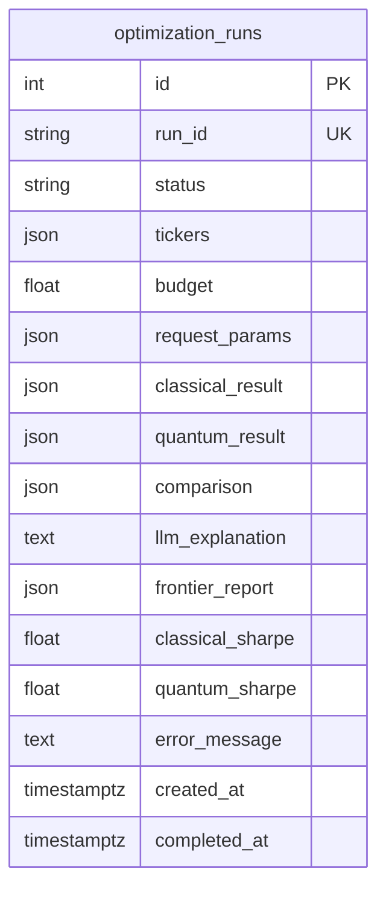

# Database Schema — `optimization_runs`

The `optimization_runs` table is the single persistent store for every portfolio
optimization request. It captures the full lifecycle of a run — from the moment
the API receives a request through to the final results or failure state — in one
denormalized row. This page documents every column, constraint, and index, along
with the design decisions behind the schema.

> **Source files:** `backend/alembic/versions/001_initial_schema.py`,
> `backend/alembic/versions/002_add_frontier_report.py`,
> `backend/app/db/models.py`

---

## Table Overview



---

## Column Reference

### Primary Key

| Column | Type | Nullable | Default | Comment |
|--------|------|----------|---------|---------|
| `id` | `INTEGER` | NOT NULL | autoincrement | Internal auto-increment primary key |

The `id` column is an internal surrogate key used by SQLAlchemy's identity map
and for foreign key references within the database. It is **never exposed** in
the public API — all external references use `run_id`.

---

### Identity

| Column | Type | Nullable | Default | Comment |
|--------|------|----------|---------|---------|
| `run_id` | `VARCHAR(36)` | NOT NULL | `uuid4()` (app-generated) | UUID exposed in the API |

`run_id` stores a standard UUID v4 formatted as a 36-character hyphenated string
(e.g., `"3f2504e0-4f89-11d3-9a0c-0305e82c3301"`). It is generated by the
application layer (Python's `uuid.uuid4()`) rather than the database, which
allows the API to return the `run_id` to the client immediately — before the
database row is committed.

**Why `VARCHAR(36)` instead of a native UUID type?**  
PostgreSQL has a native `UUID` type, but using `VARCHAR(36)` keeps the schema
portable across SQLite (used in tests) and PostgreSQL (production). The
application always generates and validates UUIDs in Python, so the database
type is purely a storage concern.

---

### Status

| Column | Type | Nullable | Default | Comment |
|--------|------|----------|---------|---------|
| `status` | `VARCHAR(20)` | NOT NULL | `'pending'` | Run lifecycle state |

Valid values are enforced by the `ck_optimization_runs_status` check constraint:

```
pending → running → completed
                 ↘ failed
```

| Value | Meaning |
|-------|---------|
| `pending` | Submitted to the API; not yet picked up by a Celery worker |
| `running` | A Celery worker is actively executing the agent graph |
| `completed` | Agent graph finished successfully; all result columns populated |
| `failed` | Unrecoverable error; `error_message` column populated |

---

### Request Inputs

| Column | Type | Nullable | Default | Comment |
|--------|------|----------|---------|---------|
| `tickers` | `JSON` | NOT NULL | — | JSON array of ticker symbols |
| `budget` | `FLOAT` | NOT NULL | — | Investment budget in USD |
| `request_params` | `JSON` | NOT NULL | `{}` | Full serialised `OptimizationRequest` |

**`tickers`** stores the raw list of ticker symbols submitted by the user, e.g.,
`["AAPL", "MSFT", "GOOGL"]`. This is a convenience denormalization — the same
data is also present inside `request_params` — but having it as a top-level
column makes it easy to display in list views without deserializing the full
request blob.

**`budget`** is the investment amount in USD. The `ck_optimization_runs_budget_positive`
check constraint ensures `budget > 0` at the database level.

**`request_params`** stores the complete `OptimizationRequest` Pydantic model
serialized to JSON via `model_dump(mode="json")`. This provides a full audit
trail of every parameter the user submitted, including constraint settings,
quantum flags, and frontier configuration.

---

### Result Columns (populated when `status = 'completed'`)

| Column | Type | Nullable | Comment |
|--------|------|----------|---------|
| `classical_result` | `JSON` | YES | Serialised `ClassicalResult` from Markowitz MVO |
| `quantum_result` | `JSON` | YES | Serialised `QuantumResult` (QAOA + VQE) |
| `comparison` | `JSON` | YES | Serialised `ComparisonSummary` |
| `llm_explanation` | `TEXT` | YES | LLM-generated natural language explanation |
| `frontier_report` | `JSON` | YES | Serialised `FrontierReport` (efficient-frontier bundle) |

All result columns are `NULL` until the run reaches `completed` status.

**`classical_result`** contains the full output of the Markowitz MVO solver:
portfolio weights, expected return, volatility, Sharpe ratio, and per-asset
allocation details.

**`quantum_result`** contains the combined output of the QAOA and VQE solvers.
This column is `NULL` when the user submitted `run_quantum: false` in the
request.

**`comparison`** contains the side-by-side comparison of classical vs. quantum
metrics, including which solver produced the higher Sharpe ratio.

**`llm_explanation`** stores the raw text generated by the LLM explanation node.
It uses `TEXT` rather than `JSON` because it is an unstructured string.

**`frontier_report`** was added in migration `002`. It stores the full
efficient-frontier sweep output (frontier points, dominant set, knee point,
reference portfolios, and LLM commentary) for runs where the user enabled
`frontier.enabled = true`. It is `NULL` for all runs that predate migration 002
and for runs where the frontier sweep was not requested.

---

### Denormalized Sharpe Columns

| Column | Type | Nullable | Comment |
|--------|------|----------|---------|
| `classical_sharpe` | `FLOAT` | YES | Denormalized classical Sharpe ratio |
| `quantum_sharpe` | `FLOAT` | YES | Denormalized quantum Sharpe ratio |

These two columns duplicate data that is also present inside `classical_result`
and `quantum_result`. The duplication is intentional:

> **Design decision:** The `/api/v1/runs` list endpoint returns paginated
> summaries of many runs. Without denormalized Sharpe columns, the server would
> need to deserialize potentially large JSON blobs for every row just to display
> a single metric. By storing the Sharpe ratios as top-level `FLOAT` columns,
> list queries can read them directly without touching the JSON columns.

`quantum_sharpe` stores the QAOA Sharpe ratio when available, falling back to
the VQE Sharpe ratio if QAOA was not run.

---

### Error Handling

| Column | Type | Nullable | Comment |
|--------|------|----------|---------|
| `error_message` | `TEXT` | YES | Human-readable error description |

Populated only when `status = 'failed'`. Contains the exception message or a
human-readable description of what went wrong (e.g., `"CVXPY solver failed:
infeasible"` or `"Quantum optimization timed out"`).

---

### Timestamps

| Column | Type | Nullable | Default | Comment |
|--------|------|----------|---------|---------|
| `created_at` | `TIMESTAMPTZ` | NOT NULL | `now()` (server default) | UTC submission time |
| `completed_at` | `TIMESTAMPTZ` | YES | `NULL` | UTC completion/failure time |

Both timestamps use `TIMESTAMPTZ` (timezone-aware) to avoid ambiguity. All
application code uses UTC explicitly via `datetime.now(UTC)`.

`created_at` uses a **server-side default** (`server_default=func.now()`) so
the database sets it atomically at insert time, even if the application layer
does not supply a value.

`completed_at` is `NULL` for `pending` and `running` runs. It is set by
`mark_completed()` and `mark_failed()` on the ORM model.

---

## Check Constraints

### `ck_optimization_runs_status`

```sql
CHECK (status IN ('pending', 'running', 'completed', 'failed'))
```

Enforces valid status values at the database level. This is a safety net beyond
the application-level validation — if a bug in the application code tries to
write an invalid status string, the database will reject the row.

### `ck_optimization_runs_budget_positive`

```sql
CHECK (budget > 0)
```

Ensures the investment budget is strictly positive. The API layer also validates
this via Pydantic (`budget: float = Field(gt=0)`), but the database constraint
provides defense-in-depth.

---

## Indexes

Four indexes are created on `optimization_runs`:

### `ix_optimization_runs_run_id`

```sql
CREATE UNIQUE INDEX ix_optimization_runs_run_id
    ON optimization_runs (run_id);
```

**Purpose:** Fast lookup by public UUID. Used by every `GET /api/v1/runs/{run_id}`
request. The `UNIQUE` constraint also enforces UUID uniqueness at the database
level (in addition to the application-level `uuid4()` generation).

**Cardinality:** Very high (one unique value per row). B-tree index is optimal.

---

### `ix_optimization_runs_status`

```sql
CREATE INDEX ix_optimization_runs_status
    ON optimization_runs (status);
```

**Purpose:** Filtering runs by lifecycle state. Used by queries like
`WHERE status = 'pending'` (e.g., monitoring dashboards, worker health checks).

**Cardinality:** Very low (only 4 distinct values). PostgreSQL may choose a
sequential scan for large result sets, but the index is useful for selective
queries (e.g., finding the few `running` rows).

---

### `ix_optimization_runs_created_at`

```sql
CREATE INDEX ix_optimization_runs_created_at
    ON optimization_runs (created_at);
```

**Purpose:** Chronological ordering for list queries (`ORDER BY created_at DESC`).
Used by the paginated `/api/v1/runs` endpoint when no status filter is applied.

---

### `ix_optimization_runs_status_created_at` (Composite)

```sql
CREATE INDEX ix_optimization_runs_status_created_at
    ON optimization_runs (status, created_at);
```

**Purpose:** Optimizes the most common list query pattern:

```sql
SELECT * FROM optimization_runs
WHERE status = 'completed'
ORDER BY created_at DESC
LIMIT 20 OFFSET 0;
```

The composite index allows PostgreSQL to satisfy both the `WHERE` clause and
the `ORDER BY` clause from a single index scan, avoiding a separate sort step.
This is defined in `__table_args__` on the ORM model:

```python
Index(
    "ix_optimization_runs_status_created_at",
    "status",
    "created_at",
)
```

---

## Design Decisions

### UUID `run_id` vs. Integer `id`

The table uses a **dual-key strategy**: an auto-increment integer `id` for
internal database operations (joins, foreign keys, ORM identity map) and a
UUID string `run_id` for all external API references.

This separation provides several benefits:

1. **Security:** Integer IDs are sequential and predictable. Exposing them in
   the API would allow clients to enumerate all runs. UUIDs are opaque.
2. **Distributed generation:** UUIDs can be generated by the application layer
   before the database row is inserted, allowing the API to return the `run_id`
   in the HTTP response immediately.
3. **Performance:** Integer primary keys are more efficient for B-tree indexes
   and foreign key lookups than 36-character strings.

### JSON Blobs for Results

The `classical_result`, `quantum_result`, `comparison`, and `frontier_report`
columns store rich nested objects as JSON blobs rather than normalizing them
into separate tables.

**Rationale:**
- The result schemas are complex and nested (weights, metrics, per-asset data).
  Normalizing them would require 5–10 additional tables with complex joins.
- Results are always read and written atomically — there is no use case for
  querying individual fields within a result.
- PostgreSQL's `JSON` type supports efficient storage and retrieval of arbitrary
  nested structures.
- The application already has Pydantic models for serialization/deserialization,
  so the JSON round-trip is handled transparently.

The trade-off is that you cannot write SQL queries against fields inside the
JSON blobs without using PostgreSQL's JSON operators (`->`, `->>`). This is
acceptable because all result queries go through the ORM layer.

### Denormalized Sharpe Columns

The `classical_sharpe` and `quantum_sharpe` columns are a deliberate
denormalization. The same values exist inside `classical_result` and
`quantum_result`, but extracting them for list queries would require either:

1. Deserializing the full JSON blob in Python for every row, or
2. Using PostgreSQL JSON operators in SQL (`classical_result->>'sharpe_ratio'`),
   which bypasses the ORM and is harder to maintain.

By storing them as top-level `FLOAT` columns, the list endpoint can include
Sharpe ratios in paginated responses with zero overhead.

---

## Related Pages

- [ORM Models](orm-models.md) — SQLAlchemy `OptimizationRun` model definition
- [Migrations](migrations.md) — Alembic migration history and workflow
- [Async Session](async-session.md) — Session factory and FastAPI dependency
