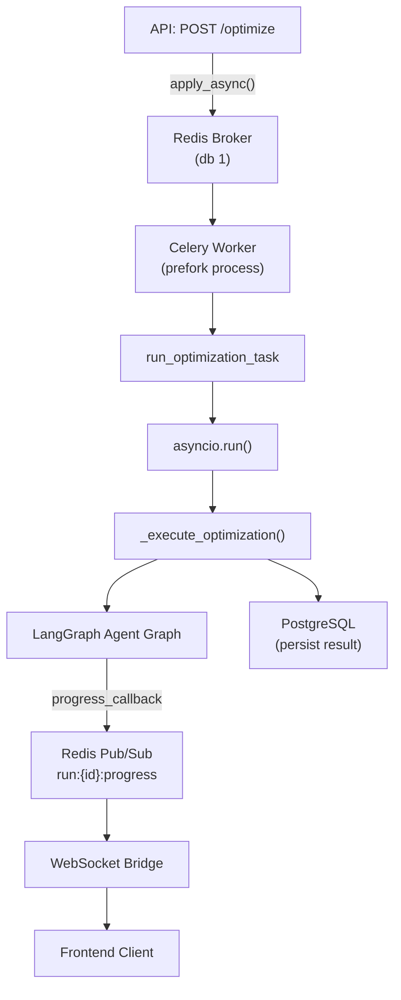
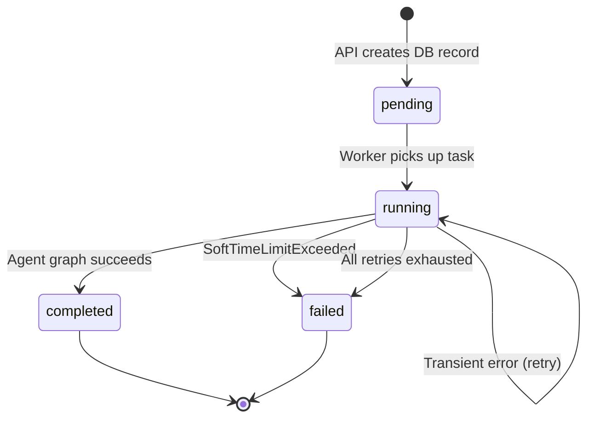
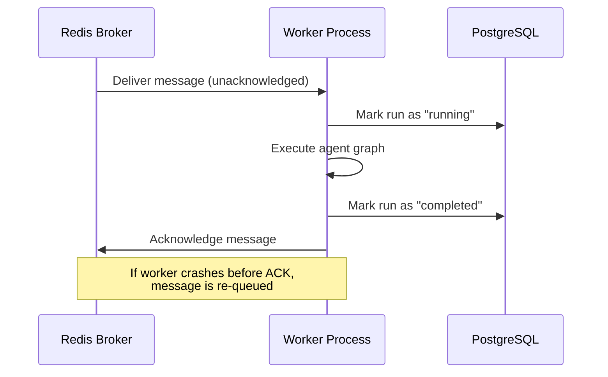

# Optimization Task

The `run_optimization_task` Celery task is the central execution unit of the Portfolio Optimizer. It bridges the synchronous Celery worker environment with the async LangGraph agent pipeline, manages the full run lifecycle in PostgreSQL, and publishes real-time progress events to Redis pub/sub.

All task code lives in `backend/app/workers/tasks.py`.

## Architecture Overview



## `OptimizationTask` Base Class

`OptimizationTask` extends Celery's `Task` base class to provide a **lazy-initialized Redis client** shared across all task invocations within a single worker process.

```python
class OptimizationTask(Task):
    """Base task class with Redis publisher for progress events."""

    _redis_client: redis.Redis | None = None

    @property
    def redis_client(self) -> redis.Redis:
        """Lazy-initialised synchronous Redis client for pub/sub publishing."""
        if self._redis_client is None:
            settings = get_settings()
            self._redis_client = redis.from_url(
                settings.REDIS_URL,
                decode_responses=True,
                socket_connect_timeout=5,
                socket_timeout=5,
                retry_on_timeout=True,
            )
        return self._redis_client
```

### Why Lazy Initialization?

The Redis client is created **once per worker process** on first use, not at module import time. This avoids:

1. **Connection overhead** — creating a new TCP connection for every task invocation
2. **Import-time failures** — if Redis is temporarily unavailable when the worker starts, the worker still boots successfully and retries the connection when the first task runs
3. **Resource waste** — worker processes that never execute tasks (e.g., during idle periods) never open a Redis connection

The `_redis_client` class variable is `None` by default and is set on first property access. Because Celery uses `prefork` concurrency (separate OS processes), each process has its own `_redis_client` instance — there is no cross-process sharing.

## Publishing Methods

`OptimizationTask` provides three methods for publishing events to the Redis pub/sub channel `run:{run_id}:progress`:

### `publish_progress()`

Publishes an intermediate progress event during agent node execution.

```python
def publish_progress(
    self,
    run_id: str,
    node: str,
    status: str,
    message: str,
) -> None:
```

| Parameter | Type | Description |
|-----------|------|-------------|
| `run_id` | `str` | UUID of the optimization run |
| `node` | `str` | Agent node name (e.g., `"data_fetch"`, `"classical_optimization"`) |
| `status` | `str` | `"started"` \| `"completed"` \| `"failed"` \| `"retrying"` |
| `message` | `str` | Human-readable description of the current step |

### `publish_result()`

Publishes the final successful result after the agent graph completes.

```python
def publish_result(
    self,
    run_id: str,
    result: dict[str, Any],
) -> None:
```

The `result` dict is the full serialized `OptimizationRunDetail` Pydantic model, including classical results, quantum results, comparison metrics, and the LLM explanation.

### `publish_error()`

Publishes a terminal error event when the task fails permanently.

```python
def publish_error(
    self,
    run_id: str,
    error_code: str,
    message: str,
) -> None:
```

| Parameter | Type | Description |
|-----------|------|-------------|
| `error_code` | `str` | Machine-readable code (e.g., `"QUANTUM_TIMEOUT"`, `"AGENT_EXECUTION_ERROR"`) |
| `message` | `str` | Human-readable error description |

All three methods silently swallow publish failures (logging a warning) so that a Redis connectivity issue does not cause the task itself to fail or retry.

## Task Registration

```python
@celery_app.task(
    bind=True,
    base=OptimizationTask,
    name="app.workers.tasks.run_optimization_task",
    max_retries=3,
    acks_late=True,
    throws=(SoftTimeLimitExceeded,),
)
def run_optimization_task(
    self: OptimizationTask,
    run_id: str,
    request_dict: dict[str, Any],
) -> dict[str, Any]:
```

Key decorator parameters:

| Parameter | Value | Meaning |
|-----------|-------|---------|
| `bind=True` | — | First argument is `self` (the task instance), giving access to `self.retry()`, `self.request`, etc. |
| `base=OptimizationTask` | — | Use the custom base class with the Redis publisher |
| `name` | `"app.workers.tasks.run_optimization_task"` | Explicit task name for stable routing |
| `max_retries` | `3` | Maximum retry attempts for transient failures |
| `acks_late` | `True` | Acknowledge broker message only after task completes |
| `throws` | `(SoftTimeLimitExceeded,)` | Do **not** retry on timeout — treat as a terminal failure |

## Task Lifecycle

The task transitions the run through four states stored in PostgreSQL:



### Phase 1: Pending → Running

When the worker picks up the task, `_execute_optimization()` is called inside `asyncio.run()`. The first action is to transition the DB record:

```python
async with AsyncSessionLocal() as session:
    run = await session.execute(
        select(OptimizationRun).where(OptimizationRun.run_id == run_id)
    )
    run.mark_running()
    await session.commit()
```

An initial progress event is immediately published:

```python
task.publish_progress(
    run_id=run_id,
    node="data_fetch",
    status="started",
    message="Fetching market data…",
)
```

### Phase 2: Running — Agent Graph Execution

The LangGraph agent graph is invoked with a `progress_callback` lambda that wires each node's progress into the Redis publisher:

```python
result_detail = await run_agent_graph(
    run_id=run_id,
    request=request,
    progress_callback=lambda node, status, msg: task.publish_progress(
        run_id=run_id,
        node=node,
        status=status,
        message=msg,
    ),
)
```

Each of the six agent nodes (`data_fetch`, `constraint_validation`, `classical_optimization`, `quantum_dispatch`, `comparison`, `llm_explanation`) calls the callback at start and completion, producing a stream of progress events visible to the frontend in real time.

### Phase 3: Running → Completed

On success, the result is persisted to PostgreSQL and the final result event is published:

```python
await _persist_completed_run(run_id, result_detail)
result_dict = result_detail.model_dump(mode="json")
task.publish_result(run_id=run_id, result=result_dict)
```

`_persist_completed_run()` populates all result columns:
- `classical_result` — MVO portfolio weights and metrics
- `quantum_result` — QAOA/VQE results (if applicable)
- `comparison` — side-by-side Sharpe ratio comparison
- `frontier_report` — efficient frontier data (if requested)
- `llm_explanation` — GPT-4o narrative explanation

### Phase 4: Async Bridge

Celery workers are synchronous processes. The async agent graph is bridged using `asyncio.run()`:

```python
result = asyncio.run(
    _execute_optimization(self, run_id, request_dict)
)
```

Each task invocation creates a fresh event loop. This is safe because Celery's `prefork` model gives each task its own OS process — there is no shared event loop state between concurrent tasks.

## Retry Policy

Transient failures (network errors, database timeouts, temporary API failures) trigger automatic retries with **exponential backoff**:

```python
_RETRY_BASE_DELAY_SECONDS = 30

# Inside the except block:
countdown = _RETRY_BASE_DELAY_SECONDS * (2 ** self.request.retries)
raise self.retry(exc=exc, countdown=countdown)
```

| Attempt | Delay Before Retry |
|---------|-------------------|
| 1st failure → retry 1 | 30 seconds |
| 2nd failure → retry 2 | 60 seconds |
| 3rd failure → retry 3 | 120 seconds |
| 4th failure | Permanent failure (no more retries) |

Before scheduling a retry, a `progress` event with `status="retrying"` is published so the frontend can display a "retrying" indicator rather than appearing stuck:

```python
self.publish_progress(
    run_id=run_id,
    node="worker",
    status="retrying",
    message=(
        f"Transient error encountered. Retrying in {countdown}s "
        f"(attempt {self.request.retries + 1}/{self.max_retries})…"
    ),
)
```

After all retries are exhausted, the task publishes an `error` event and persists the failure to the database:

```python
self.publish_error(
    run_id=run_id,
    error_code="AGENT_EXECUTION_ERROR",
    message=str(exc),
)
asyncio.run(_persist_failure(run_id, str(exc)))
raise
```

## `SoftTimeLimitExceeded` Handling

Quantum optimization jobs can run for a long time. When `QUANTUM_TIMEOUT_SECONDS` elapses, Celery raises `SoftTimeLimitExceeded` inside the running task. This is handled specially — **no retry is scheduled**:

```python
except SoftTimeLimitExceeded:
    error_message = (
        "Quantum optimization timed out. "
        "Try reducing the number of assets or disabling quantum optimization."
    )
    self.publish_error(
        run_id=run_id,
        error_code="QUANTUM_TIMEOUT",
        message=error_message,
    )
    asyncio.run(_persist_failure(run_id, error_message))
    raise  # Re-raise so Celery marks the task as FAILURE (not RETRY)
```

The `throws=(SoftTimeLimitExceeded,)` decorator parameter tells Celery to treat this exception as a terminal failure rather than an unexpected error, suppressing the default retry behavior.

> **Why no retry on timeout?** A quantum circuit that times out at 60 seconds will time out again on retry. Retrying would waste resources and delay the user's error response. The user is advised to reduce the number of assets or disable quantum optimization.

## Database Persistence Helpers

Three async helper functions manage database state transitions:

| Function | Transition | Notes |
|----------|-----------|-------|
| `_execute_optimization()` | `pending → running` | Also creates the record if missing (safety net) |
| `_persist_completed_run()` | `running → completed` | Populates all result columns |
| `_persist_failure()` | `running → failed` | Records error message |
| `_update_run_status()` | Any → any | Lightweight status-only update |

All helpers use `AsyncSessionLocal` (SQLAlchemy async session) and handle `None` gracefully — if the run record is not found, a warning is logged and the function returns without raising.

## `acks_late=True` Semantics

With `acks_late=True`, the message acknowledgment lifecycle is:



If the worker process is killed between "Mark run as completed" and "Acknowledge message", the task will be re-executed. The second execution will find the run already in `completed` state and overwrite it with the same result — a safe idempotent operation.

## Related Pages

- [Celery Configuration](celery-configuration.md) — Broker URLs, serialization, time limits, and beat scheduler
- [Queue Routing](queue-routing.md) — How `run_quantum` determines which queue receives the task
- [Progress Events](progress-events.md) — Redis pub/sub channel naming and all message schemas
- [Agent Pipeline](../02-architecture/agent-pipeline.md) — The LangGraph graph that the task executes
