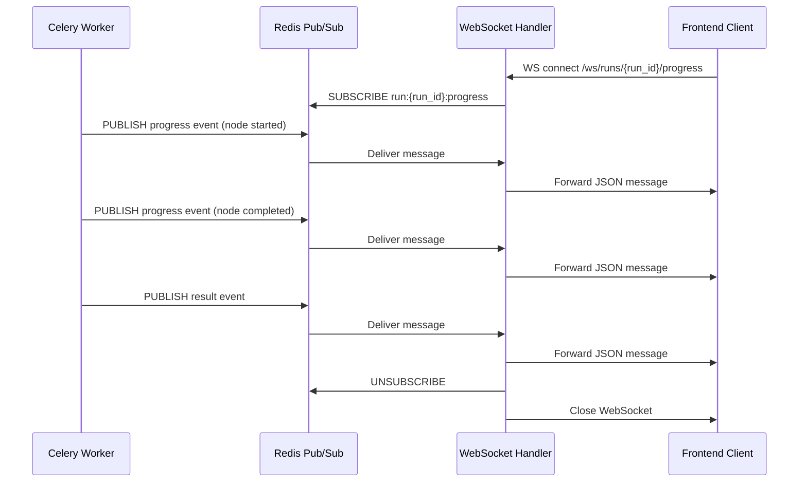
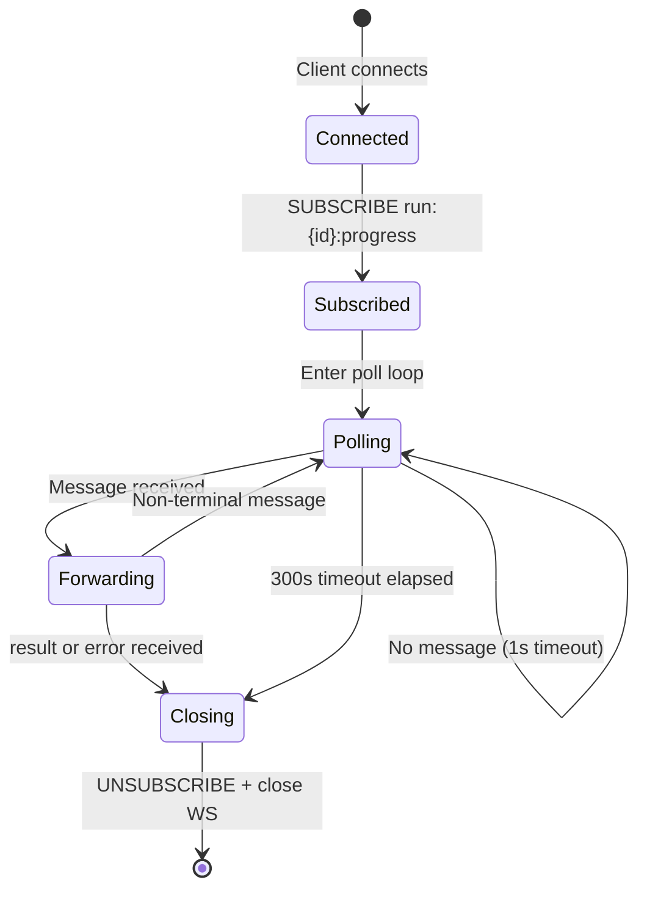

# Progress Events

The Portfolio Optimizer streams real-time progress updates from the Celery worker to the browser using **Redis pub/sub** as the message bus and a **WebSocket bridge** in `backend/app/api/websocket.py` as the delivery mechanism. This page documents the channel naming convention, all message types and their JSON schemas, timestamp format, the WebSocket bridge implementation, and event ordering guarantees.

## Architecture



## Channel Naming

Every optimization run gets its own dedicated Redis pub/sub channel:

```
run:{run_id}:progress
```

Where `{run_id}` is the UUID assigned to the run at submission time (e.g., `run:3f7a1b2c-4d5e-6f7a-8b9c-0d1e2f3a4b5c:progress`).

This naming scheme provides:
- **Isolation** — subscribers only receive events for the run they care about; no filtering needed
- **Debuggability** — you can manually subscribe to a channel in `redis-cli` to inspect events for a specific run
- **Scalability** — channels are ephemeral and cost nothing when no subscribers are active

```bash
# Manually inspect events for a run (useful for debugging)
redis-cli SUBSCRIBE "run:3f7a1b2c-4d5e-6f7a-8b9c-0d1e2f3a4b5c:progress"
```

## Message Types

Four message types flow through the channel. All messages are JSON-encoded strings.

### 1. `progress` — Agent Node Update

Published by `OptimizationTask.publish_progress()` at the start and completion of each agent node.

```json
{
  "type": "progress",
  "run_id": "3f7a1b2c-4d5e-6f7a-8b9c-0d1e2f3a4b5c",
  "node": "data_fetch",
  "status": "started",
  "message": "Fetching market data…",
  "timestamp": "2026-06-15T10:23:45.123456+00:00"
}
```

**Schema:**

| Field | Type | Description |
|-------|------|-------------|
| `type` | `"progress"` | Discriminator field |
| `run_id` | `string` (UUID) | Identifies the optimization run |
| `node` | `string` | Agent node name (see table below) |
| `status` | `string` | `"started"` \| `"completed"` \| `"failed"` \| `"retrying"` |
| `message` | `string` | Human-readable description of the current step |
| `timestamp` | `string` (ISO 8601) | UTC timestamp with microsecond precision |

**Node names and their meanings:**

| `node` value | Agent Node | Typical Duration |
|-------------|-----------|-----------------|
| `data_fetch` | Market data fetching from Yahoo Finance | 1–5 seconds |
| `constraint_validation` | Portfolio constraint validation | < 1 second |
| `classical_optimization` | Markowitz MVO / multi-objective optimization | 1–10 seconds |
| `quantum_dispatch` | QAOA/VQE quantum circuit simulation | 10–120 seconds |
| `comparison` | Classical vs. quantum result comparison | < 1 second |
| `llm_explanation` | GPT-4o narrative explanation generation | 3–15 seconds |
| `worker` | Worker-level events (e.g., retry notifications) | — |

**Example sequence for a classical-only run:**

```json
{"type":"progress","node":"data_fetch","status":"started","message":"Fetching market data…"}
{"type":"progress","node":"data_fetch","status":"completed","message":"Market data fetched for 5 tickers"}
{"type":"progress","node":"constraint_validation","status":"started","message":"Validating constraints…"}
{"type":"progress","node":"constraint_validation","status":"completed","message":"Constraints validated"}
{"type":"progress","node":"classical_optimization","status":"started","message":"Running Markowitz MVO…"}
{"type":"progress","node":"classical_optimization","status":"completed","message":"Classical optimization complete"}
{"type":"progress","node":"comparison","status":"started","message":"Comparing results…"}
{"type":"progress","node":"comparison","status":"completed","message":"Comparison complete"}
{"type":"progress","node":"llm_explanation","status":"started","message":"Generating explanation…"}
{"type":"progress","node":"llm_explanation","status":"completed","message":"Explanation generated"}
{"type":"result","run_id":"...","result":{...}}
```

### 2. `result` — Final Successful Result

Published by `OptimizationTask.publish_result()` after the agent graph completes successfully and the result is persisted to PostgreSQL.

```json
{
  "type": "result",
  "run_id": "3f7a1b2c-4d5e-6f7a-8b9c-0d1e2f3a4b5c",
  "result": {
    "run_id": "3f7a1b2c-4d5e-6f7a-8b9c-0d1e2f3a4b5c",
    "status": "completed",
    "classical_result": {
      "weights": {"AAPL": 0.35, "MSFT": 0.25, "GOOGL": 0.20, "AMZN": 0.20},
      "metrics": {
        "expected_return": 0.142,
        "volatility": 0.187,
        "sharpe_ratio": 1.24
      }
    },
    "quantum_result": null,
    "comparison": null,
    "frontier_report": null,
    "llm_explanation": "The optimized portfolio allocates 35% to Apple…"
  }
}
```

**Schema:**

| Field | Type | Description |
|-------|------|-------------|
| `type` | `"result"` | Discriminator field |
| `run_id` | `string` (UUID) | Identifies the optimization run |
| `result` | `object` | Full `OptimizationRunDetail` serialized as JSON |

The `result` object structure mirrors the response from `GET /api/v1/runs/{run_id}`. See [Runs Endpoints](../04-api-reference/runs-endpoints.md) for the complete schema.

> **Terminal event**: The WebSocket bridge closes the connection after receiving a `result` message. The frontend should treat this as the final state.

### 3. `error` — Terminal Failure

Published by `OptimizationTask.publish_error()` when the task fails permanently (all retries exhausted, or `SoftTimeLimitExceeded`).

```json
{
  "type": "error",
  "run_id": "3f7a1b2c-4d5e-6f7a-8b9c-0d1e2f3a4b5c",
  "error_code": "QUANTUM_TIMEOUT",
  "message": "Quantum optimization timed out. Try reducing the number of assets or disabling quantum optimization.",
  "timestamp": "2026-06-15T10:25:12.456789+00:00"
}
```

**Schema:**

| Field | Type | Description |
|-------|------|-------------|
| `type` | `"error"` | Discriminator field |
| `run_id` | `string` (UUID) | Identifies the optimization run |
| `error_code` | `string` | Machine-readable error code |
| `message` | `string` | Human-readable error description |
| `timestamp` | `string` (ISO 8601) | UTC timestamp with microsecond precision |

**Known error codes:**

| `error_code` | Cause | Retried? |
|-------------|-------|---------|
| `QUANTUM_TIMEOUT` | `SoftTimeLimitExceeded` — quantum circuit exceeded time limit | No |
| `AGENT_EXECUTION_ERROR` | Unhandled exception after all retries exhausted | No (retries exhausted) |
| `WEBSOCKET_TIMEOUT` | WebSocket connection open for 300 seconds without terminal event | N/A (WS-level) |
| `WEBSOCKET_ERROR` | Internal error in the WebSocket handler | N/A (WS-level) |

> **Terminal event**: The WebSocket bridge closes the connection after receiving an `error` message.

### 4. `ping` — Keepalive

Published by the **WebSocket handler** (not the Celery worker) every 30 seconds to prevent proxy/load balancer timeouts during long-running quantum jobs.

```json
{
  "type": "ping",
  "run_id": "3f7a1b2c-4d5e-6f7a-8b9c-0d1e2f3a4b5c",
  "timestamp": "2026-06-15T10:24:15.789012+00:00"
}
```

The frontend should silently ignore `ping` messages — they carry no optimization data and exist solely to keep the TCP connection alive.

## Timestamp Format

All timestamps use **ISO 8601 format with UTC timezone and microsecond precision**:

```
2026-06-15T10:23:45.123456+00:00
```

Generated by:

```python
from datetime import UTC, datetime
datetime.now(UTC).isoformat()
```

The `+00:00` suffix explicitly indicates UTC. Clients should parse this as a timezone-aware datetime and convert to local time for display.

## WebSocket Bridge

The WebSocket endpoint at `WS /ws/runs/{run_id}/progress` (implemented in `backend/app/api/websocket.py`) acts as a bridge between Redis pub/sub and the browser WebSocket connection.

### Connection Lifecycle



### Key Implementation Details

**Dedicated Redis connection per WebSocket:**

```python
redis_client = aioredis.from_url(
    settings.REDIS_URL,
    encoding="utf-8",
    decode_responses=True,
)
pubsub = redis_client.pubsub()
await pubsub.subscribe(channel)
```

Each WebSocket connection creates its own `redis.asyncio` client and pub/sub object. This avoids sharing pub/sub state across concurrent connections, which would cause message routing errors.

**Non-blocking poll loop:**

```python
message = await asyncio.wait_for(
    pubsub.get_message(ignore_subscribe_messages=True),
    timeout=poll_timeout,
)
```

The handler polls Redis with a 1-second timeout, looping back to check the keepalive ping interval and overall connection timeout on each iteration. This non-blocking design allows the async event loop to handle other WebSocket connections concurrently.

**Terminal message detection:**

```python
msg_type = data.get("type")
if msg_type in ("result", "error"):
    break
```

The loop exits immediately upon receiving a `result` or `error` message, triggering cleanup and WebSocket closure.

**Guaranteed cleanup:**

```python
finally:
    await pubsub.unsubscribe(channel)
    await pubsub.aclose()
    await redis_client.aclose()
```

The `finally` block ensures the Redis subscription and connection are always released, even if the client disconnects abruptly (`WebSocketDisconnect`) or an unexpected exception occurs.

### Timeout Behavior

| Timeout | Value | Behavior |
|---------|-------|----------|
| Overall connection timeout | 300 seconds | Sends `WEBSOCKET_TIMEOUT` error and closes |
| Keepalive ping interval | 30 seconds | Sends `ping` message to client |
| Redis poll timeout | 1 second | Loops back to check ping/timeout |

The 300-second overall timeout is generous enough to accommodate the longest quantum optimization jobs (up to `QUANTUM_TIMEOUT_SECONDS + 120` seconds for the hard kill limit). If a client disconnects and reconnects, it should poll `GET /api/v1/runs/{run_id}/status` to check the current state, then reconnect to the WebSocket if the run is still in progress.

## Event Ordering Guarantees

Redis pub/sub delivers messages **in the order they are published** to a single channel. Since all progress events for a run are published by a single Celery worker process (sequentially, not concurrently), the ordering guarantee is:

1. `progress` events arrive in agent node execution order
2. The `result` or `error` event always arrives **after** all `progress` events
3. The WebSocket bridge forwards messages in the same order it receives them from Redis

> **No persistence**: Redis pub/sub is fire-and-forget. If the WebSocket client is not connected when an event is published, that event is **lost**. Clients that connect after the run completes should use `GET /api/v1/runs/{run_id}` to retrieve the final result from PostgreSQL rather than relying on the WebSocket stream.

## Debugging

To manually inspect events for a running optimization:

```bash
# Subscribe to a run's progress channel
redis-cli SUBSCRIBE "run:YOUR-RUN-ID-HERE:progress"

# List all active progress channels
redis-cli PUBSUB CHANNELS "run:*:progress"

# Count subscribers on a channel
redis-cli PUBSUB NUMSUB "run:YOUR-RUN-ID-HERE:progress"
```

## Related Pages

- [Optimization Task](optimization-task.md) — How `publish_progress()`, `publish_result()`, and `publish_error()` are called
- [WebSocket Endpoint](../04-api-reference/websocket-endpoint.md) — API reference for the WebSocket endpoint
- [Redis Caching](../08-data-layer/redis-caching.md) — Redis database allocation and caching strategy
- [Queue Routing](queue-routing.md) — How tasks are routed to `default` vs `quantum` queues
