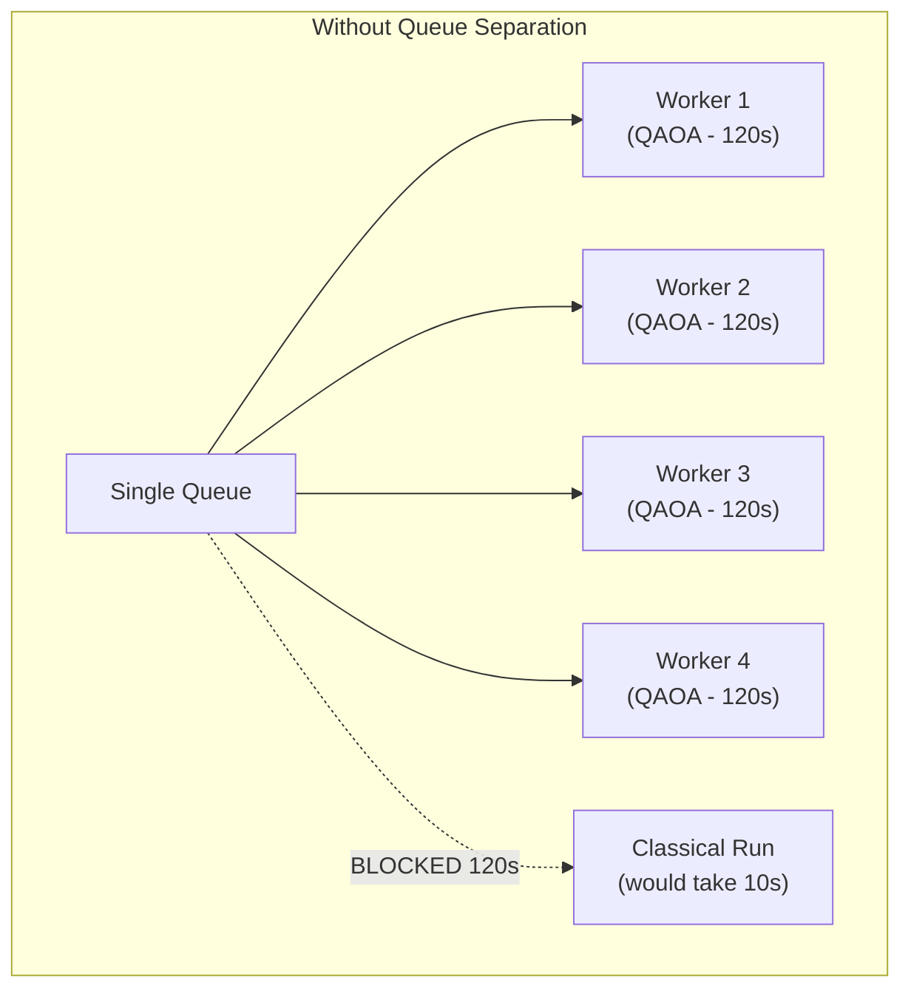
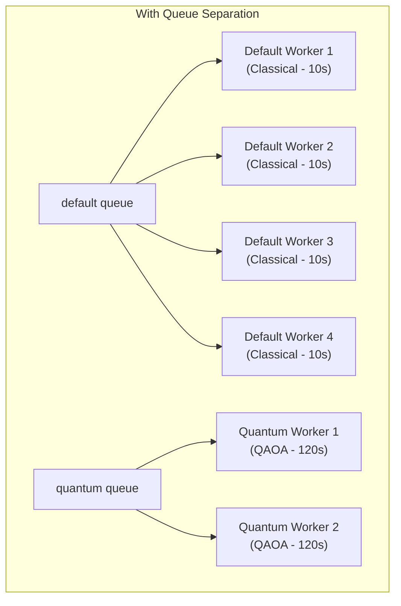

# Queue Routing

The Portfolio Optimizer uses two separate Celery queues — `default` and `quantum` — served by two separate worker processes. This page explains the routing logic, the rationale for queue separation, and how to tune concurrency for each queue.

## The Problem: Slow Quantum Jobs Block Fast Classical Runs

Without queue separation, a single worker pool would process both classical and quantum optimization requests. Classical Markowitz MVO runs complete in 5–15 seconds. QAOA/VQE quantum simulations can take 60–120 seconds or more.

If a single worker pool with concurrency 4 receives 4 simultaneous quantum jobs, **all 4 worker slots are occupied** for up to 2 minutes. Any classical optimization request submitted during that window sits in the queue waiting — even though it would complete in under 15 seconds if a worker were available.





Queue separation ensures that quantum jobs can never starve classical runs, regardless of how many quantum jobs are in flight.

## Queue Definitions

Two queues are defined in `celery_app.py`:

```python
task_queues={
    "default": {"exchange": "default", "routing_key": "default"},
    "quantum": {"exchange": "quantum", "routing_key": "quantum"},
},
task_default_queue="default",
```

| Queue | Exchange | Routing Key | Consumer |
|-------|----------|-------------|----------|
| `default` | `default` | `default` | `worker` service |
| `quantum` | `quantum` | `quantum` | `worker-quantum` service |

## Routing Decision

The routing decision is made at the **API layer** in `backend/app/api/v1/optimize.py`, based on the `run_quantum` field in the `OptimizationRequest` body:

```python
run_optimization_task.apply_async(
    kwargs={
        "run_id": run_id,
        "request_dict": request.model_dump(mode="json"),
    },
    task_id=run_id,
    queue="quantum" if request.run_quantum else "default",
)
```

This is a simple boolean branch:

| `run_quantum` | Queue | Worker |
|--------------|-------|--------|
| `false` (default) | `default` | `worker` |
| `true` | `quantum` | `worker-quantum` |

The `task_routes` configuration in `celery_app.py` sets the static default to `default`:

```python
task_routes={
    "app.workers.tasks.run_optimization_task": {
        "queue": "default",
    },
},
```

The `apply_async(queue=...)` call at dispatch time **overrides** this static route, so the routing is always determined by the request's `run_quantum` flag.

## Worker Services

### `worker` — Default Queue (Classical Runs)

```yaml
# docker-compose.yml
worker:
  command: >
    celery -A app.workers.celery_app worker
    --loglevel=info
    --concurrency=${CELERY_DEFAULT_CONCURRENCY:-4}
    --queues=default
    -n default-worker@%h
```

- **Queue**: `default` only
- **Default concurrency**: 4 prefork processes
- **Typical task duration**: 5–15 seconds
- **Worker name pattern**: `default-worker@<hostname>`

The `worker` service handles all classical-only optimization runs. With 4 concurrent processes and 15-second tasks, this worker can process approximately 16 runs per minute at full load.

### `worker-quantum` — Quantum Queue

```yaml
# docker-compose.yml
worker-quantum:
  command: >
    celery -A app.workers.celery_app worker
    --loglevel=info
    --concurrency=${CELERY_QUANTUM_CONCURRENCY:-2}
    --queues=quantum
    -n quantum-worker@%h
```

- **Queue**: `quantum` only
- **Default concurrency**: 2 prefork processes
- **Typical task duration**: 30–120 seconds
- **Worker name pattern**: `quantum-worker@<hostname>`

The `worker-quantum` service handles all runs with `run_quantum=true`. Concurrency is intentionally lower (2 vs 4) because:

1. **CPU saturation**: QAOA/VQE simulations are CPU-bound. Running 4 simultaneous quantum simulations on a typical 4-core machine would cause all 4 to run at 25% CPU speed, making each take 4× longer.
2. **Memory pressure**: Quantum circuit state vectors grow exponentially with the number of qubits. Multiple simultaneous simulations can exhaust available RAM.
3. **Timeout risk**: Slower execution due to resource contention increases the probability of hitting `QUANTUM_TIMEOUT_SECONDS`.

## Production Worker Configuration

In production (`docker-compose.prod.yml`), additional flags are set for efficiency:

```yaml
command: >
  celery -A app.workers.celery_app worker
  --loglevel=warning
  --concurrency=${CELERY_DEFAULT_CONCURRENCY:-4}
  --queues=default
  -n default-worker@%h
  --max-tasks-per-child=100
  --max-memory-per-child=512000
  --without-gossip
  --without-mingle
  --without-heartbeat
```

| Flag | Value | Purpose |
|------|-------|---------|
| `--max-tasks-per-child` | `100` (default) / `50` (quantum) | Recycle worker processes to prevent memory leaks |
| `--max-memory-per-child` | `512000` KB (default) / `1024000` KB (quantum) | Kill and restart workers that exceed memory limit |
| `--without-gossip` | — | Disable worker-to-worker gossip protocol (reduces Redis traffic) |
| `--without-mingle` | — | Disable startup synchronization (faster worker startup) |
| `--without-heartbeat` | — | Disable heartbeat (reduces Redis traffic in production) |

The quantum worker gets a higher `--max-memory-per-child` limit (1 GB vs 512 MB) because quantum circuit simulation requires more memory per task.

## Concurrency Tuning

### Environment Variables

| Variable | Default | Description |
|----------|---------|-------------|
| `CELERY_DEFAULT_CONCURRENCY` | `4` | Prefork processes for the `default` worker |
| `CELERY_QUANTUM_CONCURRENCY` | `2` | Prefork processes for the `quantum` worker |

### Recommended Values by Host Size

| Host CPUs | `CELERY_DEFAULT_CONCURRENCY` | `CELERY_QUANTUM_CONCURRENCY` |
|-----------|------------------------------|------------------------------|
| 2 cores | 2 | 1 |
| 4 cores | 4 | 2 |
| 8 cores | 6 | 2 |
| 16 cores | 8 | 4 |

For the quantum worker, a good rule of thumb is: **`CELERY_QUANTUM_CONCURRENCY` ≤ (CPU cores / 2)**. This leaves headroom for the OS, the FastAPI backend, and other services.

### Horizontal Scaling

In production, the `worker` service can be scaled horizontally by running multiple replicas:

```bash
# Scale the default worker to 3 replicas
docker compose -f docker-compose.prod.yml up -d --scale worker=3

# Or set CELERY_DEFAULT_REPLICAS in .env.prod
CELERY_DEFAULT_REPLICAS=3
```

Each replica connects to the same Redis broker and consumes from the same `default` queue. Celery's broker-based load balancing distributes tasks across all replicas automatically.

> **Quantum worker scaling**: The `worker-quantum` service can also be scaled horizontally, but each replica should have low concurrency (1–2) to avoid CPU contention. Prefer more replicas with lower concurrency over fewer replicas with higher concurrency for quantum workloads.

## `worker_prefetch_multiplier=1`

A critical setting that works in tandem with queue separation:

```python
worker_prefetch_multiplier=1,
```

Without this setting, Celery's default prefetch of 4 would cause each worker process to fetch 4 tasks from the broker simultaneously, holding them in memory. For the quantum worker with concurrency 2, this would mean 8 tasks are fetched but only 2 can run — the other 6 are held in the worker's internal queue, invisible to other workers.

With `prefetch_multiplier=1`, each worker process fetches **exactly one task** at a time. Tasks remain in the Redis broker until a worker is ready to execute them, allowing fair distribution across all worker processes and replicas.

## Task ID Equals Run ID

A subtle but important detail: the Celery task ID is set to the same value as the `run_id`:

```python
run_optimization_task.apply_async(
    kwargs={...},
    task_id=run_id,  # Task ID = Run ID
    queue="quantum" if request.run_quantum else "default",
)
```

This means:
- The Celery result backend stores the result under the key `celery-task-meta-{run_id}`
- You can look up the Celery task state using the `run_id` directly
- There is no need to store a separate "celery task ID" in the database

## Monitoring Queue Depth

To check how many tasks are waiting in each queue:

```bash
# Check queue lengths in Redis
redis-cli LLEN celery          # default queue
redis-cli LLEN quantum         # quantum queue

# Or use Celery's inspect command
celery -A app.workers.celery_app inspect active
celery -A app.workers.celery_app inspect reserved
celery -A app.workers.celery_app inspect stats
```

In production, consider adding [Flower](https://flower.readthedocs.io/) — a real-time Celery monitoring tool — to visualize queue depths, worker status, and task history.

## Related Pages

- [Celery Configuration](celery-configuration.md) — Full Celery configuration including `worker_prefetch_multiplier` and time limits
- [Optimization Task](optimization-task.md) — `run_optimization_task` implementation and retry policy
- [Progress Events](progress-events.md) — Redis pub/sub events published during task execution
- [Optimize Endpoint](../04-api-reference/optimize-endpoint.md) — API endpoint that dispatches tasks to the appropriate queue
