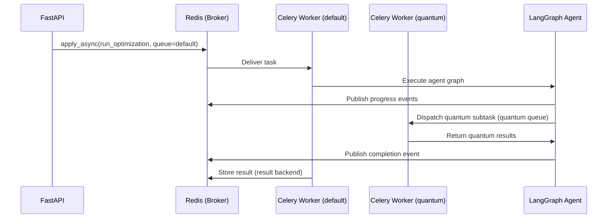

# Workers (Task Queue)

Documentation for the Celery task queue — the celery app configuration, task definitions for async optimization jobs, queue routing, and result handling.

## Section Contents

| Page | Description |
|------|-------------|
| [Celery Configuration](../10-task-queue/celery-configuration.md) | Celery app setup, broker URL, result backend, and serialization |
| [Optimization Task](../10-task-queue/optimization-task.md) | The main `run_optimization` Celery task definition |
| [Progress Events](../10-task-queue/progress-events.md) | Redis pub/sub event publishing and WebSocket forwarding |
| [Queue Routing](../10-task-queue/queue-routing.md) | `default` vs. `quantum` queue routing and worker configuration |

## Task Queue Architecture

The Portfolio Optimizer uses **Celery 5** with **Redis** as both the message broker and result backend. Optimization jobs are executed asynchronously to avoid blocking the FastAPI event loop.

## Queue Design

| Queue | Workers | Task Types | Timeout |
|-------|---------|-----------|---------|
| `default` | 2–4 | Classical optimization, data fetch, LLM explanation | 300s |
| `quantum` | 1–2 | QAOA + VQE simulation | 600s |

## Cross-References

- **Agent pipeline** → [Graph Definition](../05-agent-layer/graph-definition.md)
- **WebSocket progress streaming** → [WebSocket Endpoint](../04-api-reference/websocket-endpoint.md)
- **Progress event format** → [Progress Events](../10-task-queue/progress-events.md)
- **Infrastructure** → [Docker Compose](../14-infrastructure/docker-compose.md)
