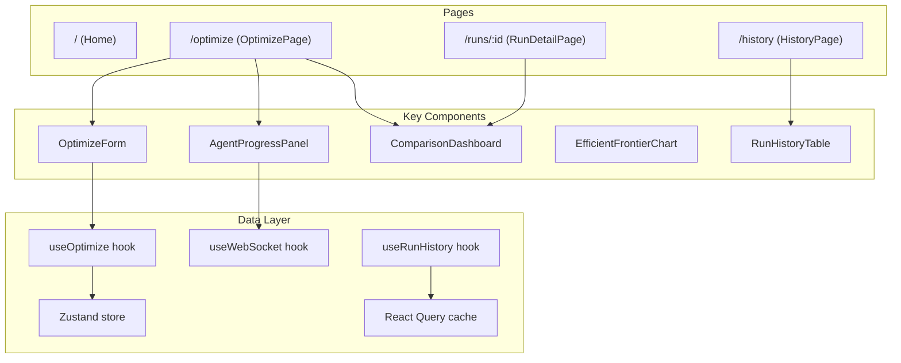

# Frontend

Documentation for the React + Vite + shadcn/ui frontend — component architecture, pages, custom hooks, the API client, TypeScript types, and the real-time WebSocket integration.

## Section Contents

| Page | Description |
|------|-------------|
| [Project Structure](project-structure.md) | Directory layout, module organization, and build configuration |
| [Pages](pages.md) | Route-level page components (Home, Optimize, History, Run Detail) |
| [Components](components.md) | Reusable UI components (OptimizeForm, ComparisonDashboard, AgentProgressPanel) |
| [Hooks](hooks.md) | Custom React hooks (useOptimize, useRunHistory, useWebSocket) |
| [API Client](api-client.md) | Axios-based REST client and WebSocket manager |
| [State Management](state-management.md) | Zustand stores and React Query integration |
| [Type Definitions](type-definitions.md) | TypeScript interfaces, enums, and type guards |

## Technology Stack

| Technology | Version | Purpose |
|-----------|---------|---------|
| React | 18 | UI framework |
| Vite | 5 | Build tool and dev server |
| TypeScript | 5 | Type safety |
| shadcn/ui | latest | Component library |
| Tailwind CSS | 3 | Utility-first styling |
| Zustand | 4 | Client state management |
| React Query (TanStack) | 5 | Server state and caching |
| Axios | 1 | HTTP client |
| Recharts | 2 | Data visualization (efficient frontier) |

## Application Structure

## Cross-References

- **API endpoints consumed** → [API Reference](../04-api-reference/optimize-endpoint.md)
- **WebSocket protocol** → [WebSocket Endpoint](../04-api-reference/websocket-endpoint.md)
- **TypeScript types mirror Pydantic schemas** → [Response Schemas](../12-schemas/response-schemas.md)
- **Frontend tests** → [Frontend Tests](../13-testing/frontend-tests.md)
