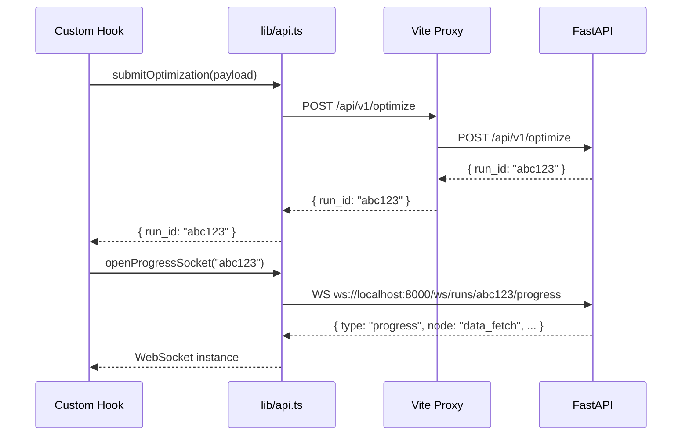

# API Client

The frontend API client (`src/lib/api.ts`) provides a typed interface to the Portfolio Optimizer backend. All REST calls and WebSocket connections go through this module. It handles base URL configuration, request serialization, error normalization, and WebSocket factory creation.

## Base URL Configuration

```typescript
const API_BASE = import.meta.env.VITE_API_BASE_URL
  ? `${import.meta.env.VITE_API_BASE_URL}/api/v1`
  : "/api/v1";

const WS_BASE = import.meta.env.VITE_WS_BASE_URL ?? "ws://localhost:8000";
```

### Environment Variables

| Variable | Default | Description |
|----------|---------|-------------|
| `VITE_API_BASE_URL` | *(none)* | Full backend base URL (e.g. `http://api.example.com`). When unset, uses `/api/v1` (proxied by Vite dev server). |
| `VITE_WS_BASE_URL` | `ws://localhost:8000` | WebSocket base URL. Used directly — not proxied. |

In development, the Vite dev server proxies `/api` to `http://localhost:8000`, so `API_BASE` resolves to `/api/v1` and requests are transparently forwarded. In production, set `VITE_API_BASE_URL` to the full backend URL.

> **Note:** `VITE_WS_BASE_URL` must be set explicitly in production since WebSocket connections cannot be proxied by the CDN/static host serving the frontend.

---

## `ApiError` Class

```typescript
class ApiError extends Error {
  constructor(
    public readonly status: number,
    public readonly errorCode: string,
    message: string,
    public readonly details?: Record<string, unknown>,
  ) {
    super(message);
    this.name = "ApiError";
  }
}
```

`ApiError` is thrown by `request<T>()` when the backend returns a non-2xx response. It captures:

| Property | Type | Description |
|----------|------|-------------|
| `status` | `number` | HTTP status code (e.g. `422`, `500`) |
| `errorCode` | `string` | Backend error code from `error_code` field (e.g. `"VALIDATION_ERROR"`) |
| `message` | `string` | Human-readable error message |
| `details` | `Record<string, unknown>` | Optional structured error details |

The `ApiError` class extends `Error`, so it can be caught with `instanceof Error` checks and its `message` property is compatible with standard error handling.

---

## `request<T>()` Generic Helper

```typescript
async function request<T>(
  path: string,
  options: RequestInit = {},
): Promise<T> {
  const url = `${API_BASE}${path}`;
  const response = await fetch(url, {
    headers: {
      "Content-Type": "application/json",
      ...options.headers,
    },
    ...options,
  });

  if (!response.ok) {
    let errorBody: {
      error_code?: string;
      message?: string;
      details?: Record<string, unknown>;
    } = {};
    try {
      errorBody = await response.json();
    } catch {
      // ignore parse errors
    }
    throw new ApiError(
      response.status,
      errorBody.error_code ?? "UNKNOWN_ERROR",
      errorBody.message ?? `HTTP ${response.status}`,
      errorBody.details,
    );
  }

  return response.json() as Promise<T>;
}
```

### Behavior

1. Constructs the full URL by prepending `API_BASE`
2. Merges `Content-Type: application/json` with any caller-provided headers
3. On non-2xx response: attempts to parse the error body as JSON, then throws `ApiError`
4. On success: parses and returns the response body as `T`

The generic type parameter `T` provides compile-time type safety for the response shape:

```typescript
// TypeScript knows the return type is { run_id: string }
const { run_id } = await request<{ run_id: string }>("/optimize", {
  method: "POST",
  body: JSON.stringify(payload),
});
```

---

## Exported Functions

### `submitOptimization`

```typescript
export async function submitOptimization(
  payload: OptimizationRequest,
): Promise<{ run_id: string }>
```

Submits a new optimization run. Returns the `run_id` immediately; progress is streamed via WebSocket.

**Endpoint:** `POST /api/v1/optimize`

| Parameter | Type | Description |
|-----------|------|-------------|
| `payload` | `OptimizationRequest` | Full optimization request (tickers, budget, constraints, etc.) |

**Returns:** `{ run_id: string }` — the UUID of the newly created run.

**Throws:** `ApiError` on validation errors (422) or server errors (500).

```typescript
const { run_id } = await submitOptimization({
  tickers: ["AAPL", "MSFT", "GOOGL"],
  budget: 100_000,
  run_quantum: false,
});
```

---

### `getOptimizationRun`

```typescript
export async function getOptimizationRun(
  runId: string,
): Promise<OptimizationRunDetail>
```

Fetches the full result of an optimization run by ID.

**Endpoint:** `GET /api/v1/runs/{runId}`

| Parameter | Type | Description |
|-----------|------|-------------|
| `runId` | `string` | The optimization run UUID |

**Returns:** `OptimizationRunDetail` — includes status, results, metrics, and LLM explanation.

**Throws:** `ApiError` with status 404 if the run does not exist.

```typescript
const run = await getOptimizationRun("abc123-...");
if (run.status === "completed") {
  console.log(run.classical_result?.metrics.sharpe_ratio);
}
```

---

### `listRuns`

```typescript
export async function listRuns(params?: {
  page?: number;
  page_size?: number;
}): Promise<{
  items: OptimizationRunSummary[];
  total: number;
  page: number;
  page_size: number;
}>
```

Lists past optimization runs with pagination.

**Endpoint:** `GET /api/v1/runs?page={page}&page_size={page_size}`

| Parameter | Type | Default | Description |
|-----------|------|---------|-------------|
| `page` | `number` | 1 | 1-based page number |
| `page_size` | `number` | 20 | Number of items per page |

**Returns:** Paginated response with `items`, `total`, `page`, and `page_size`.

```typescript
const { items, total } = await listRuns({ page: 2, page_size: 20 });
console.log(`Showing ${items.length} of ${total} runs`);
```

---

### `searchAssets`

```typescript
export async function searchAssets(query: string): Promise<AssetSearchResult[]>
```

Searches for assets by ticker symbol or company name.

**Endpoint:** `GET /api/v1/assets/search?q={query}`

| Parameter | Type | Description |
|-----------|------|-------------|
| `query` | `string` | Search query (URL-encoded automatically) |

**Returns:** Array of `AssetSearchResult` objects matching the query.

```typescript
const results = await searchAssets("apple");
// [{ ticker: "AAPL", name: "Apple Inc.", sector: "Technology", exchange: "NASDAQ" }]
```

---

### `getHealth`

```typescript
export async function getHealth(): Promise<HealthStatus>
```

Checks the health of the backend and its dependencies.

**Endpoint:** `GET /api/v1/health`

**Returns:** `HealthStatus` with overall status and per-service health.

```typescript
const health = await getHealth();
if (health.status !== "healthy") {
  console.warn("Backend degraded:", health.services);
}
```

---

### `openProgressSocket`

```typescript
export function openProgressSocket(runId: string): WebSocket
```

Opens a native WebSocket connection to stream agent progress for a given run.

**WebSocket URL:** `{WS_BASE}/ws/runs/{runId}/progress`

| Parameter | Type | Description |
|-----------|------|-------------|
| `runId` | `string` | The optimization run UUID |

**Returns:** A native `WebSocket` instance. The caller is responsible for attaching event handlers and closing the connection.

```typescript
const ws = openProgressSocket("abc123-...");

ws.onopen = () => console.log("Connected");
ws.onmessage = (event) => {
  const msg = JSON.parse(event.data) as WebSocketMessage;
  // handle progress, result, or error messages
};
ws.onclose = () => console.log("Disconnected");
```

> **Note:** In practice, `openProgressSocket` is only called by `useWebSocket`, which manages the full connection lifecycle including reconnection and cleanup. Direct usage is not recommended.

---

## Error Handling Pattern

All API functions throw `ApiError` on failure. The recommended pattern is to catch errors at the hook level and surface them via toast notifications:

```typescript
try {
  const { run_id } = await submitOptimization(payload);
  startNewRun(run_id);
} catch (err) {
  if (err instanceof ApiError) {
    toast({
      variant: "destructive",
      title: `Error ${err.status}: ${err.errorCode}`,
      description: err.message,
    });
  }
}
```

---

## Request Flow Diagram



---

## Related Pages

- [Hooks](hooks.md) — hooks that call these API functions
- [WebSocket Endpoint](../04-api-reference/websocket-endpoint.md) — backend WebSocket protocol
- [Type Definitions](type-definitions.md) — TypeScript interfaces for request/response types
- [Environment Variables](../01-getting-started/environment-variables.md) — `VITE_API_BASE_URL` and `VITE_WS_BASE_URL` configuration
