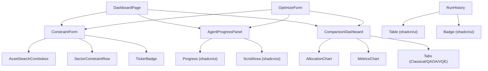

# Components

The frontend component library is organized into three layers: **shadcn/ui primitives** (`src/components/ui/`), **chart wrappers** (`src/components/charts/`), and **application components** (`src/components/` and `src/components/dashboard/`). This page documents all application-level components with their props, behavior, and usage examples.

## Component Hierarchy



---

## OptimizeForm

**File:** `src/components/OptimizeForm.tsx`

Top-level orchestrator component that ties together the full optimization workflow in a single self-contained unit. Used as an alternative to the `DashboardPage` layout when embedding the form in a custom context.

### Props

| Prop | Type | Default | Description |
|------|------|---------|-------------|
| `className` | `string` | — | Additional CSS classes for the outer grid container |

### Behavior

1. Renders `ConstraintForm` in a sticky left sidebar
2. Opens a WebSocket via `useWebSocket(currentRunId)` when a run starts
3. Shows `AgentProgressPanel` while `isOptimizing` is true
4. Shows `ComparisonDashboard` when `optimizationResult` is available
5. Shows an empty-state placeholder when no run has been started

```tsx
<OptimizeForm className="max-w-6xl mx-auto" />
```

The component reads all state from `useUIStore` — no props are required for the run lifecycle.

---

## ConstraintForm

**File:** `src/components/dashboard/ConstraintForm.tsx` (primary)  
Also: `src/components/ConstraintForm.tsx` (standalone variant)

The portfolio optimization constraint input form. Organized into collapsible sections.

### Props

| Prop | Type | Default | Description |
|------|------|---------|-------------|
| `onRunStarted` | `(runId: string) => void` | — | Callback fired with the new run ID after successful submission |

### Form Sections

| Section | Controls | Description |
|---------|----------|-------------|
| **Assets** | `AssetSearchCombobox` + `TickerBadge` list | Multi-ticker selection with live search |
| **Budget** | Formatted number input | Total investment in USD (default: $100,000) |
| **Business Objectives** | `ObjectiveRow` matrix | Multi-objective weights, directions, and thresholds |
| **Efficient Frontier** | Enable toggle + axis selects + num_points slider | Frontier sweep configuration |
| **Risk / Return** | `min_return` + `max_volatility` sliders | Legacy constraint fields |
| **Weight Bounds** | `max_weight_per_asset` + `min_weight_per_asset` sliders | Per-asset weight limits |
| **Sector Constraints** | `SectorConstraintRow` list | Per-sector max allocation |
| **Lookback Period** | Slider (60–756 days) | Historical data window |
| **Quantum Toggle** | `Switch` + `num_assets_to_select` slider | Enable QAOA + VQE |

### Default Values

```typescript
const DEFAULT_TICKERS    = ["AAPL", "MSFT", "GOOGL", "AMZN", "NVDA"];
const DEFAULT_BUDGET     = 100_000;
const DEFAULT_LOOKBACK   = 252;   // 1 trading year
const DEFAULT_MAX_WEIGHT = 0.4;   // 40% max per asset
const DEFAULT_NUM_ASSETS = 5;     // for QUBO
```

### Objective Catalogue

The form includes 7 pre-defined objectives:

| Name | Label | Default Direction | Frontier Axis |
|------|-------|-------------------|---------------|
| `return` | Expected Return | maximize | ✓ |
| `volatility` | Volatility | minimize | ✓ |
| `sharpe` | Sharpe Ratio | maximize | ✓ |
| `diversification_hhi` | Diversification (HHI) | minimize | ✓ |
| `sector_concentration` | Sector Concentration | minimize | ✓ |
| `max_drawdown` | Max Drawdown | minimize | ✗ |
| `esg_score` | ESG Score | maximize | ✗ |

### Validation

The form validates before submission:
- At least 2 tickers must be selected
- Budget must be a positive number
- `num_assets_to_select` must be ≤ number of selected tickers

### Usage

```tsx
<ConstraintForm onRunStarted={(runId) => setCurrentRunId(runId)} />
```

---

## SectorConstraintRow

**File:** `src/components/SectorConstraintRow.tsx`

A single row in the sector constraints table. Displays a sector name with a synchronized slider and numeric input for the maximum allocation weight.

### Props

| Prop | Type | Default | Description |
|------|------|---------|-------------|
| `sector` | `string` | — | Sector name (e.g. `"Technology"`) |
| `maxWeight` | `number` | — | Current max weight (0.0–1.0) |
| `onChange` | `(sector: string, maxWeight: number) => void` | — | Called when weight changes |
| `onRemove` | `(sector: string) => void` | — | Called when the row is removed |
| `disabled` | `boolean` | `false` | Disables all controls |
| `className` | `string` | — | Additional CSS classes |

### Behavior

- The slider and numeric input are kept in sync — editing either updates both
- The numeric input accepts percentage values (1–100); internally stored as 0.01–1.0
- On blur, invalid input is reset to the current `maxWeight` value
- Pressing `Enter` in the input triggers a blur (commits the value)
- The remove button shows a `Trash2` icon and calls `onRemove(sector)`

```tsx
<SectorConstraintRow
  sector="Technology"
  maxWeight={0.4}
  onChange={(sector, weight) => updateConstraint(sector, weight)}
  onRemove={(sector) => removeConstraint(sector)}
/>
```

---

## AssetSearchCombobox

**File:** `src/components/AssetSearchCombobox.tsx`

A debounced search combobox for selecting ticker symbols. Calls the backend `/assets/search` endpoint via `useAssetSearch` and renders results in an accessible dropdown.

### Props

| Prop | Type | Default | Description |
|------|------|---------|-------------|
| `selectedTickers` | `string[]` | — | Already-selected tickers (shown as disabled in results) |
| `onSelect` | `(ticker: string, name: string, sector?: string) => void` | — | Called when user picks an asset |
| `disabled` | `boolean` | `false` | Disables the input |
| `placeholder` | `string` | `"Search ticker or company name…"` | Input placeholder text |
| `className` | `string` | — | Additional CSS classes |

### Behavior

- Debounces the query by 300 ms before calling the API
- Minimum query length: 1 character
- Keyboard navigation: `ArrowUp` / `ArrowDown` to highlight, `Enter` to select, `Escape` to close
- Already-selected tickers are shown with an "Added" label and cannot be re-selected
- Clicking outside the component closes the dropdown
- Scroll-into-view is applied to the highlighted item

### Accessibility

The component implements ARIA combobox pattern:
- `role="combobox"` on the input
- `aria-autocomplete="list"` 
- `aria-expanded` reflects dropdown state
- `aria-controls` points to the listbox
- `role="listbox"` on the dropdown list
- `role="option"` on each result item

```tsx
<AssetSearchCombobox
  selectedTickers={["AAPL", "MSFT"]}
  onSelect={(ticker, name, sector) => addTicker(ticker, name, sector)}
/>
```

---

## AgentProgressPanel

**File:** `src/components/AgentProgressPanel.tsx`  
Also: `src/components/dashboard/AgentProgressPanel.tsx`

Real-time progress tracker for optimization runs. Displays the live status of each LangGraph agent node as the pipeline executes.

### Props

| Prop | Type | Default | Description |
|------|------|---------|-------------|
| `progress` | `AgentProgressMessage[]` | — | Ordered list of progress events from the WebSocket |
| `isRunning` | `boolean` | — | Whether the optimization is currently in progress |

### Pipeline Nodes

The component renders 6 pipeline steps in order:

| Node | Label | Icon |
|------|-------|------|
| `data_fetch` | Data Fetch | `Database` |
| `constraint_validation` | Constraint Validation | `ShieldCheck` |
| `classical_optimization` | Classical Optimization | `TrendingUp` |
| `quantum_dispatch` | Quantum Optimization | `Atom` |
| `comparison` | Comparison | `GitCompare` |
| `llm_explanation` | LLM Explanation | `MessageSquare` |

### Progress Calculation

Each node contributes to the overall progress percentage:
- `completed` event → 1 full step
- `started` event → 0.5 steps
- `failed` event → 0 additional progress

```typescript
function computeProgress(events: AgentProgressMessage[]): number {
  // Builds node → best-status map, then sums scores
  // Returns 0–100
}
```

### Node Status Display

| Status | Icon | Badge |
|--------|------|-------|
| `idle` | Empty circle (muted) | "Pending" |
| `running` | Spinning loader (primary) | "Running" |
| `completed` | Green checkmark | "Done" |
| `failed` | Red X circle | "Failed" |

### Auto-Scroll

The component uses a `scrollBottomRef` sentinel element to auto-scroll to the latest event as new progress messages arrive.

```tsx
<AgentProgressPanel
  progress={agentProgress}
  isRunning={isOptimizing}
/>
```

---

## AllocationChart

**File:** `src/components/AllocationChart.tsx`

Responsive donut pie chart showing portfolio asset allocation. Built with Recharts.

### Props

| Prop | Type | Default | Description |
|------|------|---------|-------------|
| `weights` | `AssetWeight[]` | — | Asset weights from the optimization result |
| `title` | `string` | — | Optional chart title |
| `colorScheme` | `"classical" \| "quantum"` | `"classical"` | Color palette |

### Color Palettes

| Scheme | Colors | Usage |
|--------|--------|-------|
| `classical` | Blues, cyans, greens | Classical (Markowitz) results |
| `quantum` | Violets, purples, fuchsias | Quantum (QAOA/VQE) results |

### Behavior

- Zero-weight assets (weight ≤ 0.001) are filtered out automatically
- Assets are sorted by weight descending (largest slice first)
- Custom tooltip shows: ticker, sector, weight %, dollar allocation
- Custom legend shows color swatches with weight percentages
- Empty state rendered when no non-zero weights exist

```tsx
<AllocationChart
  weights={classicalResult.weights}
  title="Classical Portfolio Allocation"
  colorScheme="classical"
/>
```

---

## MetricsChart

**File:** `src/components/MetricsChart.tsx`

Side-by-side bar charts comparing Expected Return, Volatility, and Sharpe Ratio across Classical, QAOA, and VQE strategies.

### Props

| Prop | Type | Default | Description |
|------|------|---------|-------------|
| `classical` | `PortfolioMetrics` | — | Classical optimization metrics (required) |
| `qaoa` | `PortfolioMetrics \| null` | — | QAOA metrics (optional) |
| `vqe` | `PortfolioMetrics \| null` | — | VQE metrics (optional) |

### Layout

Three `SingleMetricChart` sub-components in a responsive grid:

```
┌──────────────┬──────────────┬──────────────┐
│ Expected     │ Volatility   │ Sharpe       │
│ Return (%)   │ (%)          │ Ratio        │
└──────────────┴──────────────┴──────────────┘
```

### Color Coding

| Strategy | Color |
|----------|-------|
| Classical | `#3b82f6` (blue-500) |
| QAOA | `#8b5cf6` (violet-500) |
| VQE | `#a855f7` (purple-500) |

Null/undefined strategies are omitted from all charts automatically.

```tsx
<MetricsChart
  classical={classicalResult.metrics}
  qaoa={quantumResult?.qaoa?.metrics}
  vqe={quantumResult?.vqe?.metrics}
/>
```

---

## ComparisonDashboard

**File:** `src/components/ComparisonDashboard.tsx`  
Also: `src/components/dashboard/ComparisonDashboard.tsx`

The primary results view shown after an optimization run completes. Displays a full comparison of Classical, QAOA, and VQE strategies.

### Props

| Prop | Type | Default | Description |
|------|------|---------|-------------|
| `result` | `OptimizationRunDetail` | — | The completed optimization run |

### Layout

```
┌──────────────────────────────────────────────────────┐
│  Comparison Summary Card                             │
│  (recommendation + Sharpe deltas vs classical)       │
├──────────────────────────────────────────────────────┤
│  Tabs: Classical | QAOA (disabled if no quantum)     │
│        | VQE (disabled if no quantum)                │
│  ┌──────────────────┬───────────────────────────┐   │
│  │ AllocationChart  │ Metrics Table             │   │
│  │ (donut pie)      │ Return, Volatility,       │   │
│  │                  │ Sharpe, Assets, Solve Time│   │
│  └──────────────────┴───────────────────────────┘   │
├──────────────────────────────────────────────────────┤
│  MetricsChart (all strategies side-by-side bars)     │
├──────────────────────────────────────────────────────┤
│  LLM Explanation (collapsible, GPT-4o generated)     │
└──────────────────────────────────────────────────────┘
```

### Comparison Summary Card

Shows:
- **Recommendation** — LLM-generated text from `comparison.recommendation`
- **Sharpe ratio** for each available strategy with color coding
- **Delta grid** — return, volatility, and Sharpe improvements vs classical baseline
- Green/red coloring based on whether higher or lower is better for each metric

### Tab Behavior

- QAOA and VQE tabs are disabled (with tooltip) when quantum optimization was not run
- The active tab is managed by local `useState` within the component

### LLM Explanation

The `llm_explanation` field is rendered in a collapsible section with a `ChevronDown/Up` toggle. The text is displayed in a `ScrollArea` with a max height.

```tsx
<ComparisonDashboard result={optimizationResult} />
```

---

## RunHistory

**File:** `src/components/RunHistory.tsx`

Paginated table of past optimization runs. Reads data from `useRunHistory` (TanStack Query).

### Props

None — the component is self-contained and manages its own pagination state via `useRunHistory`.

### Table Columns

| Column | Width | Content |
|--------|-------|---------|
| Status | 120px | Colored `StatusBadge` |
| Assets | — | First 3 tickers as `Badge`, "+N more" if > 3 |
| Budget | 120px | Formatted USD |
| Classical Sharpe | 110px | Blue-colored number or "—" |
| Quantum Sharpe | 110px | Violet-colored number or "—" |
| Date | 130px | Relative time (e.g., "2 hours ago") |
| Actions | 110px | "View Details" link to `/run/:runId` |

### States

| State | Display |
|-------|---------|
| Loading | 5 skeleton rows |
| Empty | "No optimization runs yet" with link to dashboard |
| Error | Error message + "Retry" button |
| Data | Run rows with pagination |

### Pagination

- Page size: 20 runs per page
- Shows "Showing X–Y of Z runs" count
- Previous/Next buttons disabled at boundaries
- Pagination controls hidden when only 1 page

---

## TickerBadge

**File:** `src/components/TickerBadge.tsx`

A removable pill badge for a selected ticker symbol.

### Props

| Prop | Type | Default | Description |
|------|------|---------|-------------|
| `ticker` | `string` | — | Ticker symbol (e.g. `"AAPL"`) |
| `sector` | `string` | — | Optional sector label shown as subtitle |
| `onRemove` | `() => void` | — | Called when the × button is clicked |
| `disabled` | `boolean` | `false` | Hides the remove button when true |
| `className` | `string` | — | Additional CSS classes |

### Behavior

- Displays the ticker in bold with an optional sector subtitle in smaller text
- The × remove button has `aria-label="Remove {ticker}"` for accessibility
- When `disabled`, the badge is shown at 60% opacity with no remove button

```tsx
<TickerBadge
  ticker="AAPL"
  sector="Technology"
  onRemove={() => removeTicker("AAPL")}
  disabled={isOptimizing}
/>
```

---

## Chart Sub-Components

These components live in `src/components/charts/` and are used internally by `ComparisonDashboard`.

### AllocationPieChart

**File:** `src/components/charts/AllocationPieChart.tsx`

Recharts `PieChart` wrapper with custom tooltip and legend. Used inside the per-strategy tab panels.

### MetricsCard

**File:** `src/components/charts/MetricsCard.tsx`

Displays a single portfolio metric (return, volatility, Sharpe) as a labeled card with formatted value.

### MetricsComparisonBar

**File:** `src/components/charts/MetricsComparisonBar.tsx`

Horizontal bar chart comparing a single metric across strategies.

### SharpeComparisonChart

**File:** `src/components/charts/SharpeComparisonChart.tsx`

Specialized bar chart for Sharpe ratio comparison with delta annotations.

### WeightsTable

**File:** `src/components/charts/WeightsTable.tsx`

Tabular display of asset weights with ticker, weight %, and dollar allocation columns.

### QuantumCircuitInfo

**File:** `src/components/charts/QuantumCircuitInfo.tsx`

Displays quantum circuit metadata: number of qubits, circuit depth, and solve time.

---

## Dashboard Sub-Components

### LLMExplanationPanel

**File:** `src/components/dashboard/LLMExplanationPanel.tsx`

Renders the GPT-4o generated natural-language explanation of the optimization results. Includes a collapsible toggle and scroll area.

### FrontierReportViewer

**File:** `src/components/dashboard/FrontierReportViewer.tsx`

Displays the efficient frontier report when `frontier_report` is present in the run detail. Shows the Pareto frontier scatter plot with knee point and max-Sharpe annotations.

---

## Related Pages

- [Pages](pages.md) — how components are composed into page layouts
- [Hooks](hooks.md) — data-fetching hooks used by components
- [Type Definitions](type-definitions.md) — TypeScript interfaces for component props
