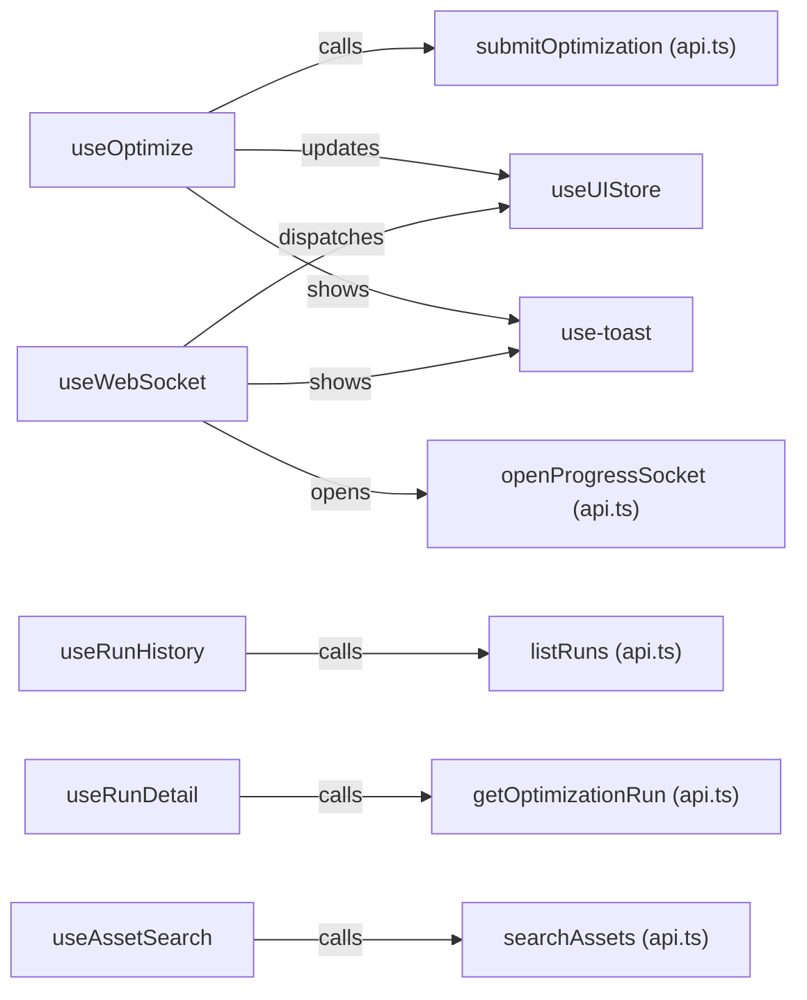
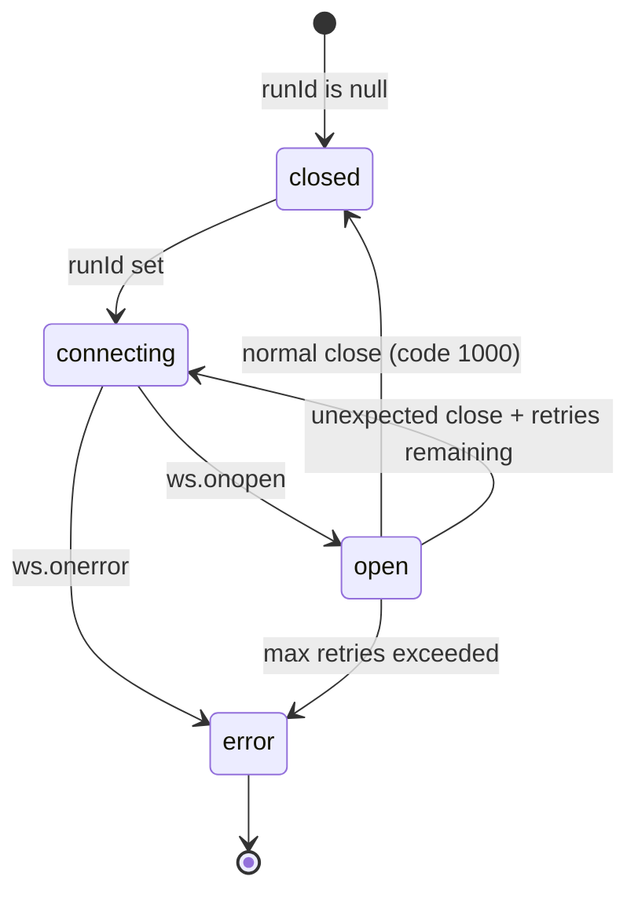

# Custom Hooks

The frontend uses six custom React hooks to encapsulate data-fetching, WebSocket lifecycle management, and UI state interactions. All hooks live in `src/hooks/`.

## Hook Overview



---

## useOptimize

**File:** `src/hooks/useOptimize.ts`

Wraps the optimization submission flow. Handles the HTTP POST, updates the global Zustand store, and shows toast notifications.

### Return Type

```typescript
interface UseOptimizeReturn {
  submit: (payload: OptimizationRequest) => Promise<string | null>;
  isSubmitting: boolean;
  error: Error | null;
}
```

| Property | Type | Description |
|----------|------|-------------|
| `submit` | `async (payload) => string \| null` | Submit an optimization request; returns `run_id` on success or `null` on failure |
| `isSubmitting` | `boolean` | True while the HTTP POST is in flight |
| `error` | `Error \| null` | The last submission error, or null if successful |

### Implementation

```typescript
export function useOptimize(): UseOptimizeReturn {
  const [isSubmitting, setIsSubmitting] = useState(false);
  const [error, setError] = useState<Error | null>(null);

  const startNewRun = useUIStore((s) => s.startNewRun);
  const { toast } = useToast();

  const submit = useCallback(
    async (payload: OptimizationRequest): Promise<string | null> => {
      setIsSubmitting(true);
      setError(null);

      try {
        const { run_id } = await submitOptimization(payload);

        // Transition the global store into "running" state
        startNewRun(run_id);

        toast({
          title: "Optimization started",
          description: `Run ${run_id.slice(0, 8)}… is now queued.`,
        });

        return run_id;
      } catch (err) {
        const castErr = err instanceof Error ? err : new Error(String(err));
        setError(castErr);

        toast({
          variant: "destructive",
          title: "Submission failed",
          description: castErr.message,
        });

        return null;
      } finally {
        setIsSubmitting(false);
      }
    },
    [startNewRun, toast],
  );

  return { submit, isSubmitting, error };
}
```

### Store Update

On success, `startNewRun(run_id)` is called, which atomically:
1. Sets `currentRunId` to the new run ID
2. Sets `isOptimizing` to `true`
3. Clears `optimizationResult` to `null`
4. Resets `agentProgress` to `[]`
5. Resets `activeTab` to `"classical"`

### Toast Notifications

| Event | Variant | Title |
|-------|---------|-------|
| Success | default | "Optimization started" |
| Failure | destructive | "Submission failed" |

### Usage

```typescript
const { submit, isSubmitting } = useOptimize();

const handleSubmit = async (formData: OptimizationRequest) => {
  const runId = await submit(formData);
  if (runId) {
    // WebSocket will open automatically via useWebSocket(runId)
  }
};
```

---

## useWebSocket

**File:** `src/hooks/useWebSocket.ts`

Manages the WebSocket lifecycle for a single optimization run. Opens a connection when `runId` becomes non-null, parses incoming messages, dispatches to the Zustand store, and handles reconnection with exponential backoff.

### Return Type

```typescript
export type ConnectionState = "connecting" | "open" | "closed" | "error";

interface UseWebSocketReturn {
  connectionState: ConnectionState;
}
```

### Parameters

| Parameter | Type | Description |
|-----------|------|-------------|
| `runId` | `string \| null` | The run ID to connect to. Pass `null` to close any existing connection. |

### Connection Lifecycle



### Reconnection Logic

```typescript
const MAX_RETRIES = 3;
const RETRY_DELAY_MS = 2000;

// On unexpected close:
if (retryCountRef.current < MAX_RETRIES) {
  retryCountRef.current += 1;
  const delay = RETRY_DELAY_MS * retryCountRef.current; // 2s, 4s, 6s
  setTimeout(() => connect(id), delay);
} else {
  setConnectionState("error");
  setIsOptimizing(false);
  toast({ variant: "destructive", title: "Connection lost" });
}
```

Retry delays are linear: 2 s, 4 s, 6 s. After 3 failed attempts, the state transitions to `"error"` and `isOptimizing` is set to `false`.

### Message Dispatch

Incoming WebSocket messages are parsed as `WebSocketMessage` and dispatched:

| Message Type | Action |
|-------------|--------|
| `"progress"` | `addAgentProgress(msg)` — appends to the progress list |
| `"result"` | `setOptimizationResult(msg.result)` + `setIsOptimizing(false)` |
| `"error"` | `setIsOptimizing(false)` + destructive toast |

### Cleanup

The hook cleans up on unmount or when `runId` changes:
- Cancels any pending retry timer
- Closes the WebSocket with code `1000` ("Component unmounted")
- Resets the retry counter

A `runIdRef` is used to prevent stale closures in the retry timer — the cleanup function checks `runIdRef.current === id` before reconnecting.

### Usage

```typescript
const { connectionState } = useWebSocket(currentRunId);

// connectionState: "closed" | "connecting" | "open" | "error"
```

---

## useRunHistory

**File:** `src/hooks/useRunHistory.ts`

Fetches paginated optimization run summaries using TanStack Query.

### Return Type

```typescript
interface UseRunHistoryReturn {
  runs: OptimizationRunSummary[];
  total: number;
  page: number;
  setPage: (page: number) => void;
  isLoading: boolean;
  error: Error | null;
}
```

| Property | Type | Description |
|----------|------|-------------|
| `runs` | `OptimizationRunSummary[]` | Current page of run summaries |
| `total` | `number` | Total number of runs across all pages |
| `page` | `number` | Current 1-based page number |
| `setPage` | `(page: number) => void` | Navigate to a specific page |
| `isLoading` | `boolean` | True while the query is fetching |
| `error` | `Error \| null` | Query error, or null |

### Implementation

```typescript
const PAGE_SIZE = 20;

export function useRunHistory(): UseRunHistoryReturn {
  const [page, setPage] = useState(1);

  const { data, isLoading, error } = useQuery({
    queryKey: ["runs", page] as const,
    queryFn: () => listRuns({ page, page_size: PAGE_SIZE }),
    staleTime: 30_000,
    placeholderData: (previousData) => previousData, // keep previous page visible
  });

  return {
    runs: data?.items ?? [],
    total: data?.total ?? 0,
    page,
    setPage,
    isLoading,
    error: error as Error | null,
  };
}
```

### Query Key

The query key `["runs", page]` ensures each page is cached independently. Navigating back to a previously visited page shows the cached data instantly.

### Placeholder Data

`placeholderData: (previousData) => previousData` keeps the previous page's data visible while the next page is loading, preventing a blank flash during pagination.

### Cache Duration

`staleTime: 30_000` — run history is considered fresh for 30 seconds. This prevents unnecessary refetches when navigating between pages quickly.

### Usage

```typescript
const { runs, total, page, setPage, isLoading } = useRunHistory();
const totalPages = Math.ceil(total / 20);
```

---

## useRunDetail

**File:** `src/hooks/useRunDetail.ts`

Fetches a single optimization run by ID. Polls every 3 seconds while the run is in a non-terminal state.

### Return Type

```typescript
interface UseRunDetailReturn {
  run: OptimizationRunDetail | undefined;
  isLoading: boolean;
  error: Error | null;
}
```

### Parameters

| Parameter | Type | Description |
|-----------|------|-------------|
| `runId` | `string` | The optimization run ID to fetch |

### Implementation

```typescript
const POLL_INTERVAL_MS = 3000;
const TERMINAL_STATUSES = new Set(["completed", "failed"]);

export function useRunDetail(runId: string): UseRunDetailReturn {
  const { data, isLoading, error } = useQuery({
    queryKey: ["run", runId] as const,
    queryFn: () => getOptimizationRun(runId),
    refetchInterval: (query) => {
      const status = query.state.data?.status;
      if (!status || TERMINAL_STATUSES.has(status)) {
        return false; // stop polling
      }
      return POLL_INTERVAL_MS;
    },
    staleTime: 0, // always re-fetch on focus
  });

  return { run: data, isLoading, error: error as Error | null };
}
```

### Polling Behavior

| Run Status | Polling |
|------------|---------|
| `pending` | Every 3 seconds |
| `running` | Every 3 seconds |
| `completed` | Stopped |
| `failed` | Stopped |

The `refetchInterval` callback receives the current query state, allowing it to inspect the latest `status` value and return `false` to stop polling once a terminal state is reached.

### Usage

```typescript
const { run, isLoading, error } = useRunDetail(runId);

if (isLoading) return <Skeleton />;
if (error) return <ErrorPanel message={error.message} />;
if (run?.status === "completed") return <ComparisonDashboard result={run} />;
```

---

## useAssetSearch

**File:** `src/hooks/useAssetSearch.ts`

Debounced asset search hook. Waits 300 ms after the last keystroke before calling the backend `/assets/search` endpoint.

### Return Type

```typescript
interface UseAssetSearchReturn {
  results: AssetSearchResult[];
  isLoading: boolean;
}
```

### Parameters

| Parameter | Type | Description |
|-----------|------|-------------|
| `query` | `string` | The search query string |

### Implementation

```typescript
const DEBOUNCE_MS = 300;
const MIN_QUERY_LENGTH = 1;

export function useAssetSearch(query: string): UseAssetSearchReturn {
  const [debouncedQuery, setDebouncedQuery] = useState(query);

  useEffect(() => {
    const timer = setTimeout(() => {
      setDebouncedQuery(query);
    }, DEBOUNCE_MS);
    return () => clearTimeout(timer);
  }, [query]);

  const isQueryLongEnough = debouncedQuery.length >= MIN_QUERY_LENGTH;

  const { data, isLoading } = useQuery({
    queryKey: ["assets", debouncedQuery] as const,
    queryFn: () => searchAssets(debouncedQuery),
    enabled: isQueryLongEnough,
    staleTime: 60_000, // asset metadata rarely changes
  });

  return {
    results: data ?? [],
    isLoading: isQueryLongEnough && isLoading,
  };
}
```

### Debounce

The debounce is implemented with `useEffect` + `setTimeout`. Each keystroke resets the timer. The API call fires only after 300 ms of inactivity.

### Cache Duration

`staleTime: 60_000` — asset search results are cached for 1 minute. The same query typed again within 1 minute returns the cached result instantly.

### `isLoading` Behavior

`isLoading` is only `true` when:
1. The debounced query is at least 1 character long, AND
2. The query is currently fetching

This prevents a loading spinner from appearing for empty queries.

### Usage

```typescript
const { results, isLoading } = useAssetSearch(query);

// results: AssetSearchResult[] — empty while loading or query too short
// isLoading: boolean — true only when a fetch is in flight
```

---

## use-toast

**File:** `src/hooks/use-toast.ts`

shadcn/ui toast state management hook. Provides a simple API for showing toast notifications from any component without prop drilling.

### Architecture

The hook uses a **module-level singleton** pattern: a shared `memoryState` object and a `listeners` array. When `dispatch()` is called, it updates `memoryState` and notifies all subscribed components.

```typescript
let memoryState: State = { toasts: [] };
const listeners: Array<(state: State) => void> = [];

function dispatch(action: Action) {
  memoryState = reducer(memoryState, action);
  listeners.forEach((listener) => listener(memoryState));
}
```

### Return Type

```typescript
function useToast() {
  return {
    toasts: ToasterToast[];
    toast: (props: Toast) => { id, dismiss, update };
    dismiss: (toastId?: string) => void;
  };
}
```

### `toast()` Function

```typescript
toast({
  title: "Optimization started",
  description: "Run abc123… is now queued.",
  variant: "default" | "destructive",
  action: <ToastAction />,  // optional
});
```

Returns `{ id, dismiss, update }` for programmatic control.

### Action Types

| Action | Effect |
|--------|--------|
| `ADD_TOAST` | Prepends toast to list (max 5 toasts) |
| `UPDATE_TOAST` | Updates an existing toast by ID |
| `DISMISS_TOAST` | Marks toast as closed (triggers animation) |
| `REMOVE_TOAST` | Removes toast from list after 5 s delay |

### Auto-Dismiss

Dismissed toasts are removed from the list after `TOAST_REMOVE_DELAY = 5000` ms. This gives the close animation time to complete before the DOM element is removed.

### Usage

```typescript
const { toast } = useToast();

// Show a success toast
toast({
  title: "Optimization started",
  description: `Run ${runId.slice(0, 8)}… is now queued.`,
});

// Show an error toast
toast({
  variant: "destructive",
  title: "Submission failed",
  description: error.message,
});
```

The `<Toaster />` component in `App.tsx` subscribes to the same state and renders the active toasts.

---

## Related Pages

- [API Client](api-client.md) — the `lib/api.ts` functions called by these hooks
- [State Management](state-management.md) — the Zustand store updated by `useOptimize` and `useWebSocket`
- [Type Definitions](type-definitions.md) — TypeScript interfaces for hook return types
