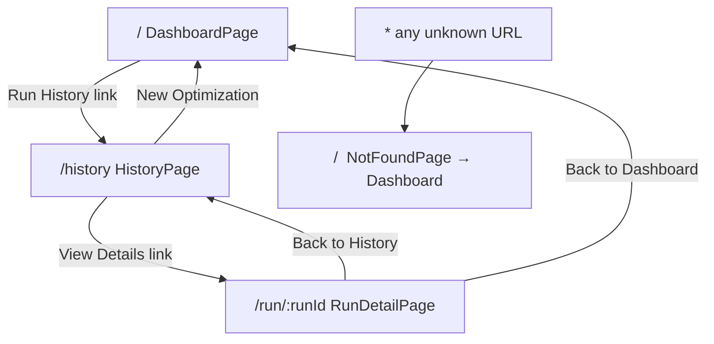

# Pages

The frontend has four route-level page components, each corresponding to a URL path defined in `src/App.tsx`. Pages are thin orchestrators — they compose hooks and components but contain minimal business logic themselves.

## Route Definitions

**File:** `src/App.tsx`

```typescript
import { Routes, Route } from "react-router-dom";
import { Toaster } from "@/components/ui/toaster";
import DashboardPage  from "@/pages/DashboardPage";
import HistoryPage    from "@/pages/HistoryPage";
import RunDetailPage  from "@/pages/RunDetailPage";
import NotFoundPage   from "@/pages/NotFoundPage";

export default function App() {
  return (
    <>
      <Routes>
        <Route path="/"          element={<DashboardPage />} />
        <Route path="/history"   element={<HistoryPage />} />
        <Route path="/run/:runId" element={<RunDetailPage />} />
        <Route path="*"          element={<NotFoundPage />} />
      </Routes>
      <Toaster />
    </>
  );
}
```

The `<Toaster />` component is rendered at the root level so toast notifications are available from any page.

### Route Table

| Path | Component | Description |
|------|-----------|-------------|
| `/` | `DashboardPage` | Main optimization interface |
| `/history` | `HistoryPage` | Paginated list of past runs |
| `/run/:runId` | `RunDetailPage` | Full detail for a single run |
| `*` | `NotFoundPage` | 404 fallback |

## Application Bootstrap

**File:** `src/main.tsx`

```typescript
const queryClient = new QueryClient({
  defaultOptions: {
    queries: {
      staleTime: 30_000,        // 30-second cache window
      retry: 2,                 // Retry failed queries twice
      refetchOnWindowFocus: false,
    },
  },
});

createRoot(rootElement).render(
  <StrictMode>
    <QueryClientProvider client={queryClient}>
      <BrowserRouter>
        <App />
      </BrowserRouter>
    </QueryClientProvider>
  </StrictMode>,
);
```

The provider hierarchy wraps the entire app:
1. `StrictMode` — enables React development warnings
2. `QueryClientProvider` — makes TanStack Query available to all hooks
3. `BrowserRouter` — enables client-side routing

---

## DashboardPage

**File:** `src/pages/DashboardPage.tsx`  
**Route:** `/`

The main entry point for the Portfolio Optimizer. It presents a two-column layout: a sticky constraint form on the left and a dynamic results panel on the right.

### Layout

```
┌──────────────────────────────────────────────────────┐
│  Header (logo + nav + WebSocket connection badge)    │
├──────────────────┬───────────────────────────────────┤
│  Constraint Form │  Results Panel                    │
│  (left sidebar)  │  - AgentProgressPanel (running)   │
│                  │  - ComparisonDashboard (complete)  │
│                  │  - Empty state (idle)              │
└──────────────────┴───────────────────────────────────┘
```

### State Management

The page reads all run-lifecycle state from `useUIStore`:

```typescript
const currentRunId       = useUIStore((s) => s.currentRunId);
const isOptimizing       = useUIStore((s) => s.isOptimizing);
const agentProgress      = useUIStore((s) => s.agentProgress);
const optimizationResult = useUIStore((s) => s.optimizationResult);
```

The WebSocket is opened automatically when `currentRunId` becomes non-null:

```typescript
const { connectionState } = useWebSocket(currentRunId);
```

### Results Panel Logic

Three mutually exclusive display states are derived from the store:

```typescript
const showProgress = isOptimizing || (currentRunId && !optimizationResult);
const showResults  = !isOptimizing && optimizationResult !== null;
const showEmpty    = !showProgress && !showResults;
```

| Condition | Displayed Component |
|-----------|---------------------|
| `showProgress` | `AgentProgressPanel` with live events |
| `showResults` | `ComparisonDashboard` with full results |
| `showEmpty` | Empty state placeholder |

### Connection Badge

A `ConnectionBadge` sub-component renders in the header when a run is active, showing the WebSocket state:

| State | Icon | Color |
|-------|------|-------|
| `connecting` | Spinning loader | Amber |
| `open` | Wifi icon | Green |
| `error` | WifiOff icon | Destructive red |
| `closed` | *(hidden)* | — |

### Submit Button

The submit button is rendered in a sticky footer below the constraint form. It is disabled while either `isSubmitting` (HTTP POST in flight) or `isOptimizing` (run in progress) is true:

```tsx
<Button
  type="submit"
  form="constraint-form"
  disabled={isSubmitting || isOptimizing}
>
  {isSubmitting ? "Submitting…" : isOptimizing ? "Running…" : "Run Optimization"}
</Button>
```

---

## HistoryPage

**File:** `src/pages/HistoryPage.tsx`  
**Route:** `/history`

Displays a paginated table of all past optimization runs. The page is a thin wrapper around the `RunHistory` component.

### Layout

```
┌──────────────────────────────────────────────────────┐
│  Header (logo + "Back to Dashboard" nav link)        │
├──────────────────────────────────────────────────────┤
│  Title: "Optimization Run History"                   │
│  Subtitle + "New Optimization" button                │
├──────────────────────────────────────────────────────┤
│  RunHistory component                                │
│  (table + pagination controls)                       │
└──────────────────────────────────────────────────────┘
```

### Key Features

- The `RunHistory` component handles all data fetching via `useRunHistory` (TanStack Query)
- Pagination is managed inside `RunHistory` — the page itself has no state
- A "New Optimization" button links back to `/`
- The header provides a "Back to Dashboard" navigation link

---

## RunDetailPage

**File:** `src/pages/RunDetailPage.tsx`  
**Route:** `/run/:runId`

Full detail view for a single optimization run. Reads the `runId` from the URL via `useParams()` and fetches the run using `useRunDetail(runId)`, which polls every 3 seconds while the run is in a non-terminal state.

### Layout

```
┌──────────────────────────────────────────────────────┐
│  Header (logo + Dashboard + History nav links)       │
├──────────────────────────────────────────────────────┤
│  ← Back to History                                   │
│  Run Metadata Card (ID, status, budget, tickers, ts) │
├──────────────────────────────────────────────────────┤
│  [loading]   Skeleton placeholders                   │
│  [pending]   InProgressPanel (queued message)        │
│  [running]   InProgressPanel (live progress)         │
│  [completed] ComparisonDashboard + FrontierReport    │
│  [failed]    ErrorPanel with error message           │
└──────────────────────────────────────────────────────┘
```

### Status-Driven Rendering

```typescript
const { run, isLoading, error } = useRunDetail(runId);

// Render based on run.status:
if (isLoading)                    → <MetadataSkeleton /> + <ResultsSkeleton />
if (error)                        → <PageError message={error.message} />
if (run.status === "pending")     → <MetadataCard /> + <InProgressPanel />
if (run.status === "running")     → <MetadataCard /> + <InProgressPanel />
if (run.status === "completed")   → <MetadataCard /> + <ComparisonDashboard />
if (run.status === "failed")      → <MetadataCard /> + <ErrorPanel />
```

### Polling Behavior

`useRunDetail` uses TanStack Query's `refetchInterval` to poll the backend:

- **Polling active** when `status` is `"pending"` or `"running"` (every 3 seconds)
- **Polling stops** when `status` reaches `"completed"` or `"failed"`

This means the page automatically updates when a run completes without requiring a WebSocket connection.

### Sub-Components

| Component | Purpose |
|-----------|---------|
| `MetadataCard` | Displays run ID, status badge, budget, timestamps, and ticker list |
| `MetadataSkeleton` | Loading placeholder for the metadata card |
| `ResultsSkeleton` | Loading placeholder for the results area |
| `InProgressPanel` | Shows `AgentProgressPanel` with empty progress (no live WebSocket) |
| `ErrorPanel` | Displays `error_message` with a link back to the dashboard |
| `StatusBadge` | Color-coded badge for `pending/running/completed/failed` |

### Frontier Report

When the run has `frontier_report` data, the `FrontierReportViewer` component is rendered below the `ComparisonDashboard` to display the efficient frontier chart.

---

## NotFoundPage

**File:** `src/pages/NotFoundPage.tsx`  
**Route:** `*` (catch-all)

A simple 404 page rendered for any unmatched URL.

```typescript
export default function NotFoundPage() {
  return (
    <div className="flex min-h-screen flex-col items-center justify-center bg-background">
      <h1 className="text-6xl font-bold text-muted-foreground">404</h1>
      <h2 className="text-2xl font-semibold">Page Not Found</h2>
      <p className="text-muted-foreground">
        The page you are looking for does not exist.
      </p>
      <Link to="/">
        <Home className="h-4 w-4" />
        Back to Dashboard
      </Link>
    </div>
  );
}
```

The page is centered vertically and horizontally, with a large "404" heading and a link back to the dashboard.

---

## Page Navigation Flow



## Related Pages

- [Components](components.md) — detailed props for all components used by these pages
- [Hooks](hooks.md) — `useWebSocket`, `useRunHistory`, `useRunDetail`
- [State Management](state-management.md) — Zustand `useUIStore` used by `DashboardPage`
